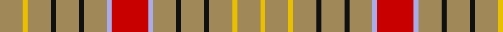

This page is one **sett** — a single exact thread-count. It belongs to the [tartan](/tartans/lo14ly3lo14k3lo14k3lo14lb3r22lb3lo14k3lo14k3lo14ly3lo14ly3/)
(the same proportion at any scale), whose colour order is pattern [YYYKYKYWRWYKYKYYYY](/stripes/yyykykywrwykykyyyy/).

Sourced from register-of-tartans.  It is a [18 stripe tartan](/stripes/stripes18/).

Original link https://www.tartanregister.gov.uk/tartanDetails.aspx?ref=5355

## Register references

External register numbers recorded for this tartan.

- Scottish Register of Tartans: [5355](https://www.tartanregister.gov.uk/tartanDetails.aspx?ref=5355)
- Scottish Tartans Authority (ITI): 3232

## Thread count
LT/28 Y6 LT28 K6 LT28 K6 LT28 LP6 R44 LP6 LT28 K6 LT28 K6 LT28 Y6 LT28 Y/6

## Palette

Palette: <strong>Tartan Register</strong>
<table><thead><tr><th>Colour</th><th>Threads</th><th>Shade</th><th>Base</th><th>OKLCh</th></tr></thead><tbody><tr><td>LT/</td><td style="text-align:right;font-variant-numeric:tabular-nums">28</td><td><code style="background-color:#A08858;">#A08858</code> <small style="color:#888">#A08858</small></td><td>Y <code style="background-color:#F2BF00;">#F2BF00</code></td><td><small style="color:#888">oklch(63.7% 0.071 84.0)</small></td></tr><tr><td>Y</td><td style="text-align:right;font-variant-numeric:tabular-nums">6</td><td><code style="background-color:#E8C000;">#E8C000</code> <small style="color:#888">#E8C000</small></td><td>Y <code style="background-color:#F2BF00;">#F2BF00</code></td><td><small style="color:#888">oklch(81.9% 0.168 93.7)</small></td></tr><tr><td>LT</td><td style="text-align:right;font-variant-numeric:tabular-nums">28</td><td><code style="background-color:#A08858;">#A08858</code> <small style="color:#888">#A08858</small></td><td>Y <code style="background-color:#F2BF00;">#F2BF00</code></td><td><small style="color:#888">oklch(63.7% 0.071 84.0)</small></td></tr><tr><td>K</td><td style="text-align:right;font-variant-numeric:tabular-nums">6</td><td><code style="background-color:#101010;">#101010</code> <small style="color:#888">#101010</small></td><td>K <code style="background-color:#000000;">#000000</code></td><td><small style="color:#888">oklch(17.3% 0.000 89.9)</small></td></tr><tr><td>LT</td><td style="text-align:right;font-variant-numeric:tabular-nums">28</td><td><code style="background-color:#A08858;">#A08858</code> <small style="color:#888">#A08858</small></td><td>Y <code style="background-color:#F2BF00;">#F2BF00</code></td><td><small style="color:#888">oklch(63.7% 0.071 84.0)</small></td></tr><tr><td>K</td><td style="text-align:right;font-variant-numeric:tabular-nums">6</td><td><code style="background-color:#101010;">#101010</code> <small style="color:#888">#101010</small></td><td>K <code style="background-color:#000000;">#000000</code></td><td><small style="color:#888">oklch(17.3% 0.000 89.9)</small></td></tr><tr><td>LT</td><td style="text-align:right;font-variant-numeric:tabular-nums">28</td><td><code style="background-color:#A08858;">#A08858</code> <small style="color:#888">#A08858</small></td><td>Y <code style="background-color:#F2BF00;">#F2BF00</code></td><td><small style="color:#888">oklch(63.7% 0.071 84.0)</small></td></tr><tr><td>LP</td><td style="text-align:right;font-variant-numeric:tabular-nums">6</td><td><code style="background-color:#A8ACE8;">#A8ACE8</code> <small style="color:#888">#A8ACE8</small></td><td>W <code style="background-color:#F7F7F7;">#F7F7F7</code></td><td><small style="color:#888">oklch(76.3% 0.086 281.2)</small></td></tr><tr><td>R</td><td style="text-align:right;font-variant-numeric:tabular-nums">44</td><td><code style="background-color:#C80000;">#C80000</code> <small style="color:#888">#C80000</small></td><td>R <code style="background-color:#CC0000;">#CC0000</code></td><td><small style="color:#888">oklch(52.3% 0.215 29.2)</small></td></tr><tr><td>LP</td><td style="text-align:right;font-variant-numeric:tabular-nums">6</td><td><code style="background-color:#A8ACE8;">#A8ACE8</code> <small style="color:#888">#A8ACE8</small></td><td>W <code style="background-color:#F7F7F7;">#F7F7F7</code></td><td><small style="color:#888">oklch(76.3% 0.086 281.2)</small></td></tr><tr><td>LT</td><td style="text-align:right;font-variant-numeric:tabular-nums">28</td><td><code style="background-color:#A08858;">#A08858</code> <small style="color:#888">#A08858</small></td><td>Y <code style="background-color:#F2BF00;">#F2BF00</code></td><td><small style="color:#888">oklch(63.7% 0.071 84.0)</small></td></tr><tr><td>K</td><td style="text-align:right;font-variant-numeric:tabular-nums">6</td><td><code style="background-color:#101010;">#101010</code> <small style="color:#888">#101010</small></td><td>K <code style="background-color:#000000;">#000000</code></td><td><small style="color:#888">oklch(17.3% 0.000 89.9)</small></td></tr><tr><td>LT</td><td style="text-align:right;font-variant-numeric:tabular-nums">28</td><td><code style="background-color:#A08858;">#A08858</code> <small style="color:#888">#A08858</small></td><td>Y <code style="background-color:#F2BF00;">#F2BF00</code></td><td><small style="color:#888">oklch(63.7% 0.071 84.0)</small></td></tr><tr><td>K</td><td style="text-align:right;font-variant-numeric:tabular-nums">6</td><td><code style="background-color:#101010;">#101010</code> <small style="color:#888">#101010</small></td><td>K <code style="background-color:#000000;">#000000</code></td><td><small style="color:#888">oklch(17.3% 0.000 89.9)</small></td></tr><tr><td>LT</td><td style="text-align:right;font-variant-numeric:tabular-nums">28</td><td><code style="background-color:#A08858;">#A08858</code> <small style="color:#888">#A08858</small></td><td>Y <code style="background-color:#F2BF00;">#F2BF00</code></td><td><small style="color:#888">oklch(63.7% 0.071 84.0)</small></td></tr><tr><td>Y</td><td style="text-align:right;font-variant-numeric:tabular-nums">6</td><td><code style="background-color:#E8C000;">#E8C000</code> <small style="color:#888">#E8C000</small></td><td>Y <code style="background-color:#F2BF00;">#F2BF00</code></td><td><small style="color:#888">oklch(81.9% 0.168 93.7)</small></td></tr><tr><td>LT</td><td style="text-align:right;font-variant-numeric:tabular-nums">28</td><td><code style="background-color:#A08858;">#A08858</code> <small style="color:#888">#A08858</small></td><td>Y <code style="background-color:#F2BF00;">#F2BF00</code></td><td><small style="color:#888">oklch(63.7% 0.071 84.0)</small></td></tr><tr><td>Y/</td><td style="text-align:right;font-variant-numeric:tabular-nums">6</td><td><code style="background-color:#E8C000;">#E8C000</code> <small style="color:#888">#E8C000</small></td><td>Y <code style="background-color:#F2BF00;">#F2BF00</code></td><td><small style="color:#888">oklch(81.9% 0.168 93.7)</small></td></tr></tbody></table>

## Nearest tartans

The nearest existing variants by ΔTartan distance, with this tartan at the top so the swatches line up against it.

ΔTartan

Tartan

Sett

—

<a href="/ttd/edit/#slug=lo14ly3lo14k3lo14k3lo14lb3r22lb3lo14k3lo14k3lo14ly3lo14ly3~x2">Sutherland of Duffus</a> <a class="nn-out" href="/setts/s18/lo14ly3lo14k3lo14k3lo14lb3r22lb3lo14k3lo14k3lo14ly3lo14ly3~x2/" title="open its dictionary page">↗</a>

1.67

<a href="/ttd/edit/#slug=r22lb3lo14k3lo14k3lo14ly3lo14ly3~x2">Sutherland of Duffus (Clan)</a> <a class="nn-out" href="/setts/s10/r22lb3lo14k3lo14k3lo14ly3lo14ly3~x2/" title="open its dictionary page">↗</a>

1.86

<a href="/ttd/edit/#slug=r8g2r2g6r1g6r2g2r8ly1r8g2r2g6r1g6r2g2r8w1~x4">Bruce (VS) Clan Tartan Tartan Number: 1848. Earliest known date: 1842 The design comes from the Vestiarium Scoticum, and is approved by Lord Bruce, Earl of Elgin. Much doubt has been cast on the authority of the Vestiarium, but in this case Lord Bruce believes he has independant evidence of the tartan dating back to 1571. The original document was a chart of the weavers threadcount which is now lost. The chart included black 'guards' on the yellow and white stripes and Lord Bruce has adopted this variation as his personal tartan. Writing in 1967, Lord Bruce also states that the Elgin family also wear the Bruce of Kinnaird for 'undress' or day wear, a wholly different tartan similar to the Prince Charles Edward. See products available Copyright © Blair Urquhart, Comrie, 2015</a> <a class="nn-out" href="/setts/s20/r8g2r2g6r1g6r2g2r8ly1r8g2r2g6r1g6r2g2r8w1~x4/" title="open its dictionary page">↗</a>

1.99

<a href="/ttd/edit/#slug=y19ly3y19r3y19ly3y19r3y3r21t3r21y3r3~x2">Burnett of Powis (Modern) (Personal)</a> <a class="nn-out" href="/setts/s14/y19ly3y19r3y19ly3y19r3y3r21t3r21y3r3~x2/" title="open its dictionary page">↗</a>

2.10

<a href="/ttd/edit/#slug=r16t3o12k3o12k3o12ly3o12ly3~x2">Duffus, Lord</a> <a class="nn-out" href="/setts/s10/r16t3o12k3o12k3o12ly3o12ly3~x2/" title="open its dictionary page">↗</a>

2.12

<a href="/ttd/edit/#slug=w1db1r7g2r2g6r1g6r2g2r8ly1~x2">Bruce County</a> <a class="nn-out" href="/setts/s12/w1db1r7g2r2g6r1g6r2g2r8ly1~x2/" title="open its dictionary page">↗</a>

2.14

<a href="/ttd/edit/#slug=dp2r1lo4w2lo12w8lo12w2lo2lo2w1lo2~x4">Gary (Personal)</a> <a class="nn-out" href="/setts/s12/dp2r1lo4w2lo12w8lo12w2lo2lo2w1lo2~x4/" title="open its dictionary page">↗</a>

2.16

<a href="/ttd/edit/#slug=r9g10w2g2ly2g10r9g5r9g10ly2g2w2g10r9g5~x2">Wilson's No.169</a> <a class="nn-out" href="/setts/s16/r9g10w2g2ly2g10r9g5r9g10ly2g2w2g10r9g5~x2/" title="open its dictionary page">↗</a>

2.20

<a href="/ttd/edit/#slug=lo10w1lo12k7w2k7lo12w1r4w1lo12k2~x2">Unidentified (GMG 2002)</a> <a class="nn-out" href="/setts/s12/lo10w1lo12k7w2k7lo12w1r4w1lo12k2~x2/" title="open its dictionary page">↗</a>

2.20

<a href="/ttd/edit/#slug=o6r2r15o15k2o15r2r6r2o8w2~x2">Frater</a> <a class="nn-out" href="/setts/s11/o6r2r15o15k2o15r2r6r2o8w2~x2/" title="open its dictionary page">↗</a>

2.20

<a href="/ttd/edit/#slug=w1db1r7g2r2g6r1g6r2g2r8lo1~x4">Bruce County</a> <a class="nn-out" href="/setts/s12/w1db1r7g2r2g6r1g6r2g2r8lo1~x4/" title="open its dictionary page">↗</a>

## Neighbour map

Every grey dot is one of 14299 variants placed by the first two principal components of the ΔTartan feature space (44% of its variance). Red is this tartan; blue dots are its nearest — click one to open its page.

<svg viewBox="0 0 640 380" role="img" style="max-width:100%;height:auto;border:1px solid #e0e0e0;border-radius:4px;display:block" xmlns="http://www.w3.org/2000/svg"><image href="/nn/cloud.v1.png" width="640" height="380"/><a href="/setts/s10/r22lb3lo14k3lo14k3lo14ly3lo14ly3~x2/"><circle cx="300.9" cy="194.5" r="4" fill="#3465a4"><title>Sutherland of Duffus (Clan)</title></circle></a><a href="/setts/s20/r8g2r2g6r1g6r2g2r8ly1r8g2r2g6r1g6r2g2r8w1~x4/"><circle cx="308.2" cy="179.5" r="4" fill="#3465a4"><title>Bruce (VS) Clan Tartan Tartan Number: 1848. Earliest known date: 1842 The design comes from the Vestiarium Scoticum, and is approved by Lord Bruce, Earl of Elgin. Much doubt has been cast on the authority of the Vestiarium, but in this case Lord Bruce believes he has independant evidence of the tartan dating back to 1571. The original document was a chart of the weavers threadcount which is now lost. The chart included black 'guards' on the yellow and white stripes and Lord Bruce has adopted this variation as his personal tartan. Writing in 1967, Lord Bruce also states that the Elgin family also wear the Bruce of Kinnaird for 'undress' or day wear, a wholly different tartan similar to the Prince Charles Edward. See products available Copyright © Blair Urquhart, Comrie, 2015</title></circle></a><a href="/setts/s14/y19ly3y19r3y19ly3y19r3y3r21t3r21y3r3~x2/"><circle cx="354.6" cy="209.4" r="4" fill="#3465a4"><title>Burnett of Powis (Modern) (Personal)</title></circle></a><a href="/setts/s10/r16t3o12k3o12k3o12ly3o12ly3~x2/"><circle cx="267.4" cy="211.0" r="4" fill="#3465a4"><title>Duffus, Lord</title></circle></a><a href="/setts/s12/w1db1r7g2r2g6r1g6r2g2r8ly1~x2/"><circle cx="263.8" cy="173.1" r="4" fill="#3465a4"><title>Bruce County</title></circle></a><a href="/setts/s12/dp2r1lo4w2lo12w8lo12w2lo2lo2w1lo2~x4/"><circle cx="343.5" cy="131.7" r="4" fill="#3465a4"><title>Gary (Personal)</title></circle></a><a href="/setts/s16/r9g10w2g2ly2g10r9g5r9g10ly2g2w2g10r9g5~x2/"><circle cx="245.6" cy="218.0" r="4" fill="#3465a4"><title>Wilson's No.169</title></circle></a><a href="/setts/s12/lo10w1lo12k7w2k7lo12w1r4w1lo12k2~x2/"><circle cx="323.5" cy="169.7" r="4" fill="#3465a4"><title>Unidentified (GMG 2002)</title></circle></a><a href="/setts/s11/o6r2r15o15k2o15r2r6r2o8w2~x2/"><circle cx="322.8" cy="196.9" r="4" fill="#3465a4"><title>Frater</title></circle></a><a href="/setts/s12/w1db1r7g2r2g6r1g6r2g2r8lo1~x4/"><circle cx="264.4" cy="172.5" r="4" fill="#3465a4"><title>Bruce County</title></circle></a><circle cx="345.2" cy="176.9" r="5" fill="#c00000"/></svg>

ID: /setts/s18/lo14ly3lo14k3lo14k3lo14lb3r22lb3lo14k3lo14k3lo14ly3lo14ly3~x2/
