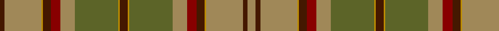

**Bands:** [BYYBRYGYBYGYRBYYBY](/stripes/byybrygybygyrbyyby/) · **Stripes:** [DO LO LO DO R LO Y LO DO LO Y LO R DO LO LO DO LO](/stripes/stripes18/) DO LO LO DO R LO Y LO DO LO Y LO R DO LO LO DO LO

This was sourced from register-of-tartans.  It is a [18 band tartan](/bands/bands18/).

Original link https://www.tartanregister.gov.uk/tartanDetails.aspx?ref=3658

## Register references

External register numbers recorded for this tartan.

- Scottish Register of Tartans: [3658](https://www.tartanregister.gov.uk/tartanDetails.aspx?ref=3658)
- Scottish Tartans Authority (ITI): 6516

## Thread count
DRa/6 LT46 DY2 DRa10 DR12 LT18 G54 DY2 DRa10 DY2 G54 LT18 DR12 DRa10 DY2 LT46 DRa6 LT/10

## Palette
Each colour and its ΔE from the base-6 reference it is a variant of.

| Colour | Shade | Base | ΔE (OKLab) |
|---|---|---|---|
| DR | <code style="background-color:#880000;">#880000</code> `#880000` | R <code style="background-color:#CC0000;">#CC0000</code> | 0.15 |
| DRa | <code style="background-color:#441800;">#441800</code> `#441800` | B <code style="background-color:#2A418A;">#2A418A</code> | 0.23 |
| DY | <code style="background-color:#BC8C00;">#BC8C00</code> `#BC8C00` | Y <code style="background-color:#F2BF00;">#F2BF00</code> | 0.16 |
| G | <code style="background-color:#5C6428;">#5C6428</code> `#5C6428` | G <code style="background-color:#006100;">#006100</code> | 0.10 |
| LT | <code style="background-color:#A08858;">#A08858</code> `#A08858` | Y <code style="background-color:#F2BF00;">#F2BF00</code> | 0.21 |

## Nearest tartans

The nearest existing variants by ΔTartan distance.

1. [Satisfashion Argyll (Corporate)](/setts/s10/do5lo1y27lo9r6do5lo1lo23do3lo5~x2/) — ΔT 1.21
1. [Prince Edward Island](/setts/s15/g16o1g2o1g2o12r12o1ly2o1r12o12g12o1w2~x2/) — ΔT 1.37
1. [Prince Edward Island District Tartan Tartan Number: 918. Earliest known date: 1964 The warmth and glow of the fertile soil, The green field and tree, The yellow and the brown of Autumn, The white of surf or a summer snow, Rust, green, yellow and white, Yes! That's our Island Tartan. See products available Copyright © Blair Urquhart, Comrie, 2015](/setts/s15/g16dy1g2dy1g2dy12m12dy1ly2dy1m12dy12g12dy1w2~x2/) — ΔT 1.38
1. [Prince Edward Island (District)](/setts/s15/g20dy2g4dy2g4dy18r18dy1ly4dy1r18dy18g18dy1w4~x2/) — ΔT 1.38
1. [Cochrane Hunting](/setts/s15/g46r6g6r2g8r2g6r2g6do36r2y47r6y24lo6/) — ΔT 1.41
1. [Unidentified (Woven sample)](/setts/s18/r2t2dy3t14do1t1y7dy3t2dy3do7t3y2t3y16r2dy3t2~x2/) — ΔT 1.47
1. [McCall (Name)](/setts/s15/r8k5r8g27r8w2r3g3r3w2r8o27r8o3r3~x2/) — ΔT 1.63
1. [Ensign, of Ontario](/setts/s15/g21k1r4k1o21g3o3g3o21g3ly4g21o3g3o3~x2/) — ΔT 1.63
1. [Manitoba Province](/setts/s14/r12g1dg3g20t1g1t3g1t1g20dg3g1r12lo3~x4/) — ΔT 1.63
1. [O'Brian #1 (Fashion)](/setts/s16/r31db2r3db2r3g12r3db2r3db2r31dy4g19dy36g19dy4~x2/) — ΔT 1.68

## Neighbour map

Every grey dot is one of 14313 variants placed by the first two principal components of the ΔTartan feature space (44% of its variance). Red is this tartan; blue dots are its nearest — click one to open its page.

<svg viewBox="0 0 640 380" role="img" style="max-width:100%;height:auto;border:1px solid #e0e0e0;border-radius:4px;display:block" xmlns="http://www.w3.org/2000/svg"><image href="/nn/cloud.v1.png" width="640" height="380"/><a href="/setts/s10/do5lo1y27lo9r6do5lo1lo23do3lo5~x2/"><circle cx="303.8" cy="147.3" r="4" fill="#3465a4"><title>Satisfashion Argyll (Corporate)</title></circle></a><a href="/setts/s15/g16o1g2o1g2o12r12o1ly2o1r12o12g12o1w2~x2/"><circle cx="225.7" cy="145.5" r="4" fill="#3465a4"><title>Prince Edward Island</title></circle></a><a href="/setts/s15/g16dy1g2dy1g2dy12m12dy1ly2dy1m12dy12g12dy1w2~x2/"><circle cx="233.4" cy="150.5" r="4" fill="#3465a4"><title>Prince Edward Island District Tartan Tartan Number: 918. Earliest known date: 1964 The warmth and glow of the fertile soil, The green field and tree, The yellow and the brown of Autumn, The white of surf or a summer snow, Rust, green, yellow and white, Yes! That's our Island Tartan. See products available Copyright © Blair Urquhart, Comrie, 2015</title></circle></a><a href="/setts/s15/g20dy2g4dy2g4dy18r18dy1ly4dy1r18dy18g18dy1w4~x2/"><circle cx="224.1" cy="144.8" r="4" fill="#3465a4"><title>Prince Edward Island (District)</title></circle></a><a href="/setts/s15/g46r6g6r2g8r2g6r2g6do36r2y47r6y24lo6/"><circle cx="265.2" cy="134.7" r="4" fill="#3465a4"><title>Cochrane Hunting</title></circle></a><a href="/setts/s18/r2t2dy3t14do1t1y7dy3t2dy3do7t3y2t3y16r2dy3t2~x2/"><circle cx="229.3" cy="149.2" r="4" fill="#3465a4"><title>Unidentified (Woven sample)</title></circle></a><a href="/setts/s15/r8k5r8g27r8w2r3g3r3w2r8o27r8o3r3~x2/"><circle cx="247.8" cy="144.8" r="4" fill="#3465a4"><title>McCall (Name)</title></circle></a><a href="/setts/s15/g21k1r4k1o21g3o3g3o21g3ly4g21o3g3o3~x2/"><circle cx="332.8" cy="146.9" r="4" fill="#3465a4"><title>Ensign, of Ontario</title></circle></a><a href="/setts/s14/r12g1dg3g20t1g1t3g1t1g20dg3g1r12lo3~x4/"><circle cx="350.5" cy="144.8" r="4" fill="#3465a4"><title>Manitoba Province</title></circle></a><a href="/setts/s16/r31db2r3db2r3g12r3db2r3db2r31dy4g19dy36g19dy4~x2/"><circle cx="325.3" cy="166.1" r="4" fill="#3465a4"><title>O'Brian #1 (Fashion)</title></circle></a><circle cx="297.0" cy="125.9" r="5" fill="#c00000"/></svg>

ID: /setts/s18/lo5do3lo23lo1do5r6lo9y27lo1do5lo1y27lo9r6do5lo1lo23do3~x2/
