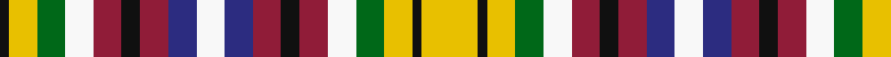

**Bands:** [KYGWRKRBWBRKRWGYKY](/stripes/kygwrkrbwbrkrwgyky/) · **Stripes:** [K LY G W R K R DB W DB R K R W G LY K LY](/stripes/stripes18/) K LY G W R K R DB W DB R K R W G LY K LY

This was sourced from register-of-tartans.  It is a [18 band tartan](/bands/bands18/).

Original link https://www.tartanregister.gov.uk/tartanDetails.aspx?ref=4628

## Attestations

This cloth appears in 2 source records; the oldest owns this page.

- 01/01/2004 — Williams Lake, City of (register-of-tartans, [record](https://www.tartanregister.gov.uk/tartanDetails.aspx?ref=4628))
- undated — Williams Lake Canadian District Tartan Tartan Number: 6736. Earliest known date: 2004 March Designed and woven by the city's Spinners & Weavers Guild to celebrate the city's 75th anniversary on March 15th 2004. Officially accepted by the City Council (Mayor Rick Gibson). See products available Copyright © Blair Urquhart, Comrie, 2015 (house-of-tartan, [record](http://www.house-of-tartan.scotland.net/house/TartanViewjs.asp?colr=Def&tnam=6736))

## Register references

External register numbers recorded for this tartan.

- Scottish Register of Tartans: [4628](https://www.tartanregister.gov.uk/tartanDetails.aspx?ref=4628)
- Scottish Tartans Authority (ITI): 6736
- Scottish Tartans World Register: 2999

## Thread count
K/2 Y6 G6 W6 DR6 K4 DR6 DB6 W6 DB6 DR6 K4 DR6 W6 G6 Y6 K2 Y/12

## Palette
Each colour and its ΔE from the base-6 reference it is a variant of.

| Colour | Shade | Base | ΔE (OKLab) |
|---|---|---|---|
| DB | <code style="background-color:#2C2C80;">#2C2C80</code> `#2C2C80` | B <code style="background-color:#2A418A;">#2A418A</code> | 0.06 |
| DR | <code style="background-color:#901C38;">#901C38</code> `#901C38` | R <code style="background-color:#CC0000;">#CC0000</code> | 0.13 |
| G | <code style="background-color:#006818;">#006818</code> `#006818` | G <code style="background-color:#006100;">#006100</code> | 0.02 |
| K | <code style="background-color:#101010;">#101010</code> `#101010` | K <code style="background-color:#000000;">#000000</code> | 0.17 |
| W | <code style="background-color:#F8F8F8;">#F8F8F8</code> `#F8F8F8` | W <code style="background-color:#F7F7F7;">#F7F7F7</code> | 0.00 |
| Y | <code style="background-color:#E8C000;">#E8C000</code> `#E8C000` | Y <code style="background-color:#F2BF00;">#F2BF00</code> | 0.02 |

## Nearest tartans

The nearest existing variants by ΔTartan distance.

1. [Hewett](/setts/s20/r6w3r8t7k4ly2k2lb4w8k5w8lb4k2ly2k4t7r8w3r6k4~x3/) — ΔT 1.20
1. [City of Williams Lake (District)](/setts/s10/ly6k1ly3g3w3r3k2r3db3w3~x2/) — ΔT 1.39
1. [Scandinavian](/setts/s14/g10k6t10ly4t10k3g10k3g10k3r10w4r10k6~x2/) — ΔT 1.63
1. [Stanners (Personal)](/setts/s13/lr4k4n4k4g4w1g4w1n3r4n3r4w1~x4/) — ΔT 1.63
1. [Buchanan Incorrect](/setts/s16/db3dg1k3db3k3dg1db3dg1r6w1r6db4ly5db1ly5dg1~x4/) — ΔT 1.69
1. [Buchanan, Incorrect](/setts/s16/db3g1k3db3k3g1db3g1r6w1r6db4ly5db1ly5g1~x4/) — ΔT 1.70
1. [MacEochaidh (Personal)](/setts/s13/r5r1db1r3r1db2r5r4db4g3k3g3ly3~x4/) — ΔT 1.74
1. [Stanners (Personal)](/setts/s13/lr4k4dt4k4g4w1g4w1dt3r4dt3r4w1~x4/) — ΔT 1.75
1. [Hovington (2014)](/setts/s13/k2w1ly6r6w1k2w2k3w2k1w2g3w2~x4/) — ΔT 1.79
1. [Victoria (Patons)](/setts/s13/r6k2r12dg10k3w2k3ly2k8w4db6w12r4/) — ΔT 1.80

## Neighbour map

Every grey dot is one of 14313 variants placed by the first two principal components of the ΔTartan feature space (44% of its variance). Red is this tartan; blue dots are its nearest — click one to open its page.

<svg viewBox="0 0 640 380" role="img" style="max-width:100%;height:auto;border:1px solid #e0e0e0;border-radius:4px;display:block" xmlns="http://www.w3.org/2000/svg"><image href="/nn/cloud.v1.png" width="640" height="380"/><a href="/setts/s20/r6w3r8t7k4ly2k2lb4w8k5w8lb4k2ly2k4t7r8w3r6k4~x3/"><circle cx="14.0" cy="164.0" r="4" fill="#3465a4"><title>Hewett</title></circle></a><a href="/setts/s10/ly6k1ly3g3w3r3k2r3db3w3~x2/"><circle cx="14.0" cy="187.1" r="4" fill="#3465a4"><title>City of Williams Lake (District)</title></circle></a><a href="/setts/s14/g10k6t10ly4t10k3g10k3g10k3r10w4r10k6~x2/"><circle cx="14.0" cy="208.1" r="4" fill="#3465a4"><title>Scandinavian</title></circle></a><a href="/setts/s13/lr4k4n4k4g4w1g4w1n3r4n3r4w1~x4/"><circle cx="14.0" cy="215.7" r="4" fill="#3465a4"><title>Stanners (Personal)</title></circle></a><a href="/setts/s16/db3dg1k3db3k3dg1db3dg1r6w1r6db4ly5db1ly5dg1~x4/"><circle cx="30.7" cy="152.0" r="4" fill="#3465a4"><title>Buchanan Incorrect</title></circle></a><a href="/setts/s16/db3g1k3db3k3g1db3g1r6w1r6db4ly5db1ly5g1~x4/"><circle cx="22.7" cy="149.9" r="4" fill="#3465a4"><title>Buchanan, Incorrect</title></circle></a><a href="/setts/s13/r5r1db1r3r1db2r5r4db4g3k3g3ly3~x4/"><circle cx="14.0" cy="178.3" r="4" fill="#3465a4"><title>MacEochaidh (Personal)</title></circle></a><a href="/setts/s13/lr4k4dt4k4g4w1g4w1dt3r4dt3r4w1~x4/"><circle cx="14.0" cy="215.5" r="4" fill="#3465a4"><title>Stanners (Personal)</title></circle></a><a href="/setts/s13/k2w1ly6r6w1k2w2k3w2k1w2g3w2~x4/"><circle cx="14.0" cy="141.5" r="4" fill="#3465a4"><title>Hovington (2014)</title></circle></a><a href="/setts/s13/r6k2r12dg10k3w2k3ly2k8w4db6w12r4/"><circle cx="26.0" cy="151.6" r="4" fill="#3465a4"><title>Victoria (Patons)</title></circle></a><circle cx="14.0" cy="170.3" r="5" fill="#c00000"/></svg>

ID: /setts/s18/ly6k1ly3g3w3r3k2r3db3w3db3r3k2r3w3g3ly3k1~x2/
