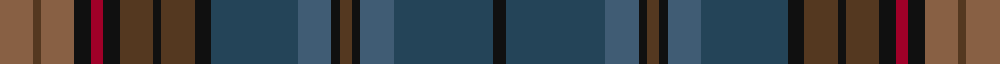

In pattern [KBBKGKBBKGKGKRKRGR](/stripes/kbbkgkbbkgkgkrkrgr/).

This was sourced from tartans-authority.  It is a [18 stripe tartan](/stripes/stripes18/).

Original link http://www.tartansauthority.com/tartan-ferret/display/7192/

## Thread count
LT/16 T4 LT16 K8 DR6 K8 T16 K4 T16 K8 DB42 N16 K4 T6 K4 N16 DB48 K/6

## Palette
Each colour and the base-6 reference it is a variant of.

| Colour | Shade | Base |
|---|---|---|
| DB | <code style="background-color:#244458;">#244458</code> `oklch(37.1% 0.051 237.7)` <small>#244458</small> | B <code style="background-color:#2A418A;">#2A418A</code> |
| DR | <code style="background-color:#A00028;">#A00028</code> `oklch(44.7% 0.179 19.5)` <small>#A00028</small> | R <code style="background-color:#CC0000;">#CC0000</code> |
| K | <code style="background-color:#101010;">#101010</code> `oklch(17.3% 0.000 89.9)` <small>#101010</small> | K <code style="background-color:#000000;">#000000</code> |
| LT | <code style="background-color:#886044;">#886044</code> `oklch(52.4% 0.066 55.7)` <small>#886044</small> | R <code style="background-color:#CC0000;">#CC0000</code> |
| N | <code style="background-color:#405C74;">#405C74</code> `oklch(46.3% 0.052 245.1)` <small>#405C74</small> | B <code style="background-color:#2A418A;">#2A418A</code> |
| T | <code style="background-color:#543820;">#543820</code> `oklch(36.7% 0.054 60.5)` <small>#543820</small> | G <code style="background-color:#006100;">#006100</code> |

## Nearest tartans

The nearest existing variants by ΔTartan distance.

1. [Yeomans (2016)](/setts/s16/dt22k2o3k2dt22k4dg10k2dg10r3k4r3do10dg2do10k3~x2/) — ΔT 0.86
1. [Redgate (Connecticut) Hunting #2](/setts/s15/do5k2n6w1n6k2do7k16dg7k2dr4dg2dr4k2dg4~x2/) — ΔT 1.30
1. [Homecoming (Fashion)](/setts/s15/o2dt14k3dt3k3dt3k15dt4o2dy2o2dy11o2dy2o2~x2/) — ΔT 1.39
1. [Watkins Welsh Name Tartan Tartan Number: 6169. Earliest known date: pre 2004 The tartan for this Welsh surname and its variations, Walters, Watts, Gwatkin, Watkiss, is actually woven in Wales at the Cambrian Woollen Mill, weaving on the same site since 1830. This tartan differs from many traditional patterns in that the warp and weft differ, giving the finished worsted wool cloth more of a predominant stripe, vertically noticeable in the finished Kilt, or Cilt in Wales. See products available Copyright © Blair Urquhart, Comrie, 2015](/setts/s19/g2g2db5g4db10dt15g10r12g6g4g6r12g10dt18t2db2dt18db1g2/) — ΔT 1.44
1. [Cowal Highland Games Corporate Tartan Tartan Number: 2536. Earliest known date: 1994 The Cowal Highland Gathering takes place on the last weekend of August each year in Dunoon, Argyllshire, on the Firth of Clyde and is the largest, most spectacular Highland Games in the world with thousands of dancers, pipers, drummers and athletes attending from all over the world. In 1994, the centenary year of the Gathering, this soft muted tartan in blues and greens was designed. Only available from Bells of Dunoon - michael.boyce@telco4u.net (Sept. 2004) See products available Copyright © Blair Urquhart, Comrie, 2015](/setts/s16/dt9dt8y1dt1y1dt1y8dg2y8dt1y1dt1y1dt8dt9n1~x4/) — ΔT 1.45
1. [Greyfriars](/setts/s11/b30o6dy16dp8dg10dp14dg24lo4dy10dp3dy28/) — ΔT 1.49
1. [Ben Murad (Personal)](/setts/s18/dg18r3dg3r15y13r14dg3r3dg18y5dg2o5dg3r2dg3n5dg2t5~x2/) — ΔT 1.52
1. [Spirit of Bannockburn Fashion Tartan Tartan Number: 3445. Earliest known date: 2000 Designed by Lochcarron of Scotland for ACS Clothing of Glasgow (0141 766 2600). Original name was 'Scotland the Brave' but changed to Spirit of Bannockburn by Lochcarron. See products available Copyright © Blair Urquhart, Comrie, 2015](/setts/s24/dp4dp4dp3dg20dp5k4dp3k7dp3k3db35lb2db35k3dp3k7dp3k4dp5dg20dp3dp4dp4k2~x2/) — ΔT 1.55
1. [Sound of Mull](/setts/s9/db30dt4dy6n4dy6n6dy12n13dr4~x2/) — ΔT 1.64
1. [Allen - 2012 (Personal)](/setts/s14/do16r2do3r4do2n12dy18lb2dy18n12do12lo2r2lo2~x2/) — ΔT 1.65

## Neighbour map

Every grey dot is one of 14299 variants placed by the first two principal components of the ΔTartan feature space (44% of its variance). Red is this tartan; blue dots are its nearest — click one to open its page.

<svg viewBox="0 0 640 380" role="img" style="max-width:100%;height:auto;border:1px solid #e0e0e0;border-radius:4px;display:block" xmlns="http://www.w3.org/2000/svg"><image href="/nn/cloud.v1.png" width="640" height="380"/><a href="/setts/s16/dt22k2o3k2dt22k4dg10k2dg10r3k4r3do10dg2do10k3~x2/"><circle cx="252.7" cy="196.5" r="4" fill="#3465a4"><title>Yeomans (2016)</title></circle></a><a href="/setts/s15/do5k2n6w1n6k2do7k16dg7k2dr4dg2dr4k2dg4~x2/"><circle cx="200.0" cy="177.2" r="4" fill="#3465a4"><title>Redgate (Connecticut) Hunting #2</title></circle></a><a href="/setts/s15/o2dt14k3dt3k3dt3k15dt4o2dy2o2dy11o2dy2o2~x2/"><circle cx="243.4" cy="218.8" r="4" fill="#3465a4"><title>Homecoming (Fashion)</title></circle></a><a href="/setts/s19/g2g2db5g4db10dt15g10r12g6g4g6r12g10dt18t2db2dt18db1g2/"><circle cx="201.5" cy="163.0" r="4" fill="#3465a4"><title>Watkins Welsh Name Tartan Tartan Number: 6169. Earliest known date: pre 2004 The tartan for this Welsh surname and its variations, Walters, Watts, Gwatkin, Watkiss, is actually woven in Wales at the Cambrian Woollen Mill, weaving on the same site since 1830. This tartan differs from many traditional patterns in that the warp and weft differ, giving the finished worsted wool cloth more of a predominant stripe, vertically noticeable in the finished Kilt, or Cilt in Wales. See products available Copyright © Blair Urquhart, Comrie, 2015</title></circle></a><a href="/setts/s16/dt9dt8y1dt1y1dt1y8dg2y8dt1y1dt1y1dt8dt9n1~x4/"><circle cx="253.1" cy="216.6" r="4" fill="#3465a4"><title>Cowal Highland Games Corporate Tartan Tartan Number: 2536. Earliest known date: 1994 The Cowal Highland Gathering takes place on the last weekend of August each year in Dunoon, Argyllshire, on the Firth of Clyde and is the largest, most spectacular Highland Games in the world with thousands of dancers, pipers, drummers and athletes attending from all over the world. In 1994, the centenary year of the Gathering, this soft muted tartan in blues and greens was designed. Only available from Bells of Dunoon - michael.boyce@telco4u.net (Sept. 2004) See products available Copyright © Blair Urquhart, Comrie, 2015</title></circle></a><a href="/setts/s11/b30o6dy16dp8dg10dp14dg24lo4dy10dp3dy28/"><circle cx="212.9" cy="231.1" r="4" fill="#3465a4"><title>Greyfriars</title></circle></a><a href="/setts/s18/dg18r3dg3r15y13r14dg3r3dg18y5dg2o5dg3r2dg3n5dg2t5~x2/"><circle cx="246.2" cy="180.7" r="4" fill="#3465a4"><title>Ben Murad (Personal)</title></circle></a><a href="/setts/s24/dp4dp4dp3dg20dp5k4dp3k7dp3k3db35lb2db35k3dp3k7dp3k4dp5dg20dp3dp4dp4k2~x2/"><circle cx="263.6" cy="135.8" r="4" fill="#3465a4"><title>Spirit of Bannockburn Fashion Tartan Tartan Number: 3445. Earliest known date: 2000 Designed by Lochcarron of Scotland for ACS Clothing of Glasgow (0141 766 2600). Original name was 'Scotland the Brave' but changed to Spirit of Bannockburn by Lochcarron. See products available Copyright © Blair Urquhart, Comrie, 2015</title></circle></a><a href="/setts/s9/db30dt4dy6n4dy6n6dy12n13dr4~x2/"><circle cx="223.7" cy="228.6" r="4" fill="#3465a4"><title>Sound of Mull</title></circle></a><a href="/setts/s14/do16r2do3r4do2n12dy18lb2dy18n12do12lo2r2lo2~x2/"><circle cx="216.5" cy="194.7" r="4" fill="#3465a4"><title>Allen - 2012 (Personal)</title></circle></a><circle cx="221.7" cy="176.7" r="5" fill="#c00000"/></svg>

ID: /setts/s18/o8dy2o8k4r3k4dy8k2dy8k4dt21n8k2dy3k2n8dt24k3~x2/
