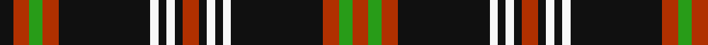

In pattern [KRGRKWKWKRKWKWKRGR](/patterns/krgrkwkwkrkwkwkrgr/).

This was sourced from register-of-tartans.  It is a [18 stripes tartan](/stripes/stripes18/).

Original link https://www.tartanregister.gov.uk/tartanDetails.aspx?ref=4780

## Thread count
K/10 R12 G10 R12 K68 W6 K6 W6 K6 R12 K6 W6 K6 W6 K68 R12 G10 R/12

## Palette
Each colour and its ΔE from the base-6 reference it is a variant of.

| Colour | Shade | Base | ΔE (OKLab) |
|---|---|---|---|
| DR | <code style="background-color:#A00000;">#A00000</code> `#A00000` | R <code style="background-color:#C80000;">#C80000</code> | 0.09 |
| G | <code style="background-color:#289C18;">#289C18</code> `#289C18` | G <code style="background-color:#006400;">#006400</code> | 0.18 |
| K | <code style="background-color:#101010;">#101010</code> `#101010` | K <code style="background-color:#000000;">#000000</code> | 0.17 |
| O | <code style="background-color:#D87C00;">#D87C00</code> `#D87C00` | Y <code style="background-color:#E8C000;">#E8C000</code> | 0.17 |
| R | <code style="background-color:#B03000;">#B03000</code> `#B03000` | R <code style="background-color:#C80000;">#C80000</code> | 0.05 |
| W | <code style="background-color:#F8F8F8;">#F8F8F8</code> `#F8F8F8` | W <code style="background-color:#F4F4F0;">#F4F4F0</code> | 0.01 |

## Nearest tartans

The nearest existing variants by ΔTartan distance.

1. [Woodberry Forest School (Corporate)](/setts/s10/r12k6w6k6w6k68r12g10r12k10-g289c18-k101010-rb03000-wf8f8f8/) — ΔT 1.21
1. [Angus, Red (Fashion)](/setts/s24/k54r26k54r4k4r4k4r4k4r4k4r4k4r4k4w12k6w12k6w12k6w12k6w12-k101010-rc80000-wc0c0c0/) — ΔT 1.21
1. [Freger](/setts/s13/w2y4k16b12k30y2k2w2k30b10w16y2w2-b780078-k101010-we0e0e0-ye8c000/) — ΔT 1.34
1. [Angus (Paton)](/setts/s24/k54r26k54r4k4r4k4r4k4r4k4r4k4r4k4w12k6w12k6w12k6w12k6w12-k101010-rdc0000-we0e0e0/) — ΔT 1.35
1. [Angus](/setts/s24/k54r26k54r4k4r4k4r4k4r4k4r4k4r4k4w12k6w12k6w12k6w12k6w12-k000000-rc00000-we0e0e0/) — ΔT 1.38
1. [Holy Sepulchre Corporate Tartan Tartan Number: 2161. Earliest known date: pre 2003 Information from Mr Scot Wilson, McCalls of Aberdeen. See products available Copyright © Blair Urquhart, Comrie, 2015](/setts/s20/w4r26k34r4k34w4r26w4k34r4k34w4y8w4k34r4k34r26w4y4-k101010-rc80000-we0e0e0-ye8c000/) — ΔT 1.42
1. [Drummond (Grey) Clan Tartan Tartan Number: 1125. Earliest known date: pre 2003 This sample comes from the MacGregor-Hastie collection which forms the basis of the cloth archive of the Scottish Tartans Society. Some of the samples, including this one, were unmarked. One can assume that the sample dates between 1930 and 1950. See products available Copyright © Blair Urquhart, Comrie, 2015](/setts/s14/k8w4k4b28w4k4w4k8b4k32w4k4w2k8-b5c5c5c-k101010-wc0c0c0/) — ΔT 1.51
1. [Ashers of Nairn](/setts/s10/y4k3w3k44y4k22wa22w3k3y4-k101010-wffffff-wac8c8c8-ye0a126/) — ΔT 1.51
1. [Clan Iain Mhor (Name)](/setts/s13/g44w4g4b6ba4w4ba38w4ba4b6ba4w4ba38-b680028-ba1c1c1c-g006038-wfcfcfc/) — ΔT 1.52
1. [Drummond (Grey)](/setts/s14/k8w4k4b28w4k4w4k8b4k32w4k4w2k8-b505050-k101010-wc0c0c0/) — ΔT 1.54

## Neighbour map

Every grey dot is one of 15726 variants placed by the first two principal components of the ΔTartan feature space (44% of its variance). Red is this tartan; blue dots are its nearest — click one to open its page.

<svg viewBox="0 0 640 380" role="img" style="max-width:100%;height:auto;border:1px solid #e0e0e0;border-radius:4px;display:block" xmlns="http://www.w3.org/2000/svg"><image href="/nn/cloud.v1.png" width="640" height="380"/><a href="/setts/s10/r12k6w6k6w6k68r12g10r12k10-g289c18-k101010-rb03000-wf8f8f8/"><circle cx="323.5" cy="150.8" r="4" fill="#3465a4"><title>Woodberry Forest School (Corporate)</title></circle></a><a href="/setts/s24/k54r26k54r4k4r4k4r4k4r4k4r4k4r4k4w12k6w12k6w12k6w12k6w12-k101010-rc80000-wc0c0c0/"><circle cx="315.7" cy="115.8" r="4" fill="#3465a4"><title>Angus, Red (Fashion)</title></circle></a><a href="/setts/s13/w2y4k16b12k30y2k2w2k30b10w16y2w2-b780078-k101010-we0e0e0-ye8c000/"><circle cx="294.3" cy="138.4" r="4" fill="#3465a4"><title>Freger</title></circle></a><a href="/setts/s24/k54r26k54r4k4r4k4r4k4r4k4r4k4r4k4w12k6w12k6w12k6w12k6w12-k101010-rdc0000-we0e0e0/"><circle cx="307.5" cy="110.8" r="4" fill="#3465a4"><title>Angus (Paton)</title></circle></a><a href="/setts/s24/k54r26k54r4k4r4k4r4k4r4k4r4k4r4k4w12k6w12k6w12k6w12k6w12-k000000-rc00000-we0e0e0/"><circle cx="303.9" cy="114.9" r="4" fill="#3465a4"><title>Angus</title></circle></a><a href="/setts/s20/w4r26k34r4k34w4r26w4k34r4k34w4y8w4k34r4k34r26w4y4-k101010-rc80000-we0e0e0-ye8c000/"><circle cx="289.8" cy="156.8" r="4" fill="#3465a4"><title>Holy Sepulchre Corporate Tartan Tartan Number: 2161. Earliest known date: pre 2003 Information from Mr Scot Wilson, McCalls of Aberdeen. See products available Copyright © Blair Urquhart, Comrie, 2015</title></circle></a><a href="/setts/s14/k8w4k4b28w4k4w4k8b4k32w4k4w2k8-b5c5c5c-k101010-wc0c0c0/"><circle cx="328.6" cy="155.6" r="4" fill="#3465a4"><title>Drummond (Grey) Clan Tartan Tartan Number: 1125. Earliest known date: pre 2003 This sample comes from the MacGregor-Hastie collection which forms the basis of the cloth archive of the Scottish Tartans Society. Some of the samples, including this one, were unmarked. One can assume that the sample dates between 1930 and 1950. See products available Copyright © Blair Urquhart, Comrie, 2015</title></circle></a><a href="/setts/s10/y4k3w3k44y4k22wa22w3k3y4-k101010-wffffff-wac8c8c8-ye0a126/"><circle cx="333.7" cy="139.0" r="4" fill="#3465a4"><title>Ashers of Nairn</title></circle></a><a href="/setts/s13/g44w4g4b6ba4w4ba38w4ba4b6ba4w4ba38-b680028-ba1c1c1c-g006038-wfcfcfc/"><circle cx="279.2" cy="149.9" r="4" fill="#3465a4"><title>Clan Iain Mhor (Name)</title></circle></a><a href="/setts/s14/k8w4k4b28w4k4w4k8b4k32w4k4w2k8-b505050-k101010-wc0c0c0/"><circle cx="331.8" cy="157.5" r="4" fill="#3465a4"><title>Drummond (Grey)</title></circle></a><circle cx="316.5" cy="124.7" r="5" fill="#c00000"/></svg>

ID: /setts/s18/r12g10r12k68w6k6w6k6r12k6w6k6w6k68r12g10r12k10-g289c18-k101010-rb03000-wf8f8f8/
