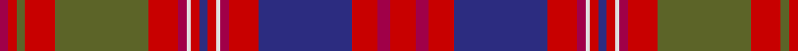

In pattern [RRGRGRRWRBRWRRBRRR](/patterns/rrgrgrrwrbrwrrbrrr/).

This was sourced from house-of-tartan.  It is a [18 stripes tartan](/stripes/stripes18/).

Original link http://www.house-of-tartan.scotland.net/house/TartanViewjs.asp?colr=Def&tnam=1637

## Thread count
R/4 Ra4 G4 Ra14 G44 Ra14 R4 LN2 Ra4 DB4 Ra4 LN2 R4 Ra14 DB44 Ra12 R6 Ra/12

## Palette
Each colour and its ΔE from the base-6 reference it is a variant of.

| Colour | Shade | Base | ΔE (OKLab) |
|---|---|---|---|
| DB | <code style="background-color:#2C2C80;">#2C2C80</code> `#2C2C80` | B <code style="background-color:#2C4084;">#2C4084</code> | 0.05 |
| G | <code style="background-color:#5C6428;">#5C6428</code> `#5C6428` | G <code style="background-color:#006400;">#006400</code> | 0.09 |
| LN | <code style="background-color:#E0E0E0;">#E0E0E0</code> `#E0E0E0` | W <code style="background-color:#F4F4F0;">#F4F4F0</code> | 0.06 |
| R | <code style="background-color:#A00048;">#A00048</code> `#A00048` | R <code style="background-color:#C80000;">#C80000</code> | 0.11 |
| Ra | <code style="background-color:#C80000;">#C80000</code> `#C80000` | R <code style="background-color:#C80000;">#C80000</code> | 0.00 |

## Nearest tartans

The nearest existing variants by ΔTartan distance.

1. [MacColl, hunting](/setts/s18/r12ra6r12b44r14ra4w2r4b4r4w2ra4r14g44r14g4r4ra4-b304080-g607030-rc00000-ra900030-we0e0e0/) — ΔT 0.51
1. [MacColl Hunting](/setts/s18/r12ra6r12b44r14ra4w2r4b4r4w2ra4r14g44r14g4r4ra4-b2c2c80-g006818-rc80000-raa00048-we0e0e0/) — ΔT 0.69
1. [Strathdon (District?)](/setts/s15/y6ya16r4ya16b22r4ya8ra8r54b2r4b4r4b26r4-b2c2c80-r901c38-rac80000-ya0a0a0-yabc8c00/) — ΔT 0.77
1. [MacColl Ancient](/setts/s17/r14ra6r12b52r16ra4r4b4r4g2ra4r16g52r16g4r4ra4-b2c4084-g005020-rdc0000-ra960028/) — ΔT 1.05
1. [MacColl, Ancient](/setts/s17/r14ra6r12b52r16g4r4b4r4ga2ra4r16ga52r16ga4r4ra4-b304080-g005020-ga008000-rc00000-ra900030/) — ΔT 1.06
1. [Grant or New Bruce Clan Tartan Tartan Number: 1385. Earliest known date: 1819 As ordered by Patrick Grant of Redcastle, the chief of the Clan Grant. The large red and the large green squares have been reduced by a factor of 4 to allow display. The original sett was S15 P2 S4 P4 S156 LB2 S4 P42 S6 G4 S6 G178 S4 P4 S10 (HSHP half sett half pivot). This tartan was also adopted by the Drummonds. See products available Copyright © Blair Urquhart, Comrie, 2015](/setts/s15/r12b2r4b4r39ba2r4b11r6g4r6g45r4b4bb10-b780078-ba5c8ca8-bb2c2c80-g006818-rc80000/) — ΔT 1.16
1. [MacDougall #3](/setts/s17/r60b6ra6g24ra24g24r16ra6r16b24ra10g6ra10g50ra8r12ba2-b5a008c-ba3c82af-g005020-rc82828-radc0000/) — ΔT 1.19
1. [Strathdon](/setts/s15/w6y16b4y16ba22b4y8r8b54ba2b4ba4b4ba26b4-b4d1a3a-ba401a4f-r7c0000-wd8e9ff-yda8d24/) — ΔT 1.21
1. [Scobie (Name)](/setts/s12/b2r2b2r12g52b28r40ba2r2ba2r4w2-b780078-ba5c8ca8-g006818-rc80000-wf0b4b4/) — ΔT 1.26
1. [MacDougall (Paton)](/setts/s20/w2b4r2g44r6g2r6ba18b4r2b4g16r16g16r2ba2r44b4r4w2-b5a008c-ba2c4084-g005020-rdc0000-we0e0e0/) — ΔT 1.26

## Neighbour map

Every grey dot is one of 15726 variants placed by the first two principal components of the ΔTartan feature space (44% of its variance). Red is this tartan; blue dots are its nearest — click one to open its page.

<svg viewBox="0 0 640 380" role="img" style="max-width:100%;height:auto;border:1px solid #e0e0e0;border-radius:4px;display:block" xmlns="http://www.w3.org/2000/svg"><image href="/nn/cloud.v1.png" width="640" height="380"/><a href="/setts/s18/r12ra6r12b44r14ra4w2r4b4r4w2ra4r14g44r14g4r4ra4-b304080-g607030-rc00000-ra900030-we0e0e0/"><circle cx="255.6" cy="101.7" r="4" fill="#3465a4"><title>MacColl, hunting</title></circle></a><a href="/setts/s18/r12ra6r12b44r14ra4w2r4b4r4w2ra4r14g44r14g4r4ra4-b2c2c80-g006818-rc80000-raa00048-we0e0e0/"><circle cx="228.2" cy="91.4" r="4" fill="#3465a4"><title>MacColl Hunting</title></circle></a><a href="/setts/s15/y6ya16r4ya16b22r4ya8ra8r54b2r4b4r4b26r4-b2c2c80-r901c38-rac80000-ya0a0a0-yabc8c00/"><circle cx="253.8" cy="98.2" r="4" fill="#3465a4"><title>Strathdon (District?)</title></circle></a><a href="/setts/s17/r14ra6r12b52r16ra4r4b4r4g2ra4r16g52r16g4r4ra4-b2c4084-g005020-rdc0000-ra960028/"><circle cx="265.0" cy="104.4" r="4" fill="#3465a4"><title>MacColl Ancient</title></circle></a><a href="/setts/s17/r14ra6r12b52r16g4r4b4r4ga2ra4r16ga52r16ga4r4ra4-b304080-g005020-ga008000-rc00000-ra900030/"><circle cx="245.9" cy="91.6" r="4" fill="#3465a4"><title>MacColl, Ancient</title></circle></a><a href="/setts/s15/r12b2r4b4r39ba2r4b11r6g4r6g45r4b4bb10-b780078-ba5c8ca8-bb2c2c80-g006818-rc80000/"><circle cx="296.8" cy="97.6" r="4" fill="#3465a4"><title>Grant or New Bruce Clan Tartan Tartan Number: 1385. Earliest known date: 1819 As ordered by Patrick Grant of Redcastle, the chief of the Clan Grant. The large red and the large green squares have been reduced by a factor of 4 to allow display. The original sett was S15 P2 S4 P4 S156 LB2 S4 P42 S6 G4 S6 G178 S4 P4 S10 (HSHP half sett half pivot). This tartan was also adopted by the Drummonds. See products available Copyright © Blair Urquhart, Comrie, 2015</title></circle></a><a href="/setts/s17/r60b6ra6g24ra24g24r16ra6r16b24ra10g6ra10g50ra8r12ba2-b5a008c-ba3c82af-g005020-rc82828-radc0000/"><circle cx="220.9" cy="106.9" r="4" fill="#3465a4"><title>MacDougall #3</title></circle></a><a href="/setts/s15/w6y16b4y16ba22b4y8r8b54ba2b4ba4b4ba26b4-b4d1a3a-ba401a4f-r7c0000-wd8e9ff-yda8d24/"><circle cx="240.6" cy="96.6" r="4" fill="#3465a4"><title>Strathdon</title></circle></a><a href="/setts/s12/b2r2b2r12g52b28r40ba2r2ba2r4w2-b780078-ba5c8ca8-g006818-rc80000-wf0b4b4/"><circle cx="276.3" cy="93.7" r="4" fill="#3465a4"><title>Scobie (Name)</title></circle></a><a href="/setts/s20/w2b4r2g44r6g2r6ba18b4r2b4g16r16g16r2ba2r44b4r4w2-b5a008c-ba2c4084-g005020-rdc0000-we0e0e0/"><circle cx="246.5" cy="79.6" r="4" fill="#3465a4"><title>MacDougall (Paton)</title></circle></a><circle cx="245.7" cy="96.0" r="5" fill="#c00000"/></svg>

ID: /setts/s18/r12ra6r12b44r14ra4w2r4b4r4w2ra4r14g44r14g4r4ra4-b2c2c80-g5c6428-rc80000-raa00048-we0e0e0/
