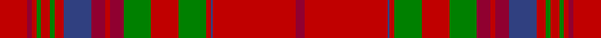

This page is one **sett** — a single exact thread-count. It belongs to the [tartan](/tartans/r12ri2r2g2r4g2r4db12ri6r2ri6g12r12g12r2db1r36ri4/)
(the same proportion at any scale), whose colour order is pattern [RRBRGRGRRRBRGRGRRR](/stripes/rrbrgrgrrrbrgrgrrr/).

Sourced from weddslist.  It is a [18 stripe tartan](/stripes/stripes18/).

Original link http://www.weddslist.com/cgi-bin/tartans/pg.pl?source=sts

## Thread count
R/24 DR4 R4 G4 R8 G4 R8 B24 DR12 R4 DR12 G24 R24 G24 R4 B2 R72 DR/8

## Palette

Palette: <strong>custom</strong>
<table><thead><tr><th>Colour</th><th>Threads</th><th>Shade</th><th>Base</th><th>OKLCh</th></tr></thead><tbody><tr><td>R/</td><td style="text-align:right;font-variant-numeric:tabular-nums">24</td><td><code style="background-color:#C00000;">#C00000</code> <small style="color:#888">#C00000</small></td><td>R <code style="background-color:#CC0000;">#CC0000</code></td><td><small style="color:#888">oklch(50.7% 0.208 29.2)</small></td></tr><tr><td>DR</td><td style="text-align:right;font-variant-numeric:tabular-nums">4</td><td><code style="background-color:#900030;">#900030</code> <small style="color:#888">#900030</small></td><td>R <code style="background-color:#CC0000;">#CC0000</code></td><td><small style="color:#888">oklch(41.6% 0.166 13.6)</small></td></tr><tr><td>R</td><td style="text-align:right;font-variant-numeric:tabular-nums">4</td><td><code style="background-color:#C00000;">#C00000</code> <small style="color:#888">#C00000</small></td><td>R <code style="background-color:#CC0000;">#CC0000</code></td><td><small style="color:#888">oklch(50.7% 0.208 29.2)</small></td></tr><tr><td>G</td><td style="text-align:right;font-variant-numeric:tabular-nums">4</td><td><code style="background-color:#008000;">#008000</code> <small style="color:#888">#008000</small></td><td>G <code style="background-color:#006100;">#006100</code></td><td><small style="color:#888">oklch(52.0% 0.177 142.5)</small></td></tr><tr><td>R</td><td style="text-align:right;font-variant-numeric:tabular-nums">8</td><td><code style="background-color:#C00000;">#C00000</code> <small style="color:#888">#C00000</small></td><td>R <code style="background-color:#CC0000;">#CC0000</code></td><td><small style="color:#888">oklch(50.7% 0.208 29.2)</small></td></tr><tr><td>G</td><td style="text-align:right;font-variant-numeric:tabular-nums">4</td><td><code style="background-color:#008000;">#008000</code> <small style="color:#888">#008000</small></td><td>G <code style="background-color:#006100;">#006100</code></td><td><small style="color:#888">oklch(52.0% 0.177 142.5)</small></td></tr><tr><td>R</td><td style="text-align:right;font-variant-numeric:tabular-nums">8</td><td><code style="background-color:#C00000;">#C00000</code> <small style="color:#888">#C00000</small></td><td>R <code style="background-color:#CC0000;">#CC0000</code></td><td><small style="color:#888">oklch(50.7% 0.208 29.2)</small></td></tr><tr><td>B</td><td style="text-align:right;font-variant-numeric:tabular-nums">24</td><td><code style="background-color:#304080;">#304080</code> <small style="color:#888">#304080</small></td><td>B <code style="background-color:#2A418A;">#2A418A</code></td><td><small style="color:#888">oklch(39.4% 0.109 270.2)</small></td></tr><tr><td>DR</td><td style="text-align:right;font-variant-numeric:tabular-nums">12</td><td><code style="background-color:#900030;">#900030</code> <small style="color:#888">#900030</small></td><td>R <code style="background-color:#CC0000;">#CC0000</code></td><td><small style="color:#888">oklch(41.6% 0.166 13.6)</small></td></tr><tr><td>R</td><td style="text-align:right;font-variant-numeric:tabular-nums">4</td><td><code style="background-color:#C00000;">#C00000</code> <small style="color:#888">#C00000</small></td><td>R <code style="background-color:#CC0000;">#CC0000</code></td><td><small style="color:#888">oklch(50.7% 0.208 29.2)</small></td></tr><tr><td>DR</td><td style="text-align:right;font-variant-numeric:tabular-nums">12</td><td><code style="background-color:#900030;">#900030</code> <small style="color:#888">#900030</small></td><td>R <code style="background-color:#CC0000;">#CC0000</code></td><td><small style="color:#888">oklch(41.6% 0.166 13.6)</small></td></tr><tr><td>G</td><td style="text-align:right;font-variant-numeric:tabular-nums">24</td><td><code style="background-color:#008000;">#008000</code> <small style="color:#888">#008000</small></td><td>G <code style="background-color:#006100;">#006100</code></td><td><small style="color:#888">oklch(52.0% 0.177 142.5)</small></td></tr><tr><td>R</td><td style="text-align:right;font-variant-numeric:tabular-nums">24</td><td><code style="background-color:#C00000;">#C00000</code> <small style="color:#888">#C00000</small></td><td>R <code style="background-color:#CC0000;">#CC0000</code></td><td><small style="color:#888">oklch(50.7% 0.208 29.2)</small></td></tr><tr><td>G</td><td style="text-align:right;font-variant-numeric:tabular-nums">24</td><td><code style="background-color:#008000;">#008000</code> <small style="color:#888">#008000</small></td><td>G <code style="background-color:#006100;">#006100</code></td><td><small style="color:#888">oklch(52.0% 0.177 142.5)</small></td></tr><tr><td>R</td><td style="text-align:right;font-variant-numeric:tabular-nums">4</td><td><code style="background-color:#C00000;">#C00000</code> <small style="color:#888">#C00000</small></td><td>R <code style="background-color:#CC0000;">#CC0000</code></td><td><small style="color:#888">oklch(50.7% 0.208 29.2)</small></td></tr><tr><td>B</td><td style="text-align:right;font-variant-numeric:tabular-nums">2</td><td><code style="background-color:#304080;">#304080</code> <small style="color:#888">#304080</small></td><td>B <code style="background-color:#2A418A;">#2A418A</code></td><td><small style="color:#888">oklch(39.4% 0.109 270.2)</small></td></tr><tr><td>R</td><td style="text-align:right;font-variant-numeric:tabular-nums">72</td><td><code style="background-color:#C00000;">#C00000</code> <small style="color:#888">#C00000</small></td><td>R <code style="background-color:#CC0000;">#CC0000</code></td><td><small style="color:#888">oklch(50.7% 0.208 29.2)</small></td></tr><tr><td>DR/</td><td style="text-align:right;font-variant-numeric:tabular-nums">8</td><td><code style="background-color:#900030;">#900030</code> <small style="color:#888">#900030</small></td><td>R <code style="background-color:#CC0000;">#CC0000</code></td><td><small style="color:#888">oklch(41.6% 0.166 13.6)</small></td></tr></tbody></table>

## Nearest tartans

The nearest existing variants by ΔTartan distance, with this tartan at the top so the swatches line up against it.

ΔTartan

Tartan

Sett

—

<a href="/ttd/edit/#slug=r12ri2r2g2r4g2r4db12ri6r2ri6g12r12g12r2db1r36ri4~x2">MacCoul</a> <a class="nn-out" href="/setts/s18/r12ri2r2g2r4g2r4db12ri6r2ri6g12r12g12r2db1r36ri4~x2/" title="open its dictionary page">↗</a>

0.34

<a href="/ttd/edit/#slug=r12m2r2g2r4g2r4db12m6r2m6g12r12g12r2db1r36m4~x2">MacCoul Clan Tartan Tartan Number: 1635. Earliest known date: 1850 This plate is taken from the manuscript of William and Andrew Smith's 'Authenticated Tartans of the Clans and Families of Scotland'. The Smith's sources included the findings of George Hunter, an Army clothier, who toured the Highlands in search of old tartans prior to 1822. See products available Copyright © Blair Urquhart, Comrie, 2015</a> <a class="nn-out" href="/setts/s18/r12m2r2g2r4g2r4db12m6r2m6g12r12g12r2db1r36m4~x2/" title="open its dictionary page">↗</a>

0.69

<a href="/ttd/edit/#slug=r12ri2r2dg2r4dg2r4dp12ri6r2ri6dg12r12dg12r2dp1r36ri4~x2">MacCoul</a> <a class="nn-out" href="/setts/s18/r12ri2r2dg2r4dg2r4dp12ri6r2ri6dg12r12dg12r2dp1r36ri4~x2/" title="open its dictionary page">↗</a>

0.92

<a href="/ttd/edit/#slug=r6g12r2db1r36ri4r36db1r2g12r12g12ri6r2ri6db12r4g2r4g36r2ri2~x4">MacDougall</a> <a class="nn-out" href="/setts/s22/r6g12r2db1r36ri4r36db1r2g12r12g12ri6r2ri6db12r4g2r4g36r2ri2~x4/" title="open its dictionary page">↗</a>

1.03

<a href="/ttd/edit/#slug=g12r11dp12k1dp1k1r32dp8g8dp8g8r32k1dp1k1dp12r11g12~x2">Fiddes #3</a> <a class="nn-out" href="/setts/s18/g12r11dp12k1dp1k1r32dp8g8dp8g8r32k1dp1k1dp12r11g12~x2/" title="open its dictionary page">↗</a>

1.18

<a href="/ttd/edit/#slug=r24w1dp2r4g32r4dp2w1r4dp6r4w1dp2r32g6ri6g6~x2">Dalziel (Clan)</a> <a class="nn-out" href="/setts/s17/r24w1dp2r4g32r4dp2w1r4dp6r4w1dp2r32g6ri6g6~x2/" title="open its dictionary page">↗</a>

1.21

<a href="/ttd/edit/#slug=g12r11p12k1p1k1r32g8p8g8p8r32k1p1k1p12r11g12~x2">Fiddes</a> <a class="nn-out" href="/setts/s18/g12r11p12k1p1k1r32g8p8g8p8r32k1p1k1p12r11g12~x2/" title="open its dictionary page">↗</a>

1.25

<a href="/ttd/edit/#slug=r4t1db1r32t2r2db12r2g16r4t1r4db2~x2">MacGillivray</a> <a class="nn-out" href="/setts/s13/r4t1db1r32t2r2db12r2g16r4t1r4db2~x2/" title="open its dictionary page">↗</a>

1.27

<a href="/ttd/edit/#slug=r6dp2r2dg24r2dg2r2dp8r2t1r32dp2r2dp1r6~x2">Drummond - 1819 (Clan)</a> <a class="nn-out" href="/setts/s15/r6dp2r2dg24r2dg2r2dp8r2t1r32dp2r2dp1r6~x2/" title="open its dictionary page">↗</a>

1.28

<a href="/ttd/edit/#slug=r6db2r2g24r2g2r2db8r2t2r32db2r2db1r6~x2">Grant or Drummond Clan Tartan Tartan Number: 1384. Earliest known date: 1831 The usual design is sometimes called Drummond. It is recorded by Logan (1831), Smibert (1850), and Smith (1850). McIan's drawing of the Grant tartan is too roughly done to make out the pattern details. A certain difficulty arises in establishing a single Grant tartan to represent the clan, illustrated by the existance of ten Grant portraits at Cullen House in which each brother is wearing a different tartan, and where a coat or plaid is worn, these also differ. The chief of the Grants is Lord Strathspey. See products available Copyright © Blair Urquhart, Comrie, 2015</a> <a class="nn-out" href="/setts/s15/r6db2r2g24r2g2r2db8r2t2r32db2r2db1r6~x2/" title="open its dictionary page">↗</a>

1.28

<a href="/ttd/edit/#slug=r24w1dp2r4g32r4dp2w1r4dp6r4w1dp2r32g2ri3g6~x2">Dalziel #2</a> <a class="nn-out" href="/setts/s17/r24w1dp2r4g32r4dp2w1r4dp6r4w1dp2r32g2ri3g6~x2/" title="open its dictionary page">↗</a>

## Neighbour map

Every grey dot is one of 14359 variants placed by the first two principal components of the ΔTartan feature space (44% of its variance). Red is this tartan; blue dots are its nearest — click one to open its page.

<svg viewBox="0 0 640 380" role="img" style="max-width:100%;height:auto;border:1px solid #e0e0e0;border-radius:4px;display:block" xmlns="http://www.w3.org/2000/svg"><image href="/nn/cloud.v1.png" width="640" height="380"/><a href="/setts/s18/r12m2r2g2r4g2r4db12m6r2m6g12r12g12r2db1r36m4~x2/"><circle cx="379.9" cy="103.9" r="4" fill="#3465a4"><title>MacCoul Clan Tartan Tartan Number: 1635. Earliest known date: 1850 This plate is taken from the manuscript of William and Andrew Smith's 'Authenticated Tartans of the Clans and Families of Scotland'. The Smith's sources included the findings of George Hunter, an Army clothier, who toured the Highlands in search of old tartans prior to 1822. See products available Copyright © Blair Urquhart, Comrie, 2015</title></circle></a><a href="/setts/s18/r12ri2r2dg2r4dg2r4dp12ri6r2ri6dg12r12dg12r2dp1r36ri4~x2/"><circle cx="379.0" cy="101.5" r="4" fill="#3465a4"><title>MacCoul</title></circle></a><a href="/setts/s22/r6g12r2db1r36ri4r36db1r2g12r12g12ri6r2ri6db12r4g2r4g36r2ri2~x4/"><circle cx="349.3" cy="91.2" r="4" fill="#3465a4"><title>MacDougall</title></circle></a><a href="/setts/s18/g12r11dp12k1dp1k1r32dp8g8dp8g8r32k1dp1k1dp12r11g12~x2/"><circle cx="329.0" cy="112.1" r="4" fill="#3465a4"><title>Fiddes #3</title></circle></a><a href="/setts/s17/r24w1dp2r4g32r4dp2w1r4dp6r4w1dp2r32g6ri6g6~x2/"><circle cx="344.2" cy="79.2" r="4" fill="#3465a4"><title>Dalziel (Clan)</title></circle></a><a href="/setts/s18/g12r11p12k1p1k1r32g8p8g8p8r32k1p1k1p12r11g12~x2/"><circle cx="316.1" cy="106.4" r="4" fill="#3465a4"><title>Fiddes</title></circle></a><a href="/setts/s13/r4t1db1r32t2r2db12r2g16r4t1r4db2~x2/"><circle cx="394.4" cy="103.1" r="4" fill="#3465a4"><title>MacGillivray</title></circle></a><a href="/setts/s15/r6dp2r2dg24r2dg2r2dp8r2t1r32dp2r2dp1r6~x2/"><circle cx="400.8" cy="89.1" r="4" fill="#3465a4"><title>Drummond - 1819 (Clan)</title></circle></a><a href="/setts/s15/r6db2r2g24r2g2r2db8r2t2r32db2r2db1r6~x2/"><circle cx="389.9" cy="92.9" r="4" fill="#3465a4"><title>Grant or Drummond Clan Tartan Tartan Number: 1384. Earliest known date: 1831 The usual design is sometimes called Drummond. It is recorded by Logan (1831), Smibert (1850), and Smith (1850). McIan's drawing of the Grant tartan is too roughly done to make out the pattern details. A certain difficulty arises in establishing a single Grant tartan to represent the clan, illustrated by the existance of ten Grant portraits at Cullen House in which each brother is wearing a different tartan, and where a coat or plaid is worn, these also differ. The chief of the Grants is Lord Strathspey. See products available Copyright © Blair Urquhart, Comrie, 2015</title></circle></a><a href="/setts/s17/r24w1dp2r4g32r4dp2w1r4dp6r4w1dp2r32g2ri3g6~x2/"><circle cx="365.3" cy="73.9" r="4" fill="#3465a4"><title>Dalziel #2</title></circle></a><circle cx="379.5" cy="105.4" r="5" fill="#c00000"/></svg>

ID: /setts/s18/r12ri2r2g2r4g2r4db12ri6r2ri6g12r12g12r2db1r36ri4~x2/
