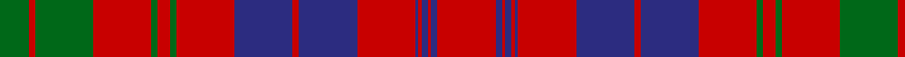

In pattern [GRGRGRGRBRBRBRBRBR](/patterns/grgrgrgrbrbrbrbrbr/).

This was sourced from tartans-authority.  It is a [18 stripes tartan](/stripes/stripes18/).

Original link http://www.tartansauthority.com/tartan-ferret/display/5971/

## Thread count
G/18 R4 G36 R36 G4 R8 G4 R36 DB36 R4 DB36 R36 DB2 R2 DB4 R2 DB4 R/36

## Palette
Each colour and its ΔE from the base-6 reference it is a variant of.

| Colour | Shade | Base | ΔE (OKLab) |
|---|---|---|---|
| DB | <code style="background-color:#2C2C80;">#2C2C80</code> `#2C2C80` | B <code style="background-color:#2A418A;">#2A418A</code> | 0.06 |
| G | <code style="background-color:#006818;">#006818</code> `#006818` | G <code style="background-color:#006100;">#006100</code> | 0.02 |
| R | <code style="background-color:#C80000;">#C80000</code> `#C80000` | R <code style="background-color:#CC0000;">#CC0000</code> | 0.01 |

## Nearest tartans

The nearest existing variants by ΔTartan distance.

1. [Ross #5](/setts/s18/g18r2g18r18g2r4g2r18b18r2b18r18b1r1b2r1b1r18x2~b2c4084-g005020-rdc0000/) — ΔT 0.32
1. [Ross 6](/setts/s18/g18r2g18r18g2r4g2r18b18r2b18r18b1r1b2r1b1r18x2~b304080-g008000-rc00000/) — ΔT 0.69
1. [Ross](/setts/s20/b18r2b18r18g2r4g2r18g18r2g18r2g18r18b1r1b2r1b1r18x2~b2c4084-g005020-rdc0000/) — ΔT 0.79
1. [Campbell of Loudoun, Plaid](/setts/s25/b3r1b1r3b9r3b1r1b3r1b1r18b14r3b1r1b1r3g4r14g10r10b5r4b1x2~b304080-g008000-rc00000/) — ΔT 0.89
1. [Murray of Tullibardine (plaid)](/setts/s21/b4r1b1r4b12r4b1r1g4r1b1r26b26r4g4r26g21r13b6r5g1x2~b2c4084-g005020-rdc0000/) — ΔT 0.92
1. [Murray of Tullibardine 4](/setts/s21/b4r1b1r4b12r4b1r1g4r1b1r26b26r4g4r26g21r13b6r5g1x2~b304080-g008000-rc00000/) — ΔT 0.97
1. [MacLeod Red](/setts/s21/b4r1b1r2b11r2b1r1y1r1b1r16b8r4g4r16g11r8b4r2y2x2~b2c2c80-g006818-rc80000-ye8c000/) — ΔT 1.00
1. [Ross #8](/setts/s25/r14b1r1b2r1b1r10g10r2g10r2g10r10g2r6g2r10b10r2b10r2b10r10g2r6x2~b2c4084-g005020-rdc0000/) — ΔT 1.02
1. [Robertson #5](/setts/s12/r28g2r5g2r28b3r3g24r3b24r3b3x2~b2c4084-g005020-rdc0000/) — ΔT 1.04
1. [MacLeod Red Clan Tartan Tartan Number: 496. Earliest known date: 1982 Designed after the tartan worn by Norman MacLeod, 22nd Chief of the clan, painted by Allan Ramsay in 1747, with the costume painted by Van Haecken (see details in entry for MacLeod portrait.) A yellow stripe was added by Ruairidh MacLeod to enhance the family resemblance to other MacLeod tartans, and to differentiate this from Murray of Tullibardine, the name now attached to the sett in the portrait. Approved by the Clan MacLeod Parliament in 1982. See products available Copyright © Blair Urquhart, Comrie, 2015](/setts/s21/b4r1b1r2b11r2b1r1y1r1b1r16b8r4g4r16g11r8b4r2y2x2~b202060-g006818-rc80000-ye8c000/) — ΔT 1.05

## Neighbour map

Every grey dot is one of 15726 variants placed by the first two principal components of the ΔTartan feature space (44% of its variance). Red is this tartan; blue dots are its nearest — click one to open its page.

<svg viewBox="0 0 640 380" role="img" style="max-width:100%;height:auto;border:1px solid #e0e0e0;border-radius:4px;display:block" xmlns="http://www.w3.org/2000/svg"><image href="/nn/cloud.v1.png" width="640" height="380"/><a href="/setts/s18/g18r2g18r18g2r4g2r18b18r2b18r18b1r1b2r1b1r18x2~b2c4084-g005020-rdc0000/"><circle cx="311.4" cy="148.5" r="4" fill="#3465a4"><title>Ross #5</title></circle></a><a href="/setts/s18/g18r2g18r18g2r4g2r18b18r2b18r18b1r1b2r1b1r18x2~b304080-g008000-rc00000/"><circle cx="315.4" cy="152.7" r="4" fill="#3465a4"><title>Ross 6</title></circle></a><a href="/setts/s20/b18r2b18r18g2r4g2r18g18r2g18r2g18r18b1r1b2r1b1r18x2~b2c4084-g005020-rdc0000/"><circle cx="286.7" cy="146.0" r="4" fill="#3465a4"><title>Ross</title></circle></a><a href="/setts/s25/b3r1b1r3b9r3b1r1b3r1b1r18b14r3b1r1b1r3g4r14g10r10b5r4b1x2~b304080-g008000-rc00000/"><circle cx="351.8" cy="131.3" r="4" fill="#3465a4"><title>Campbell of Loudoun, Plaid</title></circle></a><a href="/setts/s21/b4r1b1r4b12r4b1r1g4r1b1r26b26r4g4r26g21r13b6r5g1x2~b2c4084-g005020-rdc0000/"><circle cx="343.6" cy="113.6" r="4" fill="#3465a4"><title>Murray of Tullibardine (plaid)</title></circle></a><a href="/setts/s21/b4r1b1r4b12r4b1r1g4r1b1r26b26r4g4r26g21r13b6r5g1x2~b304080-g008000-rc00000/"><circle cx="350.2" cy="118.9" r="4" fill="#3465a4"><title>Murray of Tullibardine 4</title></circle></a><a href="/setts/s21/b4r1b1r2b11r2b1r1y1r1b1r16b8r4g4r16g11r8b4r2y2x2~b2c2c80-g006818-rc80000-ye8c000/"><circle cx="300.0" cy="121.3" r="4" fill="#3465a4"><title>MacLeod Red</title></circle></a><a href="/setts/s25/r14b1r1b2r1b1r10g10r2g10r2g10r10g2r6g2r10b10r2b10r2b10r10g2r6x2~b2c4084-g005020-rdc0000/"><circle cx="289.3" cy="157.6" r="4" fill="#3465a4"><title>Ross #8</title></circle></a><a href="/setts/s12/r28g2r5g2r28b3r3g24r3b24r3b3x2~b2c4084-g005020-rdc0000/"><circle cx="343.4" cy="165.1" r="4" fill="#3465a4"><title>Robertson #5</title></circle></a><a href="/setts/s21/b4r1b1r2b11r2b1r1y1r1b1r16b8r4g4r16g11r8b4r2y2x2~b202060-g006818-rc80000-ye8c000/"><circle cx="296.2" cy="120.4" r="4" fill="#3465a4"><title>MacLeod Red Clan Tartan Tartan Number: 496. Earliest known date: 1982 Designed after the tartan worn by Norman MacLeod, 22nd Chief of the clan, painted by Allan Ramsay in 1747, with the costume painted by Van Haecken (see details in entry for MacLeod portrait.) A yellow stripe was added by Ruairidh MacLeod to enhance the family resemblance to other MacLeod tartans, and to differentiate this from Murray of Tullibardine, the name now attached to the sett in the portrait. Approved by the Clan MacLeod Parliament in 1982. See products available Copyright © Blair Urquhart, Comrie, 2015</title></circle></a><circle cx="329.7" cy="150.5" r="5" fill="#c00000"/></svg>

ID: /setts/s18/r18b2r1b2r1b1r18b18r2b18r18g2r4g2r18g18r2g9x2~b2c2c80-g006818-rc80000/
