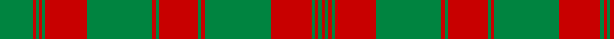

This page is one **sett** — a single exact thread-count. It belongs to the [tartan](/tartans/r24g2r2g40r25g2r2g2r2g20/)
(the same proportion at any scale), whose colour order is pattern [GRGRGRGRGRGRGRGRGR](/stripes/grgrgrgrgrgrgrgrgr/).

Sourced from house-of-tartan.  It is a [18 stripe tartan](/stripes/stripes18/).

Original link http://www.house-of-tartan.scotland.net/house/TartanViewjs.asp?colr=Def&tnam=6138

## Thread count
G/40 R4 G4 R4 G4 R50 G80 R4 G4 R48 G4 R4 G80 R50 G4 R4 G4 R/4

## Palette
Each colour and the base-6 reference it is a variant of.

| Colour | Shade | Base |
|---|---|---|
| DG | <code style="background-color:#003820;">#003820</code> `oklch(30.0% 0.070 158.3)` <small>#003820</small> | G <code style="background-color:#006100;">#006100</code> |
| DR | <code style="background-color:#800000;">#800000</code> `oklch(37.7% 0.155 29.2)` <small>#800000</small> | R <code style="background-color:#CC0000;">#CC0000</code> |
| G | <code style="background-color:#008440;">#008440</code> `oklch(53.7% 0.143 151.5)` <small>#008440</small> | G <code style="background-color:#006100;">#006100</code> |
| R | <code style="background-color:#C80000;">#C80000</code> `oklch(52.3% 0.215 29.2)` <small>#C80000</small> | R <code style="background-color:#CC0000;">#CC0000</code> |

## Nearest tartans

The nearest existing variants by ΔTartan distance, with this tartan at the top so the swatches line up against it.

ΔTartan

Tartan

Sett

—

<a href="/ttd/edit/#slug=r24g2r2g40r25g2r2g2r2g20~x2">Donachie Clan Tartan Tartan Number: 6138. Earliest known date: 2004 A new tartan, a simplified sett based on the #893 Robertson tartan once presented by the Jacobite Prince to a Robertson during the '45.'' (The Setts of the Scottish Tartans, D.C. Stewart, 1950.) The Donachie of Brockloch Society have adopted this tartan. See products available Copyright © Blair Urquhart, Comrie, 2015</a> <a class="nn-out" href="/setts/s18/r24g2r2g40r25g2r2g2r2g20~x2/" title="open its dictionary page">↗</a>

1.01

<a href="/ttd/edit/#slug=g15r1g1r1g1r18g24r1g1r18g1r1g1r3~x2">Robertson - 1746 (Artefact)</a> <a class="nn-out" href="/setts/s14/g15r1g1r1g1r18g24r1g1r18g1r1g1r3~x2/" title="open its dictionary page">↗</a>

1.16

<a href="/ttd/edit/#slug=g9r2g3r20g2r1g2r2g20r2g3r2g2r22g3ly1r3~x2">Hebrides Outer</a> <a class="nn-out" href="/setts/s17/g9r2g3r20g2r1g2r2g20r2g3r2g2r22g3ly1r3~x2/" title="open its dictionary page">↗</a>

1.25

<a href="/ttd/edit/#slug=r24g2r2g40r25g2r2g2r2g20~x2">Donachie</a> <a class="nn-out" href="/setts/s10/r24g2r2g40r25g2r2g2r2g20~x2/" title="open its dictionary page">↗</a>

1.43

<a href="/ttd/edit/#slug=dg15r1dg1r1dg1r18dg24r1dg1r18dg1r1dg1r3~x2">Robertson #2</a> <a class="nn-out" href="/setts/s14/dg15r1dg1r1dg1r18dg24r1dg1r18dg1r1dg1r3~x2/" title="open its dictionary page">↗</a>

1.52

<a href="/ttd/edit/#slug=w8g83r7g5r7g7r28g7r28g7r7g5r7g83w4g4w8">Rothesay Hunting (District)</a> <a class="nn-out" href="/setts/s17/w8g83r7g5r7g7r28g7r28g7r7g5r7g83w4g4w8/" title="open its dictionary page">↗</a>

1.58

<a href="/ttd/edit/#slug=g14r4g2r2g2r4g19r30g2r9~x2">Livingstone</a> <a class="nn-out" href="/setts/s10/g14r4g2r2g2r4g19r30g2r9~x2/" title="open its dictionary page">↗</a>

1.63

<a href="/ttd/edit/#slug=r8g3r1g1r1g22db8g3r1g1r1g3r6g1r1g1r2db6g5r3g4~x2">Matheson, hunting</a> <a class="nn-out" href="/setts/s21/r8g3r1g1r1g22db8g3r1g1r1g3r6g1r1g1r2db6g5r3g4~x2/" title="open its dictionary page">↗</a>

1.67

<a href="/ttd/edit/#slug=g20r3g6r6g6r8dp2r2g20r2dp2r46dp3r8~x2">MacAlister of Glenbarr</a> <a class="nn-out" href="/setts/s14/g20r3g6r6g6r8dp2r2g20r2dp2r46dp3r8~x2/" title="open its dictionary page">↗</a>

1.70

<a href="/ttd/edit/#slug=w2g32r2g3r2g4r16g4r16g4r2g3r2g32w1g1w2~x2">Rothesay, hunting</a> <a class="nn-out" href="/setts/s17/w2g32r2g3r2g4r16g4r16g4r2g3r2g32w1g1w2~x2/" title="open its dictionary page">↗</a>

1.71

<a href="/ttd/edit/#slug=r4g1r1g18k1g1k1g8r28g1r1g4~x2">Drummond</a> <a class="nn-out" href="/setts/s12/r4g1r1g18k1g1k1g8r28g1r1g4~x2/" title="open its dictionary page">↗</a>

## Neighbour map

Every grey dot is one of 14299 variants placed by the first two principal components of the ΔTartan feature space (44% of its variance). Red is this tartan; blue dots are its nearest — click one to open its page.

<svg viewBox="0 0 640 380" role="img" style="max-width:100%;height:auto;border:1px solid #e0e0e0;border-radius:4px;display:block" xmlns="http://www.w3.org/2000/svg"><image href="/nn/cloud.v1.png" width="640" height="380"/><a href="/setts/s14/g15r1g1r1g1r18g24r1g1r18g1r1g1r3~x2/"><circle cx="427.5" cy="151.7" r="4" fill="#3465a4"><title>Robertson - 1746 (Artefact)</title></circle></a><a href="/setts/s17/g9r2g3r20g2r1g2r2g20r2g3r2g2r22g3ly1r3~x2/"><circle cx="403.1" cy="130.7" r="4" fill="#3465a4"><title>Hebrides Outer</title></circle></a><a href="/setts/s10/r24g2r2g40r25g2r2g2r2g20~x2/"><circle cx="424.4" cy="183.6" r="4" fill="#3465a4"><title>Donachie</title></circle></a><a href="/setts/s14/dg15r1dg1r1dg1r18dg24r1dg1r18dg1r1dg1r3~x2/"><circle cx="415.1" cy="142.8" r="4" fill="#3465a4"><title>Robertson #2</title></circle></a><a href="/setts/s17/w8g83r7g5r7g7r28g7r28g7r7g5r7g83w4g4w8/"><circle cx="433.6" cy="128.5" r="4" fill="#3465a4"><title>Rothesay Hunting (District)</title></circle></a><a href="/setts/s10/g14r4g2r2g2r4g19r30g2r9~x2/"><circle cx="415.0" cy="194.7" r="4" fill="#3465a4"><title>Livingstone</title></circle></a><a href="/setts/s21/r8g3r1g1r1g22db8g3r1g1r1g3r6g1r1g1r2db6g5r3g4~x2/"><circle cx="349.4" cy="129.6" r="4" fill="#3465a4"><title>Matheson, hunting</title></circle></a><a href="/setts/s14/g20r3g6r6g6r8dp2r2g20r2dp2r46dp3r8~x2/"><circle cx="408.9" cy="136.5" r="4" fill="#3465a4"><title>MacAlister of Glenbarr</title></circle></a><a href="/setts/s17/w2g32r2g3r2g4r16g4r16g4r2g3r2g32w1g1w2~x2/"><circle cx="449.5" cy="118.0" r="4" fill="#3465a4"><title>Rothesay, hunting</title></circle></a><a href="/setts/s12/r4g1r1g18k1g1k1g8r28g1r1g4~x2/"><circle cx="390.3" cy="121.3" r="4" fill="#3465a4"><title>Drummond</title></circle></a><circle cx="428.1" cy="152.2" r="5" fill="#c00000"/></svg>

ID: /setts/s18/r24g2r2g40r25g2r2g2r2g20~x2/
