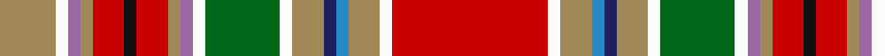

In pattern [RWYBBYWGWRYRKRYRWY](/patterns/rwybbywgwryrkryrwy/).

This was sourced from register-of-tartans.  It is a [18 stripes tartan](/stripes/stripes18/).

Original link https://www.tartanregister.gov.uk/tartanDetails.aspx?ref=534

## Attestations

This cloth appears in 2 source records; the oldest owns this page.

- 01/01/1840 — Campbell, New Louden (register-of-tartans, [record](https://www.tartanregister.gov.uk/tartanDetails.aspx?ref=534))
- 1840 — Campbell, New Louden (Military) (tartans-authority, [record](http://www.tartansauthority.com/tartan-ferret/display/11/))

## Thread count
LT/18 W4 LP4 LT4 R10 K4 R10 LT4 LP4 W4 G24 W4 LT10 DB4 B4 LT10 W4 R/50

## Palette
Each colour and its ΔE from the base-6 reference it is a variant of.

| Colour | Shade | Base | ΔE (OKLab) |
|---|---|---|---|
| B | <code style="background-color:#2888C4;">#2888C4</code> `#2888C4` | B <code style="background-color:#2A418A;">#2A418A</code> | 0.21 |
| DB | <code style="background-color:#202060;">#202060</code> `#202060` | B <code style="background-color:#2A418A;">#2A418A</code> | 0.11 |
| G | <code style="background-color:#006818;">#006818</code> `#006818` | G <code style="background-color:#006100;">#006100</code> | 0.02 |
| K | <code style="background-color:#101010;">#101010</code> `#101010` | K <code style="background-color:#000000;">#000000</code> | 0.17 |
| LP | <code style="background-color:#9C68A4;">#9C68A4</code> `#9C68A4` | R <code style="background-color:#CC0000;">#CC0000</code> | 0.21 |
| LT | <code style="background-color:#A08858;">#A08858</code> `#A08858` | Y <code style="background-color:#F2BF00;">#F2BF00</code> | 0.21 |
| R | <code style="background-color:#C80000;">#C80000</code> `#C80000` | R <code style="background-color:#CC0000;">#CC0000</code> | 0.01 |
| W | <code style="background-color:#FCFCFC;">#FCFCFC</code> `#FCFCFC` | W <code style="background-color:#F7F7F7;">#F7F7F7</code> | 0.01 |

## Nearest tartans

The nearest existing variants by ΔTartan distance.

1. [Campbell, New Louden](/setts/s18/r25w2ra5b2ba2ra5w2g12w2bb2ra2r5k2r5ra2bb2w2ra9~b8080d0-ba000050-bb800070-g008000-k000000-rc00000-ra906030-we0e0e0~x2/) — ΔT 0.47
1. [Fitzgerald dress](/setts/s25/w2k1r3b3r3ra3r12ra3r3ba3r3ba19y3g19r3ba3r3ra3r12ra3r3b3r3k1w2~b5480b0-ba304080-g008000-k000000-rc00000-ra900030-we0e0e0-yf0c000~x2/) — ΔT 1.30
1. [Fitzgerald Family Tartan Tartan Number: 1818. Earliest known date: 1985 One of four Fitzgerald tartans all apparently designed by Robert P. Fitzgerald of Philadelphia. Starting with this variation of Robertson (for no discernible reason) he then designed the blue and hunting as color variations and a further "fancy dress" version. See products available Copyright © Blair Urquhart, Comrie, 2015](/setts/s25/w2k1r3b3r3ra3r12ra3r3ba3r3ba19y3g19r3ba3r3ra3r12ra3r3b3r3k1w2~b5c8ca8-ba2c2c80-g006818-k101010-rc80000-raa00048-we0e0e0-ye8c000~x2/) — ΔT 1.44
1. [Macan of Lurgyvallan](/setts/s24/r16g1r1g1r1g4k1w1k1y1k1b6ba4b6k1y1k1w1k1g4r12g1r1k1~b5c8ca8-ba2c2c80-g006818-k101010-rc80000-wc0c0c0-ye8c000~x4/) — ΔT 1.45
1. [Macan of Lurgyvallan Portrait Tartan Tartan Number: 1155. Earliest known date: 1831 The portrait of 'Captain Macan of Lurgyvallan painted and presented to him by his sincere friend William MacKenzie, 24th Oct. 1831' was recently sold at auction in London. The watercolour measured 10 by 7 inches. The chief (three eagles feathers) is wearing full Highland Dress. The tartan is a sort of MacLean of Duart, in the red Stewart group, but showing the MacLean inversion. No such person or clan or tartan or chief ever existed. See products available Copyright © Blair Urquhart, Comrie, 2015](/setts/s24/r16g1r1g1r1g4k1w1k1y1k1b6ba4b6k1y1k1w1k1g4r12g1r1k1~b5c8ca8-ba2c2c80-g006818-k101010-rc80000-we0e0e0-ye8c000~x2/) — ΔT 1.45
1. [Contrecoeur Corporate Tartan Tartan Number: 2294. Earliest known date: 1992 Small township in southern Quebec. Tartan designed by French Canadian Madeleine Asselin. See products available Copyright © Blair Urquhart, Comrie, 2015](/setts/s15/y10g1ga2y2w2r1k2y2ga2g1y10r7w3r13b5~b2c2c80-g604000-ga006818-k000000-r901c38-wfcfcfc-ye8c000~x2/) — ΔT 1.46
1. [Dundee (1819) (District)](/setts/s14/r42ra2k15ra2g22y4w2b2w2y4ba7w2b6w6~b780078-ba5c8ca8-g006818-k101010-rc80000-rad05054-wfcfcfc-ye8c000~x2/) — ΔT 1.50
1. [Contrecoeur](/setts/s15/y10r1g2y2w2ra1w2y2g2r1y10ra7wa3ra13b5~b304080-g008000-r806050-ra802040-wc0c0c0-wae0e0e0-yf0c000~x2/) — ΔT 1.53
1. [Dundee](/setts/s14/r42ra2k15ra2g22y4w2b2w2y4ba7w2b6w6~b5a008c-ba3c82af-g005020-k101010-rdc0000-rac82828-we0e0e0-ye8c000~x2/) — ΔT 1.53
1. [Inverclyde](/setts/s20/b5ba2b9bb10bc2bb4bc2g10r33w2r33g10bc2bb4bc2bb10b9ba2b5w3~b202060-ba2c2c80-bb5c5c5c-bc2888c4-g006818-rc80000-we0e0e0~x2/) — ΔT 1.56

## Neighbour map

Every grey dot is one of 15726 variants placed by the first two principal components of the ΔTartan feature space (44% of its variance). Red is this tartan; blue dots are its nearest — click one to open its page.

<svg viewBox="0 0 640 380" role="img" style="max-width:100%;height:auto;border:1px solid #e0e0e0;border-radius:4px;display:block" xmlns="http://www.w3.org/2000/svg"><image href="/nn/cloud.v1.png" width="640" height="380"/><a href="/setts/s18/r25w2ra5b2ba2ra5w2g12w2bb2ra2r5k2r5ra2bb2w2ra9~b8080d0-ba000050-bb800070-g008000-k000000-rc00000-ra906030-we0e0e0~x2/"><circle cx="142.0" cy="54.5" r="4" fill="#3465a4"><title>Campbell, New Louden</title></circle></a><a href="/setts/s25/w2k1r3b3r3ra3r12ra3r3ba3r3ba19y3g19r3ba3r3ra3r12ra3r3b3r3k1w2~b5480b0-ba304080-g008000-k000000-rc00000-ra900030-we0e0e0-yf0c000~x2/"><circle cx="140.1" cy="35.0" r="4" fill="#3465a4"><title>Fitzgerald dress</title></circle></a><a href="/setts/s25/w2k1r3b3r3ra3r12ra3r3ba3r3ba19y3g19r3ba3r3ra3r12ra3r3b3r3k1w2~b5c8ca8-ba2c2c80-g006818-k101010-rc80000-raa00048-we0e0e0-ye8c000~x2/"><circle cx="140.7" cy="34.1" r="4" fill="#3465a4"><title>Fitzgerald Family Tartan Tartan Number: 1818. Earliest known date: 1985 One of four Fitzgerald tartans all apparently designed by Robert P. Fitzgerald of Philadelphia. Starting with this variation of Robertson (for no discernible reason) he then designed the blue and hunting as color variations and a further &quot;fancy dress&quot; version. See products available Copyright © Blair Urquhart, Comrie, 2015</title></circle></a><a href="/setts/s24/r16g1r1g1r1g4k1w1k1y1k1b6ba4b6k1y1k1w1k1g4r12g1r1k1~b5c8ca8-ba2c2c80-g006818-k101010-rc80000-wc0c0c0-ye8c000~x4/"><circle cx="184.8" cy="41.0" r="4" fill="#3465a4"><title>Macan of Lurgyvallan</title></circle></a><a href="/setts/s24/r16g1r1g1r1g4k1w1k1y1k1b6ba4b6k1y1k1w1k1g4r12g1r1k1~b5c8ca8-ba2c2c80-g006818-k101010-rc80000-we0e0e0-ye8c000~x2/"><circle cx="181.9" cy="39.7" r="4" fill="#3465a4"><title>Macan of Lurgyvallan Portrait Tartan Tartan Number: 1155. Earliest known date: 1831 The portrait of 'Captain Macan of Lurgyvallan painted and presented to him by his sincere friend William MacKenzie, 24th Oct. 1831' was recently sold at auction in London. The watercolour measured 10 by 7 inches. The chief (three eagles feathers) is wearing full Highland Dress. The tartan is a sort of MacLean of Duart, in the red Stewart group, but showing the MacLean inversion. No such person or clan or tartan or chief ever existed. See products available Copyright © Blair Urquhart, Comrie, 2015</title></circle></a><a href="/setts/s15/y10g1ga2y2w2r1k2y2ga2g1y10r7w3r13b5~b2c2c80-g604000-ga006818-k000000-r901c38-wfcfcfc-ye8c000~x2/"><circle cx="88.7" cy="62.9" r="4" fill="#3465a4"><title>Contrecoeur Corporate Tartan Tartan Number: 2294. Earliest known date: 1992 Small township in southern Quebec. Tartan designed by French Canadian Madeleine Asselin. See products available Copyright © Blair Urquhart, Comrie, 2015</title></circle></a><a href="/setts/s14/r42ra2k15ra2g22y4w2b2w2y4ba7w2b6w6~b780078-ba5c8ca8-g006818-k101010-rc80000-rad05054-wfcfcfc-ye8c000~x2/"><circle cx="108.3" cy="25.5" r="4" fill="#3465a4"><title>Dundee (1819) (District)</title></circle></a><a href="/setts/s15/y10r1g2y2w2ra1w2y2g2r1y10ra7wa3ra13b5~b304080-g008000-r806050-ra802040-wc0c0c0-wae0e0e0-yf0c000~x2/"><circle cx="116.2" cy="82.5" r="4" fill="#3465a4"><title>Contrecoeur</title></circle></a><a href="/setts/s14/r42ra2k15ra2g22y4w2b2w2y4ba7w2b6w6~b5a008c-ba3c82af-g005020-k101010-rdc0000-rac82828-we0e0e0-ye8c000~x2/"><circle cx="110.8" cy="26.3" r="4" fill="#3465a4"><title>Dundee</title></circle></a><a href="/setts/s20/b5ba2b9bb10bc2bb4bc2g10r33w2r33g10bc2bb4bc2bb10b9ba2b5w3~b202060-ba2c2c80-bb5c5c5c-bc2888c4-g006818-rc80000-we0e0e0~x2/"><circle cx="175.7" cy="64.7" r="4" fill="#3465a4"><title>Inverclyde</title></circle></a><circle cx="134.3" cy="50.6" r="5" fill="#c00000"/></svg>

ID: /setts/s18/r25w2y5b2ba2y5w2g12w2ra2y2r5k2r5y2ra2w2y9~b2888c4-ba202060-g006818-k101010-rc80000-ra9c68a4-wfcfcfc-ya08858~x2/
