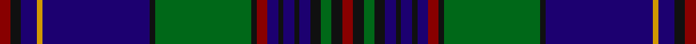

This page is one **sett** — a single exact thread-count. It belongs to the [tartan](/tartans/r2k2db3lo1db20k1g18k1r2db2k1db2k1db2k2g2k2r2/)
(the same proportion at any scale), whose colour order is pattern [RKBYBKGKRBKBKBKGKR](/stripes/rkbybkgkrbkbkbkgkr/).

Sourced from register-of-tartans.  It is a [18 stripe tartan](/stripes/stripes18/).

Original link https://www.tartanregister.gov.uk/tartanDetails.aspx?ref=787

2 attestations — the source records this cloth was collapsed from (oldest owns this page)

<ul>
<li>01/01/2002 — Craig (Personal) (register-of-tartans, <a href="https://www.tartanregister.gov.uk/tartanDetails.aspx?ref=787">record</a>)</li>
<li>pre 2002 — Craig (Personal) (tartans-authority, <a href="http://www.tartansauthority.com/tartan-ferret/display/4599/">record</a>)</li>
</ul>

## Register references

External register numbers recorded for this tartan.

- Scottish Register of Tartans: [787](https://www.tartanregister.gov.uk/tartanDetails.aspx?ref=787)
- Scottish Tartans Authority (ITI): 4599

## Thread count
DR/4 K4 DB6 DY2 DB40 K2 G36 K2 DR4 DB4 K2 DB4 K2 DB4 K4 G4 K4 DR/4

## Palette

Palette: <strong>Tartan Register</strong> <small style="color:#888">(4 of 5 colours)</small>
<table><thead><tr><th>Colour</th><th>Threads</th><th>Shade</th><th>Base</th><th>OKLCh</th></tr></thead><tbody><tr><td>DR/</td><td style="text-align:right;font-variant-numeric:tabular-nums">4</td><td><code style="background-color:#880000;">#880000</code> <small style="color:#888">#880000</small></td><td>R <code style="background-color:#CC0000;">#CC0000</code></td><td><small style="color:#888">oklch(39.4% 0.162 29.2)</small></td></tr><tr><td>K</td><td style="text-align:right;font-variant-numeric:tabular-nums">4</td><td><code style="background-color:#101010;">#101010</code> <small style="color:#888">#101010</small></td><td>K <code style="background-color:#000000;">#000000</code></td><td><small style="color:#888">oklch(17.3% 0.000 89.9)</small></td></tr><tr><td>DB</td><td style="text-align:right;font-variant-numeric:tabular-nums">6</td><td><code style="background-color:#1C0070;">#1C0070</code> <small style="color:#888">#1C0070</small></td><td>B <code style="background-color:#2A418A;">#2A418A</code></td><td><small style="color:#888">oklch(26.3% 0.162 277.1)</small></td></tr><tr><td>DY</td><td style="text-align:right;font-variant-numeric:tabular-nums">2</td><td><code style="background-color:#D09800;">#D09800</code> <small style="color:#888">#D09800</small></td><td>Y <code style="background-color:#F2BF00;">#F2BF00</code></td><td><small style="color:#888">oklch(71.4% 0.147 82.1)</small></td></tr><tr><td>DB</td><td style="text-align:right;font-variant-numeric:tabular-nums">40</td><td><code style="background-color:#1C0070;">#1C0070</code> <small style="color:#888">#1C0070</small></td><td>B <code style="background-color:#2A418A;">#2A418A</code></td><td><small style="color:#888">oklch(26.3% 0.162 277.1)</small></td></tr><tr><td>K</td><td style="text-align:right;font-variant-numeric:tabular-nums">2</td><td><code style="background-color:#101010;">#101010</code> <small style="color:#888">#101010</small></td><td>K <code style="background-color:#000000;">#000000</code></td><td><small style="color:#888">oklch(17.3% 0.000 89.9)</small></td></tr><tr><td>G</td><td style="text-align:right;font-variant-numeric:tabular-nums">36</td><td><code style="background-color:#006818;">#006818</code> <small style="color:#888">#006818</small></td><td>G <code style="background-color:#006100;">#006100</code></td><td><small style="color:#888">oklch(45.0% 0.142 145.0)</small></td></tr><tr><td>K</td><td style="text-align:right;font-variant-numeric:tabular-nums">2</td><td><code style="background-color:#101010;">#101010</code> <small style="color:#888">#101010</small></td><td>K <code style="background-color:#000000;">#000000</code></td><td><small style="color:#888">oklch(17.3% 0.000 89.9)</small></td></tr><tr><td>DR</td><td style="text-align:right;font-variant-numeric:tabular-nums">4</td><td><code style="background-color:#880000;">#880000</code> <small style="color:#888">#880000</small></td><td>R <code style="background-color:#CC0000;">#CC0000</code></td><td><small style="color:#888">oklch(39.4% 0.162 29.2)</small></td></tr><tr><td>DB</td><td style="text-align:right;font-variant-numeric:tabular-nums">4</td><td><code style="background-color:#1C0070;">#1C0070</code> <small style="color:#888">#1C0070</small></td><td>B <code style="background-color:#2A418A;">#2A418A</code></td><td><small style="color:#888">oklch(26.3% 0.162 277.1)</small></td></tr><tr><td>K</td><td style="text-align:right;font-variant-numeric:tabular-nums">2</td><td><code style="background-color:#101010;">#101010</code> <small style="color:#888">#101010</small></td><td>K <code style="background-color:#000000;">#000000</code></td><td><small style="color:#888">oklch(17.3% 0.000 89.9)</small></td></tr><tr><td>DB</td><td style="text-align:right;font-variant-numeric:tabular-nums">4</td><td><code style="background-color:#1C0070;">#1C0070</code> <small style="color:#888">#1C0070</small></td><td>B <code style="background-color:#2A418A;">#2A418A</code></td><td><small style="color:#888">oklch(26.3% 0.162 277.1)</small></td></tr><tr><td>K</td><td style="text-align:right;font-variant-numeric:tabular-nums">2</td><td><code style="background-color:#101010;">#101010</code> <small style="color:#888">#101010</small></td><td>K <code style="background-color:#000000;">#000000</code></td><td><small style="color:#888">oklch(17.3% 0.000 89.9)</small></td></tr><tr><td>DB</td><td style="text-align:right;font-variant-numeric:tabular-nums">4</td><td><code style="background-color:#1C0070;">#1C0070</code> <small style="color:#888">#1C0070</small></td><td>B <code style="background-color:#2A418A;">#2A418A</code></td><td><small style="color:#888">oklch(26.3% 0.162 277.1)</small></td></tr><tr><td>K</td><td style="text-align:right;font-variant-numeric:tabular-nums">4</td><td><code style="background-color:#101010;">#101010</code> <small style="color:#888">#101010</small></td><td>K <code style="background-color:#000000;">#000000</code></td><td><small style="color:#888">oklch(17.3% 0.000 89.9)</small></td></tr><tr><td>G</td><td style="text-align:right;font-variant-numeric:tabular-nums">4</td><td><code style="background-color:#006818;">#006818</code> <small style="color:#888">#006818</small></td><td>G <code style="background-color:#006100;">#006100</code></td><td><small style="color:#888">oklch(45.0% 0.142 145.0)</small></td></tr><tr><td>K</td><td style="text-align:right;font-variant-numeric:tabular-nums">4</td><td><code style="background-color:#101010;">#101010</code> <small style="color:#888">#101010</small></td><td>K <code style="background-color:#000000;">#000000</code></td><td><small style="color:#888">oklch(17.3% 0.000 89.9)</small></td></tr><tr><td>DR/</td><td style="text-align:right;font-variant-numeric:tabular-nums">4</td><td><code style="background-color:#880000;">#880000</code> <small style="color:#888">#880000</small></td><td>R <code style="background-color:#CC0000;">#CC0000</code></td><td><small style="color:#888">oklch(39.4% 0.162 29.2)</small></td></tr></tbody></table>

## Nearest tartans

The nearest existing variants by ΔTartan distance, with this tartan at the top so the swatches line up against it.

ΔTartan

Tartan

Sett

—

<a href="/ttd/edit/#slug=r2k2db3lo1db20k1g18k1r2db2k1db2k1db2k2g2k2r2~x2">Craig (Personal)</a> <a class="nn-out" href="/setts/s18/r2k2db3lo1db20k1g18k1r2db2k1db2k1db2k2g2k2r2~x2/" title="open its dictionary page">↗</a>

0.80

<a href="/ttd/edit/#slug=dp4db5dp3db50k15g3k5g32w2g3w2g32k5g5k15db50dp3k5dp3">Spirit of Morningside</a> <a class="nn-out" href="/setts/s19/dp4db5dp3db50k15g3k5g32w2g3w2g32k5g5k15db50dp3k5dp3/" title="open its dictionary page">↗</a>

0.97

<a href="/ttd/edit/#slug=db36g10r2g10lb2g10r2g10k14r2db12r3db2r2db4lb2~x2">Rankin (1998) (Name)</a> <a class="nn-out" href="/setts/s16/db36g10r2g10lb2g10r2g10k14r2db12r3db2r2db4lb2~x2/" title="open its dictionary page">↗</a>

1.03

<a href="/ttd/edit/#slug=k3db42k3ly2k3g22k3r2k3g22k3ly2k3db42k3r2~x2">Strachan</a> <a class="nn-out" href="/setts/s16/k3db42k3ly2k3g22k3r2k3g22k3ly2k3db42k3r2~x2/" title="open its dictionary page">↗</a>

1.06

<a href="/ttd/edit/#slug=db33k3r2k3g9r2g7w2g7r2g9k3r2k3db7r2db2r2db3w2~x2">Ranking (Personal)</a> <a class="nn-out" href="/setts/s20/db33k3r2k3g9r2g7w2g7r2g9k3r2k3db7r2db2r2db3w2~x2/" title="open its dictionary page">↗</a>

1.06

<a href="/ttd/edit/#slug=m2db1m1db12k1db1k1db1k5g1k1g1k1g5k2ly1~x4">Herriot (Personal)</a> <a class="nn-out" href="/setts/s16/m2db1m1db12k1db1k1db1k5g1k1g1k1g5k2ly1~x4/" title="open its dictionary page">↗</a>

1.07

<a href="/ttd/edit/#slug=db60ly2db2ly2db5k15db5g20r2k3r2g20db5k15g5db20ly2g4~x2">Whitworth (Name)</a> <a class="nn-out" href="/setts/s18/db60ly2db2ly2db5k15db5g20r2k3r2g20db5k15g5db20ly2g4~x2/" title="open its dictionary page">↗</a>

1.11

<a href="/ttd/edit/#slug=k3db2g2db26t1db1t1db1t1db1t3ti2k10db3g14k3r3~x2">St Lawrence District Tartan Tartan Number: 1030. Earliest known date: pre 1963 Presented to the STS collection by Mr A Yule in 1963. designed by Mrs. Helene Cobb of Clayton and is the registered trademark of the Thousand Islands Museum in Clayton, New York State - www.timuseum.org Woven by Peter MacArthur of Biggar, Scotland. The greens are for the cedars along the shore, the blues are for the St Lawrence River, and the red is the sunset over the Islands. John Fitzpatrick in his review of Canadian tartans in July 2008, pointed out that there were two slightly different thread counts given in the CIDD. See products available Copyright © Blair Urquhart, Comrie, 2015</a> <a class="nn-out" href="/setts/s17/k3db2g2db26t1db1t1db1t1db1t3ti2k10db3g14k3r3~x2/" title="open its dictionary page">↗</a>

1.14

<a href="/ttd/edit/#slug=db36dg10r2dg10w2dg10r2dg10k14r2db12r3db2r2db4w2~x2">Rankin</a> <a class="nn-out" href="/setts/s16/db36dg10r2dg10w2dg10r2dg10k14r2db12r3db2r2db4w2~x2/" title="open its dictionary page">↗</a>

1.17

<a href="/ttd/edit/#slug=k3db2g2db26b1db1b1db1b1db1b3lg2k10db3g14k3r3~x2">St. Lawrence</a> <a class="nn-out" href="/setts/s17/k3db2g2db26b1db1b1db1b1db1b3lg2k10db3g14k3r3~x2/" title="open its dictionary page">↗</a>

1.18

<a href="/ttd/edit/#slug=r2m3db2dg32db3dg1db3k14m3db2m3dg12db1k1db30m4db2m2~x2">Cooper/Couper</a> <a class="nn-out" href="/setts/s18/r2m3db2dg32db3dg1db3k14m3db2m3dg12db1k1db30m4db2m2~x2/" title="open its dictionary page">↗</a>

## Neighbour map

Every grey dot is one of 14359 variants placed by the first two principal components of the ΔTartan feature space (44% of its variance). Red is this tartan; blue dots are its nearest — click one to open its page.

<svg viewBox="0 0 640 380" role="img" style="max-width:100%;height:auto;border:1px solid #e0e0e0;border-radius:4px;display:block" xmlns="http://www.w3.org/2000/svg"><image href="/nn/cloud.v1.png" width="640" height="380"/><a href="/setts/s19/dp4db5dp3db50k15g3k5g32w2g3w2g32k5g5k15db50dp3k5dp3/"><circle cx="268.7" cy="110.5" r="4" fill="#3465a4"><title>Spirit of Morningside</title></circle></a><a href="/setts/s16/db36g10r2g10lb2g10r2g10k14r2db12r3db2r2db4lb2~x2/"><circle cx="238.4" cy="128.2" r="4" fill="#3465a4"><title>Rankin (1998) (Name)</title></circle></a><a href="/setts/s16/k3db42k3ly2k3g22k3r2k3g22k3ly2k3db42k3r2~x2/"><circle cx="319.5" cy="115.7" r="4" fill="#3465a4"><title>Strachan</title></circle></a><a href="/setts/s20/db33k3r2k3g9r2g7w2g7r2g9k3r2k3db7r2db2r2db3w2~x2/"><circle cx="218.0" cy="99.1" r="4" fill="#3465a4"><title>Ranking (Personal)</title></circle></a><a href="/setts/s16/m2db1m1db12k1db1k1db1k5g1k1g1k1g5k2ly1~x4/"><circle cx="217.5" cy="136.6" r="4" fill="#3465a4"><title>Herriot (Personal)</title></circle></a><a href="/setts/s18/db60ly2db2ly2db5k15db5g20r2k3r2g20db5k15g5db20ly2g4~x2/"><circle cx="313.0" cy="97.5" r="4" fill="#3465a4"><title>Whitworth (Name)</title></circle></a><a href="/setts/s17/k3db2g2db26t1db1t1db1t1db1t3ti2k10db3g14k3r3~x2/"><circle cx="253.0" cy="86.0" r="4" fill="#3465a4"><title>St Lawrence District Tartan Tartan Number: 1030. Earliest known date: pre 1963 Presented to the STS collection by Mr A Yule in 1963. designed by Mrs. Helene Cobb of Clayton and is the registered trademark of the Thousand Islands Museum in Clayton, New York State - www.timuseum.org Woven by Peter MacArthur of Biggar, Scotland. The greens are for the cedars along the shore, the blues are for the St Lawrence River, and the red is the sunset over the Islands. John Fitzpatrick in his review of Canadian tartans in July 2008, pointed out that there were two slightly different thread counts given in the CIDD. See products available Copyright © Blair Urquhart, Comrie, 2015</title></circle></a><a href="/setts/s16/db36dg10r2dg10w2dg10r2dg10k14r2db12r3db2r2db4w2~x2/"><circle cx="250.8" cy="131.7" r="4" fill="#3465a4"><title>Rankin</title></circle></a><a href="/setts/s17/k3db2g2db26b1db1b1db1b1db1b3lg2k10db3g14k3r3~x2/"><circle cx="244.3" cy="83.8" r="4" fill="#3465a4"><title>St. Lawrence</title></circle></a><a href="/setts/s18/r2m3db2dg32db3dg1db3k14m3db2m3dg12db1k1db30m4db2m2~x2/"><circle cx="252.9" cy="85.5" r="4" fill="#3465a4"><title>Cooper/Couper</title></circle></a><circle cx="268.9" cy="103.6" r="5" fill="#c00000"/></svg>

ID: /setts/s18/r2k2db3lo1db20k1g18k1r2db2k1db2k1db2k2g2k2r2~x2/
