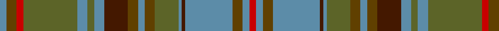

This page is one **sett** — a single exact thread-count. It belongs to the [tartan](/tartans/r2t2dy3t14do1t1y7dy3t2dy3do7t3y2t3y16r2dy3t2/)
(the same proportion at any scale), whose colour order is pattern [BGRGBGBBGBGGBBBGBR](/stripes/bgrgbgbbgbggbbbgbr/).

Sourced from tartans-authority.  It is a [18 stripe tartan](/stripes/stripes18/).

Original link http://www.tartansauthority.com/tartan-ferret/display/7934/

## Register references

External register numbers recorded for this tartan.

- Scottish Register of Tartans: [7934](https://www.tartanregister.gov.uk/tartanDetails?ref=7934)
- Scottish Tartans Authority (ITI): 7934

## Thread count
R/4 B4 T6 B28 DR2 B2 G14 T6 B4 T6 DR14 B6 G4 B6 G32 R4 T6 B/4

## Palette

Palette: <strong>Tartan Register</strong>
<table><thead><tr><th>Colour</th><th>Threads</th><th>Shade</th><th>Base</th><th>OKLCh</th></tr></thead><tbody><tr><td>R/</td><td style="text-align:right;font-variant-numeric:tabular-nums">4</td><td><code style="background-color:#C80000;">#C80000</code> <small style="color:#888">#C80000</small></td><td>R <code style="background-color:#CC0000;">#CC0000</code></td><td><small style="color:#888">oklch(52.3% 0.215 29.2)</small></td></tr><tr><td>B</td><td style="text-align:right;font-variant-numeric:tabular-nums">4</td><td><code style="background-color:#5C8CA8;">#5C8CA8</code> <small style="color:#888">#5C8CA8</small></td><td>B <code style="background-color:#2A418A;">#2A418A</code></td><td><small style="color:#888">oklch(61.7% 0.067 235.0)</small></td></tr><tr><td>T</td><td style="text-align:right;font-variant-numeric:tabular-nums">6</td><td><code style="background-color:#604000;">#604000</code> <small style="color:#888">#604000</small></td><td>G <code style="background-color:#006100;">#006100</code></td><td><small style="color:#888">oklch(39.8% 0.083 76.8)</small></td></tr><tr><td>B</td><td style="text-align:right;font-variant-numeric:tabular-nums">28</td><td><code style="background-color:#5C8CA8;">#5C8CA8</code> <small style="color:#888">#5C8CA8</small></td><td>B <code style="background-color:#2A418A;">#2A418A</code></td><td><small style="color:#888">oklch(61.7% 0.067 235.0)</small></td></tr><tr><td>DR</td><td style="text-align:right;font-variant-numeric:tabular-nums">2</td><td><code style="background-color:#441800;">#441800</code> <small style="color:#888">#441800</small></td><td>B <code style="background-color:#2A418A;">#2A418A</code></td><td><small style="color:#888">oklch(27.3% 0.076 46.3)</small></td></tr><tr><td>B</td><td style="text-align:right;font-variant-numeric:tabular-nums">2</td><td><code style="background-color:#5C8CA8;">#5C8CA8</code> <small style="color:#888">#5C8CA8</small></td><td>B <code style="background-color:#2A418A;">#2A418A</code></td><td><small style="color:#888">oklch(61.7% 0.067 235.0)</small></td></tr><tr><td>G</td><td style="text-align:right;font-variant-numeric:tabular-nums">14</td><td><code style="background-color:#5C6428;">#5C6428</code> <small style="color:#888">#5C6428</small></td><td>G <code style="background-color:#006100;">#006100</code></td><td><small style="color:#888">oklch(48.3% 0.084 116.0)</small></td></tr><tr><td>T</td><td style="text-align:right;font-variant-numeric:tabular-nums">6</td><td><code style="background-color:#604000;">#604000</code> <small style="color:#888">#604000</small></td><td>G <code style="background-color:#006100;">#006100</code></td><td><small style="color:#888">oklch(39.8% 0.083 76.8)</small></td></tr><tr><td>B</td><td style="text-align:right;font-variant-numeric:tabular-nums">4</td><td><code style="background-color:#5C8CA8;">#5C8CA8</code> <small style="color:#888">#5C8CA8</small></td><td>B <code style="background-color:#2A418A;">#2A418A</code></td><td><small style="color:#888">oklch(61.7% 0.067 235.0)</small></td></tr><tr><td>T</td><td style="text-align:right;font-variant-numeric:tabular-nums">6</td><td><code style="background-color:#604000;">#604000</code> <small style="color:#888">#604000</small></td><td>G <code style="background-color:#006100;">#006100</code></td><td><small style="color:#888">oklch(39.8% 0.083 76.8)</small></td></tr><tr><td>DR</td><td style="text-align:right;font-variant-numeric:tabular-nums">14</td><td><code style="background-color:#441800;">#441800</code> <small style="color:#888">#441800</small></td><td>B <code style="background-color:#2A418A;">#2A418A</code></td><td><small style="color:#888">oklch(27.3% 0.076 46.3)</small></td></tr><tr><td>B</td><td style="text-align:right;font-variant-numeric:tabular-nums">6</td><td><code style="background-color:#5C8CA8;">#5C8CA8</code> <small style="color:#888">#5C8CA8</small></td><td>B <code style="background-color:#2A418A;">#2A418A</code></td><td><small style="color:#888">oklch(61.7% 0.067 235.0)</small></td></tr><tr><td>G</td><td style="text-align:right;font-variant-numeric:tabular-nums">4</td><td><code style="background-color:#5C6428;">#5C6428</code> <small style="color:#888">#5C6428</small></td><td>G <code style="background-color:#006100;">#006100</code></td><td><small style="color:#888">oklch(48.3% 0.084 116.0)</small></td></tr><tr><td>B</td><td style="text-align:right;font-variant-numeric:tabular-nums">6</td><td><code style="background-color:#5C8CA8;">#5C8CA8</code> <small style="color:#888">#5C8CA8</small></td><td>B <code style="background-color:#2A418A;">#2A418A</code></td><td><small style="color:#888">oklch(61.7% 0.067 235.0)</small></td></tr><tr><td>G</td><td style="text-align:right;font-variant-numeric:tabular-nums">32</td><td><code style="background-color:#5C6428;">#5C6428</code> <small style="color:#888">#5C6428</small></td><td>G <code style="background-color:#006100;">#006100</code></td><td><small style="color:#888">oklch(48.3% 0.084 116.0)</small></td></tr><tr><td>R</td><td style="text-align:right;font-variant-numeric:tabular-nums">4</td><td><code style="background-color:#C80000;">#C80000</code> <small style="color:#888">#C80000</small></td><td>R <code style="background-color:#CC0000;">#CC0000</code></td><td><small style="color:#888">oklch(52.3% 0.215 29.2)</small></td></tr><tr><td>T</td><td style="text-align:right;font-variant-numeric:tabular-nums">6</td><td><code style="background-color:#604000;">#604000</code> <small style="color:#888">#604000</small></td><td>G <code style="background-color:#006100;">#006100</code></td><td><small style="color:#888">oklch(39.8% 0.083 76.8)</small></td></tr><tr><td>B/</td><td style="text-align:right;font-variant-numeric:tabular-nums">4</td><td><code style="background-color:#5C8CA8;">#5C8CA8</code> <small style="color:#888">#5C8CA8</small></td><td>B <code style="background-color:#2A418A;">#2A418A</code></td><td><small style="color:#888">oklch(61.7% 0.067 235.0)</small></td></tr></tbody></table>

## Nearest tartans

The nearest existing variants by ΔTartan distance, with this tartan at the top so the swatches line up against it.

ΔTartan

Tartan

Sett

—

<a href="/ttd/edit/#slug=r2t2dy3t14do1t1y7dy3t2dy3do7t3y2t3y16r2dy3t2~x2">Unidentified (Woven sample)</a> <a class="nn-out" href="/setts/s18/r2t2dy3t14do1t1y7dy3t2dy3do7t3y2t3y16r2dy3t2~x2/" title="open its dictionary page">↗</a>

0.99

<a href="/ttd/edit/#slug=g46r6g6r2g8r2g6r2g6do36r2y47r6y24lo6">Cochrane Hunting</a> <a class="nn-out" href="/setts/s15/g46r6g6r2g8r2g6r2g6do36r2y47r6y24lo6/" title="open its dictionary page">↗</a>

1.24

<a href="/ttd/edit/#slug=g16dy1g2dy1g2dy12m12dy1ly2dy1m12dy12g12dy1w2~x2">Prince Edward Island District Tartan Tartan Number: 918. Earliest known date: 1964 The warmth and glow of the fertile soil, The green field and tree, The yellow and the brown of Autumn, The white of surf or a summer snow, Rust, green, yellow and white, Yes! That's our Island Tartan. See products available Copyright © Blair Urquhart, Comrie, 2015</a> <a class="nn-out" href="/setts/s15/g16dy1g2dy1g2dy12m12dy1ly2dy1m12dy12g12dy1w2~x2/" title="open its dictionary page">↗</a>

1.25

<a href="/ttd/edit/#slug=g16o1g2o1g2o12r12o1ly2o1r12o12g12o1w2~x2">Prince Edward Island</a> <a class="nn-out" href="/setts/s15/g16o1g2o1g2o12r12o1ly2o1r12o12g12o1w2~x2/" title="open its dictionary page">↗</a>

1.29

<a href="/setts/s14/t4r1ly1t12do4y10ly1r3~x4/">Hawaiian</a>

1.32

<a href="/ttd/edit/#slug=lo18do3lo3do3lo3do16y16r2ly2r2y16do16lo17do3lo3~x2">Lander (2013)</a> <a class="nn-out" href="/setts/s15/lo18do3lo3do3lo3do16y16r2ly2r2y16do16lo17do3lo3~x2/" title="open its dictionary page">↗</a>

1.36

<a href="/setts/s22/ly5y19r2t11lb2r11y11r2g20r2g2lb2~x2/">Gordonstoun #2</a>

1.36

<a href="/ttd/edit/#slug=r4g20dt2g2dt2g3dt6o26lb3o2lb2o4~x2">Dorcas (Fashion)</a> <a class="nn-out" href="/setts/s12/r4g20dt2g2dt2g3dt6o26lb3o2lb2o4~x2/" title="open its dictionary page">↗</a>

1.47

<a href="/setts/s18/do5lo1y27loi9r6do5lo1loi23do3loi5~x2/">Satisfashion Argyll</a>

1.49

<a href="/ttd/edit/#slug=g3r15gi2r2gi2r2gi18dy2gi2dy2gi2dy27k2dy2k6lo2~x2">Strathmore (District)</a> <a class="nn-out" href="/setts/s16/g3r15gi2r2gi2r2gi18dy2gi2dy2gi2dy27k2dy2k6lo2~x2/" title="open its dictionary page">↗</a>

1.56

<a href="/ttd/edit/#slug=dg3r2o2r2n20db3n3r8dg2r2dg2r2dg8o2dg2o2dg2o8ly3~x2">Wcwm 1528</a> <a class="nn-out" href="/setts/s19/dg3r2o2r2n20db3n3r8dg2r2dg2r2dg8o2dg2o2dg2o8ly3~x2/" title="open its dictionary page">↗</a>

## Neighbour map

Every grey dot is one of 14359 variants placed by the first two principal components of the ΔTartan feature space (44% of its variance). Red is this tartan; blue dots are its nearest — click one to open its page.

<svg viewBox="0 0 640 380" role="img" style="max-width:100%;height:auto;border:1px solid #e0e0e0;border-radius:4px;display:block" xmlns="http://www.w3.org/2000/svg"><image href="/nn/cloud.v1.png" width="640" height="380"/><a href="/setts/s15/g46r6g6r2g8r2g6r2g6do36r2y47r6y24lo6/"><circle cx="264.8" cy="135.0" r="4" fill="#3465a4"><title>Cochrane Hunting</title></circle></a><a href="/setts/s15/g16dy1g2dy1g2dy12m12dy1ly2dy1m12dy12g12dy1w2~x2/"><circle cx="232.9" cy="151.1" r="4" fill="#3465a4"><title>Prince Edward Island District Tartan Tartan Number: 918. Earliest known date: 1964 The warmth and glow of the fertile soil, The green field and tree, The yellow and the brown of Autumn, The white of surf or a summer snow, Rust, green, yellow and white, Yes! That's our Island Tartan. See products available Copyright © Blair Urquhart, Comrie, 2015</title></circle></a><a href="/setts/s15/g16o1g2o1g2o12r12o1ly2o1r12o12g12o1w2~x2/"><circle cx="225.1" cy="146.1" r="4" fill="#3465a4"><title>Prince Edward Island</title></circle></a><a href="/setts/s14/t4r1ly1t12do4y10ly1r3~x4/"><circle cx="238.5" cy="168.6" r="4" fill="#3465a4"><title>Hawaiian</title></circle></a><a href="/setts/s15/lo18do3lo3do3lo3do16y16r2ly2r2y16do16lo17do3lo3~x2/"><circle cx="222.0" cy="190.3" r="4" fill="#3465a4"><title>Lander (2013)</title></circle></a><a href="/setts/s22/ly5y19r2t11lb2r11y11r2g20r2g2lb2~x2/"><circle cx="175.7" cy="153.2" r="4" fill="#3465a4"><title>Gordonstoun #2</title></circle></a><a href="/setts/s12/r4g20dt2g2dt2g3dt6o26lb3o2lb2o4~x2/"><circle cx="269.0" cy="153.2" r="4" fill="#3465a4"><title>Dorcas (Fashion)</title></circle></a><a href="/setts/s18/do5lo1y27loi9r6do5lo1loi23do3loi5~x2/"><circle cx="296.2" cy="126.1" r="4" fill="#3465a4"><title>Satisfashion Argyll</title></circle></a><a href="/setts/s16/g3r15gi2r2gi2r2gi18dy2gi2dy2gi2dy27k2dy2k6lo2~x2/"><circle cx="233.0" cy="129.6" r="4" fill="#3465a4"><title>Strathmore (District)</title></circle></a><a href="/setts/s19/dg3r2o2r2n20db3n3r8dg2r2dg2r2dg8o2dg2o2dg2o8ly3~x2/"><circle cx="151.1" cy="133.5" r="4" fill="#3465a4"><title>Wcwm 1528</title></circle></a><circle cx="229.0" cy="149.7" r="5" fill="#c00000"/></svg>

ID: /setts/s18/r2t2dy3t14do1t1y7dy3t2dy3do7t3y2t3y16r2dy3t2~x2/
