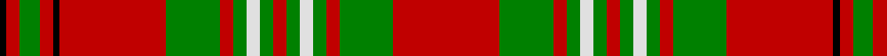

In pattern [KRGRKRGRGWGRGWGRGR](/patterns/krgrkrgrgwgrgwgrgr/).

This was sourced from weddslist.  It is a [18 stripes tartan](/stripes/stripes18/).

Original link http://www.weddslist.com/cgi-bin/tartans/pg.pl?source=sts

## Thread count
K/2 R4 G6 R4 K2 R32 G16 R4 G4 LN4 G4 R4 G4 LN4 G4 R4 G16 R/32

## Palette
Each colour and its ΔE from the base-6 reference it is a variant of.

| Colour | Shade | Base | ΔE (OKLab) |
|---|---|---|---|
| G | <code style="background-color:#008000;">#008000</code> `#008000` | G <code style="background-color:#006400;">#006400</code> | 0.09 |
| K | <code style="background-color:#000000;">#000000</code> `#000000` | K <code style="background-color:#000000;">#000000</code> | 0.00 |
| LN | <code style="background-color:#E0E0E0;">#E0E0E0</code> `#E0E0E0` | W <code style="background-color:#F4F4F0;">#F4F4F0</code> | 0.06 |
| R | <code style="background-color:#C00000;">#C00000</code> `#C00000` | R <code style="background-color:#C80000;">#C80000</code> | 0.02 |

## Nearest tartans

The nearest existing variants by ΔTartan distance.

1. [Harkness Dress](/setts/s18/b40r8w8r64g24r4g8r4g12r24g12r4g8r4g24r64w8r8-b1474b4-g006818-rc80000-wfcfcfc/) — ΔT 0.86
1. [Rothesay, Red](/setts/s17/w8r44g6r6g6r6g26r8g26r6g6r6g6r46w4r4w8-g008000-rc00000-we0e0e0/) — ΔT 1.05
1. [Hayes (Fashion)](/setts/s14/r8g4y4g48r4g4r4g16r68g12r8g4r8ya8-g004c00-rc80000-yc89800-yab0b0b0/) — ΔT 1.08
1. [Rothesay, Duke of](/setts/s17/w8r44g6r6g6r6g26r8g26r6g6r6g6r46w4r4w8-g006818-rc80000-we0e0e0/) — ΔT 1.09
1. [Munro (Logan)](/setts/s17/r38y2b2r4g36r4b2y2r4b8r4y2b2r38g4r4g4-b2c2c80-g006818-rc80000-ye8c000/) — ΔT 1.21
1. [Grant D](/setts/s15/r6b2r2g20r2g2r2b6r2w2r24b2r2b2r6-b000064-g006400-rc80000-wd0d0d0/) — ΔT 1.22
1. [MacKinnon 9](/setts/s14/w4r8g4b4r12g8r4b10g4r40g14w4r8w4-b304080-g008000-rc00000-we0e0e0/) — ΔT 1.24
1. [MacDonald of Lochmaddy](/setts/s17/r26w2b4r4g28r4w2b4r4ba8r4b4w2r32g2r4g6-b5480b0-ba304080-g008000-rc00000-we0e0e0/) — ΔT 1.26
1. [Hayes](/setts/s26/r8g4y4g48r4g4r4g16r68g12r8g4r8ya8r8g4r8g12r68g16r4g4r4g48y4g4-g004c00-rc80000-yc89800-yab0b0b0/) — ΔT 1.27
1. [Scott](/setts/s12/g8r6k2r56g28r8g8w6g8r8g8w6-g006818-k101010-rc80000-wfcfcfc/) — ΔT 1.28

## Neighbour map

Every grey dot is one of 15726 variants placed by the first two principal components of the ΔTartan feature space (44% of its variance). Red is this tartan; blue dots are its nearest — click one to open its page.

<svg viewBox="0 0 640 380" role="img" style="max-width:100%;height:auto;border:1px solid #e0e0e0;border-radius:4px;display:block" xmlns="http://www.w3.org/2000/svg"><image href="/nn/cloud.v1.png" width="640" height="380"/><a href="/setts/s18/b40r8w8r64g24r4g8r4g12r24g12r4g8r4g24r64w8r8-b1474b4-g006818-rc80000-wfcfcfc/"><circle cx="315.5" cy="121.7" r="4" fill="#3465a4"><title>Harkness Dress</title></circle></a><a href="/setts/s17/w8r44g6r6g6r6g26r8g26r6g6r6g6r46w4r4w8-g008000-rc00000-we0e0e0/"><circle cx="338.1" cy="151.8" r="4" fill="#3465a4"><title>Rothesay, Red</title></circle></a><a href="/setts/s14/r8g4y4g48r4g4r4g16r68g12r8g4r8ya8-g004c00-rc80000-yc89800-yab0b0b0/"><circle cx="345.3" cy="123.6" r="4" fill="#3465a4"><title>Hayes (Fashion)</title></circle></a><a href="/setts/s17/w8r44g6r6g6r6g26r8g26r6g6r6g6r46w4r4w8-g006818-rc80000-we0e0e0/"><circle cx="340.6" cy="151.9" r="4" fill="#3465a4"><title>Rothesay, Duke of</title></circle></a><a href="/setts/s17/r38y2b2r4g36r4b2y2r4b8r4y2b2r38g4r4g4-b2c2c80-g006818-rc80000-ye8c000/"><circle cx="386.3" cy="103.2" r="4" fill="#3465a4"><title>Munro (Logan)</title></circle></a><a href="/setts/s15/r6b2r2g20r2g2r2b6r2w2r24b2r2b2r6-b000064-g006400-rc80000-wd0d0d0/"><circle cx="318.4" cy="127.1" r="4" fill="#3465a4"><title>Grant D</title></circle></a><a href="/setts/s14/w4r8g4b4r12g8r4b10g4r40g14w4r8w4-b304080-g008000-rc00000-we0e0e0/"><circle cx="294.4" cy="147.4" r="4" fill="#3465a4"><title>MacKinnon 9</title></circle></a><a href="/setts/s17/r26w2b4r4g28r4w2b4r4ba8r4b4w2r32g2r4g6-b5480b0-ba304080-g008000-rc00000-we0e0e0/"><circle cx="308.3" cy="102.5" r="4" fill="#3465a4"><title>MacDonald of Lochmaddy</title></circle></a><a href="/setts/s26/r8g4y4g48r4g4r4g16r68g12r8g4r8ya8r8g4r8g12r68g16r4g4r4g48y4g4-g004c00-rc80000-yc89800-yab0b0b0/"><circle cx="340.3" cy="99.6" r="4" fill="#3465a4"><title>Hayes</title></circle></a><a href="/setts/s12/g8r6k2r56g28r8g8w6g8r8g8w6-g006818-k101010-rc80000-wfcfcfc/"><circle cx="333.2" cy="109.8" r="4" fill="#3465a4"><title>Scott</title></circle></a><circle cx="330.7" cy="117.0" r="5" fill="#c00000"/></svg>

ID: /setts/s18/r32g16r4g4w4g4r4g4w4g4r4g16r32k2r4g6r4k2-g008000-k000000-rc00000-we0e0e0/
