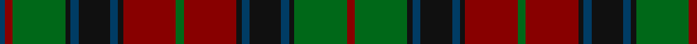

In pattern [BRGKBKBKRGRKBKBKGR](/patterns/brgkbkbkrgrkbkbkgr/).

This was sourced from house-of-tartan.  It is a [18 stripes tartan](/stripes/stripes18/).

Original link http://www.house-of-tartan.scotland.net/house/TartanViewjs.asp?colr=Def&tnam=2397

## Thread count
DB/4 DR6 G40 K4 DB6 K24 DB6 K4 DR40 G6 DR40 K4 DB6 K24 DB6 K4 G40 DR/6

## Palette
Each colour and its ΔE from the base-6 reference it is a variant of.

| Colour | Shade | Base | ΔE (OKLab) |
|---|---|---|---|
| DB | <code style="background-color:#003C64;">#003C64</code> `#003C64` | B <code style="background-color:#2A418A;">#2A418A</code> | 0.08 |
| DR | <code style="background-color:#880000;">#880000</code> `#880000` | R <code style="background-color:#CC0000;">#CC0000</code> | 0.15 |
| G | <code style="background-color:#006818;">#006818</code> `#006818` | G <code style="background-color:#006100;">#006100</code> | 0.02 |
| K | <code style="background-color:#101010;">#101010</code> `#101010` | K <code style="background-color:#000000;">#000000</code> | 0.17 |

## Nearest tartans

The nearest existing variants by ΔTartan distance.

1. [Blackburn Appalachian Htg (Personal)](/setts/s16/g7k2g7y1k2y1k10y3r10y3k10y1g11k2g3k2x2~g003820-k101010-r880000-ybc8c00/) — ΔT 0.96
1. [Matthew Gloag & Son Ltd (Corporate)](/setts/s10/g3r20k2b3k12b3k2g20r3b2x2~b003c64-g006818-k101010-r880000/) — ΔT 1.21
1. [Kettles, Ryan & Alan (Personal)](/setts/s16/g13k2g2k2g2k12b16k1g2k1b16k12g12k1y2b1x2~b440044-g006818-k101010-yfccc00/) — ΔT 1.30
1. [Bonnie Brae (School)](/setts/s11/r6b3ra3r24b20g24ra3g3ra3g3ra6~b000060-g004800-r70000c-rab07430/) — ΔT 1.32
1. [Anderson (Coulson Bonner #1)](/setts/s14/k3r7k4g7ra3g7k4ga3k3ga19k2ga2k2ra3x2~g503c14-ga005020-k101010-r960000-radc0000/) — ΔT 1.33
1. [Flaumandrum](/setts/s15/b12k2b2k2b2k12r12k1y2k1r12k12b12k1ra2x2~b5c5c5c-k101010-r880000-rac00000-ye8c000/) — ΔT 1.36
1. [Bonnie Brae School](/setts/s11/r6b3ra3r24b20g24ra3g3ra3g3ra6~b000060-g004800-r880000-rab07430/) — ΔT 1.36
1. [Cumming/Comyn/Buchan](/setts/s23/r6g6r1k8r1k1b1r1k8r1g6r6b1k6r1g8r1k1r1g8r1k6b1x2~b2c4084-g005020-k101010-rdc0000/) — ΔT 1.37
1. [Stewart of Appin (Clan)](/setts/s17/b12k1g2k1g2k1b12r2k12r1k12r2g12k1b2k1g12x2~b2c2c80-g006818-k101010-rc80000/) — ΔT 1.38
1. [Stewart of Appin Hunting](/setts/s18/g8r3g3r5g26ga7b3ba28r3ba6r3ba28b3ga7g26r5g3r3x2~b5c8ca8-ba202060-g006818-ga604000-rc80000/) — ΔT 1.38

## Neighbour map

Every grey dot is one of 15726 variants placed by the first two principal components of the ΔTartan feature space (44% of its variance). Red is this tartan; blue dots are its nearest — click one to open its page.

<svg viewBox="0 0 640 380" role="img" style="max-width:100%;height:auto;border:1px solid #e0e0e0;border-radius:4px;display:block" xmlns="http://www.w3.org/2000/svg"><image href="/nn/cloud.v1.png" width="640" height="380"/><a href="/setts/s16/g7k2g7y1k2y1k10y3r10y3k10y1g11k2g3k2x2~g003820-k101010-r880000-ybc8c00/"><circle cx="209.4" cy="186.0" r="4" fill="#3465a4"><title>Blackburn Appalachian Htg (Personal)</title></circle></a><a href="/setts/s10/g3r20k2b3k12b3k2g20r3b2x2~b003c64-g006818-k101010-r880000/"><circle cx="215.7" cy="188.7" r="4" fill="#3465a4"><title>Matthew Gloag &amp; Son Ltd (Corporate)</title></circle></a><a href="/setts/s16/g13k2g2k2g2k12b16k1g2k1b16k12g12k1y2b1x2~b440044-g006818-k101010-yfccc00/"><circle cx="224.2" cy="155.4" r="4" fill="#3465a4"><title>Kettles, Ryan &amp; Alan (Personal)</title></circle></a><a href="/setts/s11/r6b3ra3r24b20g24ra3g3ra3g3ra6~b000060-g004800-r70000c-rab07430/"><circle cx="174.0" cy="188.8" r="4" fill="#3465a4"><title>Bonnie Brae (School)</title></circle></a><a href="/setts/s14/k3r7k4g7ra3g7k4ga3k3ga19k2ga2k2ra3x2~g503c14-ga005020-k101010-r960000-radc0000/"><circle cx="188.1" cy="177.0" r="4" fill="#3465a4"><title>Anderson (Coulson Bonner #1)</title></circle></a><a href="/setts/s15/b12k2b2k2b2k12r12k1y2k1r12k12b12k1ra2x2~b5c5c5c-k101010-r880000-rac00000-ye8c000/"><circle cx="203.1" cy="154.1" r="4" fill="#3465a4"><title>Flaumandrum</title></circle></a><a href="/setts/s11/r6b3ra3r24b20g24ra3g3ra3g3ra6~b000060-g004800-r880000-rab07430/"><circle cx="170.3" cy="185.6" r="4" fill="#3465a4"><title>Bonnie Brae School</title></circle></a><a href="/setts/s23/r6g6r1k8r1k1b1r1k8r1g6r6b1k6r1g8r1k1r1g8r1k6b1x2~b2c4084-g005020-k101010-rdc0000/"><circle cx="177.4" cy="162.8" r="4" fill="#3465a4"><title>Cumming/Comyn/Buchan</title></circle></a><a href="/setts/s17/b12k1g2k1g2k1b12r2k12r1k12r2g12k1b2k1g12x2~b2c2c80-g006818-k101010-rc80000/"><circle cx="200.6" cy="163.5" r="4" fill="#3465a4"><title>Stewart of Appin (Clan)</title></circle></a><a href="/setts/s18/g8r3g3r5g26ga7b3ba28r3ba6r3ba28b3ga7g26r5g3r3x2~b5c8ca8-ba202060-g006818-ga604000-rc80000/"><circle cx="199.6" cy="148.7" r="4" fill="#3465a4"><title>Stewart of Appin Hunting</title></circle></a><circle cx="206.2" cy="166.0" r="5" fill="#c00000"/></svg>

ID: /setts/s18/r3g20k2b3k12b3k2r20g3r20k2b3k12b3k2g20r3b2x2~b003c64-g006818-k101010-r880000/
