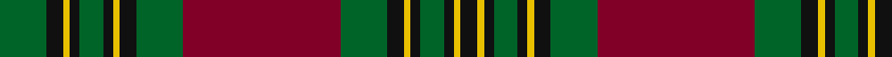

**Bands:** [KYKGKYKGRGKYKGKYKG](/stripes/kykgkykgrgkykgkykg/) · **Stripes:** [K LY K G K LY K G R G K LY K G K LY K G](/stripes/stripes18/) K LY K G K LY K G R G K LY K G K LY K G

This was sourced from register-of-tartans.  It is a [18 band tartan](/bands/bands18/).

Original link https://www.tartanregister.gov.uk/tartanDetails.aspx?ref=1591

## Register references

External register numbers recorded for this tartan.

- Scottish Register of Tartans: [1591](https://www.tartanregister.gov.uk/tartanDetails.aspx?ref=1591)
- Scottish Tartans Authority (ITI): 6469

## Thread count
G/28 K10 Y4 K6 G14 K6 Y4 K10 G28 DR94 G28 K10 Y4 K6 G14 K6 Y4 K/10

## Palette
Each colour and its ΔE from the base-6 reference it is a variant of.

| Colour | Shade | Base | ΔE (OKLab) |
|---|---|---|---|
| DR | <code style="background-color:#800028;">#800028</code> `#800028` | R <code style="background-color:#CC0000;">#CC0000</code> | 0.17 |
| G | <code style="background-color:#006428;">#006428</code> `#006428` | G <code style="background-color:#006100;">#006100</code> | 0.03 |
| K | <code style="background-color:#101010;">#101010</code> `#101010` | K <code style="background-color:#000000;">#000000</code> | 0.17 |
| Y | <code style="background-color:#E8C000;">#E8C000</code> `#E8C000` | Y <code style="background-color:#F2BF00;">#F2BF00</code> | 0.02 |

## Nearest tartans

The nearest existing variants by ΔTartan distance.

1. [Unidentified Lindley #2](/setts/s18/r18db2r2db2r3db14dg29ly1dg2ly4~x2/) — ΔT 1.15
1. [Ladybird](/setts/s15/r20p1r1db2r1p1r4db4g2db4g2db4g19r1p2~x2/) — ΔT 1.16
1. [Cumming/Buchan Hunting](/setts/s24/k2r2dg27r2k6db2r6dg6r2k24r2k2db2r2k24r2dg6r6db2k6r2dg27r2k2~x2/) — ΔT 1.21
1. [Unnamed C18/19th - Antigonish (A)](/setts/s18/r26y6dt26r2y26w1r6dt2r6dt13~x2/) — ΔT 1.24
1. [MacIntyre, and Glenorchy](/setts/s15/t1r2db2r4g16r2db1r4g1r2db16r4g2r2t1~x2/) — ΔT 1.26
1. [Leach Family Tartan Tartan Number: 2356. Earliest known date: pre 1997 Originally the name given to physicians and has been in Scotland for centuries. Can be worn by all people with all spellings of the name Leach. See products available Copyright © Blair Urquhart, Comrie, 2015](/setts/s16/r24lb1k3lb1g14r8k3dp3lb2~x4/) — ΔT 1.26
1. [Buchan](/setts/s23/r6g6r2k24r2db2k2r2k24r2g6r6db2k6r2g27r2k2r2g27r2k6db2~x2/) — ΔT 1.27
1. [Unidentified, coat](/setts/s14/g6r2g2r24t1db1r2db12r2db1t1r2g24r2~x2/) — ΔT 1.27
1. [Unidentified Coat](/setts/s14/dg6r2dg2r24t1db1r2db12r2db1t1r2dg24r2~x2/) — ΔT 1.29
1. [Stewart of Appin](/setts/s16/r3db2b1r2dg24r4dg2r2db8r2dg2r24db2b1r2dg2~x2/) — ΔT 1.30

## Neighbour map

Every grey dot is one of 14299 variants placed by the first two principal components of the ΔTartan feature space (44% of its variance). Red is this tartan; blue dots are its nearest — click one to open its page.

<svg viewBox="0 0 640 380" role="img" style="max-width:100%;height:auto;border:1px solid #e0e0e0;border-radius:4px;display:block" xmlns="http://www.w3.org/2000/svg"><image href="/nn/cloud.v1.png" width="640" height="380"/><a href="/setts/s18/r18db2r2db2r3db14dg29ly1dg2ly4~x2/"><circle cx="303.0" cy="107.2" r="4" fill="#3465a4"><title>Unidentified Lindley #2</title></circle></a><a href="/setts/s15/r20p1r1db2r1p1r4db4g2db4g2db4g19r1p2~x2/"><circle cx="269.8" cy="114.4" r="4" fill="#3465a4"><title>Ladybird</title></circle></a><a href="/setts/s24/k2r2dg27r2k6db2r6dg6r2k24r2k2db2r2k24r2dg6r6db2k6r2dg27r2k2~x2/"><circle cx="251.9" cy="129.2" r="4" fill="#3465a4"><title>Cumming/Buchan Hunting</title></circle></a><a href="/setts/s18/r26y6dt26r2y26w1r6dt2r6dt13~x2/"><circle cx="255.5" cy="127.3" r="4" fill="#3465a4"><title>Unnamed C18/19th - Antigonish (A)</title></circle></a><a href="/setts/s15/t1r2db2r4g16r2db1r4g1r2db16r4g2r2t1~x2/"><circle cx="232.1" cy="132.7" r="4" fill="#3465a4"><title>MacIntyre, and Glenorchy</title></circle></a><a href="/setts/s16/r24lb1k3lb1g14r8k3dp3lb2~x4/"><circle cx="253.5" cy="106.4" r="4" fill="#3465a4"><title>Leach Family Tartan Tartan Number: 2356. Earliest known date: pre 1997 Originally the name given to physicians and has been in Scotland for centuries. Can be worn by all people with all spellings of the name Leach. See products available Copyright © Blair Urquhart, Comrie, 2015</title></circle></a><a href="/setts/s23/r6g6r2k24r2db2k2r2k24r2g6r6db2k6r2g27r2k2r2g27r2k6db2~x2/"><circle cx="254.5" cy="135.1" r="4" fill="#3465a4"><title>Buchan</title></circle></a><a href="/setts/s14/g6r2g2r24t1db1r2db12r2db1t1r2g24r2~x2/"><circle cx="298.3" cy="111.5" r="4" fill="#3465a4"><title>Unidentified, coat</title></circle></a><a href="/setts/s14/dg6r2dg2r24t1db1r2db12r2db1t1r2dg24r2~x2/"><circle cx="298.1" cy="108.8" r="4" fill="#3465a4"><title>Unidentified Coat</title></circle></a><a href="/setts/s16/r3db2b1r2dg24r4dg2r2db8r2dg2r24db2b1r2dg2~x2/"><circle cx="334.3" cy="110.8" r="4" fill="#3465a4"><title>Stewart of Appin</title></circle></a><circle cx="263.2" cy="110.0" r="5" fill="#c00000"/></svg>

ID: /setts/s18/r47g14k5ly2k3g7k3ly2k5g14~x2/
