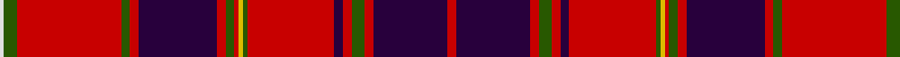

In pattern [RBRGRBRGYRGRBRGRGW](/patterns/rbrgrbrgyrgrbrgrgw/).

This was sourced from register-of-tartans.  It is a [18 stripes tartan](/stripes/stripes18/).

Original link https://www.tartanregister.gov.uk/tartanDetails.aspx?ref=3347

## Attestations

This cloth appears in 2 source records; the oldest owns this page.

- 01/01/1730 — Plowman (Personal) (register-of-tartans, [record](https://www.tartanregister.gov.uk/tartanDetails.aspx?ref=3347))
- pre 1730 — Plowman (Personal) (tartans-authority, [record](http://www.tartansauthority.com/tartan-ferret/display/6523/))

## Thread count
LN/2 G6 R48 G4 R4 DP36 R4 G4 R2 Y2 G2 R40 DP4 R4 G6 R4 DP34 R/4

## Palette
Each colour and its ΔE from the base-6 reference it is a variant of.

| Colour | Shade | Base | ΔE (OKLab) |
|---|---|---|---|
| DP | <code style="background-color:#28003C;">#28003C</code> `#28003C` | B <code style="background-color:#2C4084;">#2C4084</code> | 0.20 |
| G | <code style="background-color:#285800;">#285800</code> `#285800` | G <code style="background-color:#006400;">#006400</code> | 0.04 |
| LN | <code style="background-color:#E0E0E0;">#E0E0E0</code> `#E0E0E0` | W <code style="background-color:#F4F4F0;">#F4F4F0</code> | 0.06 |
| P | <code style="background-color:#780078;">#780078</code> `#780078` | B <code style="background-color:#2C4084;">#2C4084</code> | 0.16 |
| R | <code style="background-color:#C80000;">#C80000</code> `#C80000` | R <code style="background-color:#C80000;">#C80000</code> | 0.00 |
| Y | <code style="background-color:#DCBC00;">#DCBC00</code> `#DCBC00` | Y <code style="background-color:#E8C000;">#E8C000</code> | 0.02 |

## Nearest tartans

The nearest existing variants by ΔTartan distance.

1. [Plowman #2 (Personal)](/setts/s17/r4b34r4g6r4b4r40g2y2r2g4r4b36g4r48g6w2-b280032-g005020-rdc0000-we0e0e0-ye8c000/) — ΔT 0.40
1. [Unidentified Scarlett #8](/setts/s17/g4r40k4r4g6r4k36r6w2g6r40k4r4k36r4g4y2-g408060-k101010-rc80000-wfcfcfc-ye8c000/) — ΔT 0.92
1. [Smeaton (Wedding) (Personal)](/setts/s18/r6k4y6k6r6k64r88w6r8k12r8w6r88k64r6k6y6k4-k101010-rc80000-wc0c0c0-yd09800/) — ΔT 1.17
1. [First Special Services Forces (Mil)](/setts/s13/r8k18r6y6r36k8r4w4r4k72r48b8r6-b2c2c80-k101010-rc80000-wfcfcfc-ye8c000/) — ΔT 1.18
1. [Hebridean, South Uist](/setts/s18/b38r4g6r4b4r40g2y2r2g4r4b36r4g4r44g6w2r6-b304080-g008000-rc00000-we0e0e0-yf0c000/) — ΔT 1.19
1. [Bahrain, Royal](/setts/s18/k32r2k4r6k2r18k2r6k4r2k12g6w6g10r56wa6r6wa6-g005020-k000028-raf0014-w98d0f0-wae0e0e0/) — ΔT 1.21
1. [Murray of Tullibardine #2](/setts/s21/b4r2b2r4b8r4b2r2k4r2b2r48b24r4g4r16g24r8b4r4k2-b2c4084-g005020-k101010-rdc0000/) — ΔT 1.22
1. [Murray of Tullibardine Family Tartan Tartan Number: 441. Earliest known date: 1850 (1679) James Grant, in his book, 'The Tartans of the Clans of Scotland' (1886) says, "That tartan called the Tullibardine is a red tartan, and was adopted and worn by Charles, the first Earl of Dunmore, second son of the first Marquis of Tullibardine ..in 1679 (he) was lieutenant Colonel of the Royal Grey Dragoons..." The same sett is shown in the earlier work of the Smith brothers, 'Authenticated Tartans..' (1850) This is the sett shown in the famous picture of the Chief of the MacLeods, Normand MacLeod, at Dunvegan Castle. See 'Red MacLeod'. See products available Copyright © Blair Urquhart, Comrie, 2015](/setts/s21/b4r2b2r4b8r4b2r2k4r2b2r48b24r4g4r16g24r8b4r4k2-b2c2c80-g006818-k101010-rc80000/) — ΔT 1.24
1. [MacFarlane Red Artifact Tartan Tartan Number: 947. Earliest known date: 1822 The threadcount is taken from a silk, satin-weave sash, (1822) in the collection of the Scottish Tartans Museum in Comrie, Perthshire. (Reproduced at 50% actual count.) The sett varies slightly from the one registered with Lord Lyon but is often the manufacturers choice. MacFarlanes, 'sons of Parlan', were proscribed and their lands forfeited, in the same way as the MacGregors. Many emigrated and some changed their name: Bartholomew is a Southern form of the name. The chiefship is vacant. See products available Copyright © Blair Urquhart, Comrie, 2015](/setts/s14/r103k8g16w4r9k3r9w4g7b41k14r14w10g6-b2c2c80-g006818-k101010-rc80000-we0e0e0/) — ΔT 1.27
1. [King George IV - 1824 (Artefact)](/setts/s17/r48w2b2r6g48r6b2w2r6b12r6w2b2r48g6y6g6-b280034-g285800-rc80000-wf8f8f8-yfca098/) — ΔT 1.28

## Neighbour map

Every grey dot is one of 15726 variants placed by the first two principal components of the ΔTartan feature space (44% of its variance). Red is this tartan; blue dots are its nearest — click one to open its page.

<svg viewBox="0 0 640 380" role="img" style="max-width:100%;height:auto;border:1px solid #e0e0e0;border-radius:4px;display:block" xmlns="http://www.w3.org/2000/svg"><image href="/nn/cloud.v1.png" width="640" height="380"/><a href="/setts/s17/r4b34r4g6r4b4r40g2y2r2g4r4b36g4r48g6w2-b280032-g005020-rdc0000-we0e0e0-ye8c000/"><circle cx="310.6" cy="73.9" r="4" fill="#3465a4"><title>Plowman #2 (Personal)</title></circle></a><a href="/setts/s17/g4r40k4r4g6r4k36r6w2g6r40k4r4k36r4g4y2-g408060-k101010-rc80000-wfcfcfc-ye8c000/"><circle cx="288.7" cy="89.5" r="4" fill="#3465a4"><title>Unidentified Scarlett #8</title></circle></a><a href="/setts/s18/r6k4y6k6r6k64r88w6r8k12r8w6r88k64r6k6y6k4-k101010-rc80000-wc0c0c0-yd09800/"><circle cx="347.4" cy="89.9" r="4" fill="#3465a4"><title>Smeaton (Wedding) (Personal)</title></circle></a><a href="/setts/s13/r8k18r6y6r36k8r4w4r4k72r48b8r6-b2c2c80-k101010-rc80000-wfcfcfc-ye8c000/"><circle cx="293.5" cy="104.9" r="4" fill="#3465a4"><title>First Special Services Forces (Mil)</title></circle></a><a href="/setts/s18/b38r4g6r4b4r40g2y2r2g4r4b36r4g4r44g6w2r6-b304080-g008000-rc00000-we0e0e0-yf0c000/"><circle cx="323.7" cy="89.1" r="4" fill="#3465a4"><title>Hebridean, South Uist</title></circle></a><a href="/setts/s18/k32r2k4r6k2r18k2r6k4r2k12g6w6g10r56wa6r6wa6-g005020-k000028-raf0014-w98d0f0-wae0e0e0/"><circle cx="281.7" cy="65.6" r="4" fill="#3465a4"><title>Bahrain, Royal</title></circle></a><a href="/setts/s21/b4r2b2r4b8r4b2r2k4r2b2r48b24r4g4r16g24r8b4r4k2-b2c4084-g005020-k101010-rdc0000/"><circle cx="340.5" cy="84.7" r="4" fill="#3465a4"><title>Murray of Tullibardine #2</title></circle></a><a href="/setts/s21/b4r2b2r4b8r4b2r2k4r2b2r48b24r4g4r16g24r8b4r4k2-b2c2c80-g006818-k101010-rc80000/"><circle cx="343.1" cy="87.9" r="4" fill="#3465a4"><title>Murray of Tullibardine Family Tartan Tartan Number: 441. Earliest known date: 1850 (1679) James Grant, in his book, 'The Tartans of the Clans of Scotland' (1886) says, &quot;That tartan called the Tullibardine is a red tartan, and was adopted and worn by Charles, the first Earl of Dunmore, second son of the first Marquis of Tullibardine ..in 1679 (he) was lieutenant Colonel of the Royal Grey Dragoons...&quot; The same sett is shown in the earlier work of the Smith brothers, 'Authenticated Tartans..' (1850) This is the sett shown in the famous picture of the Chief of the MacLeods, Normand MacLeod, at Dunvegan Castle. See 'Red MacLeod'. See products available Copyright © Blair Urquhart, Comrie, 2015</title></circle></a><a href="/setts/s14/r103k8g16w4r9k3r9w4g7b41k14r14w10g6-b2c2c80-g006818-k101010-rc80000-we0e0e0/"><circle cx="319.4" cy="59.8" r="4" fill="#3465a4"><title>MacFarlane Red Artifact Tartan Tartan Number: 947. Earliest known date: 1822 The threadcount is taken from a silk, satin-weave sash, (1822) in the collection of the Scottish Tartans Museum in Comrie, Perthshire. (Reproduced at 50% actual count.) The sett varies slightly from the one registered with Lord Lyon but is often the manufacturers choice. MacFarlanes, 'sons of Parlan', were proscribed and their lands forfeited, in the same way as the MacGregors. Many emigrated and some changed their name: Bartholomew is a Southern form of the name. The chiefship is vacant. See products available Copyright © Blair Urquhart, Comrie, 2015</title></circle></a><a href="/setts/s17/r48w2b2r6g48r6b2w2r6b12r6w2b2r48g6y6g6-b280034-g285800-rc80000-wf8f8f8-yfca098/"><circle cx="347.3" cy="75.4" r="4" fill="#3465a4"><title>King George IV - 1824 (Artefact)</title></circle></a><circle cx="323.3" cy="75.9" r="5" fill="#c00000"/></svg>

ID: /setts/s18/r4b34r4g6r4b4r40g2y2r2g4r4b36r4g4r48g6w2-b28003c-g285800-rc80000-we0e0e0-ydcbc00/
