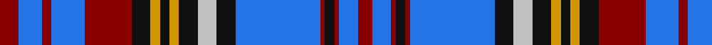

In pattern [RBRBRKYKYKWKBRKRBR](/patterns/rbrbrkykykwkbrkrbr/).

This was sourced from register-of-tartans.  It is a [18 stripes tartan](/stripes/stripes18/).

Original link https://www.tartanregister.gov.uk/tartanDetails.aspx?ref=5174

## Thread count
DR/8 B10 DR4 B14 DR20 K8 DY4 K4 DY4 K8 N8 K8 B36 DR2 K4 DR2 B8 DR/6

## Palette
Each colour and its ΔE from the base-6 reference it is a variant of.

| Colour | Shade | Base | ΔE (OKLab) |
|---|---|---|---|
| B | <code style="background-color:#2474E8;">#2474E8</code> `#2474E8` | B <code style="background-color:#2A418A;">#2A418A</code> | 0.19 |
| DR | <code style="background-color:#880000;">#880000</code> `#880000` | R <code style="background-color:#CC0000;">#CC0000</code> | 0.15 |
| DY | <code style="background-color:#D09800;">#D09800</code> `#D09800` | Y <code style="background-color:#F2BF00;">#F2BF00</code> | 0.12 |
| K | <code style="background-color:#101010;">#101010</code> `#101010` | K <code style="background-color:#000000;">#000000</code> | 0.17 |
| N | <code style="background-color:#C0C0C0;">#C0C0C0</code> `#C0C0C0` | W <code style="background-color:#F7F7F7;">#F7F7F7</code> | 0.17 |

## Nearest tartans

The nearest existing variants by ΔTartan distance.

1. [Wcwm 1138](/setts/s14/b14k2g3k2g3k2b12r4b10r3b10r4w28r4~b1c0070-g006818-k101010-r880000-wc0c0c0~x2/) — ΔT 0.84
1. [Cochrane](/setts/s15/b27r4b3r2b4r2b3r4b14k14r2ba14r4ba4y3~b5480b0-ba304080-k000000-rc00000-yf0c000~x2/) — ΔT 0.88
1. [Royal Canadian Air Force #2](/setts/s16/r3b7k1r2k1b12k4w3k2r1k1r1ba3r2ba4r2~b3c82af-ba080848-k101010-r960028-we0e0e0~x2/) — ΔT 0.95
1. [Historic Scotland (1998)](/setts/s22/b8w8b4ba4b36ba4b4r26b2r26g2b5g2r26b2r26b4ba4b36ba4b4w8~b202060-ba780078-g006818-r888888-we0e0e0/) — ΔT 1.00
1. [Royal Canadian Air Force](/setts/s16/r3b7k1r2k1b12k4w3k2r1k1r1ba3r2ba4r2~b5480b0-ba000050-k000000-r900030-we0e0e0~x2/) — ΔT 1.09
1. [Cochrane Azure](/setts/s15/b27r4b3r2b4r2b3r4b14k14r2ba14r4ba4y3~b3c82af-ba2c4084-k101010-rdc0000-ye8c000~x2/) — ΔT 1.15
1. [Royal Canadian Air Force](/setts/s18/r4b6k1r2k1b14k3w3k2r2k2r2ba4r2ba6r2ba6r2~b4682b4-ba00008b-k101010-rc80000-we0e0e0~x2/) — ΔT 1.16
1. [Scottish Knights Templar St. Andrews](/setts/s22/b2r1k2w3k4w4k4w5k6b20r1w4r1b20k6w5k4w4k4w3k2r1~b2c2c80-k101010-rc80000-wc0c0c0~x2/) — ΔT 1.20
1. [Un-named fashion (2013)](/setts/s19/k2w2k15b5r5b10wa2b10r5b5r30k2r4k2r30b4r4k15w2~b440044-k101010-r888888-wfcfcfc-wa98c8e8~x2/) — ΔT 1.25
1. [Submariners (Unofficial)](/setts/s14/w4b1ba12b1r8w8b8w2b1w2b24y4b1r2~b003c64-ba2c2c80-rc80000-wfcfcfc-yfccc00~x2/) — ΔT 1.27

## Neighbour map

Every grey dot is one of 15726 variants placed by the first two principal components of the ΔTartan feature space (44% of its variance). Red is this tartan; blue dots are its nearest — click one to open its page.

<svg viewBox="0 0 640 380" role="img" style="max-width:100%;height:auto;border:1px solid #e0e0e0;border-radius:4px;display:block" xmlns="http://www.w3.org/2000/svg"><image href="/nn/cloud.v1.png" width="640" height="380"/><a href="/setts/s14/b14k2g3k2g3k2b12r4b10r3b10r4w28r4~b1c0070-g006818-k101010-r880000-wc0c0c0~x2/"><circle cx="189.0" cy="123.2" r="4" fill="#3465a4"><title>Wcwm 1138</title></circle></a><a href="/setts/s15/b27r4b3r2b4r2b3r4b14k14r2ba14r4ba4y3~b5480b0-ba304080-k000000-rc00000-yf0c000~x2/"><circle cx="212.4" cy="123.2" r="4" fill="#3465a4"><title>Cochrane</title></circle></a><a href="/setts/s16/r3b7k1r2k1b12k4w3k2r1k1r1ba3r2ba4r2~b3c82af-ba080848-k101010-r960028-we0e0e0~x2/"><circle cx="146.9" cy="130.3" r="4" fill="#3465a4"><title>Royal Canadian Air Force #2</title></circle></a><a href="/setts/s22/b8w8b4ba4b36ba4b4r26b2r26g2b5g2r26b2r26b4ba4b36ba4b4w8~b202060-ba780078-g006818-r888888-we0e0e0/"><circle cx="228.6" cy="100.3" r="4" fill="#3465a4"><title>Historic Scotland (1998)</title></circle></a><a href="/setts/s16/r3b7k1r2k1b12k4w3k2r1k1r1ba3r2ba4r2~b5480b0-ba000050-k000000-r900030-we0e0e0~x2/"><circle cx="133.6" cy="125.7" r="4" fill="#3465a4"><title>Royal Canadian Air Force</title></circle></a><a href="/setts/s15/b27r4b3r2b4r2b3r4b14k14r2ba14r4ba4y3~b3c82af-ba2c4084-k101010-rdc0000-ye8c000~x2/"><circle cx="227.7" cy="129.1" r="4" fill="#3465a4"><title>Cochrane Azure</title></circle></a><a href="/setts/s18/r4b6k1r2k1b14k3w3k2r2k2r2ba4r2ba6r2ba6r2~b4682b4-ba00008b-k101010-rc80000-we0e0e0~x2/"><circle cx="113.5" cy="121.1" r="4" fill="#3465a4"><title>Royal Canadian Air Force</title></circle></a><a href="/setts/s22/b2r1k2w3k4w4k4w5k6b20r1w4r1b20k6w5k4w4k4w3k2r1~b2c2c80-k101010-rc80000-wc0c0c0~x2/"><circle cx="199.8" cy="104.3" r="4" fill="#3465a4"><title>Scottish Knights Templar St. Andrews</title></circle></a><a href="/setts/s19/k2w2k15b5r5b10wa2b10r5b5r30k2r4k2r30b4r4k15w2~b440044-k101010-r888888-wfcfcfc-wa98c8e8~x2/"><circle cx="238.0" cy="107.1" r="4" fill="#3465a4"><title>Un-named fashion (2013)</title></circle></a><a href="/setts/s14/w4b1ba12b1r8w8b8w2b1w2b24y4b1r2~b003c64-ba2c2c80-rc80000-wfcfcfc-yfccc00~x2/"><circle cx="203.7" cy="88.4" r="4" fill="#3465a4"><title>Submariners (Unofficial)</title></circle></a><circle cx="185.5" cy="111.0" r="5" fill="#c00000"/></svg>

ID: /setts/s18/r4b5r2b7r10k4y2k2y2k4w4k4b18r1k2r1b4r3~b2474e8-k101010-r880000-wc0c0c0-yd09800~x2/
