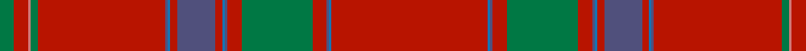

In pattern [GRRGRBBRBRBBRGRBBR](/patterns/grrgrbbrbrbbrgrbbr/).

This was sourced from tartans-authority.  It is a [18 stripes tartan](/stripes/stripes18/).

Original link http://www.tartansauthority.com/tartan-ferret/display/6374/

## Thread count
G/12 R12 LR2 G6 R108 N2 B2 R6 N32 R6 B2 N2 R12 G60 R12 N2 B2 R/132

## Palette
Each colour and its ΔE from the base-6 reference it is a variant of.

| Colour | Shade | Base | ΔE (OKLab) |
|---|---|---|---|
| B | <code style="background-color:#1474B4;">#1474B4</code> `#1474B4` | B <code style="background-color:#2A418A;">#2A418A</code> | 0.15 |
| G | <code style="background-color:#007844;">#007844</code> `#007844` | G <code style="background-color:#006100;">#006100</code> | 0.09 |
| LR | <code style="background-color:#D07878;">#D07878</code> `#D07878` | R <code style="background-color:#CC0000;">#CC0000</code> | 0.18 |
| N | <code style="background-color:#50507C;">#50507C</code> `#50507C` | B <code style="background-color:#2A418A;">#2A418A</code> | 0.08 |
| R | <code style="background-color:#B81400;">#B81400</code> `#B81400` | R <code style="background-color:#CC0000;">#CC0000</code> | 0.04 |

## Nearest tartans

The nearest existing variants by ΔTartan distance.

1. [Ramada](/setts/s18/r66b1ba1r6g30r6ba1b1r3ba16r3b1ba1r54g3ra1r6g6x2~b1474b4-ba50507c-g003820-rb81400-rad07878/) — ΔT 0.59
1. [Burrell (Personal)](/setts/s14/r29ra1r2ra1r60y2r2b10g2ga1g2b10r2y2x2~b2c2c80-g006818-ga289c18-r880000-ra888888-ybc8c00/) — ΔT 1.59
1. [Highland Queen (Corporate)](/setts/s12/r8g4r30b6r2k1r2g6r8k1r4y2x2~b2c2c80-g5c9478-k101010-rc44438-ye8c000/) — ΔT 1.68
1. [Unidentified 8](/setts/s18/r66b1ba1r6g30r6ba1b1r3ba16r3b1ba1r54g3ra1r6g6x2~b304080-ba000050-g008000-rc00000-rad03030/) — ΔT 1.70
1. [Unidentified #60](/setts/s11/r50ra3r4ra4b1ra1b1ra7g7ra1g3x4~b000088-g085454-r70000c-rab07430/) — ΔT 1.74
1. [Stenhousemuir Football Club](/setts/s16/b3r3b14r60y3r4k2r6k2r4y3r60b14r3b3w1x2~b2c2c80-k101010-r901c38-wfcfcfc-ye8c000/) — ΔT 1.79
1. [Slessor (Personal)](/setts/s14/g2y1g11r50y12b2y4b2y4b2y12r50g11y1x2~b2c2c80-g003820-r880000-ya08858/) — ΔT 1.82
1. [Ramada Corporate Tartan Tartan Number: 6374. Earliest known date: 2004 Re-created from an artifact in the Telfer Dunbar collection at the Scottish Tartans Museum. The unusual bleaching effect that has occurred either by design or by age, has been enhanced in this new design. It is a feature often seen in silk fabrics over 200 years old. See products available Copyright © Blair Urquhart, Comrie, 2015](/setts/s34/g6r6ra1g3r54b1ba1r3b16r3ba1b1r6g30r6b1ba1r66ba1b1r6g30r6b1ba1r3b16r3ba1b1r54g3ra1r6x2~b202060-ba50507c-g003820-rb81400-rad07878/) — ΔT 1.83
1. [Moffat](/setts/s10/r64b16r1b1r12g16r8b2r2k1x2~b304080-g008000-k000000-rc00000/) — ΔT 1.85
1. [Kerr of Ardgowan Red (Personal)](/setts/s13/y2ya1r42g2r6w1g1w1y4b4g1ya1y1x2~b507898-g289c18-rc80000-wfcfcec-yec8048-yae8c000/) — ΔT 1.91

## Neighbour map

Every grey dot is one of 15726 variants placed by the first two principal components of the ΔTartan feature space (44% of its variance). Red is this tartan; blue dots are its nearest — click one to open its page.

<svg viewBox="0 0 640 380" role="img" style="max-width:100%;height:auto;border:1px solid #e0e0e0;border-radius:4px;display:block" xmlns="http://www.w3.org/2000/svg"><image href="/nn/cloud.v1.png" width="640" height="380"/><a href="/setts/s18/r66b1ba1r6g30r6ba1b1r3ba16r3b1ba1r54g3ra1r6g6x2~b1474b4-ba50507c-g003820-rb81400-rad07878/"><circle cx="517.9" cy="59.3" r="4" fill="#3465a4"><title>Ramada</title></circle></a><a href="/setts/s14/r29ra1r2ra1r60y2r2b10g2ga1g2b10r2y2x2~b2c2c80-g006818-ga289c18-r880000-ra888888-ybc8c00/"><circle cx="568.1" cy="61.4" r="4" fill="#3465a4"><title>Burrell (Personal)</title></circle></a><a href="/setts/s12/r8g4r30b6r2k1r2g6r8k1r4y2x2~b2c2c80-g5c9478-k101010-rc44438-ye8c000/"><circle cx="495.7" cy="107.9" r="4" fill="#3465a4"><title>Highland Queen (Corporate)</title></circle></a><a href="/setts/s18/r66b1ba1r6g30r6ba1b1r3ba16r3b1ba1r54g3ra1r6g6x2~b304080-ba000050-g008000-rc00000-rad03030/"><circle cx="480.6" cy="44.1" r="4" fill="#3465a4"><title>Unidentified 8</title></circle></a><a href="/setts/s11/r50ra3r4ra4b1ra1b1ra7g7ra1g3x4~b000088-g085454-r70000c-rab07430/"><circle cx="525.9" cy="95.1" r="4" fill="#3465a4"><title>Unidentified #60</title></circle></a><a href="/setts/s16/b3r3b14r60y3r4k2r6k2r4y3r60b14r3b3w1x2~b2c2c80-k101010-r901c38-wfcfcfc-ye8c000/"><circle cx="569.6" cy="72.3" r="4" fill="#3465a4"><title>Stenhousemuir Football Club</title></circle></a><a href="/setts/s14/g2y1g11r50y12b2y4b2y4b2y12r50g11y1x2~b2c2c80-g003820-r880000-ya08858/"><circle cx="456.7" cy="95.7" r="4" fill="#3465a4"><title>Slessor (Personal)</title></circle></a><a href="/setts/s34/g6r6ra1g3r54b1ba1r3b16r3ba1b1r6g30r6b1ba1r66ba1b1r6g30r6b1ba1r3b16r3ba1b1r54g3ra1r6x2~b202060-ba50507c-g003820-rb81400-rad07878/"><circle cx="456.3" cy="24.3" r="4" fill="#3465a4"><title>Ramada Corporate Tartan Tartan Number: 6374. Earliest known date: 2004 Re-created from an artifact in the Telfer Dunbar collection at the Scottish Tartans Museum. The unusual bleaching effect that has occurred either by design or by age, has been enhanced in this new design. It is a feature often seen in silk fabrics over 200 years old. See products available Copyright © Blair Urquhart, Comrie, 2015</title></circle></a><a href="/setts/s10/r64b16r1b1r12g16r8b2r2k1x2~b304080-g008000-k000000-rc00000/"><circle cx="528.1" cy="97.8" r="4" fill="#3465a4"><title>Moffat</title></circle></a><a href="/setts/s13/y2ya1r42g2r6w1g1w1y4b4g1ya1y1x2~b507898-g289c18-rc80000-wfcfcec-yec8048-yae8c000/"><circle cx="510.3" cy="32.6" r="4" fill="#3465a4"><title>Kerr of Ardgowan Red (Personal)</title></circle></a><circle cx="527.8" cy="63.0" r="5" fill="#c00000"/></svg>

ID: /setts/s18/r66b1ba1r6g30r6ba1b1r3ba16r3b1ba1r54g3ra1r6g6x2~b1474b4-ba50507c-g007844-rb81400-rad07878/
