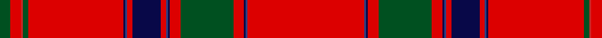

In pattern [GRRGRBBRBRBBRGRBBR](/stripes/grrgrbbrbrbbrgrbbr/).

This was sourced from register-of-tartans.  It is a [18 stripe tartan](/stripes/stripes18/).

Original link https://www.tartanregister.gov.uk/tartanDetails.aspx?ref=4235

## Register references

External register numbers recorded for this tartan.

- Scottish Register of Tartans: [4235](https://www.tartanregister.gov.uk/tartanDetails.aspx?ref=4235)
- Scottish Tartans World Register: 1011

## Thread count
R/132 B2 DB2 R12 G60 R12 DB2 B2 R6 DB32 R6 B2 DB2 R108 G6 Ra2 R12 G/12

## Palette
Each colour and the base-6 reference it is a variant of.

| Colour | Shade | Base |
|---|---|---|
| B | <code style="background-color:#2C4084;">#2C4084</code> `oklch(39.4% 0.117 268.3)` <small>#2C4084</small> | B <code style="background-color:#2A418A;">#2A418A</code> |
| DB | <code style="background-color:#080848;">#080848</code> `oklch(20.2% 0.112 270.4)` <small>#080848</small> | B <code style="background-color:#2A418A;">#2A418A</code> |
| G | <code style="background-color:#005020;">#005020</code> `oklch(37.7% 0.105 149.6)` <small>#005020</small> | G <code style="background-color:#006100;">#006100</code> |
| R | <code style="background-color:#DC0000;">#DC0000</code> `oklch(56.2% 0.230 29.2)` <small>#DC0000</small> | R <code style="background-color:#CC0000;">#CC0000</code> |
| Ra | <code style="background-color:#C82828;">#C82828</code> `oklch(54.2% 0.196 26.8)` <small>#C82828</small> | R <code style="background-color:#CC0000;">#CC0000</code> |

## Nearest tartans

The nearest existing variants by ΔTartan distance, with this tartan at the top so the swatches line up against it.

ΔTartan

Tartan

Sett

—

<a href="/ttd/edit/#slug=r66db1db1r6dg30r6db1db1r3db16r3db1db1r54dg3r1r6dg6~x2">Unidentified #34</a> <a class="nn-out" href="/setts/s18/r66db1db1r6dg30r6db1db1r3db16r3db1db1r54dg3r1r6dg6~x2/" title="open its dictionary page">↗</a>

0.56

<a href="/ttd/edit/#slug=r66db1db1r6g30r6db1db1r3db16r3db1db1r54g3r1r6g6~x2">Unidentified 8</a> <a class="nn-out" href="/setts/s18/r66db1db1r6g30r6db1db1r3db16r3db1db1r54g3r1r6g6~x2/" title="open its dictionary page">↗</a>

1.18

<a href="/ttd/edit/#slug=r64k2r2k6g2k2g2o2g6r5g2k6ly2~x2">Melrose (District)</a> <a class="nn-out" href="/setts/s13/r64k2r2k6g2k2g2o2g6r5g2k6ly2~x2/" title="open its dictionary page">↗</a>

1.24

<a href="/ttd/edit/#slug=r90k1r2db8r2k9k3w1k2ly1k3g13r11k1g2k1r5w2~x2">Scotia Village (Corporate)</a> <a class="nn-out" href="/setts/s18/r90k1r2db8r2k9k3w1k2ly1k3g13r11k1g2k1r5w2~x2/" title="open its dictionary page">↗</a>

1.30

<a href="/ttd/edit/#slug=r80w2r5k10r6o4r4k2o6k2r10o4r8k10r5w2">Hampden-Sydney College</a> <a class="nn-out" href="/setts/s16/r80w2r5k10r6o4r4k2o6k2r10o4r8k10r5w2/" title="open its dictionary page">↗</a>

1.30

<a href="/ttd/edit/#slug=r87db8k11ly2k3w2k3g13r11k2r5w3">Stewart/Stuart, Royal</a> <a class="nn-out" href="/setts/s12/r87db8k11ly2k3w2k3g13r11k2r5w3/" title="open its dictionary page">↗</a>

1.32

<a href="/ttd/edit/#slug=r134db10k14ly2k3w3k3g21r11k3r4w2">Royal Stewart - 1819</a> <a class="nn-out" href="/setts/s12/r134db10k14ly2k3w3k3g21r11k3r4w2/" title="open its dictionary page">↗</a>

1.36

<a href="/ttd/edit/#slug=r46w1ly3db1ly3db1ly3db1ly3w1r46dp14r2w2g2dp14~x2">Firenze ~ Florence</a> <a class="nn-out" href="/setts/s16/r46w1ly3db1ly3db1ly3db1ly3w1r46dp14r2w2g2dp14~x2/" title="open its dictionary page">↗</a>

1.38

<a href="/ttd/edit/#slug=r11lo3r11lo3k11lr2r51lr2k11lo3r11lo3r11g3~x2">Hackston (Green stripe) or Halkerston</a> <a class="nn-out" href="/setts/s14/r11lo3r11lo3k11lr2r51lr2k11lo3r11lo3r11g3~x2/" title="open its dictionary page">↗</a>

1.38

<a href="/setts/s14/r36db3w1db6g1k1g1r9~x4/">Inverness</a>

1.44

<a href="/ttd/edit/#slug=r55dp1ly1r3dp7r3ly1dp1r3g16r3dp1ly1k3w1g5r3k2~x2">MacFarhadian (Personal)</a> <a class="nn-out" href="/setts/s18/r55dp1ly1r3dp7r3ly1dp1r3g16r3dp1ly1k3w1g5r3k2~x2/" title="open its dictionary page">↗</a>

## Neighbour map

Every grey dot is one of 14299 variants placed by the first two principal components of the ΔTartan feature space (44% of its variance). Red is this tartan; blue dots are its nearest — click one to open its page.

<svg viewBox="0 0 640 380" role="img" style="max-width:100%;height:auto;border:1px solid #e0e0e0;border-radius:4px;display:block" xmlns="http://www.w3.org/2000/svg"><image href="/nn/cloud.v1.png" width="640" height="380"/><a href="/setts/s18/r66db1db1r6g30r6db1db1r3db16r3db1db1r54g3r1r6g6~x2/"><circle cx="479.9" cy="40.9" r="4" fill="#3465a4"><title>Unidentified 8</title></circle></a><a href="/setts/s13/r64k2r2k6g2k2g2o2g6r5g2k6ly2~x2/"><circle cx="473.5" cy="51.2" r="4" fill="#3465a4"><title>Melrose (District)</title></circle></a><a href="/setts/s18/r90k1r2db8r2k9k3w1k2ly1k3g13r11k1g2k1r5w2~x2/"><circle cx="477.6" cy="14.0" r="4" fill="#3465a4"><title>Scotia Village (Corporate)</title></circle></a><a href="/setts/s16/r80w2r5k10r6o4r4k2o6k2r10o4r8k10r5w2/"><circle cx="536.6" cy="67.1" r="4" fill="#3465a4"><title>Hampden-Sydney College</title></circle></a><a href="/setts/s12/r87db8k11ly2k3w2k3g13r11k2r5w3/"><circle cx="448.7" cy="31.6" r="4" fill="#3465a4"><title>Stewart/Stuart, Royal</title></circle></a><a href="/setts/s12/r134db10k14ly2k3w3k3g21r11k3r4w2/"><circle cx="485.3" cy="23.1" r="4" fill="#3465a4"><title>Royal Stewart - 1819</title></circle></a><a href="/setts/s16/r46w1ly3db1ly3db1ly3db1ly3w1r46dp14r2w2g2dp14~x2/"><circle cx="437.0" cy="25.0" r="4" fill="#3465a4"><title>Firenze ~ Florence</title></circle></a><a href="/setts/s14/r11lo3r11lo3k11lr2r51lr2k11lo3r11lo3r11g3~x2/"><circle cx="440.0" cy="87.1" r="4" fill="#3465a4"><title>Hackston (Green stripe) or Halkerston</title></circle></a><a href="/setts/s14/r36db3w1db6g1k1g1r9~x4/"><circle cx="426.8" cy="51.5" r="4" fill="#3465a4"><title>Inverness</title></circle></a><a href="/setts/s18/r55dp1ly1r3dp7r3ly1dp1r3g16r3dp1ly1k3w1g5r3k2~x2/"><circle cx="431.6" cy="14.0" r="4" fill="#3465a4"><title>MacFarhadian (Personal)</title></circle></a><circle cx="477.8" cy="34.8" r="5" fill="#c00000"/></svg>

ID: /setts/s18/r66db1db1r6dg30r6db1db1r3db16r3db1db1r54dg3r1r6dg6~x2/
