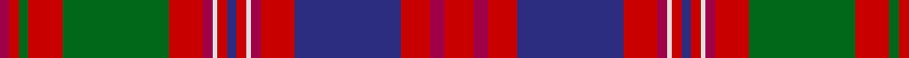

In pattern [RRGRGRRWRBRWRRBRRR](/patterns/rrgrgrrwrbrwrrbrrr/).

This was sourced from register-of-tartans.  It is a [18 stripes tartan](/stripes/stripes18/).

Original link https://www.tartanregister.gov.uk/tartanDetails.aspx?ref=2319

## Attestations

This cloth appears in 2 source records; the oldest owns this page.

- 01/01/1950 — MacColl Hunting (register-of-tartans, [record](https://www.tartanregister.gov.uk/tartanDetails.aspx?ref=2319))
- pre 1950 — MacColl - 1950 (Htg) (tartans-authority, [record](http://www.tartansauthority.com/tartan-ferret/display/1637/))

## Thread count
R/4 Ra4 G4 Ra14 G44 Ra14 R4 LN2 Ra4 DB4 Ra4 LN2 R4 Ra14 DB44 Ra12 R6 Ra/12

## Palette
Each colour and its ΔE from the base-6 reference it is a variant of.

| Colour | Shade | Base | ΔE (OKLab) |
|---|---|---|---|
| DB | <code style="background-color:#2C2C80;">#2C2C80</code> `#2C2C80` | B <code style="background-color:#2A418A;">#2A418A</code> | 0.06 |
| G | <code style="background-color:#006818;">#006818</code> `#006818` | G <code style="background-color:#006100;">#006100</code> | 0.02 |
| LN | <code style="background-color:#E0E0E0;">#E0E0E0</code> `#E0E0E0` | W <code style="background-color:#F7F7F7;">#F7F7F7</code> | 0.07 |
| R | <code style="background-color:#A00048;">#A00048</code> `#A00048` | R <code style="background-color:#CC0000;">#CC0000</code> | 0.12 |
| Ra | <code style="background-color:#C80000;">#C80000</code> `#C80000` | R <code style="background-color:#CC0000;">#CC0000</code> | 0.01 |

## Nearest tartans

The nearest existing variants by ΔTartan distance.

1. [MacColl Hunting Clan Tartan Tartan Number: 1637. Earliest known date: pre 2003 This sample comes from the MacGregor-Hastie collection which forms the basis of the cloth archive of the Scottish Tartans Society. Some of the samples, including this one, were unmarked. One can assume that the sample dates between 1930 and 1950. See products available Copyright © Blair Urquhart, Comrie, 2015](/setts/s18/r6ra3r6b22r7ra2w1r2b2r2w1ra2r7g22r7g2r2ra2~b2c2c80-g5c6428-rc80000-raa00048-we0e0e0~x2/) — ΔT 0.70
1. [MacColl, Ancient](/setts/s17/r7ra3r6b26r8g2r2b2r2ga1ra2r8ga26r8ga2r2ra2~b304080-g005020-ga008000-rc00000-ra900030~x2/) — ΔT 0.74
1. [MacDougall (Paton)](/setts/s20/w1b2r1g22r3g1r3ba9b2r1b2g8r8g8r1ba1r22b2r2w1~b5a008c-ba2c4084-g005020-rdc0000-we0e0e0~x2/) — ΔT 0.76
1. [Strathdon (District?)](/setts/s15/y3ya8r2ya8b11r2ya4ra4r27b1r2b2r2b13r2~b2c2c80-r901c38-rac80000-ya0a0a0-yabc8c00~x2/) — ΔT 0.77
1. [MacColl Ancient](/setts/s17/r7ra3r6b26r8ra2r2b2r2g1ra2r8g26r8g2r2ra2~b2c4084-g005020-rdc0000-ra960028~x2/) — ΔT 0.93
1. [Strathdon](/setts/s15/w3y8b2y8ba11b2y4r4b27ba1b2ba2b2ba13b2~b4d1a3a-ba401a4f-r7c0000-wd8e9ff-yda8d24~x2/) — ΔT 0.98
1. [Wilson, Janet (1780 Original)](/setts/s22/b30w2ba3g3ba3g3ba3g16r3g3r3g3r3g3r3g25r15g4ba4r8w2r15~b440044-ba5c8ca8-g285800-rc80000-we0e0e0~x2/) — ΔT 0.99
1. [MacColl, hunting](/setts/s18/r6ra3r6b22r7ra2w1r2b2r2w1ra2r7g22r7g2r2ra2~b304080-g607030-rc00000-ra900030-we0e0e0~x2/) — ΔT 1.02
1. [MacDougall Clan Tartan Tartan Number: 1776. Earliest known date: 1977 Matched to a sample by B Urquhart in 2004, from Lochcarron reiver cloth. The purple colour was lightened considerably to a pale mauve, giving an almost equal prominence to the white. See products available Copyright © Blair Urquhart, Comrie, 2015](/setts/s20/w2r2wa2r22b2r2g8r8g8wa2r2wa2b9r3g1r3g22r2wa2w2~b2c2c80-g006818-rc80000-we0e0e0-wac49cd8~x2/) — ΔT 1.02
1. [Leach Family Tartan Tartan Number: 2356. Earliest known date: pre 1997 Originally the name given to physicians and has been in Scotland for centuries. Can be worn by all people with all spellings of the name Leach. See products available Copyright © Blair Urquhart, Comrie, 2015](/setts/s16/r24w1k3w1g14r8k3b3w2b3k3r8g14w1k3w1~b6c0070-g006818-k101010-r880000-wc0c0c0~x4/) — ΔT 1.06

## Neighbour map

Every grey dot is one of 15726 variants placed by the first two principal components of the ΔTartan feature space (44% of its variance). Red is this tartan; blue dots are its nearest — click one to open its page.

<svg viewBox="0 0 640 380" role="img" style="max-width:100%;height:auto;border:1px solid #e0e0e0;border-radius:4px;display:block" xmlns="http://www.w3.org/2000/svg"><image href="/nn/cloud.v1.png" width="640" height="380"/><a href="/setts/s18/r6ra3r6b22r7ra2w1r2b2r2w1ra2r7g22r7g2r2ra2~b2c2c80-g5c6428-rc80000-raa00048-we0e0e0~x2/"><circle cx="248.9" cy="94.9" r="4" fill="#3465a4"><title>MacColl Hunting Clan Tartan Tartan Number: 1637. Earliest known date: pre 2003 This sample comes from the MacGregor-Hastie collection which forms the basis of the cloth archive of the Scottish Tartans Society. Some of the samples, including this one, were unmarked. One can assume that the sample dates between 1930 and 1950. See products available Copyright © Blair Urquhart, Comrie, 2015</title></circle></a><a href="/setts/s17/r7ra3r6b26r8g2r2b2r2ga1ra2r8ga26r8ga2r2ra2~b304080-g005020-ga008000-rc00000-ra900030~x2/"><circle cx="249.0" cy="90.8" r="4" fill="#3465a4"><title>MacColl, Ancient</title></circle></a><a href="/setts/s20/w1b2r1g22r3g1r3ba9b2r1b2g8r8g8r1ba1r22b2r2w1~b5a008c-ba2c4084-g005020-rdc0000-we0e0e0~x2/"><circle cx="249.3" cy="79.6" r="4" fill="#3465a4"><title>MacDougall (Paton)</title></circle></a><a href="/setts/s15/y3ya8r2ya8b11r2ya4ra4r27b1r2b2r2b13r2~b2c2c80-r901c38-rac80000-ya0a0a0-yabc8c00~x2/"><circle cx="256.7" cy="97.7" r="4" fill="#3465a4"><title>Strathdon (District?)</title></circle></a><a href="/setts/s17/r7ra3r6b26r8ra2r2b2r2g1ra2r8g26r8g2r2ra2~b2c4084-g005020-rdc0000-ra960028~x2/"><circle cx="267.7" cy="104.2" r="4" fill="#3465a4"><title>MacColl Ancient</title></circle></a><a href="/setts/s15/w3y8b2y8ba11b2y4r4b27ba1b2ba2b2ba13b2~b4d1a3a-ba401a4f-r7c0000-wd8e9ff-yda8d24~x2/"><circle cx="243.4" cy="96.5" r="4" fill="#3465a4"><title>Strathdon</title></circle></a><a href="/setts/s22/b30w2ba3g3ba3g3ba3g16r3g3r3g3r3g3r3g25r15g4ba4r8w2r15~b440044-ba5c8ca8-g285800-rc80000-we0e0e0~x2/"><circle cx="200.6" cy="100.5" r="4" fill="#3465a4"><title>Wilson, Janet (1780 Original)</title></circle></a><a href="/setts/s18/r6ra3r6b22r7ra2w1r2b2r2w1ra2r7g22r7g2r2ra2~b304080-g607030-rc00000-ra900030-we0e0e0~x2/"><circle cx="259.0" cy="100.0" r="4" fill="#3465a4"><title>MacColl, hunting</title></circle></a><a href="/setts/s20/w2r2wa2r22b2r2g8r8g8wa2r2wa2b9r3g1r3g22r2wa2w2~b2c2c80-g006818-rc80000-we0e0e0-wac49cd8~x2/"><circle cx="234.6" cy="82.5" r="4" fill="#3465a4"><title>MacDougall Clan Tartan Tartan Number: 1776. Earliest known date: 1977 Matched to a sample by B Urquhart in 2004, from Lochcarron reiver cloth. The purple colour was lightened considerably to a pale mauve, giving an almost equal prominence to the white. See products available Copyright © Blair Urquhart, Comrie, 2015</title></circle></a><a href="/setts/s16/r24w1k3w1g14r8k3b3w2b3k3r8g14w1k3w1~b6c0070-g006818-k101010-r880000-wc0c0c0~x4/"><circle cx="251.9" cy="103.3" r="4" fill="#3465a4"><title>Leach Family Tartan Tartan Number: 2356. Earliest known date: pre 1997 Originally the name given to physicians and has been in Scotland for centuries. Can be worn by all people with all spellings of the name Leach. See products available Copyright © Blair Urquhart, Comrie, 2015</title></circle></a><circle cx="231.1" cy="90.8" r="5" fill="#c00000"/></svg>

ID: /setts/s18/r6ra3r6b22r7ra2w1r2b2r2w1ra2r7g22r7g2r2ra2~b2c2c80-g006818-rc80000-raa00048-we0e0e0~x2/
