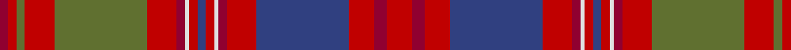

In pattern [RRGRGRRWRBRWRRBRRR](/patterns/rrgrgrrwrbrwrrbrrr/).

This was sourced from weddslist.  It is a [18 stripes tartan](/stripes/stripes18/).

Original link http://www.weddslist.com/cgi-bin/tartans/pg.pl?source=sts

## Thread count
DR/4 R4 G4 R14 G44 R14 DR4 LN2 R4 B4 R4 LN2 DR4 R14 B44 R12 DR6 R/12

## Palette
Each colour and its ΔE from the base-6 reference it is a variant of.

| Colour | Shade | Base | ΔE (OKLab) |
|---|---|---|---|
| B | <code style="background-color:#304080;">#304080</code> `#304080` | B <code style="background-color:#2A418A;">#2A418A</code> | 0.02 |
| DR | <code style="background-color:#900030;">#900030</code> `#900030` | R <code style="background-color:#CC0000;">#CC0000</code> | 0.14 |
| G | <code style="background-color:#607030;">#607030</code> `#607030` | G <code style="background-color:#006100;">#006100</code> | 0.11 |
| LN | <code style="background-color:#E0E0E0;">#E0E0E0</code> `#E0E0E0` | W <code style="background-color:#F7F7F7;">#F7F7F7</code> | 0.07 |
| R | <code style="background-color:#C00000;">#C00000</code> `#C00000` | R <code style="background-color:#CC0000;">#CC0000</code> | 0.03 |

## Nearest tartans

The nearest existing variants by ΔTartan distance.

1. [MacColl Hunting Clan Tartan Tartan Number: 1637. Earliest known date: pre 2003 This sample comes from the MacGregor-Hastie collection which forms the basis of the cloth archive of the Scottish Tartans Society. Some of the samples, including this one, were unmarked. One can assume that the sample dates between 1930 and 1950. See products available Copyright © Blair Urquhart, Comrie, 2015](/setts/s18/r6ra3r6b22r7ra2w1r2b2r2w1ra2r7g22r7g2r2ra2~b2c2c80-g5c6428-rc80000-raa00048-we0e0e0~x2/) — ΔT 0.52
1. [MacColl Hunting](/setts/s18/r6ra3r6b22r7ra2w1r2b2r2w1ra2r7g22r7g2r2ra2~b2c2c80-g006818-rc80000-raa00048-we0e0e0~x2/) — ΔT 1.02
1. [MacColl, Ancient](/setts/s17/r7ra3r6b26r8g2r2b2r2ga1ra2r8ga26r8ga2r2ra2~b304080-g005020-ga008000-rc00000-ra900030~x2/) — ΔT 1.04
1. [Strathdon (District?)](/setts/s15/y3ya8r2ya8b11r2ya4ra4r27b1r2b2r2b13r2~b2c2c80-r901c38-rac80000-ya0a0a0-yabc8c00~x2/) — ΔT 1.07
1. [MacDougall #3](/setts/s17/r30b3ra3g12ra12g12r8ra3r8b12ra5g3ra5g25ra4r6ba1~b5a008c-ba3c82af-g005020-rc82828-radc0000~x2/) — ΔT 1.21
1. [MacColl Ancient](/setts/s17/r7ra3r6b26r8ra2r2b2r2g1ra2r8g26r8g2r2ra2~b2c4084-g005020-rdc0000-ra960028~x2/) — ΔT 1.22
1. [Ryutokukan High School (Corporate)](/setts/s12/r3b20ra1b4ra2b2ra4b2ra5g2rb20w3~b5c5c5c-g289c18-r888888-rac80000-rb880000-wfcfcfc~x2/) — ΔT 1.24
1. [Pitcairn Heritage (Name)](/setts/s13/g3b4g3b4g3r28y2b2ra28b6ra9y2b2~b1870a4-g009468-ra00000-rac80050-yf09400~x2/) — ΔT 1.26
1. [Grant or New Bruce Clan Tartan Tartan Number: 1385. Earliest known date: 1819 As ordered by Patrick Grant of Redcastle, the chief of the Clan Grant. The large red and the large green squares have been reduced by a factor of 4 to allow display. The original sett was S15 P2 S4 P4 S156 LB2 S4 P42 S6 G4 S6 G178 S4 P4 S10 (HSHP half sett half pivot). This tartan was also adopted by the Drummonds. See products available Copyright © Blair Urquhart, Comrie, 2015](/setts/s15/r12b2r4b4r39ba2r4b11r6g4r6g45r4b4bb10~b780078-ba5c8ca8-bb2c2c80-g006818-rc80000/) — ΔT 1.26
1. [McCall (Name)](/setts/s15/r8k5r8g27r8w2r3g3r3w2r8ra27r8ra3r3~g408060-k101010-r880000-ra906000-we0e0e0~x2/) — ΔT 1.31

## Neighbour map

Every grey dot is one of 15726 variants placed by the first two principal components of the ΔTartan feature space (44% of its variance). Red is this tartan; blue dots are its nearest — click one to open its page.

<svg viewBox="0 0 640 380" role="img" style="max-width:100%;height:auto;border:1px solid #e0e0e0;border-radius:4px;display:block" xmlns="http://www.w3.org/2000/svg"><image href="/nn/cloud.v1.png" width="640" height="380"/><a href="/setts/s18/r6ra3r6b22r7ra2w1r2b2r2w1ra2r7g22r7g2r2ra2~b2c2c80-g5c6428-rc80000-raa00048-we0e0e0~x2/"><circle cx="248.9" cy="94.9" r="4" fill="#3465a4"><title>MacColl Hunting Clan Tartan Tartan Number: 1637. Earliest known date: pre 2003 This sample comes from the MacGregor-Hastie collection which forms the basis of the cloth archive of the Scottish Tartans Society. Some of the samples, including this one, were unmarked. One can assume that the sample dates between 1930 and 1950. See products available Copyright © Blair Urquhart, Comrie, 2015</title></circle></a><a href="/setts/s18/r6ra3r6b22r7ra2w1r2b2r2w1ra2r7g22r7g2r2ra2~b2c2c80-g006818-rc80000-raa00048-we0e0e0~x2/"><circle cx="231.1" cy="90.8" r="4" fill="#3465a4"><title>MacColl Hunting</title></circle></a><a href="/setts/s17/r7ra3r6b26r8g2r2b2r2ga1ra2r8ga26r8ga2r2ra2~b304080-g005020-ga008000-rc00000-ra900030~x2/"><circle cx="249.0" cy="90.8" r="4" fill="#3465a4"><title>MacColl, Ancient</title></circle></a><a href="/setts/s15/y3ya8r2ya8b11r2ya4ra4r27b1r2b2r2b13r2~b2c2c80-r901c38-rac80000-ya0a0a0-yabc8c00~x2/"><circle cx="256.7" cy="97.7" r="4" fill="#3465a4"><title>Strathdon (District?)</title></circle></a><a href="/setts/s17/r30b3ra3g12ra12g12r8ra3r8b12ra5g3ra5g25ra4r6ba1~b5a008c-ba3c82af-g005020-rc82828-radc0000~x2/"><circle cx="223.8" cy="105.5" r="4" fill="#3465a4"><title>MacDougall #3</title></circle></a><a href="/setts/s17/r7ra3r6b26r8ra2r2b2r2g1ra2r8g26r8g2r2ra2~b2c4084-g005020-rdc0000-ra960028~x2/"><circle cx="267.7" cy="104.2" r="4" fill="#3465a4"><title>MacColl Ancient</title></circle></a><a href="/setts/s12/r3b20ra1b4ra2b2ra4b2ra5g2rb20w3~b5c5c5c-g289c18-r888888-rac80000-rb880000-wfcfcfc~x2/"><circle cx="253.6" cy="105.9" r="4" fill="#3465a4"><title>Ryutokukan High School (Corporate)</title></circle></a><a href="/setts/s13/g3b4g3b4g3r28y2b2ra28b6ra9y2b2~b1870a4-g009468-ra00000-rac80050-yf09400~x2/"><circle cx="253.0" cy="121.3" r="4" fill="#3465a4"><title>Pitcairn Heritage (Name)</title></circle></a><a href="/setts/s15/r12b2r4b4r39ba2r4b11r6g4r6g45r4b4bb10~b780078-ba5c8ca8-bb2c2c80-g006818-rc80000/"><circle cx="299.3" cy="97.8" r="4" fill="#3465a4"><title>Grant or New Bruce Clan Tartan Tartan Number: 1385. Earliest known date: 1819 As ordered by Patrick Grant of Redcastle, the chief of the Clan Grant. The large red and the large green squares have been reduced by a factor of 4 to allow display. The original sett was S15 P2 S4 P4 S156 LB2 S4 P42 S6 G4 S6 G178 S4 P4 S10 (HSHP half sett half pivot). This tartan was also adopted by the Drummonds. See products available Copyright © Blair Urquhart, Comrie, 2015</title></circle></a><a href="/setts/s15/r8k5r8g27r8w2r3g3r3w2r8ra27r8ra3r3~g408060-k101010-r880000-ra906000-we0e0e0~x2/"><circle cx="246.8" cy="139.0" r="4" fill="#3465a4"><title>McCall (Name)</title></circle></a><circle cx="259.0" cy="100.0" r="5" fill="#c00000"/></svg>

ID: /setts/s18/r6ra3r6b22r7ra2w1r2b2r2w1ra2r7g22r7g2r2ra2~b304080-g607030-rc00000-ra900030-we0e0e0~x2/
