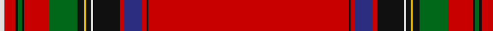

In pattern [RKRBRKKWKYKGRKGKRW](/patterns/rkrbrkkwkykgrkgkrw/).

This was sourced from tartans-authority.  It is a [18 stripes tartan](/stripes/stripes18/).

Original link http://www.tartansauthority.com/tartan-ferret/display/8805/

## Thread count
LN/4 R10 K2 G4 K2 R22 G26 K6 Y2 K4 LN2 K6 K18 R4 DB16 R4 K2 R/180

## Palette
Each colour and its ΔE from the base-6 reference it is a variant of.

| Colour | Shade | Base | ΔE (OKLab) |
|---|---|---|---|
| DB | <code style="background-color:#2C2C80;">#2C2C80</code> `#2C2C80` | B <code style="background-color:#2A418A;">#2A418A</code> | 0.06 |
| G | <code style="background-color:#006818;">#006818</code> `#006818` | G <code style="background-color:#006100;">#006100</code> | 0.02 |
| K | <code style="background-color:#101010;">#101010</code> `#101010` | K <code style="background-color:#000000;">#000000</code> | 0.17 |
| LN | <code style="background-color:#E0E0E0;">#E0E0E0</code> `#E0E0E0` | W <code style="background-color:#F7F7F7;">#F7F7F7</code> | 0.07 |
| R | <code style="background-color:#C80000;">#C80000</code> `#C80000` | R <code style="background-color:#CC0000;">#CC0000</code> | 0.01 |
| Y | <code style="background-color:#E8C000;">#E8C000</code> `#E8C000` | Y <code style="background-color:#F2BF00;">#F2BF00</code> | 0.02 |

## Nearest tartans

The nearest existing variants by ΔTartan distance.

1. [Royal Stewart - 1819](/setts/s12/r134b10k14y2k3w3k3g21r11k3r4w2~b2c2c80-g006818-k101010-rc80000-we0e0e0-ye8c000/) — ΔT 0.89
1. [MacFarhadian (Personal)](/setts/s18/r55b1y1r3b7r3y1b1r3g16r3b1y1k3w1g5r3k2x2~b740074-g006818-k101010-rc80000-wececec-ye8c000/) — ΔT 0.99
1. [Brittish Lions Corporate Tartan Tartan Number: 6636. Earliest known date: 2005 March Designed for the British Lions rugby team and unveiled in New York in April at the 2005 Tartan Day celebrations. Originally called Lion's Pride this tartan has a shield and other emblems woven into the red squares./Threadcount and colours aren't 100% original. Generated manually./ See products available Copyright © Blair Urquhart, Comrie, 2015](/setts/s12/r70w2r1w4r1k2b9k1y2r1g9w3x2~b3d4367-g45983c-k080808-rc80000-we0e0e0-ye8c000/) — ΔT 1.06
1. [Stewart/Stuart, Royal](/setts/s12/r87b8k11y2k3w2k3g13r11k2r5w3~b2c2c80-g006818-k101010-rc80000-we0e0e0-ye8c000/) — ΔT 1.07
1. [Fennell Grandmothers (Personal)](/setts/s20/r55b1y1r3b7r3y1b1r3g16r3b1y1k3w1g5r3k2b2w1x2~b740074-g006818-k101010-rc80000-wececec-ye8c000/) — ΔT 1.16
1. [MacRae of Ardentoul](/setts/s15/r80k1r2k3r2k1r3g18k1w1b2y1b18ba3r12x2~b2c2c80-ba5c8ca8-g285800-k101010-rc80000-wfcfcfc-ye8c000/) — ΔT 1.17
1. [Unidentified #34](/setts/s18/r66b1ba1r6g30r6ba1b1r3ba16r3b1ba1r54g3ra1r6g6x2~b2c4084-ba080848-g005020-rdc0000-rac82828/) — ΔT 1.24
1. [Melrose (District)](/setts/s13/r64k2r2k6g2k2g2ra2g6r5g2k6y2x2~g006818-k101010-rc80000-ra888888-ye8c000/) — ΔT 1.32
1. [Unidentified 8](/setts/s18/r66b1ba1r6g30r6ba1b1r3ba16r3b1ba1r54g3ra1r6g6x2~b304080-ba000050-g008000-rc00000-rad03030/) — ΔT 1.32
1. [Royal Stewart](/setts/s12/r87b8k11y2k3w2k3g13r11k2r5w3~b304080-g008000-k000000-rc00000-we0e0e0-yf0c000/) — ΔT 1.34

## Neighbour map

Every grey dot is one of 15726 variants placed by the first two principal components of the ΔTartan feature space (44% of its variance). Red is this tartan; blue dots are its nearest — click one to open its page.

<svg viewBox="0 0 640 380" role="img" style="max-width:100%;height:auto;border:1px solid #e0e0e0;border-radius:4px;display:block" xmlns="http://www.w3.org/2000/svg"><image href="/nn/cloud.v1.png" width="640" height="380"/><a href="/setts/s12/r134b10k14y2k3w3k3g21r11k3r4w2~b2c2c80-g006818-k101010-rc80000-we0e0e0-ye8c000/"><circle cx="486.3" cy="27.2" r="4" fill="#3465a4"><title>Royal Stewart - 1819</title></circle></a><a href="/setts/s18/r55b1y1r3b7r3y1b1r3g16r3b1y1k3w1g5r3k2x2~b740074-g006818-k101010-rc80000-wececec-ye8c000/"><circle cx="432.3" cy="14.0" r="4" fill="#3465a4"><title>MacFarhadian (Personal)</title></circle></a><a href="/setts/s12/r70w2r1w4r1k2b9k1y2r1g9w3x2~b3d4367-g45983c-k080808-rc80000-we0e0e0-ye8c000/"><circle cx="471.9" cy="18.8" r="4" fill="#3465a4"><title>Brittish Lions Corporate Tartan Tartan Number: 6636. Earliest known date: 2005 March Designed for the British Lions rugby team and unveiled in New York in April at the 2005 Tartan Day celebrations. Originally called Lion's Pride this tartan has a shield and other emblems woven into the red squares./Threadcount and colours aren't 100% original. Generated manually./ See products available Copyright © Blair Urquhart, Comrie, 2015</title></circle></a><a href="/setts/s12/r87b8k11y2k3w2k3g13r11k2r5w3~b2c2c80-g006818-k101010-rc80000-we0e0e0-ye8c000/"><circle cx="449.5" cy="35.7" r="4" fill="#3465a4"><title>Stewart/Stuart, Royal</title></circle></a><a href="/setts/s20/r55b1y1r3b7r3y1b1r3g16r3b1y1k3w1g5r3k2b2w1x2~b740074-g006818-k101010-rc80000-wececec-ye8c000/"><circle cx="415.4" cy="14.0" r="4" fill="#3465a4"><title>Fennell Grandmothers (Personal)</title></circle></a><a href="/setts/s15/r80k1r2k3r2k1r3g18k1w1b2y1b18ba3r12x2~b2c2c80-ba5c8ca8-g285800-k101010-rc80000-wfcfcfc-ye8c000/"><circle cx="441.3" cy="14.0" r="4" fill="#3465a4"><title>MacRae of Ardentoul</title></circle></a><a href="/setts/s18/r66b1ba1r6g30r6ba1b1r3ba16r3b1ba1r54g3ra1r6g6x2~b2c4084-ba080848-g005020-rdc0000-rac82828/"><circle cx="478.9" cy="39.1" r="4" fill="#3465a4"><title>Unidentified #34</title></circle></a><a href="/setts/s13/r64k2r2k6g2k2g2ra2g6r5g2k6y2x2~g006818-k101010-rc80000-ra888888-ye8c000/"><circle cx="474.4" cy="55.4" r="4" fill="#3465a4"><title>Melrose (District)</title></circle></a><a href="/setts/s18/r66b1ba1r6g30r6ba1b1r3ba16r3b1ba1r54g3ra1r6g6x2~b304080-ba000050-g008000-rc00000-rad03030/"><circle cx="480.6" cy="44.1" r="4" fill="#3465a4"><title>Unidentified 8</title></circle></a><a href="/setts/s12/r87b8k11y2k3w2k3g13r11k2r5w3~b304080-g008000-k000000-rc00000-we0e0e0-yf0c000/"><circle cx="431.6" cy="31.0" r="4" fill="#3465a4"><title>Royal Stewart</title></circle></a><circle cx="478.4" cy="14.0" r="5" fill="#c00000"/></svg>

ID: /setts/s18/r90k1r2b8r2k9k3w1k2y1k3g13r11k1g2k1r5w2x2~b2c2c80-g006818-k101010-rc80000-we0e0e0-ye8c000/
