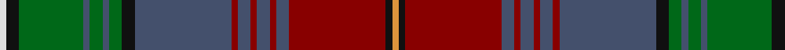

In pattern [WKGBGBGKBRBRBRBRKY](/patterns/wkgbgbgkbrbrbrbrky/).

This was sourced from register-of-tartans.  It is a [18 stripes tartan](/stripes/stripes18/).

Original link https://www.tartanregister.gov.uk/tartanDetails.aspx?ref=5580

## Attestations

This cloth appears in 2 source records; the oldest owns this page.

- 01/12/2008 — Melrose (Newbigging) (Personal) (register-of-tartans, [record](https://www.tartanregister.gov.uk/tartanDetails.aspx?ref=5580))
- pre 2008 — Melrose (Newbigging) (Personal) (tartans-authority, [record](http://www.tartansauthority.com/tartan-ferret/display/7548/))

## Thread count
LN/2 K4 G20 N2 G4 N2 G4 K4 N30 DR2 N4 DR2 N4 DR2 N4 DR30 K2 O/2

## Palette
Each colour and its ΔE from the base-6 reference it is a variant of.

| Colour | Shade | Base | ΔE (OKLab) |
|---|---|---|---|
| DR | <code style="background-color:#880000;">#880000</code> `#880000` | R <code style="background-color:#CC0000;">#CC0000</code> | 0.15 |
| G | <code style="background-color:#006818;">#006818</code> `#006818` | G <code style="background-color:#006100;">#006100</code> | 0.02 |
| K | <code style="background-color:#101010;">#101010</code> `#101010` | K <code style="background-color:#000000;">#000000</code> | 0.17 |
| LN | <code style="background-color:#E0E0E0;">#E0E0E0</code> `#E0E0E0` | W <code style="background-color:#F7F7F7;">#F7F7F7</code> | 0.07 |
| N | <code style="background-color:#44506C;">#44506C</code> `#44506C` | B <code style="background-color:#2A418A;">#2A418A</code> | 0.08 |
| O | <code style="background-color:#DC943C;">#DC943C</code> `#DC943C` | Y <code style="background-color:#F2BF00;">#F2BF00</code> | 0.12 |

## Nearest tartans

The nearest existing variants by ΔTartan distance.

1. [Strathmore (District)](/setts/s16/g3r15ga2r2ga2r2ga18gb2ga2gb2ga2gb27k2gb2k6y2x2~g289c18-ga007460-gb604000-k101010-r880000-ybc8c00/) — ΔT 1.04
1. [Empire Golf Check](/setts/s18/r2b4ba2g25ba4g2ba4k11b4w2b4g11ba2k2ba24b4ba2r2x2~b780078-ba003c64-g285800-k101010-rc80000-we0e0e0/) — ΔT 1.16
1. [Golden Glow](/setts/s17/y3k2r9k1b8k1r2k1ba8k1bb2k1ba16k1bb12k4ba2x2~b6f3940-ba4a4464-bb506b71-k101010-rd24d46-ye2af2c/) — ΔT 1.22
1. [Capercaillie Corporate Tartan Tartan Number: 6857. Earliest known date: 2005 RSPB Scotland will receive a 7% royalty on all products made from the new tartan, created in the colours of the world's largest woodland grouse, in a deal struck with the leading tartan weavers Lochcarron. See products available Copyright © Blair Urquhart, Comrie, 2015](/setts/s14/b4r3b4r2b4ba8b30k4ba4k36b4ra2k4w2~b505050-ba3c4464-k101010-r98481c-rac80000-wf8f8f8/) — ΔT 1.26
1. [State Seal of Illinois (Fashion)](/setts/s13/g4b34g4ga4b4ga4g3ga13g21ga4w3r11y3x2~b2c2c80-g006818-ga604000-r880000-we8ccb8-ybc8c00/) — ΔT 1.27
1. [Empire Golf Check (Fashion)](/setts/s18/r2b4ba2g25ba4g2ba4k11b4w2b4g11ba2k2ba24b4ba2r2x2~b780078-ba003c64-g306800-k101010-rc80000-we0e0e0/) — ΔT 1.28
1. [Wcwm 1528](/setts/s19/g3r2ra2r2b20ba3b3r8g2r2g2r2g8ra2g2ra2g2ra8y3x2~b78788c-ba00008c-g004c00-r8c0000-ra783c10-yc89800/) — ΔT 1.29
1. [Daniel Melrose Family Tartan Tartan Number: 7548. Earliest known date: 2008 Daniel Melrose says, "This Tartan is in memory of our ancestors who lived in the Newbigging and Dunsyre area for over 200 years." The tartan was designed to be woven in Ancient colours. (Corrects the 2 yellow stripes error. It should only be one yellow.) See products available Copyright © Blair Urquhart, Comrie, 2015](/setts/s18/w1k2g10b1g2b1g2k2b15r1b2r1b2r1b2r15k1y1x2~b206094-g3c7c40-k000000-r904830-wf0f0f0-yd4b844/) — ΔT 1.31
1. [Spice of Life](/setts/s20/g10k1r1k3r1k1g1r1g3r1g1ga1gb3ga1gb1y1ga3y1ga1y10x4~g21352a-ga725b49-gb463f2c-k101010-r661e08-yab9b8e/) — ΔT 1.33
1. [Scottish Spirit Fashion Tartan Tartan Number: 10970. Earliest known date: 2013 ACS Clothing. Designed by Lochcarron. Wanted 'Highland Spirit' but that was taken by Ian McLure of T J Matthews. See products available Copyright © Blair Urquhart, Comrie, 2015](/setts/s12/b10r3b32g12k5g2k4g2k17ra4k2y2x2~b484848-g747474-k101010-r88243c-ra8c708c-ya0a0a0/) — ΔT 1.35

## Neighbour map

Every grey dot is one of 15726 variants placed by the first two principal components of the ΔTartan feature space (44% of its variance). Red is this tartan; blue dots are its nearest — click one to open its page.

<svg viewBox="0 0 640 380" role="img" style="max-width:100%;height:auto;border:1px solid #e0e0e0;border-radius:4px;display:block" xmlns="http://www.w3.org/2000/svg"><image href="/nn/cloud.v1.png" width="640" height="380"/><a href="/setts/s16/g3r15ga2r2ga2r2ga18gb2ga2gb2ga2gb27k2gb2k6y2x2~g289c18-ga007460-gb604000-k101010-r880000-ybc8c00/"><circle cx="231.4" cy="118.0" r="4" fill="#3465a4"><title>Strathmore (District)</title></circle></a><a href="/setts/s18/r2b4ba2g25ba4g2ba4k11b4w2b4g11ba2k2ba24b4ba2r2x2~b780078-ba003c64-g285800-k101010-rc80000-we0e0e0/"><circle cx="183.7" cy="118.9" r="4" fill="#3465a4"><title>Empire Golf Check</title></circle></a><a href="/setts/s17/y3k2r9k1b8k1r2k1ba8k1bb2k1ba16k1bb12k4ba2x2~b6f3940-ba4a4464-bb506b71-k101010-rd24d46-ye2af2c/"><circle cx="174.5" cy="110.4" r="4" fill="#3465a4"><title>Golden Glow</title></circle></a><a href="/setts/s14/b4r3b4r2b4ba8b30k4ba4k36b4ra2k4w2~b505050-ba3c4464-k101010-r98481c-rac80000-wf8f8f8/"><circle cx="267.6" cy="110.8" r="4" fill="#3465a4"><title>Capercaillie Corporate Tartan Tartan Number: 6857. Earliest known date: 2005 RSPB Scotland will receive a 7% royalty on all products made from the new tartan, created in the colours of the world's largest woodland grouse, in a deal struck with the leading tartan weavers Lochcarron. See products available Copyright © Blair Urquhart, Comrie, 2015</title></circle></a><a href="/setts/s13/g4b34g4ga4b4ga4g3ga13g21ga4w3r11y3x2~b2c2c80-g006818-ga604000-r880000-we8ccb8-ybc8c00/"><circle cx="174.2" cy="138.7" r="4" fill="#3465a4"><title>State Seal of Illinois (Fashion)</title></circle></a><a href="/setts/s18/r2b4ba2g25ba4g2ba4k11b4w2b4g11ba2k2ba24b4ba2r2x2~b780078-ba003c64-g306800-k101010-rc80000-we0e0e0/"><circle cx="172.2" cy="113.7" r="4" fill="#3465a4"><title>Empire Golf Check (Fashion)</title></circle></a><a href="/setts/s19/g3r2ra2r2b20ba3b3r8g2r2g2r2g8ra2g2ra2g2ra8y3x2~b78788c-ba00008c-g004c00-r8c0000-ra783c10-yc89800/"><circle cx="149.3" cy="122.9" r="4" fill="#3465a4"><title>Wcwm 1528</title></circle></a><a href="/setts/s18/w1k2g10b1g2b1g2k2b15r1b2r1b2r1b2r15k1y1x2~b206094-g3c7c40-k000000-r904830-wf0f0f0-yd4b844/"><circle cx="189.7" cy="89.0" r="4" fill="#3465a4"><title>Daniel Melrose Family Tartan Tartan Number: 7548. Earliest known date: 2008 Daniel Melrose says, &quot;This Tartan is in memory of our ancestors who lived in the Newbigging and Dunsyre area for over 200 years.&quot; The tartan was designed to be woven in Ancient colours. (Corrects the 2 yellow stripes error. It should only be one yellow.) See products available Copyright © Blair Urquhart, Comrie, 2015</title></circle></a><a href="/setts/s20/g10k1r1k3r1k1g1r1g3r1g1ga1gb3ga1gb1y1ga3y1ga1y10x4~g21352a-ga725b49-gb463f2c-k101010-r661e08-yab9b8e/"><circle cx="134.2" cy="105.5" r="4" fill="#3465a4"><title>Spice of Life</title></circle></a><a href="/setts/s12/b10r3b32g12k5g2k4g2k17ra4k2y2x2~b484848-g747474-k101010-r88243c-ra8c708c-ya0a0a0/"><circle cx="257.5" cy="134.6" r="4" fill="#3465a4"><title>Scottish Spirit Fashion Tartan Tartan Number: 10970. Earliest known date: 2013 ACS Clothing. Designed by Lochcarron. Wanted 'Highland Spirit' but that was taken by Ian McLure of T J Matthews. See products available Copyright © Blair Urquhart, Comrie, 2015</title></circle></a><circle cx="224.4" cy="99.6" r="5" fill="#c00000"/></svg>

ID: /setts/s18/w1k2g10b1g2b1g2k2b15r1b2r1b2r1b2r15k1y1x2~b44506c-g006818-k101010-r880000-we0e0e0-ydc943c/
