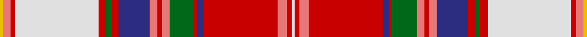

In pattern [WRRRBRGRRRBRGRWRRY](/stripes/wrrrbrgrrrbrgrwrry/).

This was sourced from tartans-authority.  It is a [18 stripe tartan](/stripes/stripes18/).

Original link http://www.tartansauthority.com/tartan-ferret/display/8847/

## Thread count
Y/4 LR10 R6 LN108 R10 G6 R10 DB40 LR10 R6 LR10 G32 R4 DB8 R96 LR12 R6 LN/4

## Palette
Each colour and the base-6 reference it is a variant of.

| Colour | Shade | Base |
|---|---|---|
| DB | <code style="background-color:#2C2C80;">#2C2C80</code> `oklch(35.0% 0.138 276.6)` <small>#2C2C80</small> | B <code style="background-color:#2A418A;">#2A418A</code> |
| G | <code style="background-color:#006818;">#006818</code> `oklch(45.0% 0.142 145.0)` <small>#006818</small> | G <code style="background-color:#006100;">#006100</code> |
| LN | <code style="background-color:#E0E0E0;">#E0E0E0</code> `oklch(90.7% 0.000 89.9)` <small>#E0E0E0</small> | W <code style="background-color:#F7F7F7;">#F7F7F7</code> |
| LR | <code style="background-color:#E87878;">#E87878</code> `oklch(70.0% 0.139 21.2)` <small>#E87878</small> | R <code style="background-color:#CC0000;">#CC0000</code> |
| R | <code style="background-color:#C80000;">#C80000</code> `oklch(52.3% 0.215 29.2)` <small>#C80000</small> | R <code style="background-color:#CC0000;">#CC0000</code> |
| Y | <code style="background-color:#E8C000;">#E8C000</code> `oklch(81.9% 0.168 93.7)` <small>#E8C000</small> | Y <code style="background-color:#F2BF00;">#F2BF00</code> |

## Nearest tartans

The nearest existing variants by ΔTartan distance.

1. [Puccini (Fashion)](/setts/s16/r6lb1r1k15r1lb2k1lo5lb25r5k1r5k1lb5k1r5~x2/) — ΔT 0.85
1. [Canadian Dental Association](/setts/s18/r8k3lb15k1w3k1lb8k1w3k1r19k2lo2k2g2k2r2k2~x2/) — ΔT 0.99
1. [Chattan, Chief of Clan](/setts/s17/w4ly12r8k8t32w4ly7r7k2r7ly7w4g32w2k4r60w2~x2/) — ΔT 1.07
1. [Chattan Chief Clan Tartan Tartan Number: 1851. Earliest known date: 1816 Also known as Finzean's fancy. The record of the Lord Lyon states, 'Note - this tartan is specifically for the Chief of Clan Chattan and his immediate family.' Logan descibed this sett (without the chiefs extra white line) thus: 'The Chief also wears a particular tartan of a very showy pattern.' It is illustrated by Smith in 1850. Chief of the Clan Mackintosh Sir Aeneas Mackintosh of that Ilk, acknowledged this sett as the Clan tartan in 1816. See products available Copyright © Blair Urquhart, Comrie, 2015](/setts/s17/w4ly12r8k8t32w4ly7r7k2r7ly7w4g32w2k4r60w2/) — ΔT 1.12
1. [MacGlashan #3](/setts/s16/r20k3w2lo25w2ly5r4k2r4ly5w3t4k5r6w1t1~x2/) — ΔT 1.17
1. [Crieff Red Dress (Dance)](/setts/s13/k2g2w2g3w33r2dp10r3g3r26g2r4r2~x2/) — ΔT 1.23
1. [Chattan, Chief](/setts/s17/w4ly12r8k8t32w4ly7r7k2r7ly7w4g32w2k8r60w2/) — ΔT 1.23
1. [Canadian Dental Association (Corp.)](/setts/s18/r8k3o15k1w3k1o8k1w3k1r19k2ly2k2g2k2r2k2~x2/) — ΔT 1.24
1. [Mehrtens (Personal)](/setts/s16/w4dt4r18o4r1o36k1o4k6r2k6r6k2r6ly4r2~x2/) — ΔT 1.26
1. [Chattan](/setts/s17/w4ly10r8k7y28w3ly6r5k2r5ly6w3g30w2k3r50w2~x2/) — ΔT 1.29

## Neighbour map

Every grey dot is one of 14299 variants placed by the first two principal components of the ΔTartan feature space (44% of its variance). Red is this tartan; blue dots are its nearest — click one to open its page.

<svg viewBox="0 0 640 380" role="img" style="max-width:100%;height:auto;border:1px solid #e0e0e0;border-radius:4px;display:block" xmlns="http://www.w3.org/2000/svg"><image href="/nn/cloud.v1.png" width="640" height="380"/><a href="/setts/s16/r6lb1r1k15r1lb2k1lo5lb25r5k1r5k1lb5k1r5~x2/"><circle cx="173.3" cy="41.6" r="4" fill="#3465a4"><title>Puccini (Fashion)</title></circle></a><a href="/setts/s18/r8k3lb15k1w3k1lb8k1w3k1r19k2lo2k2g2k2r2k2~x2/"><circle cx="154.1" cy="51.9" r="4" fill="#3465a4"><title>Canadian Dental Association</title></circle></a><a href="/setts/s17/w4ly12r8k8t32w4ly7r7k2r7ly7w4g32w2k4r60w2~x2/"><circle cx="186.5" cy="40.7" r="4" fill="#3465a4"><title>Chattan, Chief of Clan</title></circle></a><a href="/setts/s17/w4ly12r8k8t32w4ly7r7k2r7ly7w4g32w2k4r60w2/"><circle cx="191.5" cy="43.5" r="4" fill="#3465a4"><title>Chattan Chief Clan Tartan Tartan Number: 1851. Earliest known date: 1816 Also known as Finzean's fancy. The record of the Lord Lyon states, 'Note - this tartan is specifically for the Chief of Clan Chattan and his immediate family.' Logan descibed this sett (without the chiefs extra white line) thus: 'The Chief also wears a particular tartan of a very showy pattern.' It is illustrated by Smith in 1850. Chief of the Clan Mackintosh Sir Aeneas Mackintosh of that Ilk, acknowledged this sett as the Clan tartan in 1816. See products available Copyright © Blair Urquhart, Comrie, 2015</title></circle></a><a href="/setts/s16/r20k3w2lo25w2ly5r4k2r4ly5w3t4k5r6w1t1~x2/"><circle cx="175.4" cy="58.9" r="4" fill="#3465a4"><title>MacGlashan #3</title></circle></a><a href="/setts/s13/k2g2w2g3w33r2dp10r3g3r26g2r4r2~x2/"><circle cx="170.9" cy="54.0" r="4" fill="#3465a4"><title>Crieff Red Dress (Dance)</title></circle></a><a href="/setts/s17/w4ly12r8k8t32w4ly7r7k2r7ly7w4g32w2k8r60w2/"><circle cx="171.9" cy="40.5" r="4" fill="#3465a4"><title>Chattan, Chief</title></circle></a><a href="/setts/s18/r8k3o15k1w3k1o8k1w3k1r19k2ly2k2g2k2r2k2~x2/"><circle cx="172.4" cy="64.2" r="4" fill="#3465a4"><title>Canadian Dental Association (Corp.)</title></circle></a><a href="/setts/s16/w4dt4r18o4r1o36k1o4k6r2k6r6k2r6ly4r2~x2/"><circle cx="234.9" cy="45.4" r="4" fill="#3465a4"><title>Mehrtens (Personal)</title></circle></a><a href="/setts/s17/w4ly10r8k7y28w3ly6r5k2r5ly6w3g30w2k3r50w2~x2/"><circle cx="170.4" cy="47.1" r="4" fill="#3465a4"><title>Chattan</title></circle></a><circle cx="177.9" cy="28.3" r="5" fill="#c00000"/></svg>

ID: /setts/s18/w2r3r6r48db4r2g16r5r3r5db20r5g3r5w54r3r5ly2~x2/
