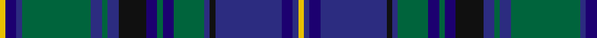

In pattern [YBBBKBGBGBKBGBGBBY](/patterns/ybbbkbgbgbkbgbgbby/).

This was sourced from register-of-tartans.  It is a [18 stripes tartan](/stripes/stripes18/).

Original link https://www.tartanregister.gov.uk/tartanDetails.aspx?ref=2241

## Register references

External register numbers recorded for this tartan.

- Scottish Register of Tartans: [2241](https://www.tartanregister.gov.uk/tartanDetails.aspx?ref=2241)
- Scottish Tartans Authority (ITI): 4041

## Thread count
Y/4 DB8 DBa4 G50 DBa8 G4 DBa8 K20 DB8 G4 DB8 G22 DBa4 K4 DBa48 DB8 DBa4 Y/4

## Palette
Each colour and its ΔE from the base-6 reference it is a variant of.

| Colour | Shade | Base | ΔE (OKLab) |
|---|---|---|---|
| DB | <code style="background-color:#1C0070;">#1C0070</code> `#1C0070` | B <code style="background-color:#2A418A;">#2A418A</code> | 0.14 |
| DBa | <code style="background-color:#2C2C80;">#2C2C80</code> `#2C2C80` | B <code style="background-color:#2A418A;">#2A418A</code> | 0.06 |
| G | <code style="background-color:#00643C;">#00643C</code> `#00643C` | G <code style="background-color:#006100;">#006100</code> | 0.05 |
| K | <code style="background-color:#101010;">#101010</code> `#101010` | K <code style="background-color:#000000;">#000000</code> | 0.17 |
| Y | <code style="background-color:#E8C000;">#E8C000</code> `#E8C000` | Y <code style="background-color:#F2BF00;">#F2BF00</code> | 0.02 |

## Nearest tartans

The nearest existing variants by ΔTartan distance.

1. [Scottish Rugby Union](/setts/s20/b6k2b24k10g2r2g2r2g10k2w3k2g10r2g2r2g2k10b24k2~b2c2c80-g006818-k101010-r9c68a4-wc0c0c0~x2/) — ΔT 0.96
1. [Herriot (Personal)](/setts/s16/r2b1r1b12k1b1k1b1k5g1k1g1k1g5k2y1~b2c2c80-g006818-k101010-r9c68a4-ye8c000~x4/) — ΔT 0.97
1. [Frangord](/setts/s17/g14b2r2b2g22ba2b16ba2bb20g5r2g5bb20ba2b16ba2g8~b2c2c80-ba2888c4-bb202060-g285800-re87878~x2/) — ΔT 1.02
1. [Hope-Vere/Weir (Modern)](/setts/s16/g19k1ga3k1g3k9b20k1y1k7y1k1b21k12g2ga1~b2c4084-g006428-ga005020-k101010-ye8c000~x2/) — ΔT 1.06
1. [O'Connor / Ochiltree](/setts/s19/b12k1g2k1g2k1b12r2k12ka1k12r2g12k1b2k1b2k1g12~b1c0070-g006818-k101010-ka000000-r880000~x4/) — ΔT 1.07
1. [Ochiltree (Name)](/setts/s19/b12k1g2k1g2k1b12r2k12y1k12r2g12k1b2k1b2k1g12~b1c0070-g006818-k101010-r880000-yfccc00~x4/) — ΔT 1.13
1. [Brown Ellis (Personal)](/setts/s12/k2b11k1b2k1b11k2ba14k2g14k1r2~b1474b4-ba2c2c80-g006818-k101010-rc80000~x2/) — ΔT 1.13
1. [Ochiltree Family Tartan Tartan Number: 321. Earliest known date: 1988 O'Sullivan McCragh was designed by Chris Aitken for Geoffrey (Tailor) Highland Crafts Ltd. in June 1994. See products available Copyright © Blair Urquhart, Comrie, 2015](/setts/s19/b12k1g2k1g2k1b12r2k12y1k12r2g12k1b2k1b2k1g12~b2c2c80-g006818-k101010-rc80000-ye8c000~x2/) — ΔT 1.14
1. [O'Connor, Hugh (Personal)](/setts/s19/b12ba1g2ba1g2ba1b12ga2ba12y1ba12ga2g12ba1b2ba1b2ba1g12~b000048-ba440044-g003c14-ga289c18-yfccc00~x2/) — ΔT 1.15
1. [Duchess of Albany](/setts/s27/r2b24k16g3k2g2k2g12k2g2k2g3b8g2b8g3k2g2k2g12k2g2k2g3k16b22y2~b2c2c80-g006818-k101010-rc80000-yd09800~x2/) — ΔT 1.15

## Neighbour map

Every grey dot is one of 15726 variants placed by the first two principal components of the ΔTartan feature space (44% of its variance). Red is this tartan; blue dots are its nearest — click one to open its page.

<svg viewBox="0 0 640 380" role="img" style="max-width:100%;height:auto;border:1px solid #e0e0e0;border-radius:4px;display:block" xmlns="http://www.w3.org/2000/svg"><image href="/nn/cloud.v1.png" width="640" height="380"/><a href="/setts/s20/b6k2b24k10g2r2g2r2g10k2w3k2g10r2g2r2g2k10b24k2~b2c2c80-g006818-k101010-r9c68a4-wc0c0c0~x2/"><circle cx="227.3" cy="130.2" r="4" fill="#3465a4"><title>Scottish Rugby Union</title></circle></a><a href="/setts/s16/r2b1r1b12k1b1k1b1k5g1k1g1k1g5k2y1~b2c2c80-g006818-k101010-r9c68a4-ye8c000~x4/"><circle cx="214.1" cy="130.1" r="4" fill="#3465a4"><title>Herriot (Personal)</title></circle></a><a href="/setts/s17/g14b2r2b2g22ba2b16ba2bb20g5r2g5bb20ba2b16ba2g8~b2c2c80-ba2888c4-bb202060-g285800-re87878~x2/"><circle cx="211.6" cy="167.2" r="4" fill="#3465a4"><title>Frangord</title></circle></a><a href="/setts/s16/g19k1ga3k1g3k9b20k1y1k7y1k1b21k12g2ga1~b2c4084-g006428-ga005020-k101010-ye8c000~x2/"><circle cx="252.2" cy="127.9" r="4" fill="#3465a4"><title>Hope-Vere/Weir (Modern)</title></circle></a><a href="/setts/s19/b12k1g2k1g2k1b12r2k12ka1k12r2g12k1b2k1b2k1g12~b1c0070-g006818-k101010-ka000000-r880000~x4/"><circle cx="187.8" cy="143.3" r="4" fill="#3465a4"><title>O'Connor / Ochiltree</title></circle></a><a href="/setts/s19/b12k1g2k1g2k1b12r2k12y1k12r2g12k1b2k1b2k1g12~b1c0070-g006818-k101010-r880000-yfccc00~x4/"><circle cx="181.0" cy="140.1" r="4" fill="#3465a4"><title>Ochiltree (Name)</title></circle></a><a href="/setts/s12/k2b11k1b2k1b11k2ba14k2g14k1r2~b1474b4-ba2c2c80-g006818-k101010-rc80000~x2/"><circle cx="197.4" cy="154.1" r="4" fill="#3465a4"><title>Brown Ellis (Personal)</title></circle></a><a href="/setts/s19/b12k1g2k1g2k1b12r2k12y1k12r2g12k1b2k1b2k1g12~b2c2c80-g006818-k101010-rc80000-ye8c000~x2/"><circle cx="181.0" cy="138.1" r="4" fill="#3465a4"><title>Ochiltree Family Tartan Tartan Number: 321. Earliest known date: 1988 O'Sullivan McCragh was designed by Chris Aitken for Geoffrey (Tailor) Highland Crafts Ltd. in June 1994. See products available Copyright © Blair Urquhart, Comrie, 2015</title></circle></a><a href="/setts/s19/b12ba1g2ba1g2ba1b12ga2ba12y1ba12ga2g12ba1b2ba1b2ba1g12~b000048-ba440044-g003c14-ga289c18-yfccc00~x2/"><circle cx="207.5" cy="149.6" r="4" fill="#3465a4"><title>O'Connor, Hugh (Personal)</title></circle></a><a href="/setts/s27/r2b24k16g3k2g2k2g12k2g2k2g3b8g2b8g3k2g2k2g12k2g2k2g3k16b22y2~b2c2c80-g006818-k101010-rc80000-yd09800~x2/"><circle cx="214.1" cy="124.3" r="4" fill="#3465a4"><title>Duchess of Albany</title></circle></a><circle cx="205.6" cy="136.3" r="5" fill="#c00000"/></svg>

ID: /setts/s18/y2b4ba2g25ba4g2ba4k10b4g2b4g11ba2k2ba24b4ba2y2~b1c0070-ba2c2c80-g00643c-k101010-ye8c000~x2/
