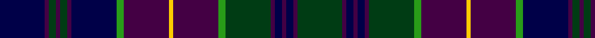

In pattern [BBGBGBBGBYBGGBBBBBG](/patterns/bbgbgbbgbybggbbbbbg/).

This was sourced from register-of-tartans.  It is a [19 stripes tartan](/stripes/stripes19/).

Original link https://www.tartanregister.gov.uk/tartanDetails.aspx?ref=11339

## Thread count
DB/24 DP2 DG4 DP2 DG4 DP2 DB24 G4 DP24 Y2 DP24 G4 DG24 DP2 DB4 DP2 DB4 DP2 DG/24

## Palette
Each colour and its ΔE from the base-6 reference it is a variant of.

| Colour | Shade | Base | ΔE (OKLab) |
|---|---|---|---|
| DB | <code style="background-color:#000048;">#000048</code> `#000048` | B <code style="background-color:#2A418A;">#2A418A</code> | 0.22 |
| DG | <code style="background-color:#003C14;">#003C14</code> `#003C14` | G <code style="background-color:#006100;">#006100</code> | 0.13 |
| DP | <code style="background-color:#440044;">#440044</code> `#440044` | B <code style="background-color:#2A418A;">#2A418A</code> | 0.18 |
| G | <code style="background-color:#289C18;">#289C18</code> `#289C18` | G <code style="background-color:#006100;">#006100</code> | 0.19 |
| Y | <code style="background-color:#FCCC00;">#FCCC00</code> `#FCCC00` | Y <code style="background-color:#F2BF00;">#F2BF00</code> | 0.04 |

## Nearest tartans

The nearest existing variants by ΔTartan distance.

1. [O'Connor / Ochiltree](/setts/s19/b12k1g2k1g2k1b12r2k12ka1k12r2g12k1b2k1b2k1g12x4~b1c0070-g006818-k101010-ka000000-r880000/) — ΔT 0.95
1. [Stephenson Htg (Name)](/setts/s15/g2k1b9k9g9k1w1k2w1k1g9k9b9k1r2x4~b2c2c80-g003820-k101010-rc80000-wfcfcfc/) — ΔT 1.02
1. [Polaris Corporate Tartan Tartan Number: 222. Earliest known date: 1964 Designed for the Officers and men of the American Submarine base at the Holy Loch - making the Polaris submarine the first ship in history to have its own tartan. The idea came from Captain Walter F Schlech, Commander of the submarine squadron. The arrangement of stripes between the cornflower yellows is blue-sky-blue (Dalgliesh). It was previously recorded as green-blue-green (STS). The sindex card created by Davidson c1964 is Black-Royal Blue-Black. The sky blue version was recently confirmed as the correct one by R. E. Trygstad, LCDR USN (Retired), who has in his possession an original scarf with the sky blue colours. See products available Copyright © Blair Urquhart, Comrie, 2015](/setts/s17/b6k1b1k1b1k7g6y1b1w1b1y1g6k7b7k1b1x4~b202060-g005028-k101010-w8ca0f0-ye0b000/) — ΔT 1.09
1. [KPMG](/setts/s18/r12y2b3k3b30k20ba6k10y2ba4y2k10ba6k20b30k3b3y2x2~b2c2c80-ba680028-k101010-rc80000-ya08858/) — ΔT 1.09
1. [Ochiltree (Name)](/setts/s19/b12k1g2k1g2k1b12r2k12y1k12r2g12k1b2k1b2k1g12x4~b1c0070-g006818-k101010-r880000-yfccc00/) — ΔT 1.13
1. [LS Curling](/setts/s18/y2b4ba2g25ba4g2ba4k10b4g2b4g11ba2k2ba24b4ba2y2x2~b1c0070-ba2c2c80-g00643c-k101010-ye8c000/) — ΔT 1.15
1. [Van Ingelgem (Personal)](/setts/s18/y3k18ka3k3ka3k3ka18b3k3b3k3b12w2b12k9b12k2w2x2~b3c505c-k101010-ka000040-we0e0e0-yb09400/) — ΔT 1.20
1. [Cumbernauld District Tartan Tartan Number: 1566. Earliest known date: 1987 The Cumbernauld tartan is the same as the MacKenzie, except for a change in the colour scheme. Ancient green was incorporated with modern blue, black and red to represent a new thriving community, proud of its heritage. Cumbernauld is one of Scotlands new towns. See products available Copyright © Blair Urquhart, Comrie, 2015](/setts/s15/b17k3b3k3b3k17g17k2w3k2g17k17b17k2r3x2~b202060-g00643c-k101010-rc80000-we0e0e0/) — ΔT 1.23
1. [Frangord](/setts/s17/g14b2r2b2g22ba2b16ba2bb20g5r2g5bb20ba2b16ba2g8x2~b2c2c80-ba2888c4-bb202060-g285800-re87878/) — ΔT 1.25
1. [Ochiltree Family Tartan Tartan Number: 321. Earliest known date: 1988 O'Sullivan McCragh was designed by Chris Aitken for Geoffrey (Tailor) Highland Crafts Ltd. in June 1994. See products available Copyright © Blair Urquhart, Comrie, 2015](/setts/s19/b12k1g2k1g2k1b12r2k12y1k12r2g12k1b2k1b2k1g12x2~b2c2c80-g006818-k101010-rc80000-ye8c000/) — ΔT 1.28

## Neighbour map

Every grey dot is one of 15726 variants placed by the first two principal components of the ΔTartan feature space (44% of its variance). Red is this tartan; blue dots are its nearest — click one to open its page.

<svg viewBox="0 0 640 380" role="img" style="max-width:100%;height:auto;border:1px solid #e0e0e0;border-radius:4px;display:block" xmlns="http://www.w3.org/2000/svg"><image href="/nn/cloud.v1.png" width="640" height="380"/><a href="/setts/s19/b12k1g2k1g2k1b12r2k12ka1k12r2g12k1b2k1b2k1g12x4~b1c0070-g006818-k101010-ka000000-r880000/"><circle cx="187.8" cy="143.3" r="4" fill="#3465a4"><title>O'Connor / Ochiltree</title></circle></a><a href="/setts/s15/g2k1b9k9g9k1w1k2w1k1g9k9b9k1r2x4~b2c2c80-g003820-k101010-rc80000-wfcfcfc/"><circle cx="187.4" cy="178.3" r="4" fill="#3465a4"><title>Stephenson Htg (Name)</title></circle></a><a href="/setts/s17/b6k1b1k1b1k7g6y1b1w1b1y1g6k7b7k1b1x4~b202060-g005028-k101010-w8ca0f0-ye0b000/"><circle cx="183.5" cy="180.6" r="4" fill="#3465a4"><title>Polaris Corporate Tartan Tartan Number: 222. Earliest known date: 1964 Designed for the Officers and men of the American Submarine base at the Holy Loch - making the Polaris submarine the first ship in history to have its own tartan. The idea came from Captain Walter F Schlech, Commander of the submarine squadron. The arrangement of stripes between the cornflower yellows is blue-sky-blue (Dalgliesh). It was previously recorded as green-blue-green (STS). The sindex card created by Davidson c1964 is Black-Royal Blue-Black. The sky blue version was recently confirmed as the correct one by R. E. Trygstad, LCDR USN (Retired), who has in his possession an original scarf with the sky blue colours. See products available Copyright © Blair Urquhart, Comrie, 2015</title></circle></a><a href="/setts/s18/r12y2b3k3b30k20ba6k10y2ba4y2k10ba6k20b30k3b3y2x2~b2c2c80-ba680028-k101010-rc80000-ya08858/"><circle cx="237.3" cy="139.1" r="4" fill="#3465a4"><title>KPMG</title></circle></a><a href="/setts/s19/b12k1g2k1g2k1b12r2k12y1k12r2g12k1b2k1b2k1g12x4~b1c0070-g006818-k101010-r880000-yfccc00/"><circle cx="181.0" cy="140.1" r="4" fill="#3465a4"><title>Ochiltree (Name)</title></circle></a><a href="/setts/s18/y2b4ba2g25ba4g2ba4k10b4g2b4g11ba2k2ba24b4ba2y2x2~b1c0070-ba2c2c80-g00643c-k101010-ye8c000/"><circle cx="205.6" cy="136.3" r="4" fill="#3465a4"><title>LS Curling</title></circle></a><a href="/setts/s18/y3k18ka3k3ka3k3ka18b3k3b3k3b12w2b12k9b12k2w2x2~b3c505c-k101010-ka000040-we0e0e0-yb09400/"><circle cx="175.8" cy="164.7" r="4" fill="#3465a4"><title>Van Ingelgem (Personal)</title></circle></a><a href="/setts/s15/b17k3b3k3b3k17g17k2w3k2g17k17b17k2r3x2~b202060-g00643c-k101010-rc80000-we0e0e0/"><circle cx="183.8" cy="180.8" r="4" fill="#3465a4"><title>Cumbernauld District Tartan Tartan Number: 1566. Earliest known date: 1987 The Cumbernauld tartan is the same as the MacKenzie, except for a change in the colour scheme. Ancient green was incorporated with modern blue, black and red to represent a new thriving community, proud of its heritage. Cumbernauld is one of Scotlands new towns. See products available Copyright © Blair Urquhart, Comrie, 2015</title></circle></a><a href="/setts/s17/g14b2r2b2g22ba2b16ba2bb20g5r2g5bb20ba2b16ba2g8x2~b2c2c80-ba2888c4-bb202060-g285800-re87878/"><circle cx="211.6" cy="167.2" r="4" fill="#3465a4"><title>Frangord</title></circle></a><a href="/setts/s19/b12k1g2k1g2k1b12r2k12y1k12r2g12k1b2k1b2k1g12x2~b2c2c80-g006818-k101010-rc80000-ye8c000/"><circle cx="181.0" cy="138.1" r="4" fill="#3465a4"><title>Ochiltree Family Tartan Tartan Number: 321. Earliest known date: 1988 O'Sullivan McCragh was designed by Chris Aitken for Geoffrey (Tailor) Highland Crafts Ltd. in June 1994. See products available Copyright © Blair Urquhart, Comrie, 2015</title></circle></a><circle cx="207.5" cy="149.6" r="5" fill="#c00000"/></svg>

ID: /setts/s19/b12ba1g2ba1g2ba1b12ga2ba12y1ba12ga2g12ba1b2ba1b2ba1g12x2~b000048-ba440044-g003c14-ga289c18-yfccc00/
