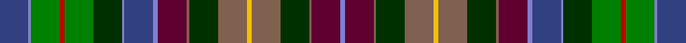

This page is one **sett** — a single exact thread-count. It belongs to the [tartan](/tartans/ba12b1g12r2g12dg12b1ba12b2dr12lt1dg12lt12y2lt12dg12lt1dr12b2/)
(the same proportion at any scale), whose colour order is pattern [BBGRGGBBBBRGRYRGRBB](/stripes/bbgrggbbbbrgryrgrbb/).

Sourced from weddslist.  It is a [19 stripe tartan](/stripes/stripes19/).

Original link http://www.weddslist.com/cgi-bin/tartans/pg.pl?source=sts

## Thread count
Ba/24 B2 G24 R4 G24 DG24 B2 Ba24 B4 DR24 LT2 DG24 LT24 Y4 LT24 DG24 LT2 DR24 B/4

## Palette
Each colour and the base-6 reference it is a variant of.

| Colour | Shade | Base |
|---|---|---|
| B | <code style="background-color:#8080D0;">#8080D0</code> `oklch(63.4% 0.119 282.5)` <small>#8080D0</small> | B <code style="background-color:#2A418A;">#2A418A</code> |
| Ba | <code style="background-color:#304080;">#304080</code> `oklch(39.4% 0.109 270.2)` <small>#304080</small> | B <code style="background-color:#2A418A;">#2A418A</code> |
| DG | <code style="background-color:#003000;">#003000</code> `oklch(26.8% 0.091 142.5)` <small>#003000</small> | G <code style="background-color:#006100;">#006100</code> |
| DR | <code style="background-color:#600030;">#600030</code> `oklch(31.7% 0.129 359.5)` <small>#600030</small> | B <code style="background-color:#2A418A;">#2A418A</code> |
| G | <code style="background-color:#008000;">#008000</code> `oklch(52.0% 0.177 142.5)` <small>#008000</small> | G <code style="background-color:#006100;">#006100</code> |
| LT | <code style="background-color:#806050;">#806050</code> `oklch(51.7% 0.049 47.8)` <small>#806050</small> | R <code style="background-color:#CC0000;">#CC0000</code> |
| R | <code style="background-color:#C00000;">#C00000</code> `oklch(50.7% 0.208 29.2)` <small>#C00000</small> | R <code style="background-color:#CC0000;">#CC0000</code> |
| Y | <code style="background-color:#F0C000;">#F0C000</code> `oklch(82.7% 0.169 90.5)` <small>#F0C000</small> | Y <code style="background-color:#F2BF00;">#F2BF00</code> |

## Nearest tartans

The nearest existing variants by ΔTartan distance, with this tartan at the top so the swatches line up against it.

ΔTartan

Tartan

Sett

—

<a href="/ttd/edit/#slug=db12b1g12r2g12dg12b1db12b2dr12o1dg12o12ly2o12dg12o1dr12b2~x2">United Distillers, (Warp)</a> <a class="nn-out" href="/setts/s19/db12b1g12r2g12dg12b1db12b2dr12o1dg12o12ly2o12dg12o1dr12b2~x2/" title="open its dictionary page">↗</a>

1.42

<a href="/setts/s20/db10k2g2r2g2k2do2k2dy4k1y2~x4/">Highfield Hunting</a>

1.61

<a href="/ttd/edit/#slug=dy16k4dy8g2dg19w2g22db15k4w3dg3ly4g30db25w5dg40db16~x2">Les Cercles de Fermieres du Quebec</a> <a class="nn-out" href="/setts/s17/dy16k4dy8g2dg19w2g22db15k4w3dg3ly4g30db25w5dg40db16~x2/" title="open its dictionary page">↗</a>

1.65

<a href="/ttd/edit/#slug=k4dg10lo4dg10k4g20dg5k2dy6k2r10k2w4~x2">Donegal County, Crest Range</a> <a class="nn-out" href="/setts/s13/k4dg10lo4dg10k4g20dg5k2dy6k2r10k2w4~x2/" title="open its dictionary page">↗</a>

1.65

<a href="/ttd/edit/#slug=k12g16lb2do12g2y10k4y8o27k30lb6o27g20lo4k2lb4k4~x2">Le Cercle des Femmes (Corporate)</a> <a class="nn-out" href="/setts/s17/k12g16lb2do12g2y10k4y8o27k30lb6o27g20lo4k2lb4k4~x2/" title="open its dictionary page">↗</a>

1.68

<a href="/setts/s16/db20y1w1lo3y4g10n4y1dp4~x2/">St. Columba (two greens)</a>

1.78

<a href="/ttd/edit/#slug=n16lr2dr7lr2k14b6lr2n15lr2dg17b6dg6r8k6r8k2~x2">Huntly Old</a> <a class="nn-out" href="/setts/s16/n16lr2dr7lr2k14b6lr2n15lr2dg17b6dg6r8k6r8k2~x2/" title="open its dictionary page">↗</a>

1.78

<a href="/ttd/edit/#slug=n16lr2dr7lr2k14b6lr2n15lr2dg17b6dg6r8k6r8k2">Huntly Old</a> <a class="nn-out" href="/setts/s16/n16lr2dr7lr2k14b6lr2n15lr2dg17b6dg6r8k6r8k2/" title="open its dictionary page">↗</a>

1.81

<a href="/ttd/edit/#slug=db8r4db6r10db24dg12o4dg4k4db18r10db4r6lr3">Hyndman (Omagh)</a> <a class="nn-out" href="/setts/s14/db8r4db6r10db24dg12o4dg4k4db18r10db4r6lr3/" title="open its dictionary page">↗</a>

1.85

<a href="/ttd/edit/#slug=dg18w2db16w2t6k16w2r8w2db9r9k6r9dg6t6~x2">Gordon Red</a> <a class="nn-out" href="/setts/s15/dg18w2db16w2t6k16w2r8w2db9r9k6r9dg6t6~x2/" title="open its dictionary page">↗</a>

1.86

<a href="/setts/s14/r4ly3g12k16dy5db20k4w2~x2/">Iowa</a>

## Neighbour map

Every grey dot is one of 14299 variants placed by the first two principal components of the ΔTartan feature space (44% of its variance). Red is this tartan; blue dots are its nearest — click one to open its page.

<svg viewBox="0 0 640 380" role="img" style="max-width:100%;height:auto;border:1px solid #e0e0e0;border-radius:4px;display:block" xmlns="http://www.w3.org/2000/svg"><image href="/nn/cloud.v1.png" width="640" height="380"/><a href="/setts/s20/db10k2g2r2g2k2do2k2dy4k1y2~x4/"><circle cx="87.2" cy="147.1" r="4" fill="#3465a4"><title>Highfield Hunting</title></circle></a><a href="/setts/s17/dy16k4dy8g2dg19w2g22db15k4w3dg3ly4g30db25w5dg40db16~x2/"><circle cx="117.2" cy="113.7" r="4" fill="#3465a4"><title>Les Cercles de Fermieres du Quebec</title></circle></a><a href="/setts/s13/k4dg10lo4dg10k4g20dg5k2dy6k2r10k2w4~x2/"><circle cx="71.9" cy="142.7" r="4" fill="#3465a4"><title>Donegal County, Crest Range</title></circle></a><a href="/setts/s17/k12g16lb2do12g2y10k4y8o27k30lb6o27g20lo4k2lb4k4~x2/"><circle cx="73.9" cy="103.6" r="4" fill="#3465a4"><title>Le Cercle des Femmes (Corporate)</title></circle></a><a href="/setts/s16/db20y1w1lo3y4g10n4y1dp4~x2/"><circle cx="101.7" cy="77.5" r="4" fill="#3465a4"><title>St. Columba (two greens)</title></circle></a><a href="/setts/s16/n16lr2dr7lr2k14b6lr2n15lr2dg17b6dg6r8k6r8k2~x2/"><circle cx="25.2" cy="136.0" r="4" fill="#3465a4"><title>Huntly Old</title></circle></a><a href="/setts/s16/n16lr2dr7lr2k14b6lr2n15lr2dg17b6dg6r8k6r8k2/"><circle cx="25.2" cy="136.0" r="4" fill="#3465a4"><title>Huntly Old</title></circle></a><a href="/setts/s14/db8r4db6r10db24dg12o4dg4k4db18r10db4r6lr3/"><circle cx="59.4" cy="139.6" r="4" fill="#3465a4"><title>Hyndman (Omagh)</title></circle></a><a href="/setts/s15/dg18w2db16w2t6k16w2r8w2db9r9k6r9dg6t6~x2/"><circle cx="14.0" cy="136.3" r="4" fill="#3465a4"><title>Gordon Red</title></circle></a><a href="/setts/s14/r4ly3g12k16dy5db20k4w2~x2/"><circle cx="84.5" cy="144.9" r="4" fill="#3465a4"><title>Iowa</title></circle></a><circle cx="43.7" cy="121.7" r="5" fill="#c00000"/></svg>

ID: /setts/s19/db12b1g12r2g12dg12b1db12b2dr12o1dg12o12ly2o12dg12o1dr12b2~x2/
