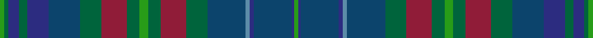

In pattern [GBBBBBGRGGGRGBBGBGG](/stripes/gbbbbbgrgggrgbbgbgg/).

This was sourced from house-of-tartan.  It is a [19 stripe tartan](/stripes/stripes19/).

Original link http://www.house-of-tartan.scotland.net/house/TartanViewjs.asp?colr=Def&tnam=6169

## Thread count
G/2 Ga2 DBa5 Ga4 DBa10 DB15 Ga10 DR12 Ga6 G4 Ga6 DR12 Ga10 DB18 B2 DBa2 DB18 DBa1 G/2

## Palette
Each colour and the base-6 reference it is a variant of.

| Colour | Shade | Base |
|---|---|---|
| B | <code style="background-color:#5C8CA8;">#5C8CA8</code> `oklch(61.7% 0.067 235.0)` <small>#5C8CA8</small> | B <code style="background-color:#2A418A;">#2A418A</code> |
| DB | <code style="background-color:#0C446C;">#0C446C</code> `oklch(37.4% 0.088 245.7)` <small>#0C446C</small> | B <code style="background-color:#2A418A;">#2A418A</code> |
| DBa | <code style="background-color:#2C2C80;">#2C2C80</code> `oklch(35.0% 0.138 276.6)` <small>#2C2C80</small> | B <code style="background-color:#2A418A;">#2A418A</code> |
| DR | <code style="background-color:#901C38;">#901C38</code> `oklch(43.2% 0.150 13.1)` <small>#901C38</small> | R <code style="background-color:#CC0000;">#CC0000</code> |
| G | <code style="background-color:#289C18;">#289C18</code> `oklch(60.6% 0.191 141.6)` <small>#289C18</small> | G <code style="background-color:#006100;">#006100</code> |
| Ga | <code style="background-color:#00643C;">#00643C</code> `oklch(44.3% 0.104 157.7)` <small>#00643C</small> | G <code style="background-color:#006100;">#006100</code> |

## Nearest tartans

The nearest existing variants by ΔTartan distance.

1. [Glaz](/setts/s18/r2ly1y7t1y4t2y3t3y1t15lr1t4dt2t2dt4t1dt9lr2~x2/) — ΔT 1.34
1. [Glaz (Fashion)](/setts/s18/n2dt9db1dt4db2dt2db4n1db15g1db3g3db2g4db1g7ly1r2~x2/) — ΔT 1.36
1. [Renton (Personal)](/setts/s18/o8dy2o8k4r3k4dy8k2dy8k4dt21n8k2dy3k2n8dt24k3~x2/) — ΔT 1.44
1. [Penman](/setts/s14/o22b12g12ly2b4ly2g12b12o12k1r6k2g10b10~x2/) — ΔT 1.45
1. [Copar a'Beannichte Family Tartan Tartan Number: 6483. Earliest known date: 2004 The name of the tartan is constructed in Gaelic from the Dutch van Koperen and the French Benoist to mean the Blessed Copper, a tribute to Mrs Y Ch van Koperen-Benoist. The green represents oxidised copper of the Koperens and blue the Benoist family. See products available Copyright © Blair Urquhart, Comrie, 2015](/setts/s16/g20g6dg15dt5dg2dt15o4dt10r2~x2/) — ΔT 1.45
1. [Balmaha](/setts/s14/dy3ly3dy12ly1k1db12k1db12k1dg12k1dy12t3db2~x2/) — ΔT 1.46
1. [Buchanan Hunting (Mackinlay strip)](/setts/s18/dg24k2t6k2m12w1m12k2t6k2dy12k2dy12k2t6k2dg12t6~x2/) — ΔT 1.56
1. [Isle of Skye](/setts/s20/dy20dp2dy2dp2dy3dp8dg9g8y8dg1lb2~x2/) — ΔT 1.56
1. [Greg Wells (Personal)](/setts/s13/dg12k1r2k1dg12y2k12ly1k12y2dt12k3dt12~x2/) — ΔT 1.58
1. [Wacker](/setts/s20/db6k3db3dt13g13k1g13dt13w1db3k3~x2/) — ΔT 1.59

## Neighbour map

Every grey dot is one of 14299 variants placed by the first two principal components of the ΔTartan feature space (44% of its variance). Red is this tartan; blue dots are its nearest — click one to open its page.

<svg viewBox="0 0 640 380" role="img" style="max-width:100%;height:auto;border:1px solid #e0e0e0;border-radius:4px;display:block" xmlns="http://www.w3.org/2000/svg"><image href="/nn/cloud.v1.png" width="640" height="380"/><a href="/setts/s18/r2ly1y7t1y4t2y3t3y1t15lr1t4dt2t2dt4t1dt9lr2~x2/"><circle cx="261.3" cy="152.0" r="4" fill="#3465a4"><title>Glaz</title></circle></a><a href="/setts/s18/n2dt9db1dt4db2dt2db4n1db15g1db3g3db2g4db1g7ly1r2~x2/"><circle cx="251.8" cy="152.5" r="4" fill="#3465a4"><title>Glaz (Fashion)</title></circle></a><a href="/setts/s18/o8dy2o8k4r3k4dy8k2dy8k4dt21n8k2dy3k2n8dt24k3~x2/"><circle cx="221.7" cy="176.7" r="4" fill="#3465a4"><title>Renton (Personal)</title></circle></a><a href="/setts/s14/o22b12g12ly2b4ly2g12b12o12k1r6k2g10b10~x2/"><circle cx="181.5" cy="161.2" r="4" fill="#3465a4"><title>Penman</title></circle></a><a href="/setts/s16/g20g6dg15dt5dg2dt15o4dt10r2~x2/"><circle cx="209.5" cy="202.2" r="4" fill="#3465a4"><title>Copar a'Beannichte Family Tartan Tartan Number: 6483. Earliest known date: 2004 The name of the tartan is constructed in Gaelic from the Dutch van Koperen and the French Benoist to mean the Blessed Copper, a tribute to Mrs Y Ch van Koperen-Benoist. The green represents oxidised copper of the Koperens and blue the Benoist family. See products available Copyright © Blair Urquhart, Comrie, 2015</title></circle></a><a href="/setts/s14/dy3ly3dy12ly1k1db12k1db12k1dg12k1dy12t3db2~x2/"><circle cx="192.2" cy="162.2" r="4" fill="#3465a4"><title>Balmaha</title></circle></a><a href="/setts/s18/dg24k2t6k2m12w1m12k2t6k2dy12k2dy12k2t6k2dg12t6~x2/"><circle cx="164.5" cy="126.6" r="4" fill="#3465a4"><title>Buchanan Hunting (Mackinlay strip)</title></circle></a><a href="/setts/s20/dy20dp2dy2dp2dy3dp8dg9g8y8dg1lb2~x2/"><circle cx="164.6" cy="136.8" r="4" fill="#3465a4"><title>Isle of Skye</title></circle></a><a href="/setts/s13/dg12k1r2k1dg12y2k12ly1k12y2dt12k3dt12~x2/"><circle cx="194.7" cy="182.0" r="4" fill="#3465a4"><title>Greg Wells (Personal)</title></circle></a><a href="/setts/s20/db6k3db3dt13g13k1g13dt13w1db3k3~x2/"><circle cx="224.4" cy="184.2" r="4" fill="#3465a4"><title>Wacker</title></circle></a><circle cx="201.5" cy="163.0" r="5" fill="#c00000"/></svg>

ID: /setts/s19/g2g2db5g4db10dt15g10r12g6g4g6r12g10dt18t2db2dt18db1g2/
