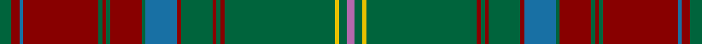

**Bands:** [RGYGRGRGRBGRGRGRBRG](/stripes/rgygrgrgrbgrgrgrbrg/) · **Stripes:** [M G LY G R G R G R B G R G R G R B R G](/stripes/stripes19/) M G LY G R G R G R B G R G R G R B R G

This was sourced from register-of-tartans.  It is a [19 band tartan](/bands/bands19/).

Original link https://www.tartanregister.gov.uk/tartanDetails.aspx?ref=349

## Attestations

This cloth appears in 2 source records; the oldest owns this page.

- 01/01/2006 — Brewer (register-of-tartans, [record](https://www.tartanregister.gov.uk/tartanDetails.aspx?ref=349))
- 2006, January — Brewer (Name) (tartans-authority, [record](http://www.tartansauthority.com/tartan-ferret/display/6833/))

## Register references

External register numbers recorded for this tartan.

- Scottish Register of Tartans: [349](https://www.tartanregister.gov.uk/tartanDetails.aspx?ref=349)
- Scottish Tartans Authority (ITI): 6833

## Thread count
G/6 DRa4 B2 DRa38 G2 DRa2 G2 DRa16 G2 B16 DRa2 G16 DRa2 G2 DRa2 G56 Y2 G4 P/4

## Palette
Each colour and its ΔE from the base-6 reference it is a variant of.

| Colour | Shade | Base | ΔE (OKLab) |
|---|---|---|---|
| B | <code style="background-color:#1870A4;">#1870A4</code> `#1870A4` | B <code style="background-color:#2A418A;">#2A418A</code> | 0.13 |
| DB | <code style="background-color:#003C64;">#003C64</code> `#003C64` | B <code style="background-color:#2A418A;">#2A418A</code> | 0.08 |
| DR | <code style="background-color:#A03030;">#A03030</code> `#A03030` | R <code style="background-color:#CC0000;">#CC0000</code> | 0.09 |
| DRa | <code style="background-color:#880000;">#880000</code> `#880000` | R <code style="background-color:#CC0000;">#CC0000</code> | 0.15 |
| G | <code style="background-color:#00643C;">#00643C</code> `#00643C` | G <code style="background-color:#006100;">#006100</code> | 0.05 |
| N | <code style="background-color:#888888;">#888888</code> `#888888` | R <code style="background-color:#CC0000;">#CC0000</code> | 0.24 |
| P | <code style="background-color:#B468AC;">#B468AC</code> `#B468AC` | R <code style="background-color:#CC0000;">#CC0000</code> | 0.21 |
| Y | <code style="background-color:#E8C000;">#E8C000</code> `#E8C000` | Y <code style="background-color:#F2BF00;">#F2BF00</code> | 0.02 |

## Nearest tartans

The nearest existing variants by ΔTartan distance.

1. [Ettrick (Green) District Tartan Tartan Number: 2300. Earliest known date: 1971 Ettrick District is in the Borders of Scotland. See products available Copyright © Blair Urquhart, Comrie, 2015](/setts/s24/dt2dg2r1dg5r1dt6r2dg1ly1dg1r1dg1r1dg1t1dg1r2dt6dg20r1dg1r1dg1dt2~x2/) — ΔT 1.29
1. [Afghanistan Memorial](/setts/s13/dt8dy3y1dy1y39dy3o3y2dt11dy8y2dy3w2~x2/) — ΔT 1.30
1. [Sarna (District)](/setts/s13/g8ly2dy4dp4g3dp4dy42g4r3g4dy4dp5r3/) — ΔT 1.31
1. [Westmeath Irish County Tartan Tartan Number: 2278. Earliest known date: 1996 One of a series of Irish District tartans designed by Polly Wittering of the House of Edgar, with colours reminiscent of the Country with soft warm colours dominating. See products available Copyright © Blair Urquhart, Comrie, 2015](/setts/s14/g11r6db6dy2g3dy2db6r6g36ly2dy3ly2db5r5~x2/) — ΔT 1.31
1. [Sarna](/setts/s13/g8ly2o4p4g3p4o42g4r3g4o4p5r3/) — ΔT 1.32
1. [Manitoba Province](/setts/s14/r12g1dg3g20t1g1t3g1t1g20dg3g1r12lo3~x4/) — ΔT 1.37
1. [Gray Hunting](/setts/s20/k3w1g29o8m2o2m2o2m8g7k2~x2/) — ΔT 1.39
1. [Glen Coe (District)](/setts/s13/r5r2k3r4g43r6k7t2r47g2r3r2g4~x2/) — ΔT 1.42
1. [Austrian Bowhunters Htg (Corp)](/setts/s20/g40k2r3k2g3k3r3k3r3k3r5ly1r5k3g3k2r3k2g3k3~x2/) — ΔT 1.42
1. [Scottish National Hunting](/setts/s16/o66m3g3m3g16dr8g3dr3m4~x2/) — ΔT 1.42

## Neighbour map

Every grey dot is one of 14299 variants placed by the first two principal components of the ΔTartan feature space (44% of its variance). Red is this tartan; blue dots are its nearest — click one to open its page.

<svg viewBox="0 0 640 380" role="img" style="max-width:100%;height:auto;border:1px solid #e0e0e0;border-radius:4px;display:block" xmlns="http://www.w3.org/2000/svg"><image href="/nn/cloud.v1.png" width="640" height="380"/><a href="/setts/s24/dt2dg2r1dg5r1dt6r2dg1ly1dg1r1dg1r1dg1t1dg1r2dt6dg20r1dg1r1dg1dt2~x2/"><circle cx="354.2" cy="103.3" r="4" fill="#3465a4"><title>Ettrick (Green) District Tartan Tartan Number: 2300. Earliest known date: 1971 Ettrick District is in the Borders of Scotland. See products available Copyright © Blair Urquhart, Comrie, 2015</title></circle></a><a href="/setts/s13/dt8dy3y1dy1y39dy3o3y2dt11dy8y2dy3w2~x2/"><circle cx="381.0" cy="107.6" r="4" fill="#3465a4"><title>Afghanistan Memorial</title></circle></a><a href="/setts/s13/g8ly2dy4dp4g3dp4dy42g4r3g4dy4dp5r3/"><circle cx="388.2" cy="129.8" r="4" fill="#3465a4"><title>Sarna (District)</title></circle></a><a href="/setts/s14/g11r6db6dy2g3dy2db6r6g36ly2dy3ly2db5r5~x2/"><circle cx="341.0" cy="146.5" r="4" fill="#3465a4"><title>Westmeath Irish County Tartan Tartan Number: 2278. Earliest known date: 1996 One of a series of Irish District tartans designed by Polly Wittering of the House of Edgar, with colours reminiscent of the Country with soft warm colours dominating. See products available Copyright © Blair Urquhart, Comrie, 2015</title></circle></a><a href="/setts/s13/g8ly2o4p4g3p4o42g4r3g4o4p5r3/"><circle cx="379.8" cy="121.9" r="4" fill="#3465a4"><title>Sarna</title></circle></a><a href="/setts/s14/r12g1dg3g20t1g1t3g1t1g20dg3g1r12lo3~x4/"><circle cx="350.3" cy="144.8" r="4" fill="#3465a4"><title>Manitoba Province</title></circle></a><a href="/setts/s20/k3w1g29o8m2o2m2o2m8g7k2~x2/"><circle cx="343.3" cy="95.4" r="4" fill="#3465a4"><title>Gray Hunting</title></circle></a><a href="/setts/s13/r5r2k3r4g43r6k7t2r47g2r3r2g4~x2/"><circle cx="355.6" cy="107.4" r="4" fill="#3465a4"><title>Glen Coe (District)</title></circle></a><a href="/setts/s20/g40k2r3k2g3k3r3k3r3k3r5ly1r5k3g3k2r3k2g3k3~x2/"><circle cx="346.8" cy="63.4" r="4" fill="#3465a4"><title>Austrian Bowhunters Htg (Corp)</title></circle></a><a href="/setts/s16/o66m3g3m3g16dr8g3dr3m4~x2/"><circle cx="291.3" cy="88.9" r="4" fill="#3465a4"><title>Scottish National Hunting</title></circle></a><circle cx="363.9" cy="98.9" r="5" fill="#c00000"/></svg>

ID: /setts/s19/g3r2b1r19g1r1g1r8g1b8r1g8r1g1r1g28ly1g2m2~x2/
