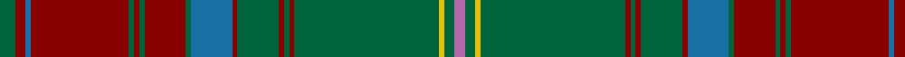

In pattern [GRBRGRGRGBRGRGRGYGR](/patterns/grbrgrgrgbrgrgrgygr/).

This was sourced from register-of-tartans.  It is a [19 stripes tartan](/stripes/stripes19/).

Original link https://www.tartanregister.gov.uk/tartanDetails.aspx?ref=349

## Attestations

This cloth appears in 2 source records; the oldest owns this page.

- 01/01/2006 — Brewer (register-of-tartans, [record](https://www.tartanregister.gov.uk/tartanDetails.aspx?ref=349))
- 2006, January — Brewer (Name) (tartans-authority, [record](http://www.tartansauthority.com/tartan-ferret/display/6833/))

## Thread count
G/6 DRa4 B2 DRa38 G2 DRa2 G2 DRa16 G2 B16 DRa2 G16 DRa2 G2 DRa2 G56 Y2 G4 P/4

## Palette
Each colour and its ΔE from the base-6 reference it is a variant of.

| Colour | Shade | Base | ΔE (OKLab) |
|---|---|---|---|
| B | <code style="background-color:#1870A4;">#1870A4</code> `#1870A4` | B <code style="background-color:#2A418A;">#2A418A</code> | 0.13 |
| DB | <code style="background-color:#003C64;">#003C64</code> `#003C64` | B <code style="background-color:#2A418A;">#2A418A</code> | 0.08 |
| DR | <code style="background-color:#A03030;">#A03030</code> `#A03030` | R <code style="background-color:#CC0000;">#CC0000</code> | 0.09 |
| DRa | <code style="background-color:#880000;">#880000</code> `#880000` | R <code style="background-color:#CC0000;">#CC0000</code> | 0.15 |
| G | <code style="background-color:#00643C;">#00643C</code> `#00643C` | G <code style="background-color:#006100;">#006100</code> | 0.05 |
| N | <code style="background-color:#888888;">#888888</code> `#888888` | R <code style="background-color:#CC0000;">#CC0000</code> | 0.24 |
| P | <code style="background-color:#B468AC;">#B468AC</code> `#B468AC` | R <code style="background-color:#CC0000;">#CC0000</code> | 0.21 |
| Y | <code style="background-color:#E8C000;">#E8C000</code> `#E8C000` | Y <code style="background-color:#F2BF00;">#F2BF00</code> | 0.02 |

## Nearest tartans

The nearest existing variants by ΔTartan distance.

1. [Ettrick (Green) District Tartan Tartan Number: 2300. Earliest known date: 1971 Ettrick District is in the Borders of Scotland. See products available Copyright © Blair Urquhart, Comrie, 2015](/setts/s24/b2g2r1g5r1b6r2g1y1g1r1g1r1g1ba1g1r2b6g20r1g1r1g1b2~b003c64-ba5c8ca8-g003820-rc80000-ye8c000~x2/) — ΔT 1.29
1. [Manitoba Province (District)](/setts/s14/r12g1ga3g20b1g1b3g1b1g20ga3g1r12y3~b5c8ca8-g006818-ga003820-r901c38-ybc8c00~x4/) — ΔT 1.30
1. [Afghanistan Memorial](/setts/s13/b8g3ga1g1ga39g3r3ga2b11g8ga2g3w2~b2a2a2a-g2e1a01-ga70572e-r770101-wffffff~x2/) — ΔT 1.30
1. [Sarna (District)](/setts/s13/g8y2ga4b4g3b4ga42g4r3g4ga4b5r3~b780078-g006818-ga604000-rc80000-ye8c000/) — ΔT 1.31
1. [Westmeath Irish County Tartan Tartan Number: 2278. Earliest known date: 1996 One of a series of Irish District tartans designed by Polly Wittering of the House of Edgar, with colours reminiscent of the Country with soft warm colours dominating. See products available Copyright © Blair Urquhart, Comrie, 2015](/setts/s14/g11r6b6ga2g3ga2b6r6g36y2ga3y2b5r5~b004874-g3c6838-ga28200c-r8c0020-ycc9c10~x2/) — ΔT 1.31
1. [Sarna](/setts/s13/g8y2r4b4g3b4r42g4ra3g4r4b5ra3~b800080-g008000-r806050-rac00000-yf0c000/) — ΔT 1.32
1. [Manitoba Province](/setts/s14/r12g1ga3g20b1g1b3g1b1g20ga3g1r12y3~b5c8ca8-g006818-ga285800-r901c38-ybc8c00~x4/) — ΔT 1.37
1. [Gray Hunting](/setts/s20/k3w1g29r8ra2r2ra2r2ra8g7k2g7ra8r2ra2r2ra2r8g29w1~g006818-k101010-r888888-ra981c70-we0e0e0~x2/) — ΔT 1.39
1. [Glen Coe (District)](/setts/s13/r5ra2k3r4g43r6k7b2r47g2r3ra2g4~b5c8ca8-g006818-k101010-r880000-rae87878~x2/) — ΔT 1.42
1. [Austrian Bowhunters Htg (Corp)](/setts/s20/g40k2r3k2g3k3ra3k3ra3k3r5y1r5k3g3k2r3k2g3k3~g00683c-k101010-r880000-rac80000-ye8c000~x2/) — ΔT 1.42

## Neighbour map

Every grey dot is one of 15726 variants placed by the first two principal components of the ΔTartan feature space (44% of its variance). Red is this tartan; blue dots are its nearest — click one to open its page.

<svg viewBox="0 0 640 380" role="img" style="max-width:100%;height:auto;border:1px solid #e0e0e0;border-radius:4px;display:block" xmlns="http://www.w3.org/2000/svg"><image href="/nn/cloud.v1.png" width="640" height="380"/><a href="/setts/s24/b2g2r1g5r1b6r2g1y1g1r1g1r1g1ba1g1r2b6g20r1g1r1g1b2~b003c64-ba5c8ca8-g003820-rc80000-ye8c000~x2/"><circle cx="352.0" cy="95.6" r="4" fill="#3465a4"><title>Ettrick (Green) District Tartan Tartan Number: 2300. Earliest known date: 1971 Ettrick District is in the Borders of Scotland. See products available Copyright © Blair Urquhart, Comrie, 2015</title></circle></a><a href="/setts/s14/r12g1ga3g20b1g1b3g1b1g20ga3g1r12y3~b5c8ca8-g006818-ga003820-r901c38-ybc8c00~x4/"><circle cx="340.1" cy="133.1" r="4" fill="#3465a4"><title>Manitoba Province (District)</title></circle></a><a href="/setts/s13/b8g3ga1g1ga39g3r3ga2b11g8ga2g3w2~b2a2a2a-g2e1a01-ga70572e-r770101-wffffff~x2/"><circle cx="379.9" cy="99.4" r="4" fill="#3465a4"><title>Afghanistan Memorial</title></circle></a><a href="/setts/s13/g8y2ga4b4g3b4ga42g4r3g4ga4b5r3~b780078-g006818-ga604000-rc80000-ye8c000/"><circle cx="387.6" cy="122.0" r="4" fill="#3465a4"><title>Sarna (District)</title></circle></a><a href="/setts/s14/g11r6b6ga2g3ga2b6r6g36y2ga3y2b5r5~b004874-g3c6838-ga28200c-r8c0020-ycc9c10~x2/"><circle cx="339.4" cy="137.3" r="4" fill="#3465a4"><title>Westmeath Irish County Tartan Tartan Number: 2278. Earliest known date: 1996 One of a series of Irish District tartans designed by Polly Wittering of the House of Edgar, with colours reminiscent of the Country with soft warm colours dominating. See products available Copyright © Blair Urquhart, Comrie, 2015</title></circle></a><a href="/setts/s13/g8y2r4b4g3b4r42g4ra3g4r4b5ra3~b800080-g008000-r806050-rac00000-yf0c000/"><circle cx="379.1" cy="115.0" r="4" fill="#3465a4"><title>Sarna</title></circle></a><a href="/setts/s14/r12g1ga3g20b1g1b3g1b1g20ga3g1r12y3~b5c8ca8-g006818-ga285800-r901c38-ybc8c00~x4/"><circle cx="348.9" cy="136.9" r="4" fill="#3465a4"><title>Manitoba Province</title></circle></a><a href="/setts/s20/k3w1g29r8ra2r2ra2r2ra8g7k2g7ra8r2ra2r2ra2r8g29w1~g006818-k101010-r888888-ra981c70-we0e0e0~x2/"><circle cx="341.3" cy="90.7" r="4" fill="#3465a4"><title>Gray Hunting</title></circle></a><a href="/setts/s13/r5ra2k3r4g43r6k7b2r47g2r3ra2g4~b5c8ca8-g006818-k101010-r880000-rae87878~x2/"><circle cx="354.6" cy="103.7" r="4" fill="#3465a4"><title>Glen Coe (District)</title></circle></a><a href="/setts/s20/g40k2r3k2g3k3ra3k3ra3k3r5y1r5k3g3k2r3k2g3k3~g00683c-k101010-r880000-rac80000-ye8c000~x2/"><circle cx="344.6" cy="58.5" r="4" fill="#3465a4"><title>Austrian Bowhunters Htg (Corp)</title></circle></a><circle cx="362.4" cy="91.5" r="5" fill="#c00000"/></svg>

ID: /setts/s19/g3r2b1r19g1r1g1r8g1b8r1g8r1g1r1g28y1g2ra2~b1870a4-g00643c-r880000-rab468ac-ye8c000~x2/
