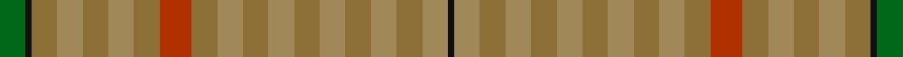

In pattern [GKGYGYGRGYGYGYGYGYK](/stripes/gkgygygrgygygygygyk/).

This was sourced from register-of-tartans.  It is a [19 stripe tartan](/stripes/stripes19/).

Original link https://www.tartanregister.gov.uk/tartanDetails.aspx?ref=3313

## Attestations

This cloth appears in 2 source records; the oldest owns this page.

- 01/01/2006 — Peeper (check) (register-of-tartans, [record](https://www.tartanregister.gov.uk/tartanDetails.aspx?ref=3313))
- 2006 — Peeper (check) (Name) (tartans-authority, [record](http://www.tartansauthority.com/tartan-ferret/display/6992/))

## Register references

External register numbers recorded for this tartan.

- Scottish Register of Tartans: [3313](https://www.tartanregister.gov.uk/tartanDetails.aspx?ref=3313)
- Scottish Tartans Authority (ITI): 6992

## Thread count
G/8 K2 LTa8 LT8 LTa8 LT8 LTa8 R10 LTa8 LT8 LTa8 LT8 LTa8 LT8 LTa8 LT8 LTa8 LT8 K/2

## Palette
Each colour and the base-6 reference it is a variant of.

| Colour | Shade | Base |
|---|---|---|
| G | <code style="background-color:#006818;">#006818</code> `oklch(45.0% 0.142 145.0)` <small>#006818</small> | G <code style="background-color:#006100;">#006100</code> |
| K | <code style="background-color:#101010;">#101010</code> `oklch(17.3% 0.000 89.9)` <small>#101010</small> | K <code style="background-color:#000000;">#000000</code> |
| LT | <code style="background-color:#A08858;">#A08858</code> `oklch(63.7% 0.071 84.0)` <small>#A08858</small> | Y <code style="background-color:#F2BF00;">#F2BF00</code> |
| LTa | <code style="background-color:#8C7038;">#8C7038</code> `oklch(56.0% 0.082 83.0)` <small>#8C7038</small> | G <code style="background-color:#006100;">#006100</code> |
| R | <code style="background-color:#B03000;">#B03000</code> `oklch(50.3% 0.171 36.3)` <small>#B03000</small> | R <code style="background-color:#CC0000;">#CC0000</code> |
| T | <code style="background-color:#604000;">#604000</code> `oklch(39.8% 0.083 76.8)` <small>#604000</small> | G <code style="background-color:#006100;">#006100</code> |

## Nearest tartans

The nearest existing variants by ΔTartan distance.

1. [Harmony 14](/setts/s11/g3y16o11y2y11y2y11y2o11y16w3~x2/) — ΔT 2.79
1. [Glen Burns (WCWM - 1)](/setts/s20/o10k1o7n4o7n1o7n1o7n4o6k1o6n4o7n1o2n1o7n7~x4/) — ΔT 2.90
1. [Callanish (District)](/setts/s11/ly2o2n2y2o6y3o3n3y2o2ly2~x2/) — ΔT 2.93
1. [Outlander #2](/setts/s9/o7n6lb1lo6n1lo6n6lb1o6~x8/) — ΔT 3.03
1. [Outlander #2](/setts/s9/y7n6lt1lo6n1lo6n6lt1y6~x8/) — ΔT 3.03
1. [Lawrence's Seven Pillars of Khaki](/setts/s9/r3o23y8g6y8t6y10t12y3~x2/) — ΔT 3.10
1. [MacKinnon Hunting #3](/setts/s12/dy8w1dy8g8r1g8dy8g1dy8g8r1g8~x8/) — ΔT 3.35
1. [Unidentified #40](/setts/s8/dy13ly3dy13dg23dy16dy13dy23r5~x2/) — ΔT 3.55
1. [Jardine](/setts/s8/n9o9y9r1y1o9y1r1~x4/) — ΔT 3.57
1. [Jardine of Castlemilk Family Tartan Tartan Number: 1432. Earliest known date: c.1978 The chiefly house is Jardine of Applegirth, a baronetcy created in 1672. The Jardines of Castlemilk in Dumfriesshire settled there in the early fourteenth century. The tartan is approved by Col Jardine. The darker brown is recorded as "J.Br", and the lighter as "Olive Br" in the Lyon Books. See products available Copyright © Blair Urquhart, Comrie, 2015](/setts/s8/o9o9y9o1t1o9t1o1~x4/) — ΔT 3.60

## Neighbour map

Every grey dot is one of 14299 variants placed by the first two principal components of the ΔTartan feature space (44% of its variance). Red is this tartan; blue dots are its nearest — click one to open its page.

<svg viewBox="0 0 640 380" role="img" style="max-width:100%;height:auto;border:1px solid #e0e0e0;border-radius:4px;display:block" xmlns="http://www.w3.org/2000/svg"><image href="/nn/cloud.v1.png" width="640" height="380"/><a href="/setts/s11/g3y16o11y2y11y2y11y2o11y16w3~x2/"><circle cx="309.9" cy="263.6" r="4" fill="#3465a4"><title>Harmony 14</title></circle></a><a href="/setts/s20/o10k1o7n4o7n1o7n1o7n4o6k1o6n4o7n1o2n1o7n7~x4/"><circle cx="278.5" cy="230.1" r="4" fill="#3465a4"><title>Glen Burns (WCWM - 1)</title></circle></a><a href="/setts/s11/ly2o2n2y2o6y3o3n3y2o2ly2~x2/"><circle cx="216.5" cy="313.8" r="4" fill="#3465a4"><title>Callanish (District)</title></circle></a><a href="/setts/s9/o7n6lb1lo6n1lo6n6lb1o6~x8/"><circle cx="264.1" cy="298.7" r="4" fill="#3465a4"><title>Outlander #2</title></circle></a><a href="/setts/s9/y7n6lt1lo6n1lo6n6lt1y6~x8/"><circle cx="264.6" cy="299.9" r="4" fill="#3465a4"><title>Outlander #2</title></circle></a><a href="/setts/s9/r3o23y8g6y8t6y10t12y3~x2/"><circle cx="256.6" cy="261.3" r="4" fill="#3465a4"><title>Lawrence's Seven Pillars of Khaki</title></circle></a><a href="/setts/s12/dy8w1dy8g8r1g8dy8g1dy8g8r1g8~x8/"><circle cx="358.1" cy="283.9" r="4" fill="#3465a4"><title>MacKinnon Hunting #3</title></circle></a><a href="/setts/s8/dy13ly3dy13dg23dy16dy13dy23r5~x2/"><circle cx="228.7" cy="259.3" r="4" fill="#3465a4"><title>Unidentified #40</title></circle></a><a href="/setts/s8/n9o9y9r1y1o9y1r1~x4/"><circle cx="357.1" cy="266.0" r="4" fill="#3465a4"><title>Jardine</title></circle></a><a href="/setts/s8/o9o9y9o1t1o9t1o1~x4/"><circle cx="315.6" cy="241.0" r="4" fill="#3465a4"><title>Jardine of Castlemilk Family Tartan Tartan Number: 1432. Earliest known date: c.1978 The chiefly house is Jardine of Applegirth, a baronetcy created in 1672. The Jardines of Castlemilk in Dumfriesshire settled there in the early fourteenth century. The tartan is approved by Col Jardine. The darker brown is recorded as &quot;J.Br&quot;, and the lighter as &quot;Olive Br&quot; in the Lyon Books. See products available Copyright © Blair Urquhart, Comrie, 2015</title></circle></a><circle cx="248.6" cy="309.8" r="5" fill="#c00000"/></svg>

ID: /setts/s19/g4k1y4lo4y4lo4y4r5y4lo4y4lo4y4lo4y4lo4y4lo4k1~x2/
