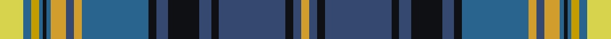

In pattern [YBKBKBKBKBYBYBKBYBY](/stripes/ybkbkbkbkbybybkbyby/).

This was sourced from register-of-tartans.  It is a [19 stripe tartan](/stripes/stripes19/).

Original link https://www.tartanregister.gov.uk/tartanDetails.aspx?ref=10790

## Register references

External register numbers recorded for this tartan.

- Scottish Register of Tartans: [10790](https://www.tartanregister.gov.uk/tartanDetails.aspx?ref=10790)

## Thread count
LG/12 Ba4 DY4 Ba2 K2 Ba2 Y8 B4 Y4 Ba34 K4 B6 K16 B6 K4 B34 K4 B4 Y/4

## Palette
Each colour and its ΔE from the base-6 reference it is a variant of.

| Colour | Shade | Base | ΔE (OKLab) |
|---|---|---|---|
| B | <code style="background-color:#344870;">#344870</code> `#344870` | B <code style="background-color:#2A418A;">#2A418A</code> | 0.05 |
| Ba | <code style="background-color:#28648D;">#28648D</code> `#28648D` | B <code style="background-color:#2A418A;">#2A418A</code> | 0.10 |
| DY | <code style="background-color:#C49C00;">#C49C00</code> `#C49C00` | Y <code style="background-color:#F2BF00;">#F2BF00</code> | 0.12 |
| K | <code style="background-color:#0E1014;">#0E1014</code> `#0E1014` | K <code style="background-color:#000000;">#000000</code> | 0.17 |
| LG | <code style="background-color:#D8D34C;">#D8D34C</code> `#D8D34C` | Y <code style="background-color:#F2BF00;">#F2BF00</code> | 0.06 |
| Y | <code style="background-color:#D19D2C;">#D19D2C</code> `#D19D2C` | Y <code style="background-color:#F2BF00;">#F2BF00</code> | 0.11 |

## Nearest tartans

The nearest existing variants by ΔTartan distance.

1. [MacGiboney/MacGibboney](/setts/s15/k2dg4w2dg19k2o10k1ly2k1o10k2db19w2db4k2~x2/) — ΔT 0.89
1. [Daniel Melrose Family Tartan Tartan Number: 7548. Earliest known date: 2008 Daniel Melrose says, "This Tartan is in memory of our ancestors who lived in the Newbigging and Dunsyre area for over 200 years." The tartan was designed to be woven in Ancient colours. (Corrects the 2 yellow stripes error. It should only be one yellow.) See products available Copyright © Blair Urquhart, Comrie, 2015](/setts/s18/w1k2g10b1g2b1g2k2b15o1b2o1b2o1b2o15k1ly1~x2/) — ΔT 0.94
1. [Mungall Family Tartan Tartan Number: 4070. Earliest known date: 2001 This tartan was first produced in ancient colours. It is a personal tartan to commemorate the signing of the Ragman's Roll by William de Mungall See products available Copyright © Blair Urquhart, Comrie, 2015](/setts/s15/t30y8r2k8ly2k8r2y8db11r2t10r3t2r2db3~x2/) — ΔT 0.96
1. [MacNicol Htg (Clan)](/setts/s17/g20k2w2k2ly2k2g19r5k19r5b20k2g2k2g2k2b20~x2/) — ΔT 0.99
1. [Ferrari (Name)](/setts/s19/ly6db2lo2db1k1db1ly4t2ly2db17k2t3k8t3k2t17k2t2ly2~x2/) — ΔT 1.02
1. [Strathclyde, University of](/setts/s26/db7k1r3k1db24k1w3k3y3k3y3g19k2w4~x2/) — ΔT 1.06
1. [Strathclyde, University of (Corporat](/setts/s14/db7k1r3k1db24k1w3k3y3k3y3g19k2w4~x2/) — ΔT 1.08
1. [Mungall](/setts/s15/lg27g7r2k7ly2k7r2g7db10r2lg9r3lg2r2db3~x2/) — ΔT 1.09
1. [Inverclyde Green](/setts/s20/db5b2db9dp10k2dp4k2g10g33w2g33g10k2dp4k2dp10db9b2db5w3~x2/) — ΔT 1.11
1. [Hunnisett/Edinchip (Personal)](/setts/s20/db38w2db2k10g2ly2g22k3r3k3r3~x2/) — ΔT 1.12

## Neighbour map

Every grey dot is one of 14299 variants placed by the first two principal components of the ΔTartan feature space (44% of its variance). Red is this tartan; blue dots are its nearest — click one to open its page.

<svg viewBox="0 0 640 380" role="img" style="max-width:100%;height:auto;border:1px solid #e0e0e0;border-radius:4px;display:block" xmlns="http://www.w3.org/2000/svg"><image href="/nn/cloud.v1.png" width="640" height="380"/><a href="/setts/s15/k2dg4w2dg19k2o10k1ly2k1o10k2db19w2db4k2~x2/"><circle cx="119.3" cy="95.3" r="4" fill="#3465a4"><title>MacGiboney/MacGibboney</title></circle></a><a href="/setts/s18/w1k2g10b1g2b1g2k2b15o1b2o1b2o1b2o15k1ly1~x2/"><circle cx="192.6" cy="95.6" r="4" fill="#3465a4"><title>Daniel Melrose Family Tartan Tartan Number: 7548. Earliest known date: 2008 Daniel Melrose says, &quot;This Tartan is in memory of our ancestors who lived in the Newbigging and Dunsyre area for over 200 years.&quot; The tartan was designed to be woven in Ancient colours. (Corrects the 2 yellow stripes error. It should only be one yellow.) See products available Copyright © Blair Urquhart, Comrie, 2015</title></circle></a><a href="/setts/s15/t30y8r2k8ly2k8r2y8db11r2t10r3t2r2db3~x2/"><circle cx="174.6" cy="110.0" r="4" fill="#3465a4"><title>Mungall Family Tartan Tartan Number: 4070. Earliest known date: 2001 This tartan was first produced in ancient colours. It is a personal tartan to commemorate the signing of the Ragman's Roll by William de Mungall See products available Copyright © Blair Urquhart, Comrie, 2015</title></circle></a><a href="/setts/s17/g20k2w2k2ly2k2g19r5k19r5b20k2g2k2g2k2b20~x2/"><circle cx="133.9" cy="123.3" r="4" fill="#3465a4"><title>MacNicol Htg (Clan)</title></circle></a><a href="/setts/s19/ly6db2lo2db1k1db1ly4t2ly2db17k2t3k8t3k2t17k2t2ly2~x2/"><circle cx="121.4" cy="78.3" r="4" fill="#3465a4"><title>Ferrari (Name)</title></circle></a><a href="/setts/s26/db7k1r3k1db24k1w3k3y3k3y3g19k2w4~x2/"><circle cx="179.7" cy="61.7" r="4" fill="#3465a4"><title>Strathclyde, University of</title></circle></a><a href="/setts/s14/db7k1r3k1db24k1w3k3y3k3y3g19k2w4~x2/"><circle cx="191.1" cy="86.3" r="4" fill="#3465a4"><title>Strathclyde, University of (Corporat</title></circle></a><a href="/setts/s15/lg27g7r2k7ly2k7r2g7db10r2lg9r3lg2r2db3~x2/"><circle cx="147.3" cy="108.5" r="4" fill="#3465a4"><title>Mungall</title></circle></a><a href="/setts/s20/db5b2db9dp10k2dp4k2g10g33w2g33g10k2dp4k2dp10db9b2db5w3~x2/"><circle cx="164.6" cy="81.8" r="4" fill="#3465a4"><title>Inverclyde Green</title></circle></a><a href="/setts/s20/db38w2db2k10g2ly2g22k3r3k3r3~x2/"><circle cx="174.9" cy="79.8" r="4" fill="#3465a4"><title>Hunnisett/Edinchip (Personal)</title></circle></a><circle cx="144.9" cy="91.5" r="5" fill="#c00000"/></svg>

ID: /setts/s19/ly6n2ly2n1k1n1lo4n2lo2n17k2n3k8n3k2n17k2n2lo2~x2/
