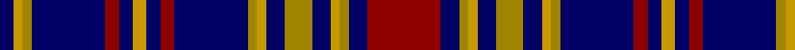

In pattern [BYYBRBYBRBYYBYBYYBR](/stripes/byybrbybrbyybybyybr/).

This was sourced from register-of-tartans.  It is a [19 stripe tartan](/stripes/stripes19/).

Original link https://www.tartanregister.gov.uk/tartanDetails.aspx?ref=2204

## Register references

External register numbers recorded for this tartan.

- Scottish Register of Tartans: [2204](https://www.tartanregister.gov.uk/tartanDetails.aspx?ref=2204)
- Scottish Tartans Authority (ITI): 4394

## Thread count
DR/32 DB8 LG4 DY4 DB8 LG12 DB8 DY4 LG4 DB32 DR6 DB6 DY6 DB6 DR6 DB32 LG4 DY4 DB/6

## Palette
Each colour and the base-6 reference it is a variant of.

| Colour | Shade | Base |
|---|---|---|
| DB | <code style="background-color:#000064;">#000064</code> `oklch(22.7% 0.158 264.1)` <small>#000064</small> | B <code style="background-color:#2A418A;">#2A418A</code> |
| DR | <code style="background-color:#8C0000;">#8C0000</code> `oklch(40.2% 0.165 29.2)` <small>#8C0000</small> | R <code style="background-color:#CC0000;">#CC0000</code> |
| DY | <code style="background-color:#C89800;">#C89800</code> `oklch(70.6% 0.144 85.9)` <small>#C89800</small> | Y <code style="background-color:#F2BF00;">#F2BF00</code> |
| LG | <code style="background-color:#A08400;">#A08400</code> `oklch(62.1% 0.127 93.9)` <small>#A08400</small> | Y <code style="background-color:#F2BF00;">#F2BF00</code> |

## Nearest tartans

The nearest existing variants by ΔTartan distance, with this tartan at the top so the swatches line up against it.

ΔTartan

Tartan

Sett

—

<a href="/ttd/edit/#slug=r16db4lo2ly2db4lo6db4ly2lo2db16r3db3ly3db3r3db16lo2ly2db3~x2">Longniddry</a> <a class="nn-out" href="/setts/s19/r16db4lo2ly2db4lo6db4ly2lo2db16r3db3ly3db3r3db16lo2ly2db3~x2/" title="open its dictionary page">↗</a>

1.24

<a href="/setts/s18/db2r2k2lb3k4lb5k6db20r2lb4r2db20k6lb5k4lb3k2r2~x2/">Scottish Knights Templar Militi Templi Scotia</a>

1.27

<a href="/ttd/edit/#slug=w2ly2w15dp10k23w2k2ly2k23dp10k15ly2w2ly2k15dp10k23ly2k23dp10w15ly2~x2">Freger (Corporate)</a> <a class="nn-out" href="/setts/s22/w2ly2w15dp10k23w2k2ly2k23dp10k15ly2w2ly2k15dp10k23ly2k23dp10w15ly2~x2/" title="open its dictionary page">↗</a>

1.35

<a href="/ttd/edit/#slug=lo16k2lo2k2lo2db16db16r3db16db16lo16k2lo2~x2">MacLachlan, Gold Dress (Fashion)</a> <a class="nn-out" href="/setts/s13/lo16k2lo2k2lo2db16db16r3db16db16lo16k2lo2~x2/" title="open its dictionary page">↗</a>

1.39

<a href="/ttd/edit/#slug=lo7db3lo2db2lo2db30k9lb2db2lo2db2lo3db5lo2db2lo2db2k9lo5db3lo4~x2">Blue Matheson Hunting (Kinloch Anderson)</a> <a class="nn-out" href="/setts/s21/lo7db3lo2db2lo2db30k9lb2db2lo2db2lo3db5lo2db2lo2db2k9lo5db3lo4~x2/" title="open its dictionary page">↗</a>

1.45

<a href="/ttd/edit/#slug=db56k6g24k6db8k21ly6k21db8k6g24k6db56">Murray of Elibank</a> <a class="nn-out" href="/setts/s13/db56k6g24k6db8k21ly6k21db8k6g24k6db56/" title="open its dictionary page">↗</a>

1.45

<a href="/setts/s10/r12db3g5db16ly2g2~x2/">Dunbog Primary School</a>

1.45

<a href="/ttd/edit/#slug=db32k6db6k6db6k32db33k4ly8k4db33k32db34k4w8">Fleming /Frisken/Flanders</a> <a class="nn-out" href="/setts/s15/db32k6db6k6db6k32db33k4ly8k4db33k32db34k4w8/" title="open its dictionary page">↗</a>

1.48

<a href="/ttd/edit/#slug=k15lb3k3w4k3lb3k15db4k4db30k4~x2">Shalom (Fashion)</a> <a class="nn-out" href="/setts/s11/k15lb3k3w4k3lb3k15db4k4db30k4~x2/" title="open its dictionary page">↗</a>

1.52

<a href="/ttd/edit/#slug=db24k3db2k3db24t20k3t2k3t20db4t20k3t2k3t20db24k3db2k3db24r4">Roberts of Wales</a> <a class="nn-out" href="/setts/s22/db24k3db2k3db24t20k3t2k3t20db4t20k3t2k3t20db24k3db2k3db24r4/" title="open its dictionary page">↗</a>

1.53

<a href="/ttd/edit/#slug=g12k12r1k1r1k12b12r1b12k12r1k1r1k12g12k1~x4">Guthrie</a> <a class="nn-out" href="/setts/s16/g12k12r1k1r1k12b12r1b12k12r1k1r1k12g12k1~x4/" title="open its dictionary page">↗</a>

## Neighbour map

Every grey dot is one of 14299 variants placed by the first two principal components of the ΔTartan feature space (44% of its variance). Red is this tartan; blue dots are its nearest — click one to open its page.

<svg viewBox="0 0 640 380" role="img" style="max-width:100%;height:auto;border:1px solid #e0e0e0;border-radius:4px;display:block" xmlns="http://www.w3.org/2000/svg"><image href="/nn/cloud.v1.png" width="640" height="380"/><a href="/setts/s18/db2r2k2lb3k4lb5k6db20r2lb4r2db20k6lb5k4lb3k2r2~x2/"><circle cx="202.6" cy="139.3" r="4" fill="#3465a4"><title>Scottish Knights Templar Militi Templi Scotia</title></circle></a><a href="/setts/s22/w2ly2w15dp10k23w2k2ly2k23dp10k15ly2w2ly2k15dp10k23ly2k23dp10w15ly2~x2/"><circle cx="255.5" cy="137.1" r="4" fill="#3465a4"><title>Freger (Corporate)</title></circle></a><a href="/setts/s13/lo16k2lo2k2lo2db16db16r3db16db16lo16k2lo2~x2/"><circle cx="284.0" cy="184.8" r="4" fill="#3465a4"><title>MacLachlan, Gold Dress (Fashion)</title></circle></a><a href="/setts/s21/lo7db3lo2db2lo2db30k9lb2db2lo2db2lo3db5lo2db2lo2db2k9lo5db3lo4~x2/"><circle cx="265.6" cy="105.4" r="4" fill="#3465a4"><title>Blue Matheson Hunting (Kinloch Anderson)</title></circle></a><a href="/setts/s13/db56k6g24k6db8k21ly6k21db8k6g24k6db56/"><circle cx="241.6" cy="178.9" r="4" fill="#3465a4"><title>Murray of Elibank</title></circle></a><a href="/setts/s10/r12db3g5db16ly2g2~x2/"><circle cx="264.6" cy="194.2" r="4" fill="#3465a4"><title>Dunbog Primary School</title></circle></a><a href="/setts/s15/db32k6db6k6db6k32db33k4ly8k4db33k32db34k4w8/"><circle cx="280.0" cy="185.3" r="4" fill="#3465a4"><title>Fleming /Frisken/Flanders</title></circle></a><a href="/setts/s11/k15lb3k3w4k3lb3k15db4k4db30k4~x2/"><circle cx="280.1" cy="180.1" r="4" fill="#3465a4"><title>Shalom (Fashion)</title></circle></a><a href="/setts/s22/db24k3db2k3db24t20k3t2k3t20db4t20k3t2k3t20db24k3db2k3db24r4/"><circle cx="244.6" cy="147.6" r="4" fill="#3465a4"><title>Roberts of Wales</title></circle></a><a href="/setts/s16/g12k12r1k1r1k12b12r1b12k12r1k1r1k12g12k1~x4/"><circle cx="239.5" cy="170.0" r="4" fill="#3465a4"><title>Guthrie</title></circle></a><circle cx="254.1" cy="158.0" r="5" fill="#c00000"/></svg>

ID: /setts/s19/r16db4lo2ly2db4lo6db4ly2lo2db16r3db3ly3db3r3db16lo2ly2db3~x2/
