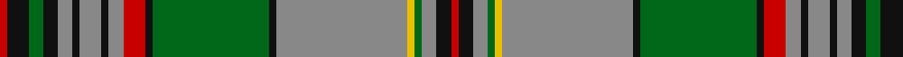

**Bands:** [RKGKRKRKRRKGKRYGRKR](/stripes/rkgkrkrkrrkgkrygrkr/) · **Stripes:** [R K G K O K O K O R K G K O LY G O K R](/stripes/stripes19/) R K G K O K O K O R K G K O LY G O K R

This was sourced from house-of-tartan.  It is a [19 band tartan](/bands/bands19/).

Original link http://www.house-of-tartan.scotland.net/house/TartanViewjs.asp?colr=Def&tnam=1574

## Variants

Other setts woven to the same stripe pattern.

- [Craig](/setts/s19/r1k2g2k2o2k1o2k1o2r2k1g14k1o17ly1g1o2k2r1~x4/)

## Thread count
R/2 K6 G4 K4 N4 K2 N6 K2 N4 R6 K2 G32 K2 N36 Y2 G2 N4 K4 R/2

## Palette
Each colour and its ΔE from the base-6 reference it is a variant of.

| Colour | Shade | Base | ΔE (OKLab) |
|---|---|---|---|
| G | <code style="background-color:#006818;">#006818</code> `#006818` | G <code style="background-color:#006100;">#006100</code> | 0.02 |
| K | <code style="background-color:#101010;">#101010</code> `#101010` | K <code style="background-color:#000000;">#000000</code> | 0.17 |
| N | <code style="background-color:#888888;">#888888</code> `#888888` | R <code style="background-color:#CC0000;">#CC0000</code> | 0.24 |
| R | <code style="background-color:#C80000;">#C80000</code> `#C80000` | R <code style="background-color:#CC0000;">#CC0000</code> | 0.01 |
| Y | <code style="background-color:#E8C000;">#E8C000</code> `#E8C000` | Y <code style="background-color:#F2BF00;">#F2BF00</code> | 0.02 |

## Nearest tartans

The nearest existing variants by ΔTartan distance.

1. [Craig](/setts/s19/r1k2g2k2o2k1o2k1o2r2k1g14k1o17ly1g1o2k2r1~x4/) — ΔT 0.65
1. [Craig](/setts/s19/r1k3g2k2y2k1y3k1y2r3k1g16k1y18ly1g1y2k2r1~x2/) — ΔT 0.94
1. [Scottish National Hunting](/setts/s16/o66m3g3m3g16dr8g3dr3m4dr3g3dr8g16m3g3m3~x2/) — ΔT 1.05
1. [Glen Orchy](/setts/s15/g3r2r1db18r2g8r4t1db8r2g18r2r1db3t1~x2/) — ΔT 1.11
1. [Wilson, Janet](/setts/s22/db30w2t3g3t3g3t3g16r3g3r3g3r3g3r3g25r15g4t4r8w2r15~x2/) — ΔT 1.13
1. [Munster](/setts/s16/t4r2t3g1t1g2t18r1k12g21t1k3g1k2g4r2~x2/) — ΔT 1.24
1. [Lomond (1983)](/setts/s13/y30k2g2k2g2lb3k1lb2k1lb1g12lo2k6~x4/) — ΔT 1.25
1. [Holyrood Golden Jubilee II](/setts/s18/dt48t12lo3w3lo3r11dt5r2lo7w2lo7r2dt5r11lo3w3lo3t12~x2/) — ΔT 1.26
1. [Cochrane (1984) Clan Tartan Tartan Number: 978. Earliest known date: 1984 Lord Dundonald originally registered a version missing a red and a green stripe in 1974. There is a story that a fragment of this design was discovered in the foundations of a Perthshire house in 1934. Around that time, a count was recorded from the sample books of Messrs William Anderson. The red and green have been restored in this version, which is now the 'approved' tartan, and appears in the 'Appendix' of the Lyon Court Books dated 12th November 1984. See products available Copyright © Blair Urquhart, Comrie, 2015](/setts/s15/g34r4g4r2g4r2g3r4g17k17r2db17r4db4ly3~x2/) — ΔT 1.32
1. [Rankin, John (Personal)](/setts/s16/t2k1dg15w2dg15k1t2k1r2k20t2k2t2k2t25k1~x2/) — ΔT 1.32

## Neighbour map

Every grey dot is one of 14313 variants placed by the first two principal components of the ΔTartan feature space (44% of its variance). Red is this tartan; blue dots are its nearest — click one to open its page.

<svg viewBox="0 0 640 380" role="img" style="max-width:100%;height:auto;border:1px solid #e0e0e0;border-radius:4px;display:block" xmlns="http://www.w3.org/2000/svg"><image href="/nn/cloud.v1.png" width="640" height="380"/><a href="/setts/s19/r1k2g2k2o2k1o2k1o2r2k1g14k1o17ly1g1o2k2r1~x4/"><circle cx="255.1" cy="96.3" r="4" fill="#3465a4"><title>Craig</title></circle></a><a href="/setts/s19/r1k3g2k2y2k1y3k1y2r3k1g16k1y18ly1g1y2k2r1~x2/"><circle cx="215.9" cy="79.0" r="4" fill="#3465a4"><title>Craig</title></circle></a><a href="/setts/s16/o66m3g3m3g16dr8g3dr3m4dr3g3dr8g16m3g3m3~x2/"><circle cx="291.7" cy="88.8" r="4" fill="#3465a4"><title>Scottish National Hunting</title></circle></a><a href="/setts/s15/g3r2r1db18r2g8r4t1db8r2g18r2r1db3t1~x2/"><circle cx="241.8" cy="126.5" r="4" fill="#3465a4"><title>Glen Orchy</title></circle></a><a href="/setts/s22/db30w2t3g3t3g3t3g16r3g3r3g3r3g3r3g25r15g4t4r8w2r15~x2/"><circle cx="197.4" cy="106.6" r="4" fill="#3465a4"><title>Wilson, Janet</title></circle></a><a href="/setts/s16/t4r2t3g1t1g2t18r1k12g21t1k3g1k2g4r2~x2/"><circle cx="209.2" cy="109.1" r="4" fill="#3465a4"><title>Munster</title></circle></a><a href="/setts/s13/y30k2g2k2g2lb3k1lb2k1lb1g12lo2k6~x4/"><circle cx="281.7" cy="84.6" r="4" fill="#3465a4"><title>Lomond (1983)</title></circle></a><a href="/setts/s18/dt48t12lo3w3lo3r11dt5r2lo7w2lo7r2dt5r11lo3w3lo3t12~x2/"><circle cx="214.7" cy="78.7" r="4" fill="#3465a4"><title>Holyrood Golden Jubilee II</title></circle></a><a href="/setts/s15/g34r4g4r2g4r2g3r4g17k17r2db17r4db4ly3~x2/"><circle cx="265.8" cy="128.0" r="4" fill="#3465a4"><title>Cochrane (1984) Clan Tartan Tartan Number: 978. Earliest known date: 1984 Lord Dundonald originally registered a version missing a red and a green stripe in 1974. There is a story that a fragment of this design was discovered in the foundations of a Perthshire house in 1934. Around that time, a count was recorded from the sample books of Messrs William Anderson. The red and green have been restored in this version, which is now the 'approved' tartan, and appears in the 'Appendix' of the Lyon Court Books dated 12th November 1984. See products available Copyright © Blair Urquhart, Comrie, 2015</title></circle></a><a href="/setts/s16/t2k1dg15w2dg15k1t2k1r2k20t2k2t2k2t25k1~x2/"><circle cx="225.8" cy="100.4" r="4" fill="#3465a4"><title>Rankin, John (Personal)</title></circle></a><circle cx="241.7" cy="90.0" r="5" fill="#c00000"/></svg>

ID: /setts/s19/r1k3g2k2o2k1o3k1o2r3k1g16k1o18ly1g1o2k2r1~x2/
