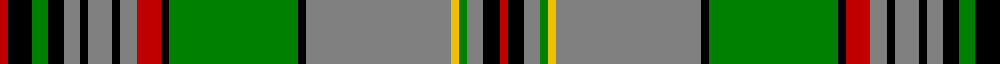

This page is one **sett** — a single exact thread-count. It belongs to the [tartan](/tartans/r1k3g2k2n2k1n3k1n2r3k1g16k1n18y1g1n2k2r1/)
(the same proportion at any scale), whose colour order is pattern [RKGGYGKGKRGKGKGKGKR](/stripes/rkggygkgkrgkgkgkgkr/).

Sourced from weddslist.  It is a [19 stripe tartan](/stripes/stripes19/).

Original link http://www.weddslist.com/cgi-bin/tartans/pg.pl?source=sts

## Thread count
R/2 K6 G4 K4 N4 K2 N6 K2 N4 R6 K2 G32 K2 N36 Y2 G2 N4 K4 R/2

## Palette
Each colour and the base-6 reference it is a variant of.

| Colour | Shade | Base |
|---|---|---|
| G | <code style="background-color:#008000;">#008000</code> `oklch(52.0% 0.177 142.5)` <small>#008000</small> | G <code style="background-color:#006100;">#006100</code> |
| K | <code style="background-color:#000000;">#000000</code> `oklch(0.0% 0.000 0.0)` <small>#000000</small> | K <code style="background-color:#000000;">#000000</code> |
| N | <code style="background-color:#808080;">#808080</code> `oklch(60.0% 0.000 89.9)` <small>#808080</small> | G <code style="background-color:#006100;">#006100</code> |
| R | <code style="background-color:#C00000;">#C00000</code> `oklch(50.7% 0.208 29.2)` <small>#C00000</small> | R <code style="background-color:#CC0000;">#CC0000</code> |
| Y | <code style="background-color:#F0C000;">#F0C000</code> `oklch(82.7% 0.169 90.5)` <small>#F0C000</small> | Y <code style="background-color:#F2BF00;">#F2BF00</code> |

## Nearest tartans

The nearest existing variants by ΔTartan distance, with this tartan at the top so the swatches line up against it.

ΔTartan

Tartan

Sett

—

<a href="/ttd/edit/#slug=r1k3g2k2y2k1y3k1y2r3k1g16k1y18ly1g1y2k2r1~x2">Craig</a> <a class="nn-out" href="/setts/s19/r1k3g2k2y2k1y3k1y2r3k1g16k1y18ly1g1y2k2r1~x2/" title="open its dictionary page">↗</a>

0.94

<a href="/ttd/edit/#slug=r1k3g2k2o2k1o3k1o2r3k1g16k1o18ly1g1o2k2r1~x2">Craig Family Tartan Tartan Number: 1574. Earliest known date: 1957 MacGregor Hastie wrote, &quot;This tartan was designed by me to meet a long felt want. Many people have asked if there was a Craig family tartan, and as the name is not connected with any Highland clan, yet the the family name is numerous, it seemed a good idea to design one. The design is based on the general colour of craigs and rocks.&quot; The Craig tartan is now in general production. See products available Copyright © Blair Urquhart, Comrie, 2015</a> <a class="nn-out" href="/setts/s19/r1k3g2k2o2k1o3k1o2r3k1g16k1o18ly1g1o2k2r1~x2/" title="open its dictionary page">↗</a>

1.12

<a href="/ttd/edit/#slug=k10ly1ly2k1n2k1ly2ly1k1n2k3n1k17ly18ly1ly2k1dg2~x2">Raznotravie (Corporate)</a> <a class="nn-out" href="/setts/s18/k10ly1ly2k1n2k1ly2ly1k1n2k3n1k17ly18ly1ly2k1dg2~x2/" title="open its dictionary page">↗</a>

1.16

<a href="/setts/s22/g46k3db6ly2db3ly2db3g7r6db2r3w4~x2/">Seller (Personal)</a>

1.16

<a href="/ttd/edit/#slug=k15w1k1w1k1w1k1g15r1g15lo2r5lo2w3~x2">Courtet-Meyer (Personal)</a> <a class="nn-out" href="/setts/s14/k15w1k1w1k1w1k1g15r1g15lo2r5lo2w3~x2/" title="open its dictionary page">↗</a>

1.25

<a href="/ttd/edit/#slug=g1k1g14k2r3db3k6w1k1w1k1w1~x4">Murray-Hetherington (Personal) Name Tartan Tartan Number: 10700. Earliest known date: 18 September 2012 After years of wearing the Murray of Atholl tartan, the registrant has chosen to register a tartan in his own name. He belongs to a family that has intermarried with the Murrays for many years and bears the additional surname of Murray. The underlying design of this personal tartan is based on details derived from the Blair Atholl tartan with due and proper differences to distinguish it. The colours used were specifically chosen to represent the colours found in the Murray of Atholl sett. The addition of three white stripes alludes to the three silver stars of the Murrays. The black and white also reflect the principal heraldic colours in the registrant's coat of arms granted to him by Garter King of Arms (England) and Norroy and Ulster King of Arms. The tartan, for the registrant, his immediate family, and their descendants to wear, maintains the strong link with the Murray Clan. See products available Copyright © Blair Urquhart, Comrie, 2015</a> <a class="nn-out" href="/setts/s12/g1k1g14k2r3db3k6w1k1w1k1w1~x4/" title="open its dictionary page">↗</a>

1.26

<a href="/ttd/edit/#slug=r2r3db2g32db3g1db3k14r3db2r3g12db1k1db30r3db2r2~x2">Cooper</a> <a class="nn-out" href="/setts/s18/r2r3db2g32db3g1db3k14r3db2r3g12db1k1db30r3db2r2~x2/" title="open its dictionary page">↗</a>

1.29

<a href="/ttd/edit/#slug=g5w2r8k2lo4k2ly2k7g40k3r10k6lo7k7ly2k2~x2">Goldstraw (Name)</a> <a class="nn-out" href="/setts/s16/g5w2r8k2lo4k2ly2k7g40k3r10k6lo7k7ly2k2~x2/" title="open its dictionary page">↗</a>

1.29

<a href="/ttd/edit/#slug=g16r2g2r1g3r1g2r2g12k12r1db16r2db8ly2~x2">Cochrane</a> <a class="nn-out" href="/setts/s15/g16r2g2r1g3r1g2r2g12k12r1db16r2db8ly2~x2/" title="open its dictionary page">↗</a>

1.32

<a href="/setts/s22/g42b3k8ly2k2w3k2g12r5k2r2w2~x2/">King George VI (Green Stewart)</a>

1.35

<a href="/ttd/edit/#slug=w3b2w3r4w16k2w2k2w3k10dg35k2dg2k1dg2~x2">Prestoungrange/Dolphinstoun/Wills dress</a> <a class="nn-out" href="/setts/s15/w3b2w3r4w16k2w2k2w3k10dg35k2dg2k1dg2~x2/" title="open its dictionary page">↗</a>

## Neighbour map

Every grey dot is one of 14299 variants placed by the first two principal components of the ΔTartan feature space (44% of its variance). Red is this tartan; blue dots are its nearest — click one to open its page.

<svg viewBox="0 0 640 380" role="img" style="max-width:100%;height:auto;border:1px solid #e0e0e0;border-radius:4px;display:block" xmlns="http://www.w3.org/2000/svg"><image href="/nn/cloud.v1.png" width="640" height="380"/><a href="/setts/s19/r1k3g2k2o2k1o3k1o2r3k1g16k1o18ly1g1o2k2r1~x2/"><circle cx="241.4" cy="90.0" r="4" fill="#3465a4"><title>Craig Family Tartan Tartan Number: 1574. Earliest known date: 1957 MacGregor Hastie wrote, &quot;This tartan was designed by me to meet a long felt want. Many people have asked if there was a Craig family tartan, and as the name is not connected with any Highland clan, yet the the family name is numerous, it seemed a good idea to design one. The design is based on the general colour of craigs and rocks.&quot; The Craig tartan is now in general production. See products available Copyright © Blair Urquhart, Comrie, 2015</title></circle></a><a href="/setts/s18/k10ly1ly2k1n2k1ly2ly1k1n2k3n1k17ly18ly1ly2k1dg2~x2/"><circle cx="252.0" cy="77.2" r="4" fill="#3465a4"><title>Raznotravie (Corporate)</title></circle></a><a href="/setts/s22/g46k3db6ly2db3ly2db3g7r6db2r3w4~x2/"><circle cx="234.7" cy="45.3" r="4" fill="#3465a4"><title>Seller (Personal)</title></circle></a><a href="/setts/s14/k15w1k1w1k1w1k1g15r1g15lo2r5lo2w3~x2/"><circle cx="214.4" cy="101.4" r="4" fill="#3465a4"><title>Courtet-Meyer (Personal)</title></circle></a><a href="/setts/s12/g1k1g14k2r3db3k6w1k1w1k1w1~x4/"><circle cx="188.6" cy="112.3" r="4" fill="#3465a4"><title>Murray-Hetherington (Personal) Name Tartan Tartan Number: 10700. Earliest known date: 18 September 2012 After years of wearing the Murray of Atholl tartan, the registrant has chosen to register a tartan in his own name. He belongs to a family that has intermarried with the Murrays for many years and bears the additional surname of Murray. The underlying design of this personal tartan is based on details derived from the Blair Atholl tartan with due and proper differences to distinguish it. The colours used were specifically chosen to represent the colours found in the Murray of Atholl sett. The addition of three white stripes alludes to the three silver stars of the Murrays. The black and white also reflect the principal heraldic colours in the registrant's coat of arms granted to him by Garter King of Arms (England) and Norroy and Ulster King of Arms. The tartan, for the registrant, his immediate family, and their descendants to wear, maintains the strong link with the Murray Clan. See products available Copyright © Blair Urquhart, Comrie, 2015</title></circle></a><a href="/setts/s18/r2r3db2g32db3g1db3k14r3db2r3g12db1k1db30r3db2r2~x2/"><circle cx="226.7" cy="70.7" r="4" fill="#3465a4"><title>Cooper</title></circle></a><a href="/setts/s16/g5w2r8k2lo4k2ly2k7g40k3r10k6lo7k7ly2k2~x2/"><circle cx="196.2" cy="75.3" r="4" fill="#3465a4"><title>Goldstraw (Name)</title></circle></a><a href="/setts/s15/g16r2g2r1g3r1g2r2g12k12r1db16r2db8ly2~x2/"><circle cx="190.1" cy="123.7" r="4" fill="#3465a4"><title>Cochrane</title></circle></a><a href="/setts/s22/g42b3k8ly2k2w3k2g12r5k2r2w2~x2/"><circle cx="253.3" cy="57.9" r="4" fill="#3465a4"><title>King George VI (Green Stewart)</title></circle></a><a href="/setts/s15/w3b2w3r4w16k2w2k2w3k10dg35k2dg2k1dg2~x2/"><circle cx="236.1" cy="56.4" r="4" fill="#3465a4"><title>Prestoungrange/Dolphinstoun/Wills dress</title></circle></a><circle cx="215.7" cy="79.0" r="5" fill="#c00000"/></svg>

ID: /setts/s19/r1k3g2k2y2k1y3k1y2r3k1g16k1y18ly1g1y2k2r1~x2/
