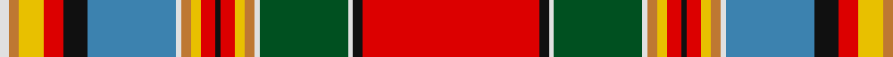

**Bands:** [RKWGWRYRKRYRWBKRYRW](/stripes/rkwgwryrkryrwbkryrw/) · **Stripes:** [R K W DG W O LY R K R LY O W T K R LY O W](/stripes/stripes19/) R K W DG W O LY R K R LY O W T K R LY O W

This was sourced from register-of-tartans.  It is a [19 band tartan](/bands/bands19/).

Original link https://www.tartanregister.gov.uk/tartanDetails.aspx?ref=623

## Register references

External register numbers recorded for this tartan.

- Scottish Register of Tartans: [623](https://www.tartanregister.gov.uk/tartanDetails.aspx?ref=623)
- Scottish Tartans World Register: 1620

## Thread count
LN/4 DO4 Y10 R8 K10 B36 LN2 DO4 Y4 R6 K2 R6 Y4 DO4 LN2 G36 LN2 K4 R/72

## Palette
Each colour and its ΔE from the base-6 reference it is a variant of.

| Colour | Shade | Base | ΔE (OKLab) |
|---|---|---|---|
| B | <code style="background-color:#3C82AF;">#3C82AF</code> `#3C82AF` | B <code style="background-color:#2A418A;">#2A418A</code> | 0.19 |
| DO | <code style="background-color:#BE7832;">#BE7832</code> `#BE7832` | R <code style="background-color:#CC0000;">#CC0000</code> | 0.17 |
| G | <code style="background-color:#005020;">#005020</code> `#005020` | G <code style="background-color:#006100;">#006100</code> | 0.07 |
| K | <code style="background-color:#101010;">#101010</code> `#101010` | K <code style="background-color:#000000;">#000000</code> | 0.17 |
| LN | <code style="background-color:#E0E0E0;">#E0E0E0</code> `#E0E0E0` | W <code style="background-color:#F7F7F7;">#F7F7F7</code> | 0.07 |
| R | <code style="background-color:#DC0000;">#DC0000</code> `#DC0000` | R <code style="background-color:#CC0000;">#CC0000</code> | 0.03 |
| Y | <code style="background-color:#E8C000;">#E8C000</code> `#E8C000` | Y <code style="background-color:#F2BF00;">#F2BF00</code> | 0.02 |

## Nearest tartans

The nearest existing variants by ΔTartan distance.

1. [Chattan Clan Tartan Tartan Number: 1620. Earliest known date: pre 2003 This sett includes a brown stripe next to the yellow which does not appear in the records of Lord Lyon. The sett is similar in other respects. See products available Copyright © Blair Urquhart, Comrie, 2015](/setts/s19/r36k2w1g18w1dy2ly2r3k1r3ly2dy2w1t18k5r4ly5dy2w2~x2/) — ΔT 0.31
1. [Chattan](/setts/s19/r36k2w1g18w1o2ly2r3k1r3ly2o2w1t18k5r4ly5o2w2~x2/) — ΔT 0.38
1. [Finzean's Fancy Artifact Tartan Tartan Number: 1860. Earliest known date: c.1805-15 Archibald Farquharson of Finzean (pronounced fingin) designed this sett to promote his claim to the chiefship of Clan Farquharson c. 1805-15. He based his design on the Chattan Chief's sett, making clear his political alignment and possibly his aspirations. A complete tartan outfit including a tartan jacket can be seen at the Stonehaven Museum. There is a sample woven in 1986 in the collection of the Scottish Tartans Society. See products available Copyright © Blair Urquhart, Comrie, 2015](/setts/s16/w5ly8r6k6t28ly12r6k2r6ly12g28w2k4r54m1w2~x2/) — ΔT 1.00
1. [Elmore (Personal)](/setts/s15/r29k1lo3dg6w6r3k1r3w2dg3db5k3ly5w5k4~x2/) — ΔT 1.04
1. [Finzean, Fancy](/setts/s16/w5ly8r6k6t28ly12r6k2r6ly12g28w2k4r54r1w2~x2/) — ΔT 1.08
1. [Chattan Chief Clan Tartan Tartan Number: 1851. Earliest known date: 1816 Also known as Finzean's fancy. The record of the Lord Lyon states, 'Note - this tartan is specifically for the Chief of Clan Chattan and his immediate family.' Logan descibed this sett (without the chiefs extra white line) thus: 'The Chief also wears a particular tartan of a very showy pattern.' It is illustrated by Smith in 1850. Chief of the Clan Mackintosh Sir Aeneas Mackintosh of that Ilk, acknowledged this sett as the Clan tartan in 1816. See products available Copyright © Blair Urquhart, Comrie, 2015](/setts/s17/w4ly12r8k8t32w4ly7r7k2r7ly7w4g32w2k4r60w2/) — ΔT 1.11
1. [Finzean's Fancy](/setts/s16/lb8lo8r6k6t28lo12r6k2r6lo12g28lb2k4r54dr1lb2~x2/) — ΔT 1.14
1. [Chattan, Chief of Clan](/setts/s17/w4ly12r8k8t32w4ly7r7k2r7ly7w4g32w2k4r60w2~x2/) — ΔT 1.14
1. [Whitworth](/setts/s20/r5ly1r8w1db20w1b20w1g20ly1r5ly1r5ly1g20ly2r52w1ly5w1~x2/) — ΔT 1.16
1. [Whitworth Artifact Tartan Tartan Number: 1724. Earliest known date: c.1790-1800 A piece of material 11x8 inches supposedly cut from a plaid worn by Prince Charles during the '45 rebellion. The piece was loaned to the Scottish Tartans Society museum in 1978 by Anthony Whitworth. The tartan expert, James Scarlett, noted that the sample was woven with a flying shuttle and appeared to be of commercial manufacture. He suggests that it may be a commercial copy of one of the many 'Princes Plaids' made c.1790. See products available Copyright © Blair Urquhart, Comrie, 2015](/setts/s20/r5ly1r8w1db20w1t20w1g20ly1r5ly1r5ly1g20ly2r52w1ly5w1~x2/) — ΔT 1.16

## Neighbour map

Every grey dot is one of 14313 variants placed by the first two principal components of the ΔTartan feature space (44% of its variance). Red is this tartan; blue dots are its nearest — click one to open its page.

<svg viewBox="0 0 640 380" role="img" style="max-width:100%;height:auto;border:1px solid #e0e0e0;border-radius:4px;display:block" xmlns="http://www.w3.org/2000/svg"><image href="/nn/cloud.v1.png" width="640" height="380"/><a href="/setts/s19/r36k2w1g18w1dy2ly2r3k1r3ly2dy2w1t18k5r4ly5dy2w2~x2/"><circle cx="205.1" cy="14.0" r="4" fill="#3465a4"><title>Chattan Clan Tartan Tartan Number: 1620. Earliest known date: pre 2003 This sett includes a brown stripe next to the yellow which does not appear in the records of Lord Lyon. The sett is similar in other respects. See products available Copyright © Blair Urquhart, Comrie, 2015</title></circle></a><a href="/setts/s19/r36k2w1g18w1o2ly2r3k1r3ly2o2w1t18k5r4ly5o2w2~x2/"><circle cx="193.8" cy="14.0" r="4" fill="#3465a4"><title>Chattan</title></circle></a><a href="/setts/s16/w5ly8r6k6t28ly12r6k2r6ly12g28w2k4r54m1w2~x2/"><circle cx="189.1" cy="16.5" r="4" fill="#3465a4"><title>Finzean's Fancy Artifact Tartan Tartan Number: 1860. Earliest known date: c.1805-15 Archibald Farquharson of Finzean (pronounced fingin) designed this sett to promote his claim to the chiefship of Clan Farquharson c. 1805-15. He based his design on the Chattan Chief's sett, making clear his political alignment and possibly his aspirations. A complete tartan outfit including a tartan jacket can be seen at the Stonehaven Museum. There is a sample woven in 1986 in the collection of the Scottish Tartans Society. See products available Copyright © Blair Urquhart, Comrie, 2015</title></circle></a><a href="/setts/s15/r29k1lo3dg6w6r3k1r3w2dg3db5k3ly5w5k4~x2/"><circle cx="185.3" cy="28.7" r="4" fill="#3465a4"><title>Elmore (Personal)</title></circle></a><a href="/setts/s16/w5ly8r6k6t28ly12r6k2r6ly12g28w2k4r54r1w2~x2/"><circle cx="178.9" cy="14.0" r="4" fill="#3465a4"><title>Finzean, Fancy</title></circle></a><a href="/setts/s17/w4ly12r8k8t32w4ly7r7k2r7ly7w4g32w2k4r60w2/"><circle cx="191.9" cy="43.4" r="4" fill="#3465a4"><title>Chattan Chief Clan Tartan Tartan Number: 1851. Earliest known date: 1816 Also known as Finzean's fancy. The record of the Lord Lyon states, 'Note - this tartan is specifically for the Chief of Clan Chattan and his immediate family.' Logan descibed this sett (without the chiefs extra white line) thus: 'The Chief also wears a particular tartan of a very showy pattern.' It is illustrated by Smith in 1850. Chief of the Clan Mackintosh Sir Aeneas Mackintosh of that Ilk, acknowledged this sett as the Clan tartan in 1816. See products available Copyright © Blair Urquhart, Comrie, 2015</title></circle></a><a href="/setts/s16/lb8lo8r6k6t28lo12r6k2r6lo12g28lb2k4r54dr1lb2~x2/"><circle cx="185.4" cy="24.7" r="4" fill="#3465a4"><title>Finzean's Fancy</title></circle></a><a href="/setts/s17/w4ly12r8k8t32w4ly7r7k2r7ly7w4g32w2k4r60w2~x2/"><circle cx="186.9" cy="40.6" r="4" fill="#3465a4"><title>Chattan, Chief of Clan</title></circle></a><a href="/setts/s20/r5ly1r8w1db20w1b20w1g20ly1r5ly1r5ly1g20ly2r52w1ly5w1~x2/"><circle cx="240.3" cy="14.0" r="4" fill="#3465a4"><title>Whitworth</title></circle></a><a href="/setts/s20/r5ly1r8w1db20w1t20w1g20ly1r5ly1r5ly1g20ly2r52w1ly5w1~x2/"><circle cx="249.6" cy="18.7" r="4" fill="#3465a4"><title>Whitworth Artifact Tartan Tartan Number: 1724. Earliest known date: c.1790-1800 A piece of material 11x8 inches supposedly cut from a plaid worn by Prince Charles during the '45 rebellion. The piece was loaned to the Scottish Tartans Society museum in 1978 by Anthony Whitworth. The tartan expert, James Scarlett, noted that the sample was woven with a flying shuttle and appeared to be of commercial manufacture. He suggests that it may be a commercial copy of one of the many 'Princes Plaids' made c.1790. See products available Copyright © Blair Urquhart, Comrie, 2015</title></circle></a><circle cx="201.0" cy="14.0" r="5" fill="#c00000"/></svg>

ID: /setts/s19/r36k2w1dg18w1o2ly2r3k1r3ly2o2w1t18k5r4ly5o2w2~x2/
