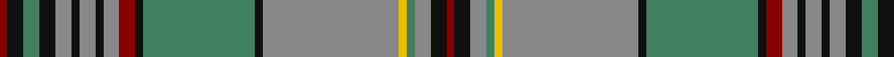

In pattern [RKGKRKRKRRKGKRYGRKR](/patterns/rkgkrkrkrrkgkrygrkr/).

This was sourced from register-of-tartans.  It is a [19 stripes tartan](/stripes/stripes19/).

Original link https://www.tartanregister.gov.uk/tartanDetails.aspx?ref=785

## Attestations

This cloth appears in 2 source records; the oldest owns this page.

- 01/01/1957 — Craig (register-of-tartans, [record](https://www.tartanregister.gov.uk/tartanDetails.aspx?ref=785))
- 1957 — Craig (Clan) (tartans-authority, [record](http://www.tartansauthority.com/tartan-ferret/display/1574/))

## Thread count
DR/4 K8 G8 K8 N8 K4 N8 K4 N8 DR8 K4 G56 K4 N68 Y4 G4 N8 K8 DR/4

## Palette
Each colour and its ΔE from the base-6 reference it is a variant of.

| Colour | Shade | Base | ΔE (OKLab) |
|---|---|---|---|
| DR | <code style="background-color:#880000;">#880000</code> `#880000` | R <code style="background-color:#C80000;">#C80000</code> | 0.14 |
| G | <code style="background-color:#408060;">#408060</code> `#408060` | G <code style="background-color:#006400;">#006400</code> | 0.13 |
| K | <code style="background-color:#101010;">#101010</code> `#101010` | K <code style="background-color:#000000;">#000000</code> | 0.17 |
| N | <code style="background-color:#888888;">#888888</code> `#888888` | R <code style="background-color:#C80000;">#C80000</code> | 0.24 |
| Y | <code style="background-color:#E8C000;">#E8C000</code> `#E8C000` | Y <code style="background-color:#E8C000;">#E8C000</code> | 0.00 |

## Nearest tartans

The nearest existing variants by ΔTartan distance.

1. [Craig Family Tartan Tartan Number: 1574. Earliest known date: 1957 MacGregor Hastie wrote, "This tartan was designed by me to meet a long felt want. Many people have asked if there was a Craig family tartan, and as the name is not connected with any Highland clan, yet the the family name is numerous, it seemed a good idea to design one. The design is based on the general colour of craigs and rocks." The Craig tartan is now in general production. See products available Copyright © Blair Urquhart, Comrie, 2015](/setts/s19/r2k6g4k4ra4k2ra6k2ra4r6k2g32k2ra36y2g2ra4k4r2-g006818-k101010-rc80000-ra888888-ye8c000/) — ΔT 0.64
1. [Scottish National Hunting](/setts/s16/r132ra6g6ra6g32b16g6b6rb8b6g6b16g32ra6g6ra6-b4c0000-g006818-r888888-ra981c70-rba00048/) — ΔT 0.83
1. [Glen Orchy](/setts/s15/g6r4ra2b36r4g16r8ba2b16r4g36r4ra2b6ba2-b304080-ba5480b0-g008000-rc00000-rad03030/) — ΔT 1.06
1. [Allen Htg - 1998 (Personal)](/setts/s25/b88r4y16b16y4b4y4b4y4b4y4b4y4b4y4b4y4b4y4b4y4b4y36g96ba8-b2888c4-ba242470-g604000-rc80000-ydc943c/) — ΔT 1.17
1. [Allen Hunting (?Thomson)](/setts/s25/b88r4y16b16y4b4y4b4y4b4y4b4y4b4y4b4y4b4y4b4y4b4y36g96ba8-b2888c4-ba2c2c80-g604000-rc80000-ydc943c/) — ΔT 1.17
1. [Daniel Melrose Family Tartan Tartan Number: 7548. Earliest known date: 2008 Daniel Melrose says, "This Tartan is in memory of our ancestors who lived in the Newbigging and Dunsyre area for over 200 years." The tartan was designed to be woven in Ancient colours. (Corrects the 2 yellow stripes error. It should only be one yellow.) See products available Copyright © Blair Urquhart, Comrie, 2015](/setts/s18/w2k4g20b2g4b2g4k4b30r2b4r2b4r2b4r30k2y2-b206094-g3c7c40-k000000-r904830-wf0f0f0-yd4b844/) — ΔT 1.22
1. [Wilson, Janet](/setts/s22/b60w4ba6g6ba6g6ba6g32r6g6r6g6r6g6r6g50r30g8ba8r16w4r30-b304080-ba5480b0-g008000-rc00000-we0e0e0/) — ΔT 1.27
1. [Holyrood Golden Jubilee II](/setts/s18/b96ba24y6w6y6r22b10r4y14w4y14r4b10r22y6w6y6ba24-b003c64-ba5c8ca8-r880000-wf8f8f8-ybc8c00/) — ΔT 1.27
1. [Munster](/setts/s16/b8r4b6g2b2g4b36r2k24ga42b2k6ga2k4ga8r4-b5c8ca8-g006818-ga00643c-k101010-rc80000/) — ΔT 1.28
1. [Falkirk District Tartan Tartan Number: 2347. Earliest known date: 1989 The original Falkirk "Tartan" , now in the National Museum of Scotland, has a place in history as one of the earliest examples of Scottish cloth in existence. It is a direct link back to the Roman occupation of the area around 250 A.D.and was found stuffed into a pot filled with over 2000 silver coins. This early Celtic tweed used undyed yarn to give a herringbone pattern in brown hues and is considered to be a "poor man's plaid". The Falkirk District Tartan is alive with vibrant colour to reflect that part of Scotland as it is seen today. It was the winning entry by Jim McGeorge (aided by Tony Murray of Stirling) in a public competition run by Falkirk Town Centre Management to create a new image for an area that was rising from the ashes of its former industrial glory. Brown - represents the dominant colour of the original cloth; blue - links Falkirk district with sea via the River Forth and the canals. It is also the colour of the Falkirk "Bairns." Red - is the colour of the blast furnace flames from the Falkirk foundries and yellow - signifies wealth and prosperity. Black - the black lines intersect on blue to show Falkirk at the crossroads of all roads through the region. See products available Copyright © Blair Urquhart, Comrie, 2015](/setts/s16/r6y4g54b44k4b8k4b8k8b8k4b8k4b44g54y4-b1474b4-g604000-k101010-rc80000-ye8c000/) — ΔT 1.31

## Neighbour map

Every grey dot is one of 15726 variants placed by the first two principal components of the ΔTartan feature space (44% of its variance). Red is this tartan; blue dots are its nearest — click one to open its page.

<svg viewBox="0 0 640 380" role="img" style="max-width:100%;height:auto;border:1px solid #e0e0e0;border-radius:4px;display:block" xmlns="http://www.w3.org/2000/svg"><image href="/nn/cloud.v1.png" width="640" height="380"/><a href="/setts/s19/r2k6g4k4ra4k2ra6k2ra4r6k2g32k2ra36y2g2ra4k4r2-g006818-k101010-rc80000-ra888888-ye8c000/"><circle cx="235.8" cy="86.9" r="4" fill="#3465a4"><title>Craig Family Tartan Tartan Number: 1574. Earliest known date: 1957 MacGregor Hastie wrote, &quot;This tartan was designed by me to meet a long felt want. Many people have asked if there was a Craig family tartan, and as the name is not connected with any Highland clan, yet the the family name is numerous, it seemed a good idea to design one. The design is based on the general colour of craigs and rocks.&quot; The Craig tartan is now in general production. See products available Copyright © Blair Urquhart, Comrie, 2015</title></circle></a><a href="/setts/s16/r132ra6g6ra6g32b16g6b6rb8b6g6b16g32ra6g6ra6-b4c0000-g006818-r888888-ra981c70-rba00048/"><circle cx="285.8" cy="84.4" r="4" fill="#3465a4"><title>Scottish National Hunting</title></circle></a><a href="/setts/s15/g6r4ra2b36r4g16r8ba2b16r4g36r4ra2b6ba2-b304080-ba5480b0-g008000-rc00000-rad03030/"><circle cx="236.4" cy="122.3" r="4" fill="#3465a4"><title>Glen Orchy</title></circle></a><a href="/setts/s25/b88r4y16b16y4b4y4b4y4b4y4b4y4b4y4b4y4b4y4b4y4b4y36g96ba8-b2888c4-ba242470-g604000-rc80000-ydc943c/"><circle cx="263.8" cy="49.0" r="4" fill="#3465a4"><title>Allen Htg - 1998 (Personal)</title></circle></a><a href="/setts/s25/b88r4y16b16y4b4y4b4y4b4y4b4y4b4y4b4y4b4y4b4y4b4y36g96ba8-b2888c4-ba2c2c80-g604000-rc80000-ydc943c/"><circle cx="264.5" cy="49.2" r="4" fill="#3465a4"><title>Allen Hunting (?Thomson)</title></circle></a><a href="/setts/s18/w2k4g20b2g4b2g4k4b30r2b4r2b4r2b4r30k2y2-b206094-g3c7c40-k000000-r904830-wf0f0f0-yd4b844/"><circle cx="186.0" cy="91.0" r="4" fill="#3465a4"><title>Daniel Melrose Family Tartan Tartan Number: 7548. Earliest known date: 2008 Daniel Melrose says, &quot;This Tartan is in memory of our ancestors who lived in the Newbigging and Dunsyre area for over 200 years.&quot; The tartan was designed to be woven in Ancient colours. (Corrects the 2 yellow stripes error. It should only be one yellow.) See products available Copyright © Blair Urquhart, Comrie, 2015</title></circle></a><a href="/setts/s22/b60w4ba6g6ba6g6ba6g32r6g6r6g6r6g6r6g50r30g8ba8r16w4r30-b304080-ba5480b0-g008000-rc00000-we0e0e0/"><circle cx="192.3" cy="103.9" r="4" fill="#3465a4"><title>Wilson, Janet</title></circle></a><a href="/setts/s18/b96ba24y6w6y6r22b10r4y14w4y14r4b10r22y6w6y6ba24-b003c64-ba5c8ca8-r880000-wf8f8f8-ybc8c00/"><circle cx="208.6" cy="76.4" r="4" fill="#3465a4"><title>Holyrood Golden Jubilee II</title></circle></a><a href="/setts/s16/b8r4b6g2b2g4b36r2k24ga42b2k6ga2k4ga8r4-b5c8ca8-g006818-ga00643c-k101010-rc80000/"><circle cx="202.5" cy="104.6" r="4" fill="#3465a4"><title>Munster</title></circle></a><a href="/setts/s16/r6y4g54b44k4b8k4b8k8b8k4b8k4b44g54y4-b1474b4-g604000-k101010-rc80000-ye8c000/"><circle cx="263.3" cy="132.3" r="4" fill="#3465a4"><title>Falkirk District Tartan Tartan Number: 2347. Earliest known date: 1989 The original Falkirk &quot;Tartan&quot; , now in the National Museum of Scotland, has a place in history as one of the earliest examples of Scottish cloth in existence. It is a direct link back to the Roman occupation of the area around 250 A.D.and was found stuffed into a pot filled with over 2000 silver coins. This early Celtic tweed used undyed yarn to give a herringbone pattern in brown hues and is considered to be a &quot;poor man's plaid&quot;. The Falkirk District Tartan is alive with vibrant colour to reflect that part of Scotland as it is seen today. It was the winning entry by Jim McGeorge (aided by Tony Murray of Stirling) in a public competition run by Falkirk Town Centre Management to create a new image for an area that was rising from the ashes of its former industrial glory. Brown - represents the dominant colour of the original cloth; blue - links Falkirk district with sea via the River Forth and the canals. It is also the colour of the Falkirk &quot;Bairns.&quot; Red - is the colour of the blast furnace flames from the Falkirk foundries and yellow - signifies wealth and prosperity. Black - the black lines intersect on blue to show Falkirk at the crossroads of all roads through the region. See products available Copyright © Blair Urquhart, Comrie, 2015</title></circle></a><circle cx="249.2" cy="92.4" r="5" fill="#c00000"/></svg>

ID: /setts/s19/r4k8g8k8ra8k4ra8k4ra8r8k4g56k4ra68y4g4ra8k8r4-g408060-k101010-r880000-ra888888-ye8c000/
