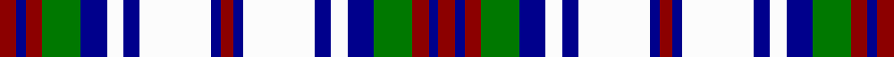

This page is one **sett** — a single exact thread-count. It belongs to the [tartan](/tartans/dr5db3dr5g12db8w5db5w22db3dr4db3w22db5w5db8g12dr5db3dr5/)
(the same proportion at any scale), whose colour order is pattern [RBRGBWBWBRBWBWBGRBR](/stripes/rbrgbwbwbrbwbwbgrbr/).

Sourced from register-of-tartans.  It is a [19 stripe tartan](/stripes/stripes19/).

Original link https://www.tartanregister.gov.uk/tartanDetails.aspx?ref=4257

## Register references

External register numbers recorded for this tartan.

- Scottish Register of Tartans: [4257](https://www.tartanregister.gov.uk/tartanDetails.aspx?ref=4257)
- Scottish Tartans Authority (ITI): 4591

## Thread count
DR/10 DB6 DR10 G24 DB16 W10 DB10 W44 DB6 DR8 DB6 W44 DB10 W10 DB16 G24 DR10 DB6 DR/10

## Palette
Each colour and the base-6 reference it is a variant of.

| Colour | Shade | Base |
|---|---|---|
| B | <code style="background-color:#788CB4;">#788CB4</code> `oklch(63.9% 0.065 264.0)` <small>#788CB4</small> | B <code style="background-color:#2A418A;">#2A418A</code> |
| DB | <code style="background-color:#00008C;">#00008C</code> `oklch(28.9% 0.200 264.1)` <small>#00008C</small> | B <code style="background-color:#2A418A;">#2A418A</code> |
| DR | <code style="background-color:#8C0000;">#8C0000</code> `oklch(40.2% 0.165 29.2)` <small>#8C0000</small> | R <code style="background-color:#CC0000;">#CC0000</code> |
| DY | <code style="background-color:#C88C00;">#C88C00</code> `oklch(68.2% 0.142 78.2)` <small>#C88C00</small> | Y <code style="background-color:#F2BF00;">#F2BF00</code> |
| G | <code style="background-color:#007800;">#007800</code> `oklch(49.6% 0.169 142.5)` <small>#007800</small> | G <code style="background-color:#006100;">#006100</code> |
| K | <code style="background-color:#000000;">#000000</code> `oklch(0.0% 0.000 0.0)` <small>#000000</small> | K <code style="background-color:#000000;">#000000</code> |
| P | <code style="background-color:#64008C;">#64008C</code> `oklch(38.5% 0.193 311.3)` <small>#64008C</small> | B <code style="background-color:#2A418A;">#2A418A</code> |
| W | <code style="background-color:#FCFCFC;">#FCFCFC</code> `oklch(99.1% 0.000 89.9)` <small>#FCFCFC</small> | W <code style="background-color:#F7F7F7;">#F7F7F7</code> |

## Nearest tartans

The nearest existing variants by ΔTartan distance, with this tartan at the top so the swatches line up against it.

ΔTartan

Tartan

Sett

—

<a href="/ttd/edit/#slug=r5db3r5g12db8w5db5w22db3r4db3w22db5w5db8g12r5db3r5~x2">Unidentified #56</a> <a class="nn-out" href="/setts/s19/r5db3r5g12db8w5db5w22db3r4db3w22db5w5db8g12r5db3r5~x2/" title="open its dictionary page">↗</a>

0.79

<a href="/ttd/edit/#slug=w20dy3w20dy3w9dy12w3dy15db3dy6db19w3db5r4db19~x2">Black and White Colourway</a> <a class="nn-out" href="/setts/s15/w20dy3w20dy3w9dy12w3dy15db3dy6db19w3db5r4db19~x2/" title="open its dictionary page">↗</a>

0.87

<a href="/ttd/edit/#slug=k19o6k3o15w3o12w9o3w20o3w20k19r4k5w3~x2">Black and White</a> <a class="nn-out" href="/setts/s15/k19o6k3o15w3o12w9o3w20o3w20k19r4k5w3~x2/" title="open its dictionary page">↗</a>

1.04

<a href="/ttd/edit/#slug=r3dg8db5w3dg20w3db5w3db5w22db3w8r3~x2">MacDonald, Flora (Dance)</a> <a class="nn-out" href="/setts/s13/r3dg8db5w3dg20w3db5w3db5w22db3w8r3~x2/" title="open its dictionary page">↗</a>

1.13

<a href="/ttd/edit/#slug=w20o3w20o3w9o12w3o15db3o6db19w3db5r4db19~x2">Black and White, Colourway</a> <a class="nn-out" href="/setts/s15/w20o3w20o3w9o12w3o15db3o6db19w3db5r4db19~x2/" title="open its dictionary page">↗</a>

1.16

<a href="/ttd/edit/#slug=db25lg8db8lg8db8lg46w46lb8w46lg46db46lg8db8">Poulter SG 104 (Fashion)</a> <a class="nn-out" href="/setts/s13/db25lg8db8lg8db8lg46w46lb8w46lg46db46lg8db8/" title="open its dictionary page">↗</a>

1.17

<a href="/ttd/edit/#slug=k19y6k3y15w3y12w9y3w20y3w20k19r4k5w3~x2">Black and White</a> <a class="nn-out" href="/setts/s15/k19y6k3y15w3y12w9y3w20y3w20k19r4k5w3~x2/" title="open its dictionary page">↗</a>

1.21

<a href="/setts/s14/db20w3db3w3db3w3k5ly10~x2/">Kile (No red line) (Personal)</a>

1.28

<a href="/ttd/edit/#slug=o25k8o8k8o8k46w46r8w46k46o46k8o8">Poulter SG 103 (Fashion)</a> <a class="nn-out" href="/setts/s13/o25k8o8k8o8k46w46r8w46k46o46k8o8/" title="open its dictionary page">↗</a>

1.32

<a href="/ttd/edit/#slug=w3dg2r8w14b3r3dg20r3b20r3b3w14r8dg2w3~x2">Robertson dress Hunting</a> <a class="nn-out" href="/setts/s15/w3dg2r8w14b3r3dg20r3b20r3b3w14r8dg2w3~x2/" title="open its dictionary page">↗</a>

1.36

<a href="/setts/s24/db12r2db2r2db2g10w12dy3w12g10db11r2db2~x2/">Idaho</a>

## Neighbour map

Every grey dot is one of 14299 variants placed by the first two principal components of the ΔTartan feature space (44% of its variance). Red is this tartan; blue dots are its nearest — click one to open its page.

<svg viewBox="0 0 640 380" role="img" style="max-width:100%;height:auto;border:1px solid #e0e0e0;border-radius:4px;display:block" xmlns="http://www.w3.org/2000/svg"><image href="/nn/cloud.v1.png" width="640" height="380"/><a href="/setts/s15/w20dy3w20dy3w9dy12w3dy15db3dy6db19w3db5r4db19~x2/"><circle cx="121.4" cy="165.0" r="4" fill="#3465a4"><title>Black and White Colourway</title></circle></a><a href="/setts/s15/k19o6k3o15w3o12w9o3w20o3w20k19r4k5w3~x2/"><circle cx="116.0" cy="163.0" r="4" fill="#3465a4"><title>Black and White</title></circle></a><a href="/setts/s13/r3dg8db5w3dg20w3db5w3db5w22db3w8r3~x2/"><circle cx="150.6" cy="152.6" r="4" fill="#3465a4"><title>MacDonald, Flora (Dance)</title></circle></a><a href="/setts/s15/w20o3w20o3w9o12w3o15db3o6db19w3db5r4db19~x2/"><circle cx="141.2" cy="174.8" r="4" fill="#3465a4"><title>Black and White, Colourway</title></circle></a><a href="/setts/s13/db25lg8db8lg8db8lg46w46lb8w46lg46db46lg8db8/"><circle cx="123.5" cy="178.8" r="4" fill="#3465a4"><title>Poulter SG 104 (Fashion)</title></circle></a><a href="/setts/s15/k19y6k3y15w3y12w9y3w20y3w20k19r4k5w3~x2/"><circle cx="116.3" cy="167.5" r="4" fill="#3465a4"><title>Black and White</title></circle></a><a href="/setts/s14/db20w3db3w3db3w3k5ly10~x2/"><circle cx="158.2" cy="155.2" r="4" fill="#3465a4"><title>Kile (No red line) (Personal)</title></circle></a><a href="/setts/s13/o25k8o8k8o8k46w46r8w46k46o46k8o8/"><circle cx="122.4" cy="178.8" r="4" fill="#3465a4"><title>Poulter SG 103 (Fashion)</title></circle></a><a href="/setts/s15/w3dg2r8w14b3r3dg20r3b20r3b3w14r8dg2w3~x2/"><circle cx="107.5" cy="136.6" r="4" fill="#3465a4"><title>Robertson dress Hunting</title></circle></a><a href="/setts/s24/db12r2db2r2db2g10w12dy3w12g10db11r2db2~x2/"><circle cx="60.7" cy="142.7" r="4" fill="#3465a4"><title>Idaho</title></circle></a><circle cx="103.6" cy="146.4" r="5" fill="#c00000"/></svg>

ID: /setts/s19/r5db3r5g12db8w5db5w22db3r4db3w22db5w5db8g12r5db3r5~x2/
