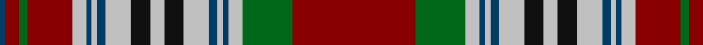

In pattern [BRGRWBWBWKWKWBWBWGR](/patterns/brgrwbwbwkwkwbwbwgr/).

This was sourced from tartans-authority.  It is a [19 stripes tartan](/stripes/stripes19/).

Original link http://www.tartansauthority.com/tartan-ferret/display/3471/

## Attestations

This cloth appears in 2 source records; the oldest owns this page.

- pre 2002 — Metcalf (Clan) (tartans-authority, [record](http://www.tartansauthority.com/tartan-ferret/display/3471/))
- undated — Metcalf (register-of-tartans, [record](https://www.tartanregister.gov.uk/tartanDetails.aspx?ref=5182))

## Thread count
DB/4 DR10 G6 DR32 N10 DB4 N4 DB6 N18 K14 N10 K14 N18 DB6 N4 DB4 N10 G36 DR/88

## Palette
Each colour and its ΔE from the base-6 reference it is a variant of.

| Colour | Shade | Base | ΔE (OKLab) |
|---|---|---|---|
| DB | <code style="background-color:#003C64;">#003C64</code> `#003C64` | B <code style="background-color:#2C4084;">#2C4084</code> | 0.07 |
| DR | <code style="background-color:#880000;">#880000</code> `#880000` | R <code style="background-color:#C80000;">#C80000</code> | 0.14 |
| G | <code style="background-color:#006818;">#006818</code> `#006818` | G <code style="background-color:#006400;">#006400</code> | 0.02 |
| K | <code style="background-color:#101010;">#101010</code> `#101010` | K <code style="background-color:#000000;">#000000</code> | 0.17 |
| N | <code style="background-color:#C0C0C0;">#C0C0C0</code> `#C0C0C0` | W <code style="background-color:#F4F4F0;">#F4F4F0</code> | 0.16 |

## Nearest tartans

The nearest existing variants by ΔTartan distance.

1. [MacDougall Clan Tartan Tartan Number: 1776. Earliest known date: 1977 Matched to a sample by B Urquhart in 2004, from Lochcarron reiver cloth. The purple colour was lightened considerably to a pale mauve, giving an almost equal prominence to the white. See products available Copyright © Blair Urquhart, Comrie, 2015](/setts/s20/w4r4wa4r44b4r4g16r16g16wa4r4wa4b18r6g2r6g44r4wa4w4-b2c2c80-g006818-rc80000-we0e0e0-wac49cd8/) — ΔT 0.77
1. [MacDougall (Paton)](/setts/s20/w2b4r2g44r6g2r6ba18b4r2b4g16r16g16r2ba2r44b4r4w2-b5a008c-ba2c4084-g005020-rdc0000-we0e0e0/) — ΔT 0.84
1. [MacColl Hunting](/setts/s18/r12ra6r12b44r14ra4w2r4b4r4w2ra4r14g44r14g4r4ra4-b2c2c80-g006818-rc80000-raa00048-we0e0e0/) — ΔT 1.10
1. [Brown-Wells (Personal)](/setts/s16/r8b2y6b2r40b8g18r6g18b8w6b2g14b4r12y4-b1c1c1c-g00643c-rc82828-w98c8e8-yd8b000/) — ΔT 1.10
1. [MacDougall 7](/setts/s20/w2b4r2g44r6g2r6ba18b4r2b4g16r16g16r2ba2r44b4r4w2-b800080-ba304080-g008000-rc00000-we0e0e0/) — ΔT 1.10
1. [Nike Golf Dark (Corporate)](/setts/s17/r10k40b2k4b2k4b4k4b10ra4b4ra4b4ra6b4ra20w6-b5c5c5c-k101010-rc80000-ra888888-wfcfcfc/) — ΔT 1.11
1. [Read Dress, Peter (Personal)](/setts/s18/r16k48ra2k2ra2k2ra2k2ra16k2ra2k2ra2k2ra2r40y2w2-k101010-rc04c08-ra888888-wfcfcfc-ye8c000/) — ΔT 1.11
1. [MacDougall](/setts/s20/w1r3ra1g23ra3g1ra3b6r4ra1r4g6ra6g6ra2b1ra24r1ra1w1-b00004c-g004c00-rff4040-rac80000-wd0d0d0/) — ΔT 1.11
1. [Stewart of Ardshiel](/setts/s18/g14r6ra2k3r65k2b2r6k34r6b2k2r4g66r12ra2k2b4-b5480b0-g008000-k000030-rc00000-rad03030/) — ΔT 1.15
1. [Wilson, Janet (1780 Original)](/setts/s22/b60w4ba6g6ba6g6ba6g32r6g6r6g6r6g6r6g50r30g8ba8r16w4r30-b440044-ba5c8ca8-g285800-rc80000-we0e0e0/) — ΔT 1.16

## Neighbour map

Every grey dot is one of 15726 variants placed by the first two principal components of the ΔTartan feature space (44% of its variance). Red is this tartan; blue dots are its nearest — click one to open its page.

<svg viewBox="0 0 640 380" role="img" style="max-width:100%;height:auto;border:1px solid #e0e0e0;border-radius:4px;display:block" xmlns="http://www.w3.org/2000/svg"><image href="/nn/cloud.v1.png" width="640" height="380"/><a href="/setts/s20/w4r4wa4r44b4r4g16r16g16wa4r4wa4b18r6g2r6g44r4wa4w4-b2c2c80-g006818-rc80000-we0e0e0-wac49cd8/"><circle cx="232.0" cy="82.6" r="4" fill="#3465a4"><title>MacDougall Clan Tartan Tartan Number: 1776. Earliest known date: 1977 Matched to a sample by B Urquhart in 2004, from Lochcarron reiver cloth. The purple colour was lightened considerably to a pale mauve, giving an almost equal prominence to the white. See products available Copyright © Blair Urquhart, Comrie, 2015</title></circle></a><a href="/setts/s20/w2b4r2g44r6g2r6ba18b4r2b4g16r16g16r2ba2r44b4r4w2-b5a008c-ba2c4084-g005020-rdc0000-we0e0e0/"><circle cx="246.5" cy="79.6" r="4" fill="#3465a4"><title>MacDougall (Paton)</title></circle></a><a href="/setts/s18/r12ra6r12b44r14ra4w2r4b4r4w2ra4r14g44r14g4r4ra4-b2c2c80-g006818-rc80000-raa00048-we0e0e0/"><circle cx="228.2" cy="91.4" r="4" fill="#3465a4"><title>MacColl Hunting</title></circle></a><a href="/setts/s16/r8b2y6b2r40b8g18r6g18b8w6b2g14b4r12y4-b1c1c1c-g00643c-rc82828-w98c8e8-yd8b000/"><circle cx="216.0" cy="111.5" r="4" fill="#3465a4"><title>Brown-Wells (Personal)</title></circle></a><a href="/setts/s20/w2b4r2g44r6g2r6ba18b4r2b4g16r16g16r2ba2r44b4r4w2-b800080-ba304080-g008000-rc00000-we0e0e0/"><circle cx="248.2" cy="81.7" r="4" fill="#3465a4"><title>MacDougall 7</title></circle></a><a href="/setts/s17/r10k40b2k4b2k4b4k4b10ra4b4ra4b4ra6b4ra20w6-b5c5c5c-k101010-rc80000-ra888888-wfcfcfc/"><circle cx="190.6" cy="92.5" r="4" fill="#3465a4"><title>Nike Golf Dark (Corporate)</title></circle></a><a href="/setts/s18/r16k48ra2k2ra2k2ra2k2ra16k2ra2k2ra2k2ra2r40y2w2-k101010-rc04c08-ra888888-wfcfcfc-ye8c000/"><circle cx="250.7" cy="57.9" r="4" fill="#3465a4"><title>Read Dress, Peter (Personal)</title></circle></a><a href="/setts/s20/w1r3ra1g23ra3g1ra3b6r4ra1r4g6ra6g6ra2b1ra24r1ra1w1-b00004c-g004c00-rff4040-rac80000-wd0d0d0/"><circle cx="251.5" cy="68.7" r="4" fill="#3465a4"><title>MacDougall</title></circle></a><a href="/setts/s18/g14r6ra2k3r65k2b2r6k34r6b2k2r4g66r12ra2k2b4-b5480b0-g008000-k000030-rc00000-rad03030/"><circle cx="260.9" cy="51.9" r="4" fill="#3465a4"><title>Stewart of Ardshiel</title></circle></a><a href="/setts/s22/b60w4ba6g6ba6g6ba6g32r6g6r6g6r6g6r6g50r30g8ba8r16w4r30-b440044-ba5c8ca8-g285800-rc80000-we0e0e0/"><circle cx="197.9" cy="101.4" r="4" fill="#3465a4"><title>Wilson, Janet (1780 Original)</title></circle></a><circle cx="215.3" cy="74.6" r="5" fill="#c00000"/></svg>

ID: /setts/s19/r88g36w10b4w4b6w18k14w10k14w18b6w4b4w10r32g6r10b4-b003c64-g006818-k101010-r880000-wc0c0c0/
