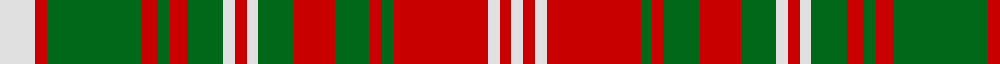

In pattern [WRGRGRGWRWGRGRGRWRW](/patterns/wrgrgrgwrwgrgrgrwrw/).

This was sourced from register-of-tartans.  It is a [19 stripes tartan](/stripes/stripes19/).

Original link https://www.tartanregister.gov.uk/tartanDetails.aspx?ref=2404

## Attestations

This cloth appears in 2 source records; the oldest owns this page.

- 01/01/2005 — MacDougall (Lochcarron) (register-of-tartans, [record](https://www.tartanregister.gov.uk/tartanDetails.aspx?ref=2404))
- pre 2005 — MacDougall - 2005 (Lochcarron) (tartans-authority, [record](http://www.tartansauthority.com/tartan-ferret/display/6634/))

## Thread count
LN/12 R4 G32 R6 G4 R6 G12 LN4 R4 LN4 G12 R14 G12 R4 G4 R32 LN4 R4 LN/4

## Palette
Each colour and its ΔE from the base-6 reference it is a variant of.

| Colour | Shade | Base | ΔE (OKLab) |
|---|---|---|---|
| G | <code style="background-color:#006818;">#006818</code> `#006818` | G <code style="background-color:#006100;">#006100</code> | 0.02 |
| LN | <code style="background-color:#E0E0E0;">#E0E0E0</code> `#E0E0E0` | W <code style="background-color:#F7F7F7;">#F7F7F7</code> | 0.07 |
| R | <code style="background-color:#C80000;">#C80000</code> `#C80000` | R <code style="background-color:#CC0000;">#CC0000</code> | 0.01 |

## Nearest tartans

The nearest existing variants by ΔTartan distance.

1. [Snaefell](/setts/s14/w16g14ga2g2ga2g2ga22g2ga2g2ga2g14w16g3x2~g604000-ga685838-we8e4d0/) — ΔT 1.22
1. [Strathearn District Tartan Tartan Number: 1890. Earliest known date: 1812 Ref: The Setts No. 244 The Strathearn tartan is said to have been worn by the father of Queen Victoria H.R.H. Edward, Duke of Kent, who was also Duke of Strathearn. As Colonel of the Royal Scots Regiment 1801-1821, he apparently sent a sample to Wilson's of Bannockburn with a view to 'dressing the gallant corps'. It it also the adopted tartan of the Comrie Pipe Band who regularly march past the Scottish Tartans Museum in village main street. See products available Copyright © Blair Urquhart, Comrie, 2015](/setts/s16/y1r1g6y8r1g1r1y8r6g1y1g1r6g6r1y1x2~g006818-rc80000-ye8c000/) — ΔT 1.24
1. [Frazer Major Portrait Tartan Tartan Number: 1865. Earliest known date: 1988 Reconstructed from portrait by the Scottish Tartan Society for Jacobite figures in Scotch Whisky Heritage Centre See products available Copyright © Blair Urquhart, Comrie, 2015](/setts/s15/w2r18w2r5w2g13w2g13w2r5w2g13w2g13w2x2~g006818-rc80000-we0e0e0/) — ΔT 1.33
1. [Fraser of Castle Leathers, Major James](/setts/s15/w2r19w2r5w2g13w2g12w2r5w2g14w2g12w2x2~g006818-rc80000-wc0c0c0/) — ΔT 1.34
1. [MacNeish](/setts/s12/g6r3k3r24g4k10r2g4r2g24r6g2x2~g289c18-k101010-rc80000/) — ΔT 1.34
1. [Aubigny Auld Alliance District Tartan Tartan Number: 2159. Earliest known date: 1994 The Aubigny Auld Alliance tartan was created using the Stewart of Atholl tartan and the colours of the Aubigny sur Nere town crest. The Stewart of Atholl tartan was used as the basis for this tartan because of the 16th century Chateau d'Aubigny sur Nere which was built by the Stewarts. The name arises from the Auld Alliance, a cultural and diplomatic treaty between Scotland and France, which was at it's strongest during conflicts with England, the common enemy. See products available Copyright © Blair Urquhart, Comrie, 2015](/setts/s17/r9k9y4k2y3k2y20k2y3k2y4k9r18k2r5k2r9x2~k101010-rc8002c-ye8c000/) — ΔT 1.42
1. [Strathearn](/setts/s16/y1r1g6y8r1g1r1y8r6g1y1g1r6g6r1y1x2~g008000-rc00000-yf0c000/) — ΔT 1.46
1. [Stewart of Urrard](/setts/s14/g6r2g2r18b9r3g3r3b9r3g24r2g2r4x2~b304080-g008000-rc00000/) — ΔT 1.46
1. [Strathearn (Royal)](/setts/s11/g1r1y8r6g1y1g1r6g6r1y1x4~g006818-rc80000-ye8c000/) — ΔT 1.51
1. [Strathearn](/setts/s30/r1g6r6g1y1g1r6y8r1g1r1y8g6r1y1r1g6y8r1g1r1y8r6g1y1g1r6g6r1y1x2~g006818-rc80000-ye8c000/) — ΔT 1.52

## Neighbour map

Every grey dot is one of 15726 variants placed by the first two principal components of the ΔTartan feature space (44% of its variance). Red is this tartan; blue dots are its nearest — click one to open its page.

<svg viewBox="0 0 640 380" role="img" style="max-width:100%;height:auto;border:1px solid #e0e0e0;border-radius:4px;display:block" xmlns="http://www.w3.org/2000/svg"><image href="/nn/cloud.v1.png" width="640" height="380"/><a href="/setts/s14/w16g14ga2g2ga2g2ga22g2ga2g2ga2g14w16g3x2~g604000-ga685838-we8e4d0/"><circle cx="212.5" cy="159.4" r="4" fill="#3465a4"><title>Snaefell</title></circle></a><a href="/setts/s16/y1r1g6y8r1g1r1y8r6g1y1g1r6g6r1y1x2~g006818-rc80000-ye8c000/"><circle cx="200.2" cy="168.3" r="4" fill="#3465a4"><title>Strathearn District Tartan Tartan Number: 1890. Earliest known date: 1812 Ref: The Setts No. 244 The Strathearn tartan is said to have been worn by the father of Queen Victoria H.R.H. Edward, Duke of Kent, who was also Duke of Strathearn. As Colonel of the Royal Scots Regiment 1801-1821, he apparently sent a sample to Wilson's of Bannockburn with a view to 'dressing the gallant corps'. It it also the adopted tartan of the Comrie Pipe Band who regularly march past the Scottish Tartans Museum in village main street. See products available Copyright © Blair Urquhart, Comrie, 2015</title></circle></a><a href="/setts/s15/w2r18w2r5w2g13w2g13w2r5w2g13w2g13w2x2~g006818-rc80000-we0e0e0/"><circle cx="274.4" cy="179.3" r="4" fill="#3465a4"><title>Frazer Major Portrait Tartan Tartan Number: 1865. Earliest known date: 1988 Reconstructed from portrait by the Scottish Tartan Society for Jacobite figures in Scotch Whisky Heritage Centre See products available Copyright © Blair Urquhart, Comrie, 2015</title></circle></a><a href="/setts/s15/w2r19w2r5w2g13w2g12w2r5w2g14w2g12w2x2~g006818-rc80000-wc0c0c0/"><circle cx="287.9" cy="182.4" r="4" fill="#3465a4"><title>Fraser of Castle Leathers, Major James</title></circle></a><a href="/setts/s12/g6r3k3r24g4k10r2g4r2g24r6g2x2~g289c18-k101010-rc80000/"><circle cx="266.7" cy="165.6" r="4" fill="#3465a4"><title>MacNeish</title></circle></a><a href="/setts/s17/r9k9y4k2y3k2y20k2y3k2y4k9r18k2r5k2r9x2~k101010-rc8002c-ye8c000/"><circle cx="193.9" cy="150.9" r="4" fill="#3465a4"><title>Aubigny Auld Alliance District Tartan Tartan Number: 2159. Earliest known date: 1994 The Aubigny Auld Alliance tartan was created using the Stewart of Atholl tartan and the colours of the Aubigny sur Nere town crest. The Stewart of Atholl tartan was used as the basis for this tartan because of the 16th century Chateau d'Aubigny sur Nere which was built by the Stewarts. The name arises from the Auld Alliance, a cultural and diplomatic treaty between Scotland and France, which was at it's strongest during conflicts with England, the common enemy. See products available Copyright © Blair Urquhart, Comrie, 2015</title></circle></a><a href="/setts/s16/y1r1g6y8r1g1r1y8r6g1y1g1r6g6r1y1x2~g008000-rc00000-yf0c000/"><circle cx="202.4" cy="168.9" r="4" fill="#3465a4"><title>Strathearn</title></circle></a><a href="/setts/s14/g6r2g2r18b9r3g3r3b9r3g24r2g2r4x2~b304080-g008000-rc00000/"><circle cx="267.7" cy="171.2" r="4" fill="#3465a4"><title>Stewart of Urrard</title></circle></a><a href="/setts/s11/g1r1y8r6g1y1g1r6g6r1y1x4~g006818-rc80000-ye8c000/"><circle cx="232.5" cy="184.9" r="4" fill="#3465a4"><title>Strathearn (Royal)</title></circle></a><a href="/setts/s30/r1g6r6g1y1g1r6y8r1g1r1y8g6r1y1r1g6y8r1g1r1y8r6g1y1g1r6g6r1y1x2~g006818-rc80000-ye8c000/"><circle cx="181.0" cy="143.7" r="4" fill="#3465a4"><title>Strathearn</title></circle></a><circle cx="227.7" cy="164.7" r="5" fill="#c00000"/></svg>

ID: /setts/s19/w6r2g16r3g2r3g6w2r2w2g6r7g6r2g2r16w2r2w2x2~g006818-rc80000-we0e0e0/
