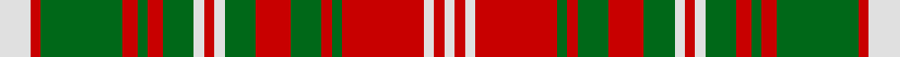

This page is one **sett** — a single exact thread-count. It belongs to the [tartan](/tartans/ln6r2g16r3g2r3g6ln2r2ln2g6r7g6r2g2r16ln2r2ln2/)
(the same proportion at any scale), whose colour order is pattern [WRGRGRGWRWGRGRGRWRW](/stripes/wrgrgrgwrwgrgrgrwrw/).

Sourced from register-of-tartans.  It is a [19 stripe tartan](/stripes/stripes19/).

Original link https://www.tartanregister.gov.uk/tartanDetails.aspx?ref=2404

2 attestations — the source records this cloth was collapsed from (oldest owns this page)

<ul>
<li>01/01/2005 — MacDougall (Lochcarron) (register-of-tartans, <a href="https://www.tartanregister.gov.uk/tartanDetails.aspx?ref=2404">record</a>)</li>
<li>pre 2005 — MacDougall - 2005 (Lochcarron) (tartans-authority, <a href="http://www.tartansauthority.com/tartan-ferret/display/6634/">record</a>)</li>
</ul>

## Register references

External register numbers recorded for this tartan.

- Scottish Register of Tartans: [2404](https://www.tartanregister.gov.uk/tartanDetails.aspx?ref=2404)
- Scottish Tartans Authority (ITI): 6634

## Thread count
LN/12 R4 G32 R6 G4 R6 G12 LN4 R4 LN4 G12 R14 G12 R4 G4 R32 LN4 R4 LN/4

## Palette
Each colour and the base-6 reference it is a variant of.

| Colour | Shade | Base |
|---|---|---|
| G | <code style="background-color:#006818;">#006818</code> `oklch(45.0% 0.142 145.0)` <small>#006818</small> | G <code style="background-color:#006100;">#006100</code> |
| LN | <code style="background-color:#E0E0E0;">#E0E0E0</code> `oklch(90.7% 0.000 89.9)` <small>#E0E0E0</small> | W <code style="background-color:#F7F7F7;">#F7F7F7</code> |
| R | <code style="background-color:#C80000;">#C80000</code> `oklch(52.3% 0.215 29.2)` <small>#C80000</small> | R <code style="background-color:#CC0000;">#CC0000</code> |

## Nearest tartans

The nearest existing variants by ΔTartan distance, with this tartan at the top so the swatches line up against it.

ΔTartan

Tartan

Sett

—

<a href="/ttd/edit/#slug=w6r2g16r3g2r3g6w2r2w2g6r7g6r2g2r16w2r2w2~x2">MacDougall (Lochcarron)</a> <a class="nn-out" href="/setts/s19/w6r2g16r3g2r3g6w2r2w2g6r7g6r2g2r16w2r2w2~x2/" title="open its dictionary page">↗</a>

1.22

<a href="/ttd/edit/#slug=w16dy14y2dy2y2dy2y22dy2y2dy2y2dy14w16dy3~x2">Snaefell</a> <a class="nn-out" href="/setts/s14/w16dy14y2dy2y2dy2y22dy2y2dy2y2dy14w16dy3~x2/" title="open its dictionary page">↗</a>

1.34

<a href="/ttd/edit/#slug=lb2r19lb2r5lb2g13lb2g12lb2r5lb2g14lb2g12lb2~x2">Fraser of Castle Leathers, Major James</a> <a class="nn-out" href="/setts/s15/lb2r19lb2r5lb2g13lb2g12lb2r5lb2g14lb2g12lb2~x2/" title="open its dictionary page">↗</a>

1.34

<a href="/ttd/edit/#slug=g6r3k3r24g4k10r2g4r2g24r6g2~x2">MacNeish</a> <a class="nn-out" href="/setts/s12/g6r3k3r24g4k10r2g4r2g24r6g2~x2/" title="open its dictionary page">↗</a>

1.43

<a href="/ttd/edit/#slug=r9k9ly4k2ly3k2ly20k2ly3k2ly4k9r18k2r5k2r9~x2">Aubigny Auld Alliance District Tartan Tartan Number: 2159. Earliest known date: 1994 The Aubigny Auld Alliance tartan was created using the Stewart of Atholl tartan and the colours of the Aubigny sur Nere town crest. The Stewart of Atholl tartan was used as the basis for this tartan because of the 16th century Chateau d'Aubigny sur Nere which was built by the Stewarts. The name arises from the Auld Alliance, a cultural and diplomatic treaty between Scotland and France, which was at it's strongest during conflicts with England, the common enemy. See products available Copyright © Blair Urquhart, Comrie, 2015</a> <a class="nn-out" href="/setts/s17/r9k9ly4k2ly3k2ly20k2ly3k2ly4k9r18k2r5k2r9~x2/" title="open its dictionary page">↗</a>

1.45

<a href="/ttd/edit/#slug=ly1r1g6ly8r1g1r1ly8r6g1ly1g1r6g6r1ly1~x2">Strathearn</a> <a class="nn-out" href="/setts/s16/ly1r1g6ly8r1g1r1ly8r6g1ly1g1r6g6r1ly1~x2/" title="open its dictionary page">↗</a>

1.46

<a href="/ttd/edit/#slug=g6r2g2r18db9r3g3r3db9r3g24r2g2r4~x2">Stewart of Urrard</a> <a class="nn-out" href="/setts/s14/g6r2g2r18db9r3g3r3db9r3g24r2g2r4~x2/" title="open its dictionary page">↗</a>

1.51

<a href="/ttd/edit/#slug=g1r1ly8r6g1ly1g1r6g6r1ly1~x4">Strathearn (Royal)</a> <a class="nn-out" href="/setts/s11/g1r1ly8r6g1ly1g1r6g6r1ly1~x4/" title="open its dictionary page">↗</a>

1.52

<a href="/ttd/edit/#slug=r1g6r6g1ly1g1r6ly8r1g1r1ly8g6r1ly1r1g6ly8r1g1r1ly8r6g1ly1g1r6g6r1ly1~x2">Strathearn</a> <a class="nn-out" href="/setts/s30/r1g6r6g1ly1g1r6ly8r1g1r1ly8g6r1ly1r1g6ly8r1g1r1ly8r6g1ly1g1r6g6r1ly1~x2/" title="open its dictionary page">↗</a>

1.54

<a href="/ttd/edit/#slug=r45db4r4g48r4db4r4db15r4db4r40g4r4g30">Bruce, Old</a> <a class="nn-out" href="/setts/s14/r45db4r4g48r4db4r4db15r4db4r40g4r4g30/" title="open its dictionary page">↗</a>

1.57

<a href="/setts/s14/o16k4w2k4o6o11o2o16~x2/">Sydney (Nova Scotia) #2</a>

## Neighbour map

Every grey dot is one of 14299 variants placed by the first two principal components of the ΔTartan feature space (44% of its variance). Red is this tartan; blue dots are its nearest — click one to open its page.

<svg viewBox="0 0 640 380" role="img" style="max-width:100%;height:auto;border:1px solid #e0e0e0;border-radius:4px;display:block" xmlns="http://www.w3.org/2000/svg"><image href="/nn/cloud.v1.png" width="640" height="380"/><a href="/setts/s14/w16dy14y2dy2y2dy2y22dy2y2dy2y2dy14w16dy3~x2/"><circle cx="214.4" cy="157.9" r="4" fill="#3465a4"><title>Snaefell</title></circle></a><a href="/setts/s15/lb2r19lb2r5lb2g13lb2g12lb2r5lb2g14lb2g12lb2~x2/"><circle cx="289.3" cy="181.5" r="4" fill="#3465a4"><title>Fraser of Castle Leathers, Major James</title></circle></a><a href="/setts/s12/g6r3k3r24g4k10r2g4r2g24r6g2~x2/"><circle cx="268.1" cy="162.8" r="4" fill="#3465a4"><title>MacNeish</title></circle></a><a href="/setts/s17/r9k9ly4k2ly3k2ly20k2ly3k2ly4k9r18k2r5k2r9~x2/"><circle cx="194.8" cy="145.9" r="4" fill="#3465a4"><title>Aubigny Auld Alliance District Tartan Tartan Number: 2159. Earliest known date: 1994 The Aubigny Auld Alliance tartan was created using the Stewart of Atholl tartan and the colours of the Aubigny sur Nere town crest. The Stewart of Atholl tartan was used as the basis for this tartan because of the 16th century Chateau d'Aubigny sur Nere which was built by the Stewarts. The name arises from the Auld Alliance, a cultural and diplomatic treaty between Scotland and France, which was at it's strongest during conflicts with England, the common enemy. See products available Copyright © Blair Urquhart, Comrie, 2015</title></circle></a><a href="/setts/s16/ly1r1g6ly8r1g1r1ly8r6g1ly1g1r6g6r1ly1~x2/"><circle cx="203.2" cy="167.3" r="4" fill="#3465a4"><title>Strathearn</title></circle></a><a href="/setts/s14/g6r2g2r18db9r3g3r3db9r3g24r2g2r4~x2/"><circle cx="269.3" cy="172.5" r="4" fill="#3465a4"><title>Stewart of Urrard</title></circle></a><a href="/setts/s11/g1r1ly8r6g1ly1g1r6g6r1ly1~x4/"><circle cx="232.9" cy="182.0" r="4" fill="#3465a4"><title>Strathearn (Royal)</title></circle></a><a href="/setts/s30/r1g6r6g1ly1g1r6ly8r1g1r1ly8g6r1ly1r1g6ly8r1g1r1ly8r6g1ly1g1r6g6r1ly1~x2/"><circle cx="182.0" cy="142.8" r="4" fill="#3465a4"><title>Strathearn</title></circle></a><a href="/setts/s14/r45db4r4g48r4db4r4db15r4db4r40g4r4g30/"><circle cx="321.5" cy="165.0" r="4" fill="#3465a4"><title>Bruce, Old</title></circle></a><a href="/setts/s14/o16k4w2k4o6o11o2o16~x2/"><circle cx="203.8" cy="180.2" r="4" fill="#3465a4"><title>Sydney (Nova Scotia) #2</title></circle></a><circle cx="229.0" cy="162.6" r="5" fill="#c00000"/></svg>

ID: /setts/s19/w6r2g16r3g2r3g6w2r2w2g6r7g6r2g2r16w2r2w2~x2/
