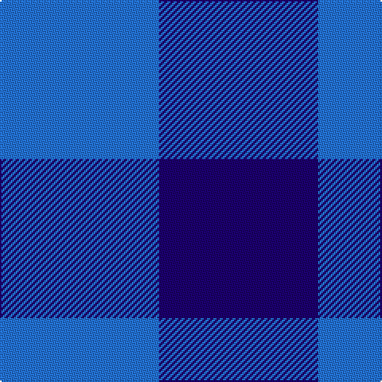

In pattern [BB](/patterns/bb/).

This was sourced from tartans-authority.  It is a [2 stripes tartan](/stripes/stripes2/).

Original link http://www.tartansauthority.com/tartan-ferret/display/3155/

## Thread count
B/100 DB/100

## Palette
Each colour and its ΔE from the base-6 reference it is a variant of.

| Colour | Shade | Base | ΔE (OKLab) |
|---|---|---|---|
| B | <code style="background-color:#2474E8;">#2474E8</code> `#2474E8` | B <code style="background-color:#2C4084;">#2C4084</code> | 0.20 |
| DB | <code style="background-color:#1C0070;">#1C0070</code> `#1C0070` | B <code style="background-color:#2C4084;">#2C4084</code> | 0.14 |

# Sample pattern

ID: /setts/s2/b100ba100-b1c0070-ba2474e8/
