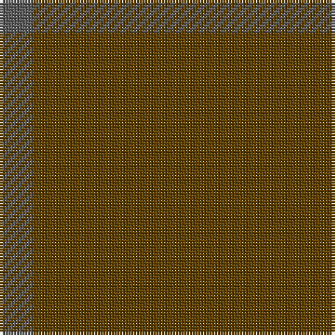

In pattern [BG](/patterns/bg/).

This was sourced from tartans-authority.  It is a [2 stripes tartan](/stripes/stripes2/).

Original link http://www.tartansauthority.com/tartan-ferret/display/11116/

## Thread count
N/12 T/108

## Palette
Each colour and its ΔE from the base-6 reference it is a variant of.

| Colour | Shade | Base | ΔE (OKLab) |
|---|---|---|---|
| N | <code style="background-color:#5C5C5C;">#5C5C5C</code> `#5C5C5C` | B <code style="background-color:#2C4084;">#2C4084</code> | 0.14 |
| T | <code style="background-color:#604000;">#604000</code> `#604000` | G <code style="background-color:#006400;">#006400</code> | 0.14 |

# Sample pattern

ID: /setts/s2/b12g108-b5c5c5c-g604000/
