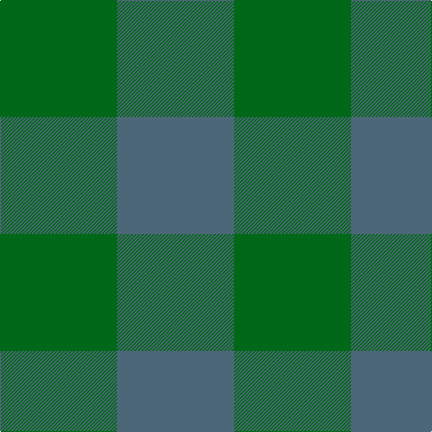

In pattern [BG](/patterns/bg/).

This was sourced from register-of-tartans.  It is a [2 stripes tartan](/stripes/stripes2/).

Original link https://www.tartanregister.gov.uk/tartanDetails.aspx?ref=1567

## Attestations

This cloth appears in 2 source records; the oldest owns this page.

- 01/01/1986 — Hafren (Personal) (register-of-tartans, [record](https://www.tartanregister.gov.uk/tartanDetails.aspx?ref=1567))
- 1986-1993 — Hafren (Personal) (tartans-authority, [record](http://www.tartansauthority.com/tartan-ferret/display/7073/))

## Thread count
G/130 N/130

## Palette
Each colour and its ΔE from the base-6 reference it is a variant of.

| Colour | Shade | Base | ΔE (OKLab) |
|---|---|---|---|
| G | <code style="background-color:#006818;">#006818</code> `#006818` | G <code style="background-color:#006400;">#006400</code> | 0.02 |
| N | <code style="background-color:#4C6878;">#4C6878</code> `#4C6878` | B <code style="background-color:#2C4084;">#2C4084</code> | 0.14 |

# Sample pattern

ID: /setts/s2/b130g130-b4c6878-g006818/
