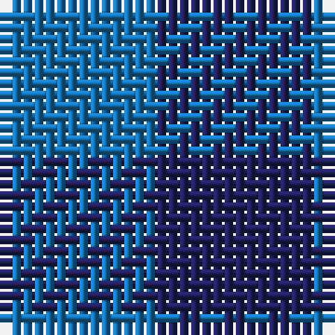

**Bands:** [BB](/stripes/bb/) · **Stripes:** [B DB](/stripes/stripes2/) B DB

This was sourced from tartans-authority.  It is a [2 band tartan](/bands/bands2/).

Original link http://www.tartansauthority.com/tartan-ferret/display/8968/

## Variants

Other setts woven to the same stripe pattern.

- [Rob Roy, Blue (Fashion)](/setts/s2/b1db1~x100/)

## Thread count
B/14 DB/14

## Palette
Each colour and its ΔE from the base-6 reference it is a variant of.

| Colour | Shade | Base | ΔE (OKLab) |
|---|---|---|---|
| B | <code style="background-color:#1474B4;">#1474B4</code> `#1474B4` | B <code style="background-color:#2A418A;">#2A418A</code> | 0.15 |
| DB | <code style="background-color:#202060;">#202060</code> `#202060` | B <code style="background-color:#2A418A;">#2A418A</code> | 0.11 |

# Sample pattern

## Nearest tartans

The nearest existing variants by ΔTartan distance.

1. [Rob Roy, Blue (Fashion)](/setts/s2/b1db1~x100/) — ΔT 1.74
1. [Wilson's No.172](/setts/s2/k9t8~x2/) — ΔT 2.88
1. [Wilson's No.116 (light)](/setts/s2/y9dp8~x2/) — ΔT 2.93
1. [Wilson's No.210](/setts/s2/g7t6~x2/) — ΔT 2.96
1. [Rob Roy, Blue & Red (Fashion)](/setts/s2/db1r1~x100/) — ΔT 3.00
1. [Cairnbulg & Inverllocjy Fisher Plaid](/setts/s2/db1r1~x14/) — ΔT 3.00
1. [Buffalo Plaid](/setts/s2/db1k1~x100/) — ΔT 3.09
1. [Wilson's, No 116](/setts/s2/g1p1~x16/) — ΔT 3.20
1. [Glenlyon](/setts/s3/db8dg7k8~x2/) — ΔT 3.21
1. [Tartan Army](/setts/s2/db2k1~x4/) — ΔT 3.51

## Neighbour map

Every grey dot is one of 14313 variants placed by the first two principal components of the ΔTartan feature space (44% of its variance). Red is this tartan; blue dots are its nearest — click one to open its page.

<svg viewBox="0 0 640 380" role="img" style="max-width:100%;height:auto;border:1px solid #e0e0e0;border-radius:4px;display:block" xmlns="http://www.w3.org/2000/svg"><image href="/nn/cloud.v1.png" width="640" height="380"/><a href="/setts/s2/b1db1~x100/"><circle cx="177.2" cy="366.0" r="4" fill="#3465a4"><title>Rob Roy, Blue (Fashion)</title></circle></a><a href="/setts/s2/k9t8~x2/"><circle cx="171.5" cy="366.0" r="4" fill="#3465a4"><title>Wilson's No.172</title></circle></a><a href="/setts/s2/y9dp8~x2/"><circle cx="233.8" cy="366.0" r="4" fill="#3465a4"><title>Wilson's No.116 (light)</title></circle></a><a href="/setts/s2/g7t6~x2/"><circle cx="245.6" cy="366.0" r="4" fill="#3465a4"><title>Wilson's No.210</title></circle></a><a href="/setts/s2/db1r1~x100/"><circle cx="236.2" cy="366.0" r="4" fill="#3465a4"><title>Rob Roy, Blue &amp; Red (Fashion)</title></circle></a><a href="/setts/s2/db1r1~x14/"><circle cx="236.2" cy="366.0" r="4" fill="#3465a4"><title>Cairnbulg &amp; Inverllocjy Fisher Plaid</title></circle></a><a href="/setts/s2/db1k1~x100/"><circle cx="288.2" cy="366.0" r="4" fill="#3465a4"><title>Buffalo Plaid</title></circle></a><a href="/setts/s2/g1p1~x16/"><circle cx="160.4" cy="366.0" r="4" fill="#3465a4"><title>Wilson's, No 116</title></circle></a><a href="/setts/s3/db8dg7k8~x2/"><circle cx="109.7" cy="366.0" r="4" fill="#3465a4"><title>Glenlyon</title></circle></a><a href="/setts/s2/db2k1~x4/"><circle cx="396.9" cy="366.0" r="4" fill="#3465a4"><title>Tartan Army</title></circle></a><circle cx="210.5" cy="366.0" r="5" fill="#c00000"/></svg>

ID: /setts/s2/b1db1~x14/
