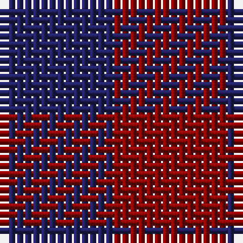

In pattern [BR](/patterns/br/).

This was sourced from tartans-authority.  It is a [2 stripes tartan](/stripes/stripes2/).

Original link http://www.tartansauthority.com/tartan-ferret/display/8969/

## Thread count
DB/14 DR/14

## Palette
Each colour and its ΔE from the base-6 reference it is a variant of.

| Colour | Shade | Base | ΔE (OKLab) |
|---|---|---|---|
| DB | <code style="background-color:#202060;">#202060</code> `#202060` | B <code style="background-color:#2A418A;">#2A418A</code> | 0.11 |
| DR | <code style="background-color:#880000;">#880000</code> `#880000` | R <code style="background-color:#CC0000;">#CC0000</code> | 0.15 |

# Sample pattern

## Nearest tartans

The nearest existing variants by ΔTartan distance.

1. [Rob Roy, Blue & Red (Fashion)](/setts/s2/b1r1~b202060-r880000~x100/) — ΔT 0.00
1. [Wilson's No.116 (light)](/setts/s2/g9b8~b440044-g5c6428~x2/) — ΔT 1.63
1. [Masai Shuka 02 (Artefact)](/setts/s2/b1r1~b2c2c80-rc80000~x20/) — ΔT 1.97
1. [Moncreiffe](/setts/s2/g1r1~g11450d-raa0000~x2/) — ΔT 2.19
1. [Dice (Name?)](/setts/s2/b1r1~b1c1c50-rc80000~x100/) — ΔT 2.20
1. [Moncreiffe D](/setts/s3/r1g1r1~g11450d-raa0000~x2/) — ΔT 2.73
1. [Moncreiffe D](/setts/s3/r1g1r1~g11450d-raa0000/) — ΔT 2.73
1. [Wilson's No.099](/setts/s2/g14r13~g285800-rc80000~x2/) — ΔT 2.81
1. [Wilson's, No 116](/setts/s2/b1g1~b800080-g008000~x16/) — ΔT 2.84
1. [Rob Roy Macgregor](/setts/s2/k1r1~k101010-rc80000~x172/) — ΔT 2.84

## Neighbour map

Every grey dot is one of 15726 variants placed by the first two principal components of the ΔTartan feature space (44% of its variance). Red is this tartan; blue dots are its nearest — click one to open its page.

<svg viewBox="0 0 640 380" role="img" style="max-width:100%;height:auto;border:1px solid #e0e0e0;border-radius:4px;display:block" xmlns="http://www.w3.org/2000/svg"><image href="/nn/cloud.v1.png" width="640" height="380"/><a href="/setts/s2/b1r1~b202060-r880000~x100/"><circle cx="236.5" cy="366.0" r="4" fill="#3465a4"><title>Rob Roy, Blue &amp; Red (Fashion)</title></circle></a><a href="/setts/s2/g9b8~b440044-g5c6428~x2/"><circle cx="233.3" cy="366.0" r="4" fill="#3465a4"><title>Wilson's No.116 (light)</title></circle></a><a href="/setts/s2/b1r1~b2c2c80-rc80000~x20/"><circle cx="187.3" cy="366.0" r="4" fill="#3465a4"><title>Masai Shuka 02 (Artefact)</title></circle></a><a href="/setts/s2/g1r1~g11450d-raa0000~x2/"><circle cx="216.3" cy="366.0" r="4" fill="#3465a4"><title>Moncreiffe</title></circle></a><a href="/setts/s2/b1r1~b1c1c50-rc80000~x100/"><circle cx="179.8" cy="366.0" r="4" fill="#3465a4"><title>Dice (Name?)</title></circle></a><a href="/setts/s3/r1g1r1~g11450d-raa0000~x2/"><circle cx="294.7" cy="366.0" r="4" fill="#3465a4"><title>Moncreiffe D</title></circle></a><a href="/setts/s3/r1g1r1~g11450d-raa0000/"><circle cx="294.7" cy="366.0" r="4" fill="#3465a4"><title>Moncreiffe D</title></circle></a><a href="/setts/s2/g14r13~g285800-rc80000~x2/"><circle cx="220.9" cy="366.0" r="4" fill="#3465a4"><title>Wilson's No.099</title></circle></a><a href="/setts/s2/b1g1~b800080-g008000~x16/"><circle cx="159.4" cy="366.0" r="4" fill="#3465a4"><title>Wilson's, No 116</title></circle></a><a href="/setts/s2/k1r1~k101010-rc80000~x172/"><circle cx="170.6" cy="366.0" r="4" fill="#3465a4"><title>Rob Roy Macgregor</title></circle></a><circle cx="236.5" cy="366.0" r="5" fill="#c00000"/></svg>

ID: /setts/s2/b1r1~b202060-r880000~x14/
