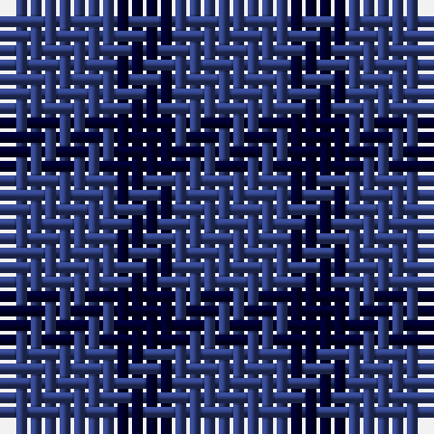

In pattern [BK](/patterns/bk/).

This was sourced from weddslist.  It is a [2 stripes tartan](/stripes/stripes2/).

Original link http://www.weddslist.com/cgi-bin/tartans/pg.pl?source=sts

## Thread count
B/8 DB/4

## Palette
Each colour and its ΔE from the base-6 reference it is a variant of.

| Colour | Shade | Base | ΔE (OKLab) |
|---|---|---|---|
| B | <code style="background-color:#304080;">#304080</code> `#304080` | B <code style="background-color:#2A418A;">#2A418A</code> | 0.02 |
| DB | <code style="background-color:#000030;">#000030</code> `#000030` | K <code style="background-color:#000000;">#000000</code> | 0.17 |

# Sample pattern

## Nearest tartans

The nearest existing variants by ΔTartan distance.

1. [Auchincloss (Personal)](/setts/s4/k68b26k14b28-b2c2c80-k101010/) — ΔT 2.84
1. [Wilson's No 211](/setts/s4/g16b16g4b4-b5a008c-g005020/) — ΔT 3.11
1. [Charles Rennie Mackintosh](/setts/s6/b10ba10b18bb10b10bb10-b1e1e1e-ba32313a-bb5900ce/) — ΔT 3.11
1. [Macintosh, Charles Rennie (Commem)](/setts/s6/b10k10b10k18ba10k10-b2c2c80-ba5c5c5c-k101010/) — ΔT 3.22
1. [Omega Delta Sigma, National Veterans](/setts/s4/k30b80k18r20-b2c2c80-k101010-r888888/) — ΔT 3.45
1. [Ferguson](/setts/s3/b24g20r4-b2c4084-g005020-rdc0000/) — ΔT 3.48
1. [St. Combs Fisher Plaid](/setts/s2/b14ba14-b1474b4-ba202060/) — ΔT 3.50
1. [Agnew](/setts/s3/b106g84r28-b2c2c80-g006818-rc80000/) — ΔT 3.53
1. [Agnew Family Tartan Tartan Number: 182. Earliest known date: 1978 Nothing See products available Copyright © Blair Urquhart, Comrie, 2015](/setts/s3/b53g42r14-b2c2c80-g006818-rc80000/) — ΔT 3.53
1. [Omega Delta Sigma, National Veterans Fraternity](/setts/s4/k30b80k18r20-b003c64-k101010-r888888/) — ΔT 3.54

## Neighbour map

Every grey dot is one of 15726 variants placed by the first two principal components of the ΔTartan feature space (44% of its variance). Red is this tartan; blue dots are its nearest — click one to open its page.

<svg viewBox="0 0 640 380" role="img" style="max-width:100%;height:auto;border:1px solid #e0e0e0;border-radius:4px;display:block" xmlns="http://www.w3.org/2000/svg"><image href="/nn/cloud.v1.png" width="640" height="380"/><a href="/setts/s4/k68b26k14b28-b2c2c80-k101010/"><circle cx="440.9" cy="361.7" r="4" fill="#3465a4"><title>Auchincloss (Personal)</title></circle></a><a href="/setts/s4/g16b16g4b4-b5a008c-g005020/"><circle cx="342.0" cy="338.1" r="4" fill="#3465a4"><title>Wilson's No 211</title></circle></a><a href="/setts/s6/b10ba10b18bb10b10bb10-b1e1e1e-ba32313a-bb5900ce/"><circle cx="244.6" cy="366.0" r="4" fill="#3465a4"><title>Charles Rennie Mackintosh</title></circle></a><a href="/setts/s6/b10k10b10k18ba10k10-b2c2c80-ba5c5c5c-k101010/"><circle cx="255.1" cy="366.0" r="4" fill="#3465a4"><title>Macintosh, Charles Rennie (Commem)</title></circle></a><a href="/setts/s4/k30b80k18r20-b2c2c80-k101010-r888888/"><circle cx="310.0" cy="308.0" r="4" fill="#3465a4"><title>Omega Delta Sigma, National Veterans</title></circle></a><a href="/setts/s3/b24g20r4-b2c4084-g005020-rdc0000/"><circle cx="330.7" cy="338.1" r="4" fill="#3465a4"><title>Ferguson</title></circle></a><a href="/setts/s2/b14ba14-b1474b4-ba202060/"><circle cx="214.8" cy="366.0" r="4" fill="#3465a4"><title>St. Combs Fisher Plaid</title></circle></a><a href="/setts/s3/b106g84r28-b2c2c80-g006818-rc80000/"><circle cx="252.6" cy="345.5" r="4" fill="#3465a4"><title>Agnew</title></circle></a><a href="/setts/s3/b53g42r14-b2c2c80-g006818-rc80000/"><circle cx="252.6" cy="345.5" r="4" fill="#3465a4"><title>Agnew Family Tartan Tartan Number: 182. Earliest known date: 1978 Nothing See products available Copyright © Blair Urquhart, Comrie, 2015</title></circle></a><a href="/setts/s4/k30b80k18r20-b003c64-k101010-r888888/"><circle cx="317.9" cy="315.5" r="4" fill="#3465a4"><title>Omega Delta Sigma, National Veterans Fraternity</title></circle></a><circle cx="399.7" cy="366.0" r="5" fill="#c00000"/></svg>

ID: /setts/s2/b8k4-b304080-k000030/
