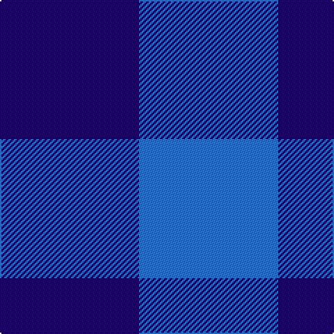

This page is one **sett** — a single exact thread-count. It belongs to the [tartan](/tartans/db1b1/)
(the same proportion at any scale), whose colour order is pattern [BB](/stripes/bb/).

Sourced from tartans-authority.  It is a [2 stripe tartan](/stripes/stripes2/).

Original link http://www.tartansauthority.com/tartan-ferret/display/3155/

## Also known as

This cloth is also recorded under:

- Rob Roy, Blue

## Thread count
DB/100 B/100

## Palette
Each colour and the base-6 reference it is a variant of.

| Colour | Shade | Base |
|---|---|---|
| B | <code style="background-color:#2474E8;">#2474E8</code> `oklch(57.8% 0.192 258.7)` <small>#2474E8</small> | B <code style="background-color:#2A418A;">#2A418A</code> |
| DB | <code style="background-color:#1C0070;">#1C0070</code> `oklch(26.3% 0.162 277.1)` <small>#1C0070</small> | B <code style="background-color:#2A418A;">#2A418A</code> |

# Sample pattern

## Nearest tartans

The nearest existing variants by ΔTartan distance, with this tartan at the top so the swatches line up against it.

ΔTartan

Tartan

Sett

—

<a href="/ttd/edit/#slug=db1b1~x100">Rob Roy, Blue (Fashion)</a> <a class="nn-out" href="/setts/s2/db1b1~x100/" title="open its dictionary page">↗</a>

1.74

<a href="/ttd/edit/#slug=db1b1~x14">St. Combs Fisher Plaid</a> <a class="nn-out" href="/setts/s2/db1b1~x14/" title="open its dictionary page">↗</a>

2.98

<a href="/ttd/edit/#slug=k9t8~x2">Wilson's No.172</a> <a class="nn-out" href="/setts/s2/k9t8~x2/" title="open its dictionary page">↗</a>

3.72

<a href="/ttd/edit/#slug=db1w1~x20">Sillitoe</a> <a class="nn-out" href="/setts/s2/db1w1~x20/" title="open its dictionary page">↗</a>

3.79

<a href="/ttd/edit/#slug=g1p1~x16">Wilson's, No 116</a> <a class="nn-out" href="/setts/s2/g1p1~x16/" title="open its dictionary page">↗</a>

3.99

<a href="/ttd/edit/#slug=y9dp8~x2">Wilson's No.116 (light)</a> <a class="nn-out" href="/setts/s2/y9dp8~x2/" title="open its dictionary page">↗</a>

4.06

<a href="/ttd/edit/#slug=db2k1~x4">Tartan Army</a> <a class="nn-out" href="/setts/s2/db2k1~x4/" title="open its dictionary page">↗</a>

4.06

<a href="/ttd/edit/#slug=db1r1~x20">Masai Shuka 02 (Artefact)</a> <a class="nn-out" href="/setts/s2/db1r1~x20/" title="open its dictionary page">↗</a>

4.08

<a href="/ttd/edit/#slug=db1r1~x100">Rob Roy, Blue &amp; Red (Fashion)</a> <a class="nn-out" href="/setts/s2/db1r1~x100/" title="open its dictionary page">↗</a>

4.08

<a href="/ttd/edit/#slug=db1r1~x14">Cairnbulg &amp; Inverllocjy Fisher Plaid</a> <a class="nn-out" href="/setts/s2/db1r1~x14/" title="open its dictionary page">↗</a>

4.16

<a href="/ttd/edit/#slug=y1m1~x2">Une Energie Nouvelle (Corporate) XXX</a> <a class="nn-out" href="/setts/s2/y1m1~x2/" title="open its dictionary page">↗</a>

## Neighbour map

Every grey dot is one of 14299 variants placed by the first two principal components of the ΔTartan feature space (44% of its variance). Red is this tartan; blue dots are its nearest — click one to open its page.

<svg viewBox="0 0 640 380" role="img" style="max-width:100%;height:auto;border:1px solid #e0e0e0;border-radius:4px;display:block" xmlns="http://www.w3.org/2000/svg"><image href="/nn/cloud.v1.png" width="640" height="380"/><a href="/setts/s2/db1b1~x14/"><circle cx="210.9" cy="366.0" r="4" fill="#3465a4"><title>St. Combs Fisher Plaid</title></circle></a><a href="/setts/s2/k9t8~x2/"><circle cx="172.0" cy="366.0" r="4" fill="#3465a4"><title>Wilson's No.172</title></circle></a><a href="/setts/s2/db1w1~x20/"><circle cx="109.5" cy="366.0" r="4" fill="#3465a4"><title>Sillitoe</title></circle></a><a href="/setts/s2/g1p1~x16/"><circle cx="160.7" cy="366.0" r="4" fill="#3465a4"><title>Wilson's, No 116</title></circle></a><a href="/setts/s2/y9dp8~x2/"><circle cx="234.1" cy="366.0" r="4" fill="#3465a4"><title>Wilson's No.116 (light)</title></circle></a><a href="/setts/s2/db2k1~x4/"><circle cx="397.2" cy="366.0" r="4" fill="#3465a4"><title>Tartan Army</title></circle></a><a href="/setts/s2/db1r1~x20/"><circle cx="187.4" cy="366.0" r="4" fill="#3465a4"><title>Masai Shuka 02 (Artefact)</title></circle></a><a href="/setts/s2/db1r1~x100/"><circle cx="236.5" cy="366.0" r="4" fill="#3465a4"><title>Rob Roy, Blue &amp; Red (Fashion)</title></circle></a><a href="/setts/s2/db1r1~x14/"><circle cx="236.5" cy="366.0" r="4" fill="#3465a4"><title>Cairnbulg &amp; Inverllocjy Fisher Plaid</title></circle></a><a href="/setts/s2/y1m1~x2/"><circle cx="198.8" cy="366.0" r="4" fill="#3465a4"><title>Une Energie Nouvelle (Corporate) XXX</title></circle></a><circle cx="177.8" cy="366.0" r="5" fill="#c00000"/></svg>

ID: /setts/s2/db1b1~x100/
