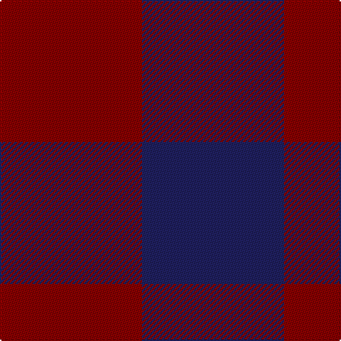

In pattern [BR](/stripes/br/).

This was sourced from tartans-authority.  It is a [2 stripe tartan](/stripes/stripes2/).

Original link http://www.tartansauthority.com/tartan-ferret/display/3156/

## Also known as

This cloth is also recorded under:

- Cairnbulg & Inverllocjy Fisher Plaid
- Rob Roy, Blue & Red

## Attestations

This cloth appears in 2 source records; the oldest owns this page.

- pre 2002 — Rob Roy, Blue & Red (Fashion) (tartans-authority, [record](http://www.tartansauthority.com/tartan-ferret/display/3156/))
- pre 2010 — Dice (Name?) (tartans-authority, [record](http://www.tartansauthority.com/tartan-ferret/display/8114/))

## Thread count
DR/100 DB/100

## Palette
Each colour and the base-6 reference it is a variant of.

| Colour | Shade | Base |
|---|---|---|
| DB | <code style="background-color:#202060;">#202060</code> `oklch(28.9% 0.111 276.9)` <small>#202060</small> | B <code style="background-color:#2A418A;">#2A418A</code> |
| DR | <code style="background-color:#880000;">#880000</code> `oklch(39.4% 0.162 29.2)` <small>#880000</small> | R <code style="background-color:#CC0000;">#CC0000</code> |

# Sample pattern

## Nearest tartans

The nearest existing variants by ΔTartan distance.

1. [Cairnbulg & Inverllocjy Fisher Plaid](/setts/s2/db1r1~x14/) — ΔT 0.00
1. [Wilson's No.116 (light)](/setts/s2/y9dp8~x2/) — ΔT 1.63
1. [Masai Shuka 02 (Artefact)](/setts/s2/db1r1~x20/) — ΔT 1.96
1. [Moncreiffe](/setts/s2/dg1r1/) — ΔT 2.19
1. [Moncreiffe D](/setts/s3/r1dg1r1~x2/) — ΔT 2.72
1. [Moncreiffe D](/setts/s3/r1dg1r1/) — ΔT 2.72
1. [Wilson's No.099](/setts/s2/dg14r13~x2/) — ΔT 2.81
1. [Rob Roy Macgregor](/setts/s2/k1r1~x172/) — ΔT 2.83
1. [MacGregor - 1816 (Red & Black)](/setts/s2/k1r1~x100/) — ΔT 2.83
1. [Masai Shuka 03 (Artefact)](/setts/s2/k1r1~x20/) — ΔT 2.83

## Neighbour map

Every grey dot is one of 14299 variants placed by the first two principal components of the ΔTartan feature space (44% of its variance). Red is this tartan; blue dots are its nearest — click one to open its page.

<svg viewBox="0 0 640 380" role="img" style="max-width:100%;height:auto;border:1px solid #e0e0e0;border-radius:4px;display:block" xmlns="http://www.w3.org/2000/svg"><image href="/nn/cloud.v1.png" width="640" height="380"/><a href="/setts/s2/db1r1~x14/"><circle cx="236.5" cy="366.0" r="4" fill="#3465a4"><title>Cairnbulg &amp; Inverllocjy Fisher Plaid</title></circle></a><a href="/setts/s2/y9dp8~x2/"><circle cx="234.1" cy="366.0" r="4" fill="#3465a4"><title>Wilson's No.116 (light)</title></circle></a><a href="/setts/s2/db1r1~x20/"><circle cx="187.4" cy="366.0" r="4" fill="#3465a4"><title>Masai Shuka 02 (Artefact)</title></circle></a><a href="/setts/s2/dg1r1/"><circle cx="216.1" cy="366.0" r="4" fill="#3465a4"><title>Moncreiffe</title></circle></a><a href="/setts/s3/r1dg1r1~x2/"><circle cx="293.2" cy="366.0" r="4" fill="#3465a4"><title>Moncreiffe D</title></circle></a><a href="/setts/s3/r1dg1r1/"><circle cx="293.2" cy="366.0" r="4" fill="#3465a4"><title>Moncreiffe D</title></circle></a><a href="/setts/s2/dg14r13~x2/"><circle cx="220.5" cy="366.0" r="4" fill="#3465a4"><title>Wilson's No.099</title></circle></a><a href="/setts/s2/k1r1~x172/"><circle cx="170.7" cy="366.0" r="4" fill="#3465a4"><title>Rob Roy Macgregor</title></circle></a><a href="/setts/s2/k1r1~x100/"><circle cx="170.7" cy="366.0" r="4" fill="#3465a4"><title>MacGregor - 1816 (Red &amp; Black)</title></circle></a><a href="/setts/s2/k1r1~x20/"><circle cx="170.7" cy="366.0" r="4" fill="#3465a4"><title>Masai Shuka 03 (Artefact)</title></circle></a><circle cx="236.5" cy="366.0" r="5" fill="#c00000"/></svg>

ID: /setts/s2/db1r1~x100/
