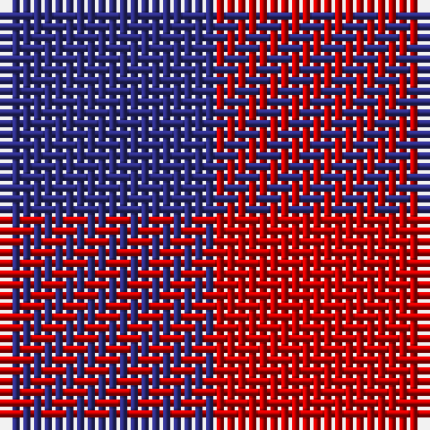

In pattern [BR](/stripes/br/).

This was sourced from tartans-authority.  It is a [2 stripe tartan](/stripes/stripes2/).

Original link http://www.tartansauthority.com/tartan-ferret/display/7189/

## Thread count
DB/20 R/20

## Palette
Each colour and the base-6 reference it is a variant of.

| Colour | Shade | Base |
|---|---|---|
| DB | <code style="background-color:#2C2C80;">#2C2C80</code> `oklch(35.0% 0.138 276.6)` <small>#2C2C80</small> | B <code style="background-color:#2A418A;">#2A418A</code> |
| R | <code style="background-color:#C80000;">#C80000</code> `oklch(52.3% 0.215 29.2)` <small>#C80000</small> | R <code style="background-color:#CC0000;">#CC0000</code> |

# Sample pattern

## Nearest tartans

The nearest existing variants by ΔTartan distance, with this tartan at the top so the swatches line up against it.

ΔTartan

Tartan

Sett

—

<a href="/ttd/edit/#slug=db1r1~x20">Masai Shuka 02 (Artefact)</a> <a class="nn-out" href="/setts/s2/db1r1~x20/" title="open its dictionary page">↗</a>

1.76

<a href="/ttd/edit/#slug=k1r1~x172">Rob Roy Macgregor</a> <a class="nn-out" href="/setts/s2/k1r1~x172/" title="open its dictionary page">↗</a>

1.76

<a href="/ttd/edit/#slug=k1r1~x100">MacGregor - 1816 (Red &amp; Black)</a> <a class="nn-out" href="/setts/s2/k1r1~x100/" title="open its dictionary page">↗</a>

1.76

<a href="/ttd/edit/#slug=k1r1~x20">Masai Shuka 03 (Artefact)</a> <a class="nn-out" href="/setts/s2/k1r1~x20/" title="open its dictionary page">↗</a>

1.76

<a href="/ttd/edit/#slug=k1r1~x16">Rob Roy Clan Tartan Tartan Number: 1504. Earliest known date: 1815 - 16 A specimen of the Rob Roy sett exists in the collection of the Highland Society of London, bearing the Seal of Arms of Sir John MacGregor Murray of MacGregor, Baronet, and signed John M. Murray. The specimens were collected during the period 1815-16. See products available Copyright © Blair Urquhart, Comrie, 2015</a> <a class="nn-out" href="/setts/s2/k1r1~x16/" title="open its dictionary page">↗</a>

1.96

<a href="/ttd/edit/#slug=db1r1~x100">Rob Roy, Blue &amp; Red (Fashion)</a> <a class="nn-out" href="/setts/s2/db1r1~x100/" title="open its dictionary page">↗</a>

1.96

<a href="/ttd/edit/#slug=db1r1~x14">Cairnbulg &amp; Inverllocjy Fisher Plaid</a> <a class="nn-out" href="/setts/s2/db1r1~x14/" title="open its dictionary page">↗</a>

2.00

<a href="/ttd/edit/#slug=y1m1~x2">Une Energie Nouvelle (Corporate) XXX</a> <a class="nn-out" href="/setts/s2/y1m1~x2/" title="open its dictionary page">↗</a>

2.00

<a href="/ttd/edit/#slug=y9dp8~x2">Wilson's No.116 (light)</a> <a class="nn-out" href="/setts/s2/y9dp8~x2/" title="open its dictionary page">↗</a>

2.05

<a href="/ttd/edit/#slug=g1p1~x16">Wilson's, No 116</a> <a class="nn-out" href="/setts/s2/g1p1~x16/" title="open its dictionary page">↗</a>

2.29

<a href="/ttd/edit/#slug=dg1r1~x80">Glenlyon (District)</a> <a class="nn-out" href="/setts/s2/dg1r1~x80/" title="open its dictionary page">↗</a>

## Neighbour map

Every grey dot is one of 14299 variants placed by the first two principal components of the ΔTartan feature space (44% of its variance). Red is this tartan; blue dots are its nearest — click one to open its page.

<svg viewBox="0 0 640 380" role="img" style="max-width:100%;height:auto;border:1px solid #e0e0e0;border-radius:4px;display:block" xmlns="http://www.w3.org/2000/svg"><image href="/nn/cloud.v1.png" width="640" height="380"/><a href="/setts/s2/k1r1~x172/"><circle cx="170.7" cy="366.0" r="4" fill="#3465a4"><title>Rob Roy Macgregor</title></circle></a><a href="/setts/s2/k1r1~x100/"><circle cx="170.7" cy="366.0" r="4" fill="#3465a4"><title>MacGregor - 1816 (Red &amp; Black)</title></circle></a><a href="/setts/s2/k1r1~x20/"><circle cx="170.7" cy="366.0" r="4" fill="#3465a4"><title>Masai Shuka 03 (Artefact)</title></circle></a><a href="/setts/s2/k1r1~x16/"><circle cx="170.7" cy="366.0" r="4" fill="#3465a4"><title>Rob Roy Clan Tartan Tartan Number: 1504. Earliest known date: 1815 - 16 A specimen of the Rob Roy sett exists in the collection of the Highland Society of London, bearing the Seal of Arms of Sir John MacGregor Murray of MacGregor, Baronet, and signed John M. Murray. The specimens were collected during the period 1815-16. See products available Copyright © Blair Urquhart, Comrie, 2015</title></circle></a><a href="/setts/s2/db1r1~x100/"><circle cx="236.5" cy="366.0" r="4" fill="#3465a4"><title>Rob Roy, Blue &amp; Red (Fashion)</title></circle></a><a href="/setts/s2/db1r1~x14/"><circle cx="236.5" cy="366.0" r="4" fill="#3465a4"><title>Cairnbulg &amp; Inverllocjy Fisher Plaid</title></circle></a><a href="/setts/s2/y1m1~x2/"><circle cx="198.8" cy="366.0" r="4" fill="#3465a4"><title>Une Energie Nouvelle (Corporate) XXX</title></circle></a><a href="/setts/s2/y9dp8~x2/"><circle cx="234.1" cy="366.0" r="4" fill="#3465a4"><title>Wilson's No.116 (light)</title></circle></a><a href="/setts/s2/g1p1~x16/"><circle cx="160.7" cy="366.0" r="4" fill="#3465a4"><title>Wilson's, No 116</title></circle></a><a href="/setts/s2/dg1r1~x80/"><circle cx="179.6" cy="366.0" r="4" fill="#3465a4"><title>Glenlyon (District)</title></circle></a><circle cx="187.4" cy="366.0" r="5" fill="#c00000"/></svg>

ID: /setts/s2/db1r1~x20/
